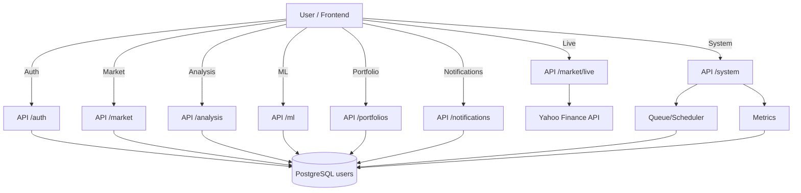

# BPMN Level 1 — Processes Overview

This level shows an overview of the system's main processes.

## Processes
- **Authentication**: Register / Login / Refresh (Public)
- **Market Data Access**: Symbols / Price History / Latest Prices
- **Live Data Proxy**: Proxy endpoints to the Yahoo Finance API
- **Analysis Pipeline**: Technical / Momentum / Volatility / Risk / Scoring / Signals
- **ML Inference**: Predict / Patterns / Anomaly / Recommendation / Forecast / Optimize
- **Portfolio Management**: Create portfolio / Manage holdings
- **Notifications**: List / Mark read / Mark all read / Delete
- **System Operations**: Scheduler / Queue / Metrics

## Diagram (Mermaid flowchart-style)

## Key Data / Events
- JWT Access/Refresh
- Asset / PriceCandle / MLSignal
- Portfolio / Position
- Notification
- Job (queue)