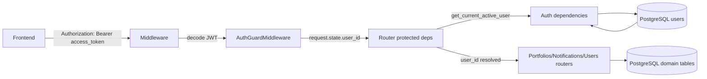

# DFD Level 2 — Authentication & Access Control

Separation of data flows related to JWT and propagation of user information.

## Diagram (Mermaid)

## Data Flows
- **JWT Access Token**: Sent from FE to Middleware.
- **AuthGuardMiddleware**:
  - JWT decode
  - Check `type == access`
  - Set `request.state.user_id` and `request.state.username`
- **get_route_user_id**:
  - If `request.state.user_id` is present, use it
  - Otherwise (dev) fall back to `settings.DEV_USER_ID`

## Key Data
- `Token(access_token, refresh_token)`
- JWT payload: `{sub, user_id, type}`
- User entity in the `users` table