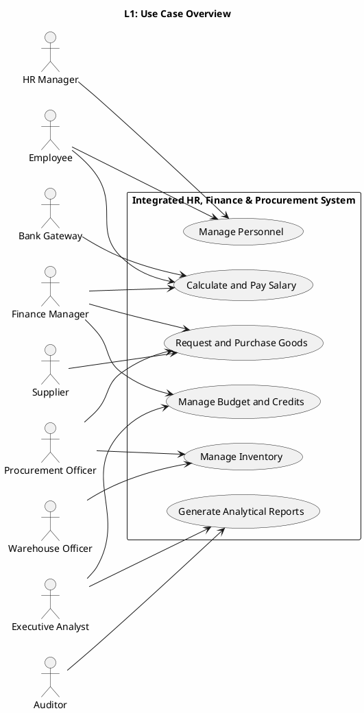
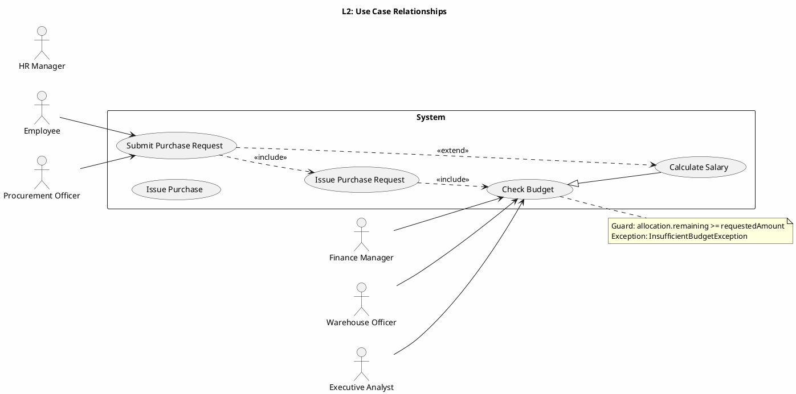
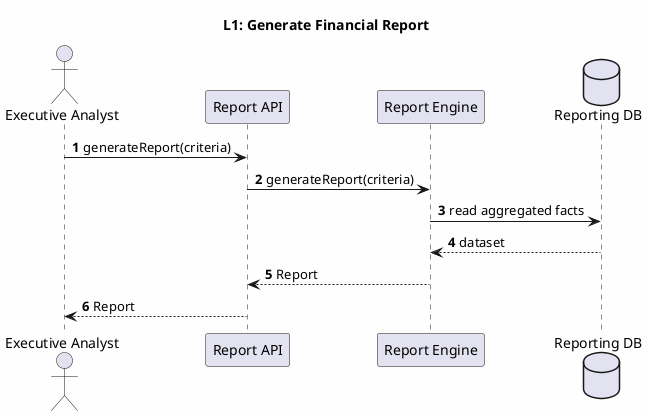
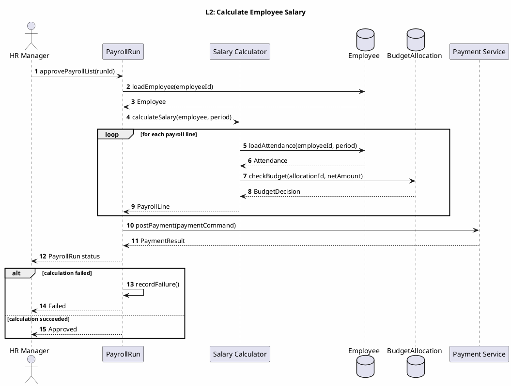
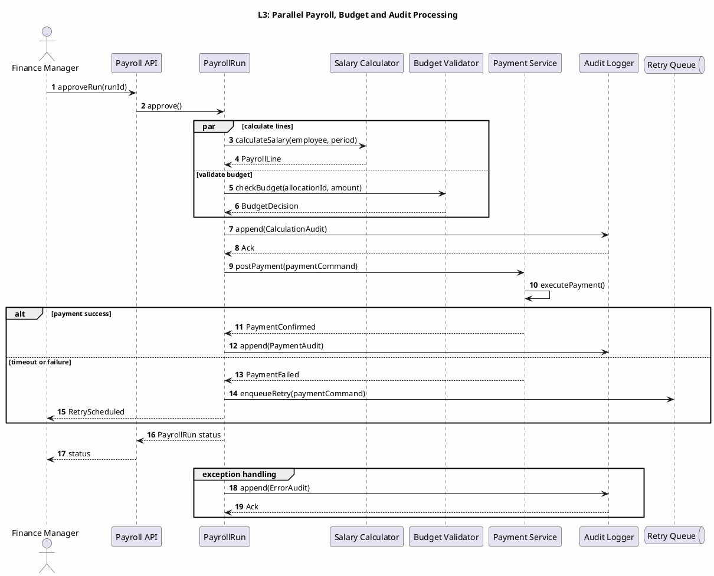
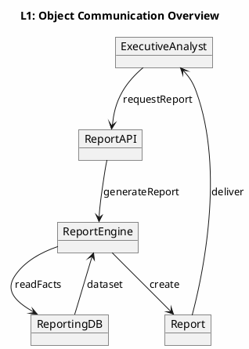
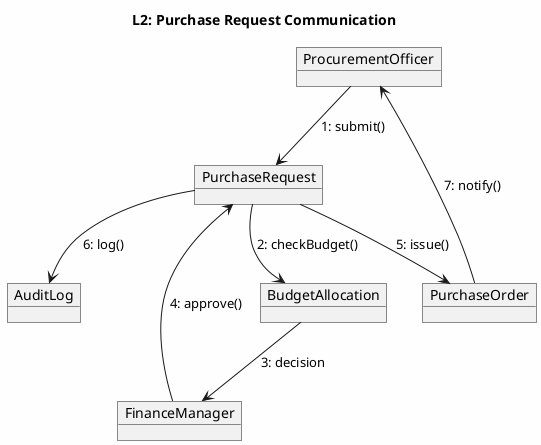
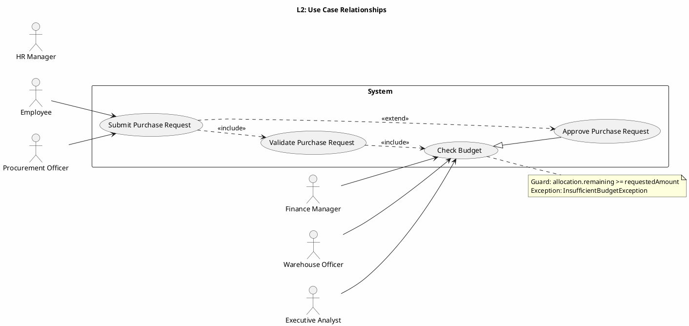

# UML 2.5 Behavioral Diagrams — Use Case and Activity

**عنوان:** UML 2.5 Behavioral Diagrams — سیستم یکپارچه HR/Finance/Procurement  
**نسخه:** v1.0  
**تاریخ:** 2026-09-09

---

## ۱. مقدمه

این سند دو نوع نمودار رفتاری UML 2.5 را در سه سطح انتزاع مدل‌سازی می‌کند:

- **Use Case` و **Activity Diagram` را ثبت می‌کند.
- **Activity:** جریان کار، تصمیم‌ها، شاخه‌های موازی، Swimlane و سیگنال‌ها را نشان می‌دهد.

نام‌های مشترک با DFD و BPMN شامل `Employee`، `PayrollRun`، `BudgetAllocation`، `PurchaseRequest`، `PurchaseOrder`، `StockLot`، `GoodsReceipt`، `Payment`، `Report` و `AuditLog` است.

---

## ۲. نمودار مورد استفاده — نوع ۸

### ۲.۱ سطح ۱ — چشم‌انداز دامنه



**توضیح:** بازیگران اصلی و شش قابلیت کلان سیستم در مرز سامانه نمایش داده شده‌اند. `Employee` و `HRManager` مدیریت پرسنل، `FinanceManager` حقوق و بودجه، `ProcurementOfficer` خرید، `WarehouseOfficer` انبار و `ExecutiveAnalyst` گزارش‌گیری را هدایت می‌کنند. `Supplier` و `BankGateway` سرویس‌های بیرونی زنجیره تأمین و پرداخت هستند. `Auditor` فقط به گزارش‌ها و شواهد ممیزی دسترسی دارد.

### ۲.۲ سطح ۲ — include، extend و تعمیم



**توضیح:** «ثبت درخواست خرید» همواره «اعتبارسنجی درخواست» و «بررسی بودجه» را شامل می‌شود. «تأیید درخواست خرید» در شرایط خاص، مسیر ثبت را گسترش می‌دهد و تعمیم `Approve Purchase Request` از `Check Budget` نشان می‌دهد که تأیید، زیرمجموعه‌ای از بررسی اعتبار است. نگهبان بودجه و استثنا در یادداشت مشخص شده‌اند.

### ۲.۳ سطح ۳ — مشخصه سناریوها و استثناها

| شناسه مورد استفاده | مسیر اصلی | مسیر جایگزین | مسیر استثنا | پیش‌شرط | پس‌شرط |
|---|---|---|---|---|---|
| UC-HR-01 Manage Personnel | ثبت و تأیید تغییرات پرسنلی | بازگشت برای اصلاح | `AuthorizationException` | نقش HR فعال است | `Employee` و `AuditLog` به‌روز |
| UC-PAY-01 Calculate and Pay Salary | `calculateSalary()` و `postPayment()` | retry پرداخت | `CalculationException`، `PaymentFailedException` | دوره حقوق باز است | `PayrollRun` تأیید یا ناموفق |
| UC-BUD-01 Manage Budget | تعریف بودجه و تخصیص | تخصیص مجدد | `InsufficientBudgetException` | مدیر مالی مجاز است | `BudgetAllocation` پایدار |
| UC-PROC-01 Request and Purchase Goods | ایجاد PR و صدور PO | اصلاح سطر یا تامین‌کننده | `ValidationException` | کالا و مبلغ معتبرند | `PurchaseRequest` تأیید شده |
| UC-INV-01 Manage Inventory | ثبت رسید و تخصیص لات | دریافت ناقص | `StockShortageException` | PO معتبر است | `StockLot` و `GoodsReceipt` به‌روز |
| UC-REP-01 Generate Analytical Reports | تولید `Report` | درخواست اصلاح | `DataQualityException` | دوره و معیارها معتبرند | `Report` منتشر شده |

**سناریوی جایگزین PR:** اگر سطر ناقص باشد، درخواست به حالت `Draft` برمی‌گردد و نسخه جدید ایجاد می‌شود. اگر بودجه ناکافی باشد، `FinanceManager` می‌تواند درخواست تخصیص مجدد ثبت کند. در صورت رد تخصیص مجدد، درخواست خرید نهایی رد و در `AuditLog` ثبت می‌شود.

**سناریوی استثنا Payroll:** اگر `calculateSalary()` مقدار منفی تولید کند یا قوانین مالی نقض شوند، `PayrollRun` به `Failed` می‌رود و هیچ `Payment` ایجاد نمی‌شود. اگر درگاه پاسخ ندهد، پیام به صف retry منتقل شده و حداکثر سه بار تلاش انجام می‌شود.

---

## ۳. نمودار فعالیت — نوع ۹

### ۳.۱ سطح ۱ — ثبت و پردازش درخواست خرید

```plantuml
@startuml ARCH-L1-Activity
skinparam backgroundColor #FEFEFE
left to right direction

title L1: Purchase Request Processing

start
:Create PurchaseRequest;
:Validate requester and lines;
if (Valid?) then (yes)
  :Submit for budget check;
  :Check BudgetAllocation;
  if (Budget available?) then (yes)
    :Reserve budget;
    :Manager approval;
    if (Approved?) then (yes)
      :Issue PurchaseOrder;
      :Send PO to Supplier;
      stop
    else (no)
      :Reject request;
      :Release reservation;
      stop
    endif
  else (no)
    :Request reallocation;
    stop
  endif
else (no)
  :Reject request;
  :Release reservation;
  stop
endif

@enduml
```

**توضیح:** فعالیت سطح ۱ چرخه درخواست خرید را از ایجاد تا ارسال سفارش نشان می‌دهد. تصمیم‌های اعتبارسنجی، بودجه و تأیید مدیر مسیرهای اصلی و استثنا را جدا می‌کنند. رزرو بودجه فقط پس از اعتبارسنجی انجام می‌شود و رد درخواست، رزرو را آزاد می‌کند. این جریان با DFD-L3.2 و BPMN-L3 Budget-Check for Purchase Request هم‌ردیف است.

### ۳.۲ سطح 1.۲ سطح 3.۲ سطح ۲ — شاخه‌های موازی و شرطی

```plantuml
@startuml ARCH-L2-Activity
skinparam backgroundColor #FEFEFE
left to right direction

title L2: Purchase Request with Parallel Review

start
:Create PurchaseRequest;
fork
  :Validate product catalog;
  :Validate supplier terms;
fork again
  :Check BudgetAllocation;
  :Check approval authority;
end fork
if (All checks passed?) then (yes)
  :Reserve budget;
  fork
    :Prepare PurchaseOrder;
    :Notify Procurement Officer;
  fork again
    :Notify Finance Manager;
    :Create audit event;
  end fork
  :Issue PurchaseOrder;
  stop
else (no)
  if (Correctable?) then (yes)
    :Return for correction;
    stop
  else (no)
    :Reject request;
    :Release reservation;
    stop
  endif
endif

@enduml
```

**توضیح:** اعتبارسنجی کالا و شرایط تامین‌کننده به‌صورت موازی با بررسی بودجه و سطح اختیار انجام می‌شود. شاخه‌ها فقط زمانی به صدور سفارش می‌رسند که همه بررسی‌ها موفق باشند. مسیر قابل اصلاح به درخواست‌دهنده بازمی‌گردد و مسیر غیرقابل اصلاح، رزرو را آزاد می‌کند. `AuditLog` همزمان با تصمیم نهایی ثبت می‌شود.

### ۳.۳ سطح ۳ — Activity با Swimlane، Pin و Signal

```plantuml
@startuml ARCH-L3-Activity
skinparam backgroundColor #FEFEFE
left to right direction
swimlane "Procurement Officer" as PROC {
  start
  :Create PurchaseRequest;
  {in=RequestCommand}
  :Submit Request;
  <<sendSignal>> SubmitPurchaseRequest
}

swimlane "Validation Service" as VAL {
  <<receiveSignal>> SubmitPurchaseRequest
  :Validate Lines;
  if (Lines valid?) then (yes)
    :Publish ValidatedRequest;
  else (no)
    :Publish ValidationFailed;
    stop
  endif
}

swimlane "Finance Manager" as FIN {
  <<receiveSignal>> ValidatedRequest
  :Check BudgetAllocation;
  if (Budget available?) then (yes)
    :Reserve Budget;
    :Approve Request;
  else (no)
    <<sendSignal>> BudgetUnavailable;
    stop
  endif
}

swimlane "Procurement Service" as SVC {
  <<receiveSignal>> BudgetUnavailable
  :Release Reservation;
  :Publish RequestRejected;
  stop
  <<receiveSignal>> ApprovedRequest
  {out=PurchaseOrder}
  :Issue PurchaseOrder;
  <<sendSignal>> PurchaseOrderIssued;
  stop
}

swimlane "Supplier" as SUP {
  <<receiveSignal>> PurchaseOrderIssued
  :Acknowledge Order;
  <<sendSignal>> OrderAcknowledged;
  stop
}

@enduml
```

**توضیح:** فعالیت سطح ۳1.۳.۲ سطح ۳1.۳.۲ سطح ۳.۲ سطح ۱ — چشم‌انداز دامنه



**توضیح:** تحلیلگر معیار گزارش را به API می‌دهد، Report Engine داده‌های تجمیعی را از Reporting DB می‌خواند و `Report` را برمی‌گرداند. این سناریو با DFD-L2.6 و مؤلفه Reporting در Class/Component هم‌خوان است. در سطح ۱ فقط ترتیب کلی فراخوانی‌ها نمایش داده شده و جزییات خطا و صف در سطح‌های بعدی اضافه می‌شود.

### ۱۱.۲ سطح ۲ — محاسبه حقوق یک کارمند



**توضیح:** حلقه برای تولید `PayrollLine` هر کارمند اجرا می‌شود و `calculateSalary()` داده‌های حضور و بودجه را ترکیب می‌کند. شاخه `alt` خطای محاسبه را از مسیر موفق جدا می‌کند. `postPayment()` پس از تأیید اجرا فراخوانی می‌شود و نتیجه به `HRManager` بازمی‌گردد. این سناریو مستقیماً با DFD-L3.1 و BPMN-L3 Payroll Approval مرتبط است.

### ۱۱.۳ سطح ۳ — همزمانی، پیام ناهمگام و مدیریت خطا



**توضیح:** `par` محاسبه خطوط و بررسی بودجه همزمان اجرا می‌شوند، اما پرداخت فقط پس از تکمیل هر دو nhánh انجام می‌گیرد. پیام‌های ممیزی همگام و پیام retry به صف ناهمگام ارسال می‌شود. خطای درگاه باعث ثبت `ErrorAudit` و زمان‌بندی تلاش مجدد می‌شود. این سطح با Interaction Overview و Timing Diagram سطح ۳ هماهنگ است.

---

## ۱۲. نمودار ارتباطی — نوع ۱۲

### ۱۲.۱ سطح ۱ — ارتباط اشیاء در معماری کلی



**توضیح:** ارتباط سطح ۱ بین تحلیلگر، API، موتور گزارش، پایگاه داده و شیء گزارش را نشان می‌دهد. هر لینک یک همکاری معنایی دارد و شماره پیام در سطح‌های بعدی دقیق می‌شود. این نما با Use Case `Generate Analytical Reports` و DFD-L2.6 مطابقت دارد.

### ۱۲.۲ سطح ۲ — پیام‌های فرایند میانی



**توضیح:** شماره پیام‌ها ترتیب همکاری را از ایجاد درخواست تا صدور سفارش مشخص می‌کند. `BudgetAllocation` پیش از تأیید بررسی می‌شود و `AuditLog` پس از تصمیم نهایی ثبت می‌گردد. این ترتیب با DFD-L3.2 و Activity سطح ۲ یکسان است.

### ۱۲.۳ سطح ۳ — شماره‌گذاری دقیق پیام‌ها

```plantuml
@startuml ARCH-L3-Communication
skinparam backgroundColor #FEFEFE

title L3: Detailed Message Numbering — Payroll

object "HRManager" as HRM
object "PayrollRun" as RUN
object "SalaryCalculator" as CALC
object "EmployeeStore" as EMP
object "BudgetAllocation" as BUD
object "PaymentService" as PAY
object "AuditLog" as AUDIT

HRM --> RUN : 1.1: approveRun(runId
RUN --> EMP : 1.2: loadEmployee(employeeId)
EMP --> RUN : 1.3: Employee
RUN --> CALC : 2.1: calculateSalary(employee, period)
CALC --> EMP : 2.2: loadAttendance(employeeId, period)
EMP --> CALC : 2.3: Attendance
CALC --> BUD : 2.4: checkBudget(allocationId, amount)
BUD --> CALC : 2.5: BudgetDecision
CALC --> RUN : 2.6: PayrollLine
RUN --> PAY : 3.1: postPayment(paymentCommand)
PAY --> RUN : 3.2: PaymentResult
RUN --> AUDIT : 4.1: append(AuditEvent)
AUDIT --> RUN : 4.2: Ack
RUN --> HRM : 5.1: PayrollRun status
HRM : 5.1: status

alt calculation failed
  RUN --> AUDIT : 6.1: append(ErrorAudit)
  AUDIT --> RUN : 6.2: Ack
else payment failed
  RUN --> AUDIT : 6.3: append(PaymentError)
  RUN --> RUN : 6.4: enqueueRetry()
end

@enduml
```

**توضیح:** شماره‌های اعشاری ترتیب فراخوانی‌های هم‌سطح و تو‌در‌تو را نشان می‌دهند. محاسبه حقوق، بررسی بودجه، پرداخت و ممیزی در یک سناریوی بحرانی هماهنگ شده‌اند. شاخه‌های خطا پیام‌های `ErrorAudit` و `enqueueRetry()` را فعال می‌کنند. این نمودار با Sequence سطح ۳ و Timing Diagram سطح ۳完全" as UC_PROC
FIN --> UC_PROC
SUP --> UC_PROC
WH --> UC_INV
PROC --> UC_INV
EXEC --> UC_REP
AUD --> UC_REP
BANK --> UC_PAY

@enduml
```

**توضیح:** بازیگران اصلی و شش قابلیت کلان سیستم در مرز سامانه نمایش داده شده‌اند. `Employee` و `HRManager` مدیریت پرسنل، `FinanceManager` حقوق و بودجه، `ProcurementOfficer` خرید، `WarehouseOfficer` انبار و `ExecutiveAnalyst` گزارش‌گیری را هدایت می‌کنند. `Supplier` و `BankGateway` سرویس‌های بیرونی زنجیره تأمین و پرداخت هستند. `Auditor` فقط به گزارش‌ها و شواهد ممیزی دسترسی دارد.

### ۲.۲ سطح ۲ — include، extend و تعمیم



**توضیح:** «ثبت درخواست خرید» همواره «اعتبارسنجی درخواست» و «بررسی بودجه» را شامل می‌شود. «تأیید درخواست خرید» در شرایط خاص، مسیر ثبت را گسترش می‌دهد و تعمیم `Approve Purchase Request` از `Check Budget` نشان می‌دهد که تأیید، زیرمجموعه‌ای از بررسی اعتبار است. نگهبان بودجه سطح ۳.۲ سطح ۳ — Activity با Swimlane، Pin و Signal

```plantuml
@startuml ARCH-L3-Activity
skinparam backgroundColor #FEFEFE
left to right direction
swimlane "Procurement Officer" as PROC {
  start
  :Create PurchaseRequest;
  {in=RequestCommand}
  :Submit Request;
  <<sendSignal>> SubmitPurchaseRequest
}

swimlane "Validation Service" as VAL {
  <<receiveSignal>> SubmitPurchaseRequest
  :Validate Lines;
  if (Lines valid?) then (yes)
    :Publish ValidatedRequest;
  else (no)
    :Publish ValidationFailed;
    stop
  endif
}

swimlane "Finance Manager" as FIN {
  <<receiveSignal>> ValidatedRequest
  :Check BudgetAllocation;
  if (Budget available?) then (yes)
    :Reserve Budget;
    :Approve Request;
  else (no)
    <<sendSignal>> BudgetUnavailable;
    stop
  endif
}

swimlane "Procurement Service" as SVC {
  <<receiveSignal>> ApprovedRequest
  :Release Reservation;
  :Issue PurchaseOrder;
  <<sendSignal>> PurchaseOrderIssued;
}

swimlane "Supplier" as SUP {
  <<receiveSignal>> PurchaseOrderIssued
  :Acknowledge Order;
  <<sendSignal>> OrderAcknowledged;
  :Acknowledge
  :Acknowledge OrderAcknowledged;
  stop
}

@enduml
```

**توضیح:activity-v1.md
```

**توضیح: The activity diagram has a syntax issue. Need provide a syntax issue. Need fix the BPMN file as well. Need use edit exact replacements.
</think>

<tool_call>
<function=edit>