# مدل جریان داده‌ها (DFD) — سیستم یکپارچه مدیریت منابع انسانی، مالی و خرید

## خلاصه و نقشه‌برداری

| سطح | شناسه | عنوان | ارجاع BPMN/UML |
|---|---|---|---|
| 0 | DFD-L0 | نمودار زمینه (Context) | UC-01 |
| 1 | DFD-L1 | فرآیندهای کلان |泳池泳道 / Component |
| 2 | DFD-L2.1 … L2.6 | تجزیه هر فرآیند کلان | Activity / Sequence / State Machine |
| 3 | DFD-L3.1 … L3.3 | نمودارهای اتمی | Activity Diagram (Atomic) |

---

## سطح 0 — نمودار زمینه (Context Diagram)

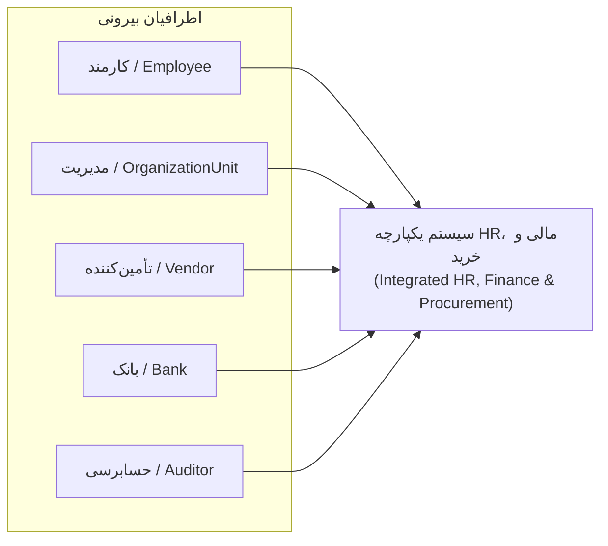

این نمودار کل سیستم را به عنوان یک فرآیند واحد در مرکز قرار می‌دهد.  
هر ذی‌نفع خارجی فقط از طریق رابط‌های مشخص با سیستم تعامل دارد.  
هدف، دامنه کلی جریان داده‌ها و کنترل‌های کلان است.  
برای ردیابی: این نمودار معادل «شرح مورد استفاده» (UC-01) در BPMN و «Use Case Model» در UML است.  
محدودیت: هیچ ذخیره‌سازی یا فرآیند داخلی در این سطح نمایش داده نمی‌شود.  

---

## سطح 1 — نمودار فرآیندهای کلان (Level-1 DFD)

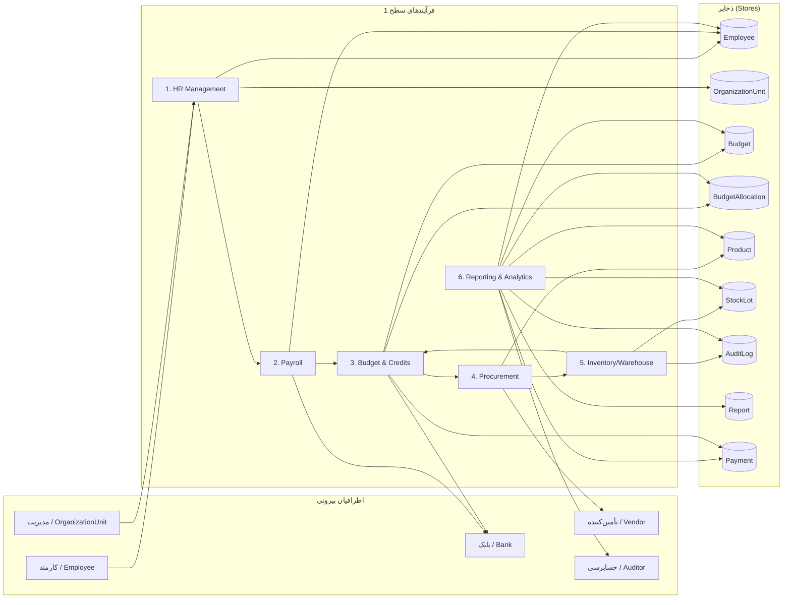

شش فرآیند اصلی بر اساس حوزه عملکردی تفکیک شده‌اند.  
داده‌های پایه شامل کارمند، واحد سازمانی، بودجه، تخصیص بودجه، کالا، موجودی و گزارش هستند.  
جریان‌های مالی از طریق «بودجه» و «پرداخت» به پرداخت و خرید متصل هستند.  
همپوشانی‌های منطقی: Payroll ← HR Management، Procurement ← Budget & Credits، Inventory/Warehouse ← Procurement.  
گزارش‌گیری از تمام ذخایر و فرآیندها داده می‌گیرد و گزارش را در Report ذخیره می‌کند.  
ردیابی: معادل «Activity Diagram» و «泳池泳道» در BPMN و «نمودار کامپوننت» در UML است.  
هر فرآیند سطح ۱ در نمودارهای سطح ۲ تفکیک می‌شود.  

---

## سطح 2 — تجزیه فرآیندها (Level-2 DFD)

### DFD-L2.1 — HR Management

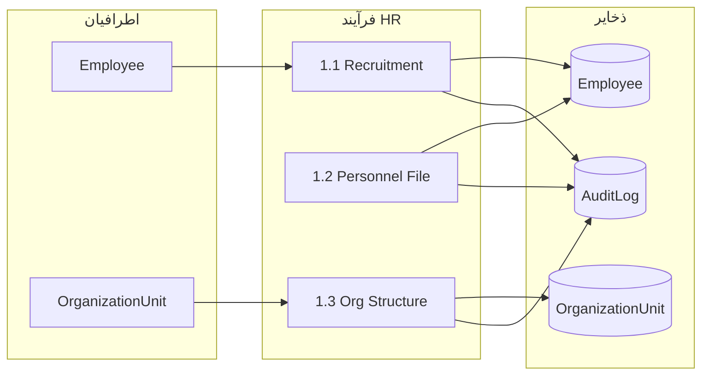

این نمودار فرآیند «مدیریت منابع انسانی» را به سه زیرفرآیند تقسیم می‌کند.  
داده‌های خروجی به Payroll و Reporting & Analytics ارسال می‌شود.  
هر موجودیت (Employee, OrganizationUnit) یک ذخیره مجزا است.  
ردیابی: در BPMN به泳道های «Human Resources» و در UML به «Class Diagram» (Employee, OrganizationUnit) بازمی‌گردد.  
کنترل‌های امنیتی: تنها مدیران مجاز به تغییر ساختار سازمانی هستند.  
تغییرات در Employee و OrganizationUnit همواره در AuditLog ثبت می‌شود.  

### DFD-L2.2 — Payroll

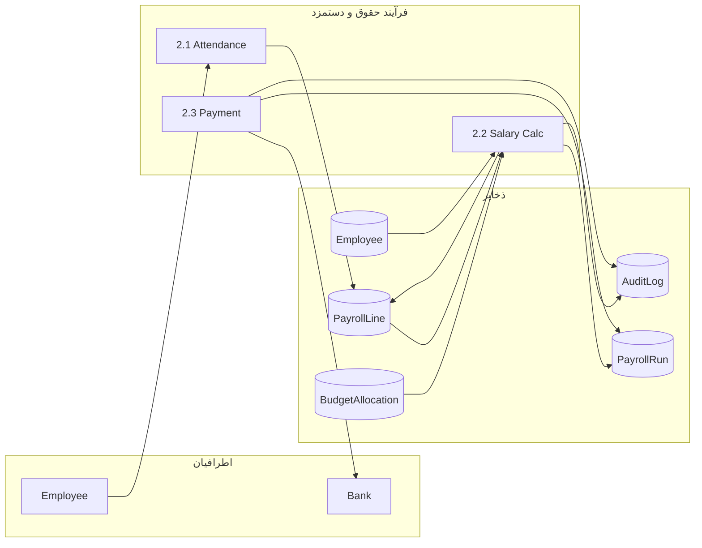

PayrollRun و PayrollLine برای ردیابی هر اجرای حقوق و خط‌های آن استفاده می‌شود.  
جریان مالی به تجزیه سطح ۳ («محاسبه نهایی حقوق») راهی می‌شود.  
ردیابی: BPMN泳道 «Payroll»؛ UML Sequence Diagram برای محاسبه حقوق.  
همپوشانی: فقط با HR Management (دریافت داده‌های پرسنلی) و Budget & Credits (اعتبار).  
خروجی: PayrollLine شامل دستمزد پایه، اضافات، کسورات و خالص پرداخت است.  
تمام محاسبات در AuditLog برای حسابرسی پیگیری می‌شود.  

### DFD-L2.3 — Budget & Credits

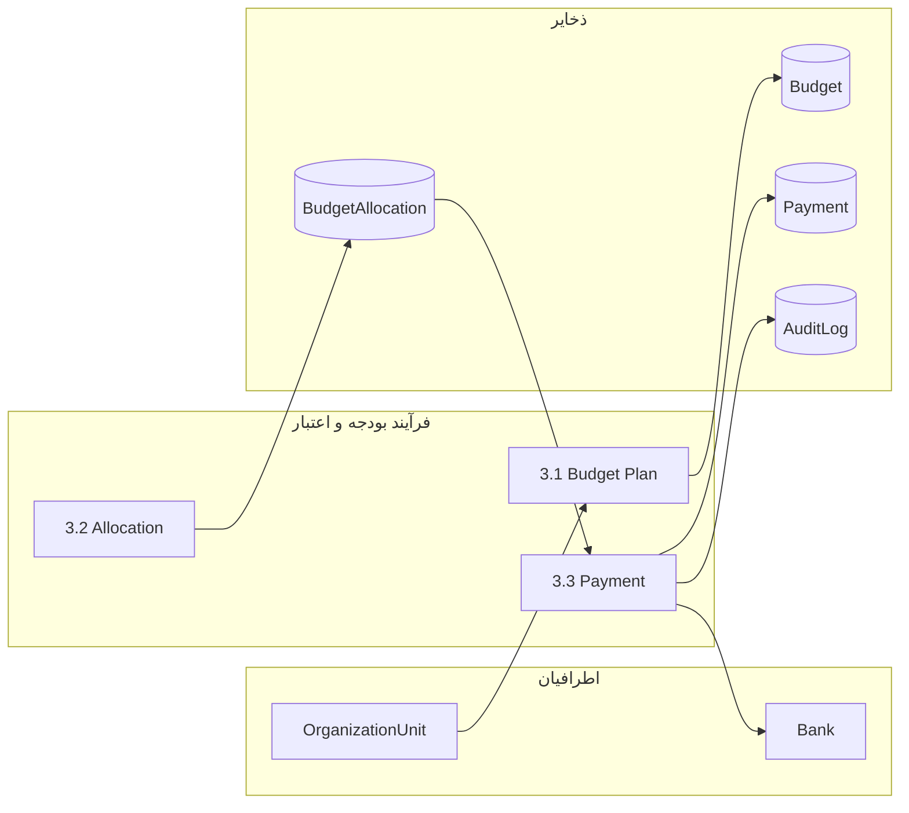

BudgetAllocation برای تقسیم اعتبار به واحدهای سازمانی یا پروژه‌ها به کار می‌رود.  
Payment به عنوان ذخیره مشترک با Procurement و Payroll عمل می‌کند.  
ردیابی: BPMN泳道 «Finance»؛ UML Class Diagram برای موجودیت‌های مالی.  
محدودیت: پرداخت‌ها تنها در صورت کافی بودن اعتبار تایید می‌شوند.  
خلاصه بودجه به Reporting & Analytics برای تحلیل ارسال می‌شود.  

### DFD-L2.4 — Procurement

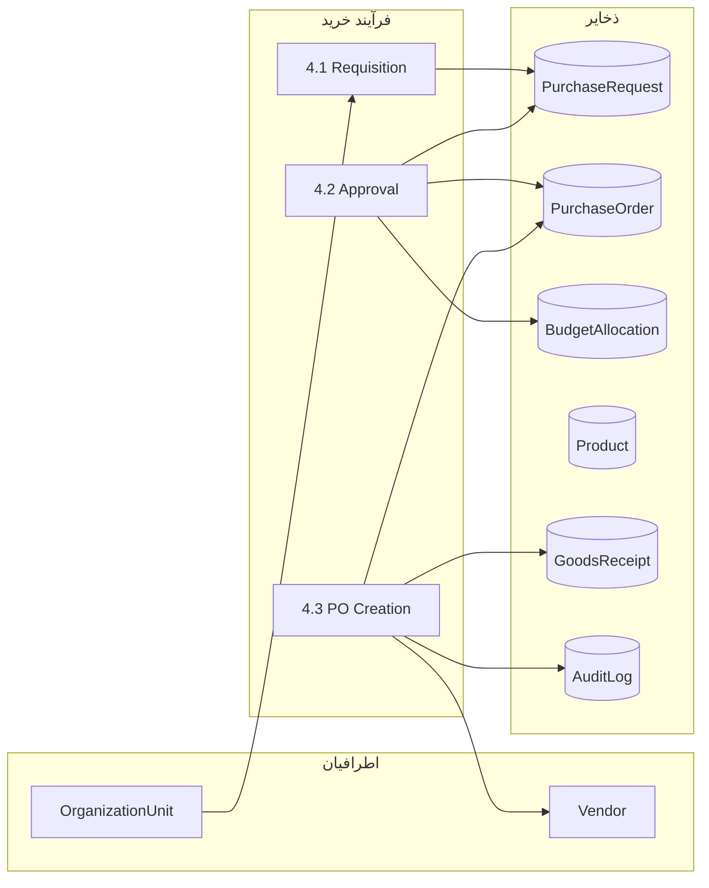

PurchaseRequest تا PurchaseOrder و سپس GoodsReceipt جریان دارد.  
ردیابی: BPMN泳道 «Procurement»؛ UML Activity Diagram برای تأیید خرید.  
همپوشانی: با Inventory/Warehouse از طریق Product و GoodsReceipt.  
نقطه اتمی در سطح ۳: «تأیید درخواست خرید».  
کنترل‌ها: هیچ PurchaseOrder بدون تأیید BudgetAllocation صادر نمی‌شود.  

### DFD-L2.5 — Inventory/Warehouse

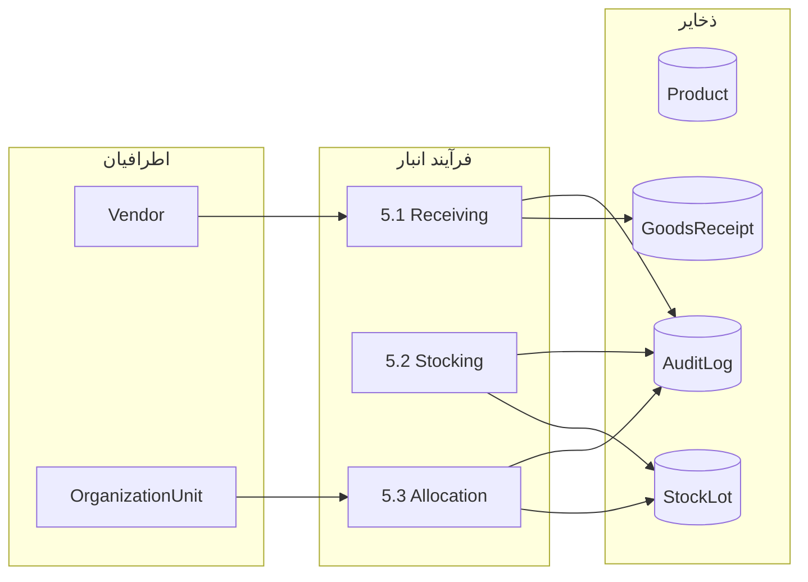

StockLot برای پیگیری سریال یا lot کالاها استفاده می‌شود.  
Allocation به Budget & Credits و Reporting & Analytics باز می‌گردد.  
ردیابی: BPMN泳道 «Warehouse»؛ UML State Machine برای چرخه عمر StockLot.  
نقطه اتمی در سطح ۳: «تخصیص موجودی».  
خروجی: GoodsReceipt برای ورود کالا و AuditLog برای ردیابی ثبت می‌شود.  

### DFD-L2.6 — Reporting & Analytics

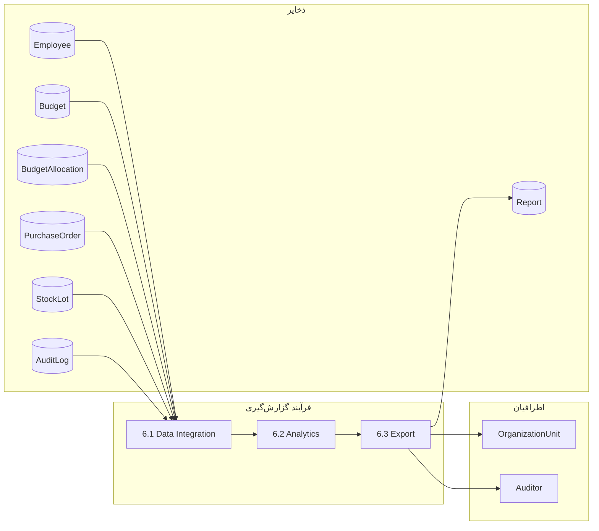

تمام ذخایر اصلی به عنوان منبع داده در این فرآیند گردهم می‌آیند.  
گزارش‌ها به صورت Report تولید و به مدیران و حسابرسان ارائه می‌شوند.  
ردیابی: BPMN泳道 «Reporting»؛ UML Component Diagram برای لایه گزارش‌گیری.  
خروجی: Report به OrganizationUnit و Auditor ارسال می‌شود.  
این فرآیند هیچ تغییری در ذخایر اصلی ایجاد نمی‌کند؛ فقط خواندن و تحلیل.  

---

## سطح ۳ — نمودارهای اتمی (Level-3 DFD)

### DFD-L3.1 — محاسبه نهایی حقوق (Final Salary Calculation)

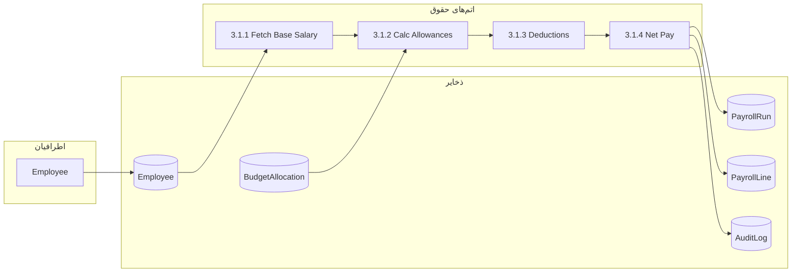

این نمودار اتمی مسیر دقیق محاسبه حقوق را از داده‌های پایه تا خروجی نهایی نشان می‌دهد.  
هر مهار (step) یک وظیفه atomic در سطح BPMN و یک تراکنش در Sequence Diagram است.  
ردیابی: BPMN泳道 «Payroll»، فعالیت‌های ۳.۱.۱ تا ۳.۱.۴؛ UML Activity Diagram.  
خروجی: PayrollLine شامل دستمزد پایه، اضافات، کسورات و خالص پرداخت است.  
AuditLog برای پیگیری هر محاسبه الزامی است.  

### DFD-L3.2 — تأیید درخواست خرید (Purchase-Request Approval)

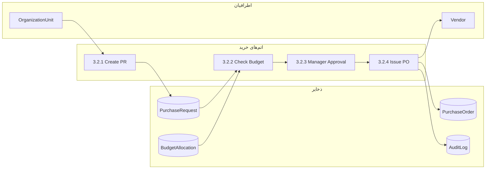

مراحل اتمی از ایجاد درخواست تا صدور PurchaseOrder را پوشش می‌دهد.  
بررسی بودجه و تأیید مدیر نقاط بحرانی تصمیم‌گیری هستند.  
ردیابی: BPMN泳道 «Procurement»، وابستگی‌های Sequence؛ UML Activity Diagram.  
خروجی: PurchaseOrder به Vendor ارسال می‌شود و در AuditLog ثبت می‌گردد.  
هیچ PurchaseRequest بدون تایید BudgetAllocation به Approval نمی‌رسد.  

### DFD-L3.3 — تخصیص موجودی (Stock Allocation)

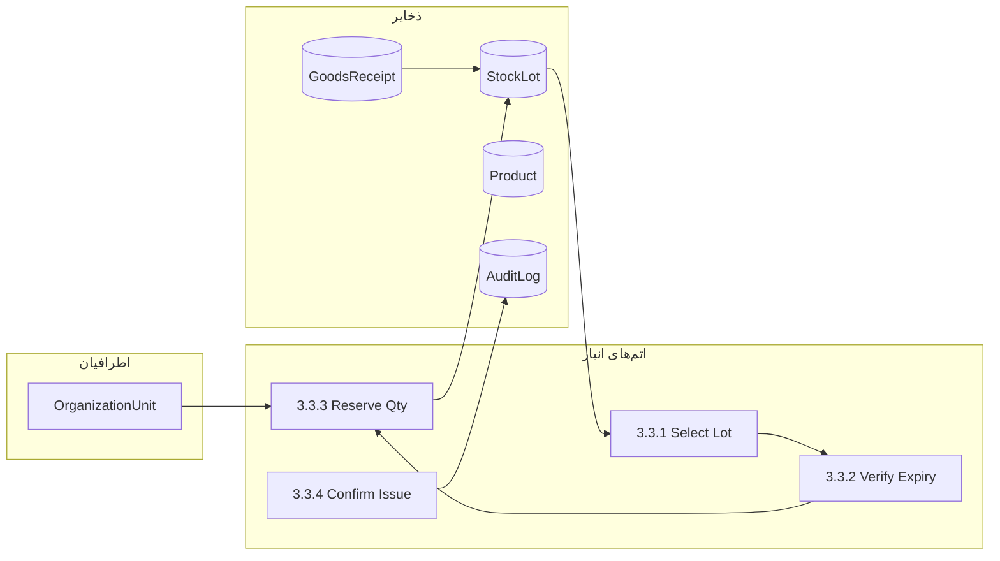

تخصیص موجودی از انتخاب lot تا تایید خروج را دنبال می‌کند.  
اعتبارسنجی انقضا (expiry) قبل از رزرو الزامی است.  
ردیابی: BPMN泳道 «Warehouse»؛ UML State Machine برای StockLot.  
خروجی: کسری یا اضافی موجودی در AuditLog ثبت می‌شود.  
Product و StockLot به عنوان مرجع اصلی برای تخصیص به کار می‌روند.  

---

## ردیابی کلی (Traceability Matrix)

| شناسه DFD | عنوان | BPMN泳道 / Activity | UML artifact |
|---|---|---|---|
| DFD-L0 | Context | UC-01 | Use Case Diagram |
| DFD-L1 | Level-1 |泳池泳道 کلان | Component Diagram |
| DFD-L2.1 | HR Management |泳道 HR | Class Diagram |
| DFD-L2.2 | Payroll |泳道 Payroll | Sequence Diagram |
| DFD-L2.3 | Budget & Credits |泳道 Finance | Class Diagram |
| DFD-L2.4 | Procurement |泳道 Procurement | Activity Diagram |
| DFD-L2.5 | Inventory/Warehouse |泳道 Warehouse | State Machine |
| DFD-L2.6 | Reporting & Analytics |泳道 Reporting | Component Diagram |
| DFD-L3.1 | Final Salary Calc | Activity 3.1.x | Activity Diagram |
| DFD-L3.2 | PR Approval | Activity 3.2.x | Activity Diagram |
| DFD-L3.3 | Stock Allocation | Activity 3.3.x | State Machine |

هر نمودار DFD با یک یا چند Artefact BPMN/UML نگاشت شده است.  
این ماتریس به عنوان مرجع برای هماهنگی بین تیم‌های تحلیل، توسعه و تست استفاده می‌شود.  
در صورت تغییر هر یک از فرآیندها، ردیابی در این ماتریس به‌روزرسانی خواهد شد.  
Artifactهای UML شامل Use Case, Class, Sequence, Activity و State Machine می‌باشند.  
BPMN泳道ها دقیقاً با فرآیندهای سازمانی (HR, Finance, Procurement, Warehouse, Reporting) تطبیق داده شده‌اند.  

---

*تاریخ تهیه: 2026-09-09*  
*نسخه: v1.0*
