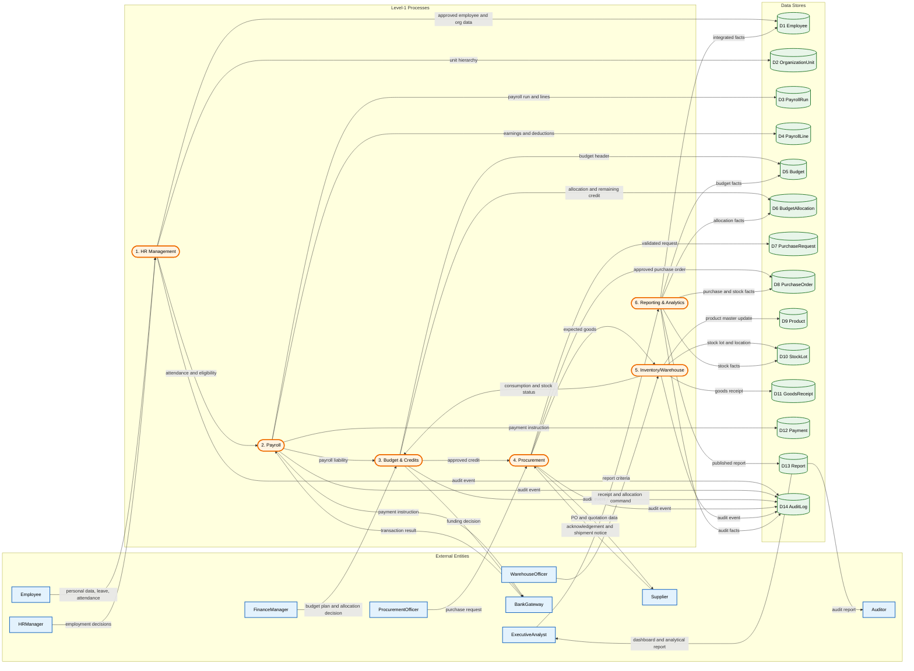
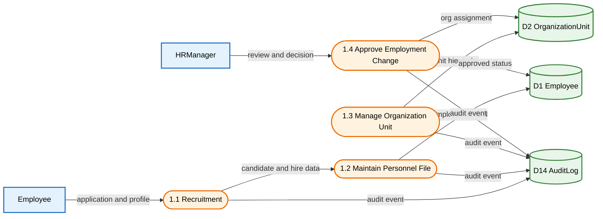
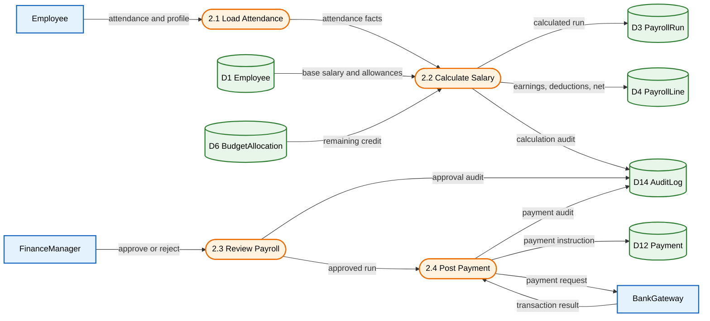
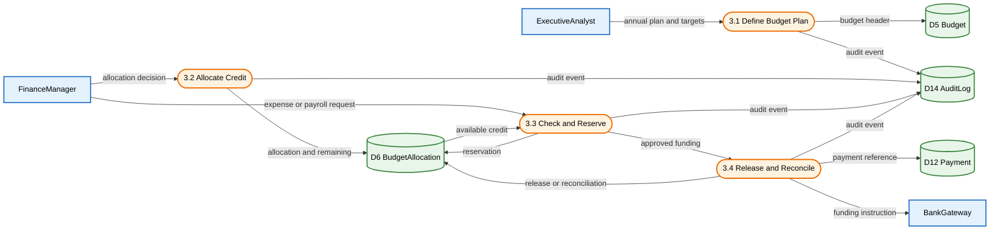
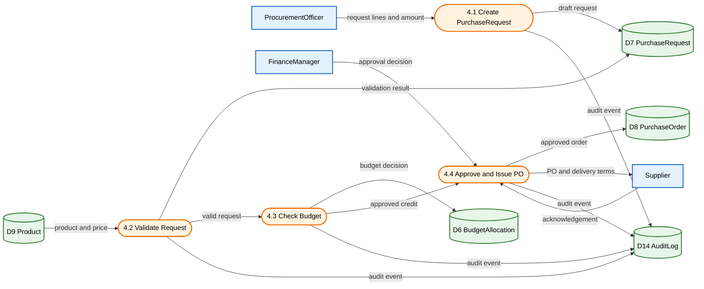
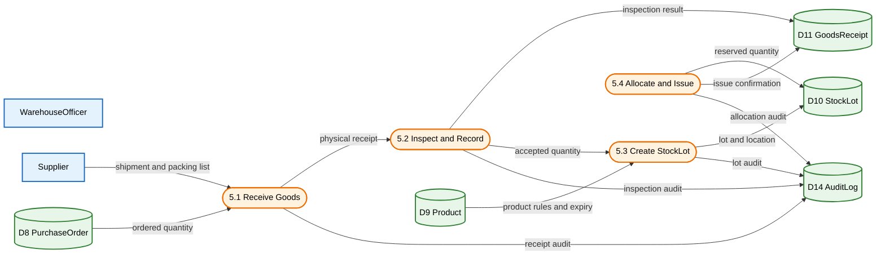
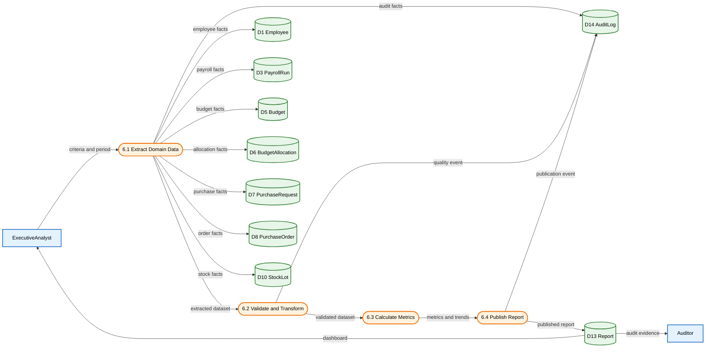
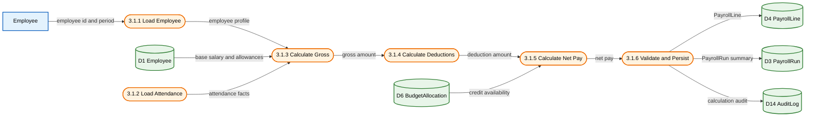
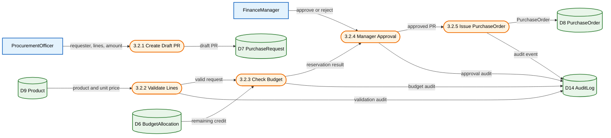

# DFD — Integrated HR, Finance & Procurement Management System

**Title:** Integrated HR, Finance & Procurement Management System  
**Version:** v1.0  
**Date:** 2026-09-09

## Traceability Map

| Level | ID | Content | Primary Output |
|---|---|---|---|
| 0 | DFD-L0 | System context and boundary | External actors and boundary flows |
| 1 | DFD-L1 | Six high-level processes | Domain-level data architecture |
| 2 | DFD-L2.1 through L2.6 | Decomposition of each high-level process | Operational sub-processes |
| 3 | DFD-L3.1 through L3.3 | Critical atomic processes | Detailed data transformation rules |

## Naming Convention

- External entities use the names `Employee`, `HRManager`, `FinanceManager`, `ProcurementOfficer`, `WarehouseOfficer`, `Supplier`, `BankGateway`, `ExecutiveAnalyst`, and `Auditor`.
- Data stores are numbered `D1` through `D14`, with each store's logical name included in its label.
- Processes use level and domain numbers, such as `2.2` or `3.1.4`.
- Flows carry data names, and input/output arrows preserve DFD balance.
- `AuditLog` records all material changes, and `Report` contains analytical outputs.

---

## Level 0 — Context Diagram

This diagram defines the system boundary and treats the software as one process.  
`Employee` provides identity, leave, and attendance data and receives salary slips and notifications.  
`HRManager`, `FinanceManager`, `ProcurementOfficer`, and `WarehouseOfficer` are internal organizational roles that submit decisions and operations for their domains.  
`Supplier` and `BankGateway` are external supply and payment systems, while `ExecutiveAnalyst` and `Auditor` receive management and audit outputs.  
No internal data stores appear at this level; every flow crosses the system boundary.  
This diagram aligns with the Level-1 UML Use Case Diagram.

---

## Level 1 — High-Level Processes

شش فرایند کلان، پنج حوزه درخواستی به‌علاوه گزارش‌گیری تحلیلی را پوشش می‌دهند.  
`HR Management` منبع داده `Employee` و `OrganizationUnit` را برای حقوق و گزارش‌ها فراهم می‌کند.  
`Payroll` از داده‌های پرسنلی و بودجه استفاده می‌کند و `PayrollRun`، `PayrollLine` و `Payment` را تولید می‌کند.  
`Budget & Credits` اعتبار را تعریف و تخصیص می‌دهد و قبل از خرید یا پرداخت، مانده `BudgetAllocation` را کنترل می‌کند.  
`Procurement` و `Inventory/Warehouse` زنجیره درخواست خرید، سفارش، رسید کالا، `Product` و `StockLot` را به‌هم وصل می‌کنند.  
`Reporting & Analytics` فقط داده‌های حوزه‌ای را می‌خواند، `Report` را تولید می‌کند و خروجی را به `ExecutiveAnalyst` و `Auditor` می‌دهد.

---

## سطح ۲ — تجزیه فرایندها

### DFD-L2.1 — مدیریت منابع انسانی

این نمودار استخدام، پرونده پرسنلی، ساختار سازمانی و تأیید تغییرات استخدامی را جدا می‌کند.  
ورودی `Employee` شامل درخواست و اطلاعات هویتی است و `HRManager` تصمیم استخدام، انتقال یا خاتمه همکاری را ثبت می‌کند.  
`D1 Employee` رکورد پایدار پرسنلی و `D2 OrganizationUnit` سلسله‌مراتب واحد سازمانی است.  
تمام تغییرات وضعیت و ساختار، یک رویداد در `D14 AuditLog` ایجاد می‌کنند.  
خروجی‌های تأییدشده به فرایند حقوق ارسال می‌شوند تا eligiblity و داده‌های محاسبه به‌روز باشد.

### DFD-L2.2 — حقوق و دستمزد

`PayrollRun` شناسه اجرای حقوق و `PayrollLine` جزئیات هر کارمند را نگهداری می‌کند.  
فرایند محاسبه از `Employee`، حضور، مزایا، کسورات و مانده `BudgetAllocation` استفاده می‌کند.  
`FinanceManager` پیش از ارسال به درگاه، جمع خالص و اعتبار را تأیید می‌کند.  
نتیجه بانک به `Payment` و `AuditLog` نوشته می‌شود و خطای درگاه مسیر retry را فعال می‌کند.  
این تجزیه مستقیماً با `calculateSalary()` و `postPayment()` در UML و BPMN سطح ۳ مرتبط است؛ امضای این متدها در Class Diagram سطح ۳ تعریف شده‌اند.

### DFD-L2.3 — بودجه و اعتبارات

بودجه سالانه در `D5 Budget` و سهم هر واحد یا پروژه در `D6 BudgetAllocation` نگهداری می‌شود.  
`checkBudget()` قبل از رزرو، مقدار درخواست را با `remaining` مقایسه می‌کند.  
رزرو موقت از کاهش همزمان اعتبار توسط درخواست‌های موازی جلوگیری می‌کند.  
پرداخت موفق باعث آزادسازی یا تطبیق اعتبار و ثبت `Payment` می‌شود.  
کمبود اعتبار، درخواست تخصیص مجدد یا رد درخواست را از طریق BPMN سطح ۳ فعال می‌کند.

### DFD-L2.4 — تدارکات و خرید

`PurchaseRequest` قبل از تأیید، اعتبارسنجی کامل بودن سطرها، قیمت و شناسه کالا را انجام می‌دهد.  
`BudgetAllocation` در `4.3 Check Budget` خوانده و در صورت تأیید، مقدار درخواست رزرو می‌شود.  
فقط درخواست تأییدشده به `PurchaseOrder` تبدیل می‌شود و برای `Supplier` ارسال می‌گردد.  
پاسخ تامین‌کننده و شرایط تحویل به مخزن سفارش و رویدادهای ممیزی وصل است.  
این نمودار با DFD-L3.2 و BPMN-L3 Budget Check for Purchase Request هم‌ردیف است.

### DFD-L2.5 — انبار و موجودی

رسید فیزیکی با مقدار سفارش و فهرست حمل تامین‌کننده تطبیق داده می‌شود.  
کالای پذیرفته‌شده به `GoodsReceipt` و سپس به `StockLot` با محل، تاریخ انقضا و مقدار تبدیل می‌شود.  
`allocateStock()` مقدار رزروشده را از موجودی قابل تخصیص کسر و وضعیت لات را به‌روز می‌کند.  
مغایرت تعداد یا کیفیت، گزارش تفاوت ایجاد می‌کند و از ثبت موجودی قطعی جلوگیری می‌کند.  
رخدادهای دریافت، بازرسی، ساخت لات و تخصیص در `AuditLog` قابل ممیزی هستند.

### DFD-L2.6 — گزارش‌گیری و تحلیل

گزارش‌گیری از مخازن اصلی خواندن انجام می‌دهد و هیچ رکورد عملیاتی حوزه‌ای را تغییر نمی‌دهد.  
استخراج، اعتبارسنجی، تبدیل و محاسبه شاخص‌ها به‌ترتیب انجام می‌شوند تا گزارش‌های ناسازگار منتشر نشوند.  
`Report` شامل دوره، فیلترها، معیارها، نسخه و زمان تولید است.  
`ExecutiveAnalyst` داشبورد مدیریتی و `Auditor` شواهد ممیزی دریافت می‌کند.  
رخداد کیفیت داده و انتشار گزارش برای ردیابی و بازتولید گزارش در `AuditLog` ثبت می‌شود.

---

## سطح ۳ — فرایندهای اتمی بحرانی

### DFD-L3.1 — محاسبه نهایی حقوق

ورودی اتمی شامل شناسه کارمند، دوره حقوق، وضعیت استخدام و داده‌های حضور است.  
قانون تبدیل ناخالص برابر است با `baseSalary + allowances + approved overtime - unpaidLeave`.  
کسورات شامل مالیات، بیمه و سایر کسرهای تأییدشده است و خالص نباید منفی شود.  
در صورت ناکافی بودن اعتبار یا نقض قانون محاسبه، `PayrollLine` پایدار نمی‌شود و خطا در `AuditLog` ثبت می‌گردد.  
خروجی نهایی یک `PayrollLine` با مقادیر ناخالص، کسورات، خالص و نسخه قوانین است که به `PayrollRun` جمع می‌شود.

### DFD-L3.2 — ثبت و تأیید درخواست خرید

درخواست باید دارای درخواست‌دهنده فعال، حداقل یک سطر، مقدار مثبت و کالای معتبر باشد.  
`checkBudget()` مقدار کل درخواست را با مانده تخصیص مقایسه و در صورت موفقیت، رزرو موقت ایجاد می‌کند.  
تأیید مدیر فقط پس از اعتبارسنجی و رزرو بودجه امکان‌پذیر است و رد درخواست، رزرو را آزاد می‌کند.  
صدور `PurchaseOrder` یک عمل اتمی است و شماره سفارش، تامین‌کننده، مبلغ و مهلت تحویل را پایدار می‌کند.  
همه تصمیم‌ها و تغییرات بودجه در `AuditLog` ثبت می‌شوند تا درخواست قابل ممیزی باشد.

### DFD-L3.3 — تخصیص کالا به درخواست‌کننده

انتخاب لات بر اساس محصول، مقدار قابل تخصیص، تاریخ انقضا، کیفیت و قانون FEFO انجام می‌شود.  
قبل از رزرو، مقدار درخواست باید از `StockLot.availableQuantity` بیشتر نباشد.  
رزرو به‌صورت اتمی مقدار `availableQuantity` را کاهش و مقدار `reservedQuantity` را افزایش می‌دهد تا تخصیص موازی باعث کسری نشود.  
تأیید خروج، رسید کالا و رویداد ممیزی را به‌روز می‌کند و در صورت مغایرت فیزیکی، تخصیص متوقف می‌شود.  
خروجی نهایی شامل `StockLot` به‌روز، مقدار تخصیص‌یافته، محل تحویل و `AuditLog` است.

---

## ماتریس ردیابی

| شناسه DFD | فرایند | BPMN | UML |
|---|---|---|---|
| DFD-L0 | Context | BPMN-L1 Overview | Use Case Diagram |
| DFD-L1 | Level-1 processes | BPMN-L1 Pools | Component Diagram |
| DFD-L2.1 | HR Management | BPMN-L2 HR | Class Diagram |
| DFD-L2.2 | Payroll | BPMN-L2 Payroll / L3 Payroll Approval | Sequence Diagram |
| DFD-L2.3 | Budget & Credits | BPMN-L2 Budget / L3 Budget Check | Class Diagram |
| DFD-L2.4 | Procurement | BPMN-L2 Procurement / L3 PR Approval | Activity Diagram |
| DFD-L2.5 | Inventory/Warehouse | BPMN-L2 Inventory / L3 Stock Allocation | State Machine Diagram |
| DFD-L2.6 | Reporting & Analytics | BPMN-L2 Reporting | Component Diagram |
| DFD-L3.1 | Final Salary Calculation | `calculateSalary()` | PayrollRun / PayrollLine |
| DFD-L3.2 | Purchase-Request Approval | `checkBudget()` / approve PR | PurchaseRequest / BudgetAllocation |
| DFD-L3.3 | Stock Allocation | `allocateStock()` | StockLot / GoodsReceipt |

## قوانین یکپارچگی

1. هر فرایند سطح ۲ باید ورودی و خروجی‌های متناظر با فرایند والد سطح ۱ را حفظ کند.
2. هر تغییر در `Employee`، `BudgetAllocation`، `PurchaseRequest`، `PurchaseOrder`، `StockLot` یا `Payment` باید `AuditLog` تولید کند.
3. `Reporting & Analytics` حق نوشتن در مخازن عملیاتی ندارد و فقط `Report` را ایجاد می‌کند.
4. هیچ پرداخت یا سفارش خرید بدون بررسی و رزرو اعتبار صادر نمی‌شود.
5. هیچ تخصیص موجودی بدون رسید معتبر و لات واجد شرایط انجام نمی‌شود.

*پایان سند DFD*
