# DFD — Integrated HR, Finance & Procurement Management System

**Title:** Integrated HR, Finance & Procurement Management System
**Version:** v1.0
**Date:** 2026-09-09

## Traceability Map

| Level | ID | Content | Primary Output |
|---|---|---|---|
| 0 | DFD-L0 | System context and boundary | External actors and boundary flows |
| 1 | DFD-L1 | Six high-level processes | Domain-level data architecture |
| 2 | DFD-L2.1 through L2.6 | Decomposition of each high-level process | Operational sub-processes |
| 3 | DFD-L3.1 through L3.3 | Critical atomic processes | Detailed data transformation rules |

## Naming Convention

- External entities use the names `Employee`, `HRManager`, `FinanceManager`, `ProcurementOfficer`, `WarehouseOfficer`, `Supplier`, `BankGateway`, `ExecutiveAnalyst`, and `Auditor`.
- Data stores are numbered `D1` through `D14`, with each store's logical name included in its label.
- Processes use level and domain numbers, such as `2.2` or `3.1.4`.
- Flows carry data names, and input/output arrows preserve DFD balance.
- `AuditLog` records all material changes, and `Report` contains analytical outputs.

---

## Level 0 — Context Diagram

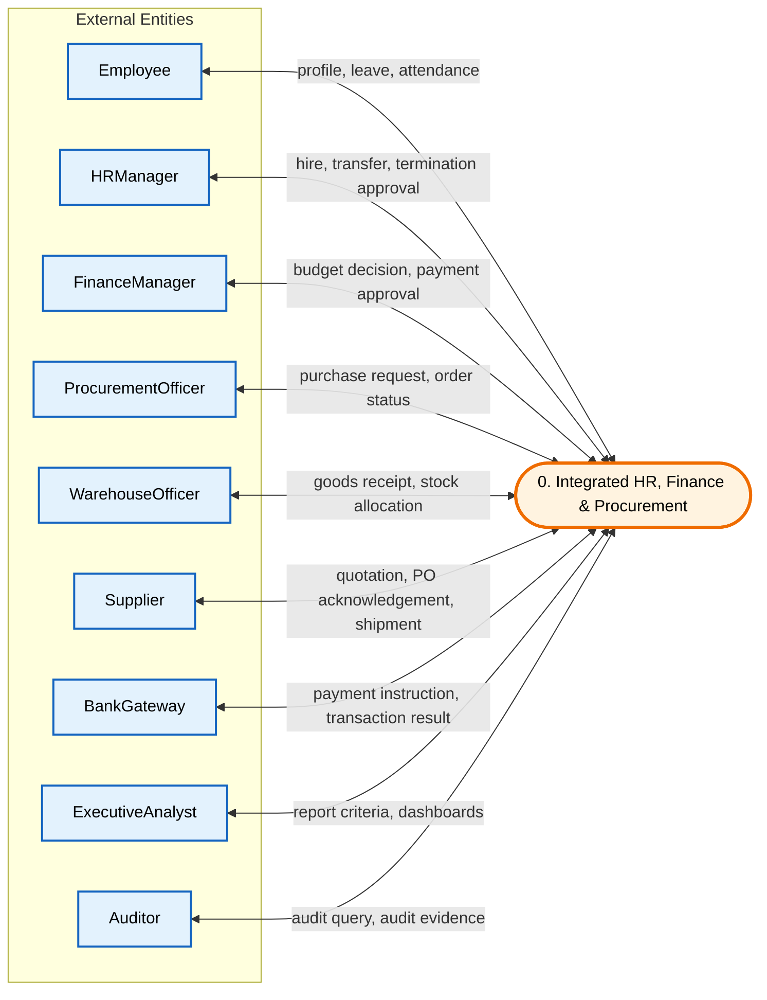

This diagram defines the system boundary and treats the software as one process.
`Employee` provides identity, leave, and attendance data and receives salary slips and notifications.
`HRManager`, `FinanceManager`, `ProcurementOfficer`, and `WarehouseOfficer` are internal organizational roles that submit decisions and operations for their domains.
`Supplier` and `BankGateway` are external supply and payment systems, while `ExecutiveAnalyst` and `Auditor` receive management and audit outputs.
No internal data stores appear at this level; every flow crosses the system boundary.
This diagram aligns with the Level-1 UML Use Case Diagram.

---

## Level 1 — High-Level Processes

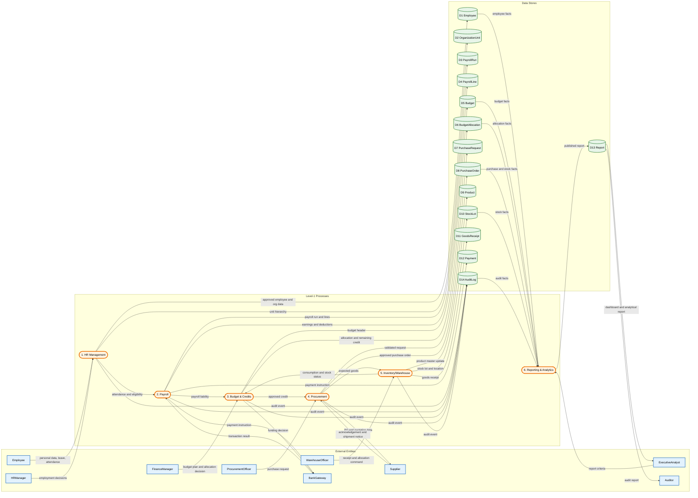

Six high-level processes cover the five requested domains plus analytical reporting.
`HR Management` supplies `Employee` and `OrganizationUnit` data to payroll and reporting.
`Payroll` uses personnel and budget data to produce `PayrollRun`, `PayrollLine`, and `Payment`.
`Budget & Credits` defines and allocates credit and checks the `BudgetAllocation` balance before purchasing or payment.
`Procurement` and `Inventory/Warehouse` connect purchase requests, orders, goods receipts, `Product`, and `StockLot`.
`Reporting & Analytics` reads domain data, creates `Report`, and delivers outputs to `ExecutiveAnalyst` and `Auditor`.

---

## Level 2 — Process Decomposition

### DFD-L2.1 — Human Resources Management

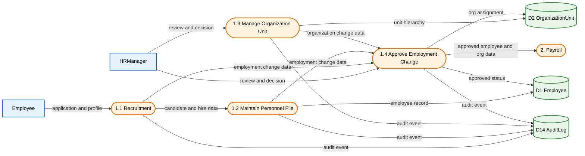

This diagram separates recruitment, personnel-file maintenance, organization-unit management, and employment-change approval.
The `Employee` input includes applications and profile data, while `HRManager` records hiring, transfer, or termination decisions.
`D1 Employee` is the persistent personnel record and `D2 OrganizationUnit` is the organizational hierarchy.
Every status and structure change creates an event in `D14 AuditLog`.
Approved outputs are sent to payroll so eligibility and calculation data remain current.

### DFD-L2.2 — Payroll

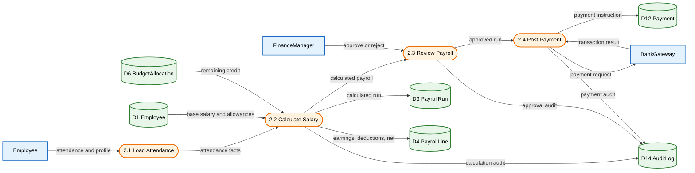

`PayrollRun` holds the payroll execution identifier, and `PayrollLine` holds each employee's calculation details.
The calculation process uses `Employee`, attendance, allowances, deductions, and the remaining `BudgetAllocation`.
`FinanceManager` approves the net total and available credit before the payment request is sent to the gateway.
The bank result is written to `Payment` and `AuditLog`; a gateway error activates the bounded retry path.
This decomposition maps directly to `calculateSalary()` and `postPayment()` in the Level-3 UML and BPMN models.

### DFD-L2.3 — Budget & Credits

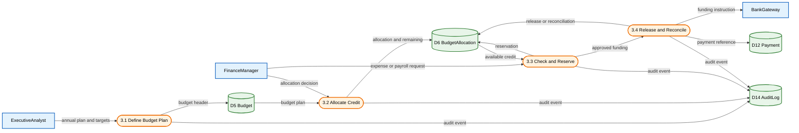

The annual budget is stored in `D5 Budget`, while each unit or project share is stored in `D6 BudgetAllocation`.
Before reserving credit, `BudgetAllocation.checkBudget()` compares the requested amount with `remaining`.
A temporary reservation prevents concurrent requests from consuming the same credit.
A successful payment releases or reconciles the reservation and records `Payment`.
Insufficient credit triggers a reallocation request or rejection through the Level-3 BPMN process.

### DFD-L2.4 — Procurement

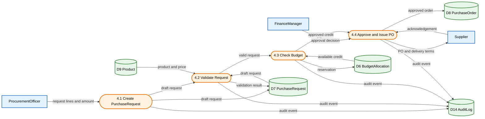

Before approval, `PurchaseRequest` validates line completeness, price, and product identifiers.
`BudgetAllocation` is read by `4.3 Check Budget`; when approved, the requested amount is reserved.
Only an approved request is converted into a `PurchaseOrder` and sent to `Supplier`.
The supplier response and delivery terms are connected to the order store and audit events.
This diagram aligns with DFD-L3.2 and BPMN-L3 Budget Check for Purchase Request.

### DFD-L2.5 — Inventory & Warehouse

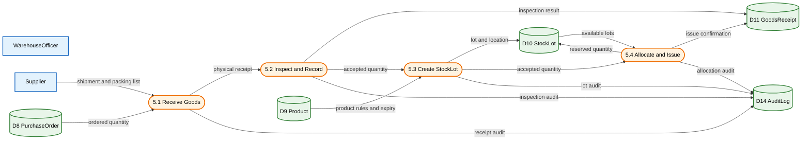

The physical receipt is reconciled with the ordered quantity and the supplier packing list.
Accepted goods become a `GoodsReceipt` and then a `StockLot` with location, expiry date, and quantity.
`StockLot.allocate()` / `allocateStock()` reduces available quantity and updates the lot state.
A quantity or quality discrepancy creates a discrepancy report and prevents final inventory posting.
Receipt, inspection, lot creation, and allocation events are auditable in `AuditLog`.

### DFD-L2.6 — Reporting & Analytics

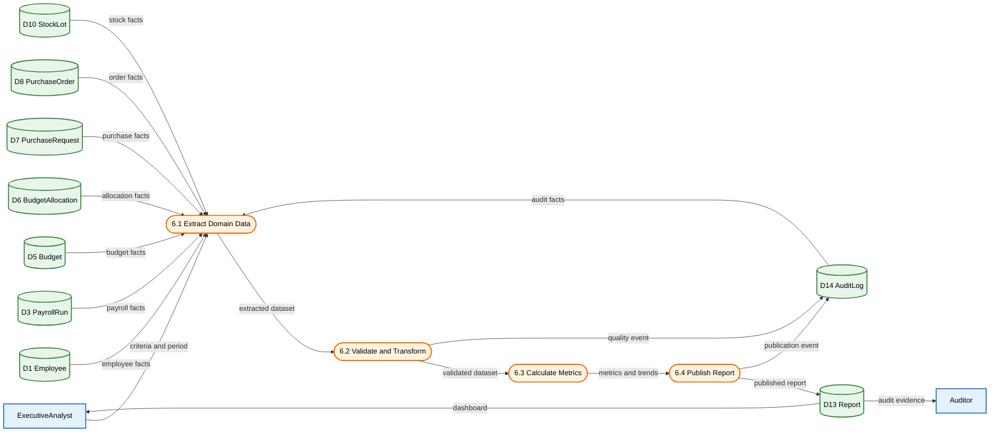

Reporting reads the primary stores and does not modify operational domain records.
Extraction, validation, transformation, and metric calculation run in sequence so inconsistent reports are not published.
`Report` contains the period, filters, criteria, version, and generation time.
`ExecutiveAnalyst` receives the management dashboard, and `Auditor` receives audit evidence.
Data-quality and publication events are stored in `AuditLog` for traceability and report reproduction.

---

## Level 3 — Critical Atomic Processes

### DFD-L3.1 — Final Salary Calculation

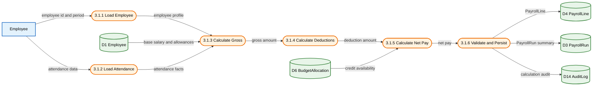

Atomic inputs include employee ID, payroll period, employment status, and attendance data.
Gross pay is calculated as `baseSalary + allowances + approved overtime - unpaidLeave`.
Deductions include tax, insurance, and other approved deductions, and net pay must not be negative.
If credit is insufficient or a calculation rule is violated, no `PayrollLine` is persisted and the error is recorded in `AuditLog`.
The final output is a `PayrollLine` containing gross, deductions, net pay, and the rule version, aggregated into `PayrollRun`.

### DFD-L3.2 — Purchase-Request Registration and Approval

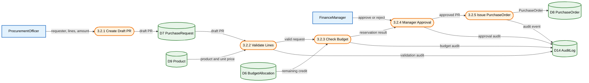

A request must have an active requester, at least one line, a positive amount, and a valid product.
`BudgetAllocation.checkBudget()` compares the total request with the allocation balance and creates a temporary reservation on success.
Manager approval is possible only after line validation and budget reservation; rejection releases the reservation.
Issuing a `PurchaseOrder` is atomic and persists the order number, supplier, amount, and delivery deadline.
All decisions and budget changes are recorded in `AuditLog` for auditability.

### DFD-L3.3 — Stock Allocation to Requester

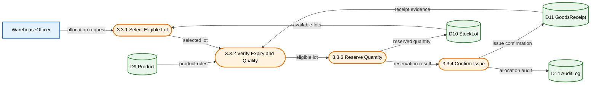

Lot selection uses product, available quantity, expiry date, quality, and the FEFO rule.
Before reservation, the requested quantity must not exceed `StockLot.availableQuantity`.
Reservation atomically decreases `availableQuantity` and increases `reservedQuantity`, preventing concurrent allocation from creating a shortage.
Issue confirmation updates the goods receipt and audit event; a physical discrepancy stops allocation.
The final output contains the updated `StockLot`, allocated quantity, delivery location, and `AuditLog`.

---

## Traceability Matrix

| DFD ID | Process | BPMN | UML |
|---|---|---|---|
| DFD-L0 | Context | BPMN-L1 Overview | Use Case Diagram |
| DFD-L1 | Level-1 processes | BPMN-L1 Pools | Component Diagram |
| DFD-L2.1 | HR Management | BPMN-L2 HR | Class Diagram |
| DFD-L2.2 | Payroll | BPMN-L2 Payroll / L3 Payroll Approval | Sequence Diagram |
| DFD-L2.3 | Budget & Credits | BPMN-L2 Budget / L3 Budget Check | Class Diagram |
| DFD-L2.4 | Procurement | BPMN-L2 Procurement / L3 PR Approval | Activity Diagram |
| DFD-L2.5 | Inventory/Warehouse | BPMN-L2 Inventory / L3 Stock Allocation | State Machine Diagram |
| DFD-L2.6 | Reporting & Analytics | BPMN-L2 Reporting | Component Diagram |
| DFD-L3.1 | Final Salary Calculation | `calculateSalary()` | PayrollRun / PayrollLine |
| DFD-L3.2 | Purchase-Request Approval | `checkBudget()` / approve PR | PurchaseRequest / BudgetAllocation |
| DFD-L3.3 | Stock Allocation | `allocateStock()` | StockLot / GoodsReceipt |

## Integrity Rules

1. Every Level-2 process must preserve the inputs and outputs of its Level-1 parent process.
2. Every change to `Employee`, `BudgetAllocation`, `PurchaseRequest`, `PurchaseOrder`, `StockLot`, or `Payment` must create an `AuditLog` event.
3. `Reporting & Analytics` may not write to operational stores and may create only `Report`.
4. No payment or purchase order is issued without credit checking and reservation.
5. No stock allocation occurs without a valid receipt and an eligible lot.

*End of DFD document*
