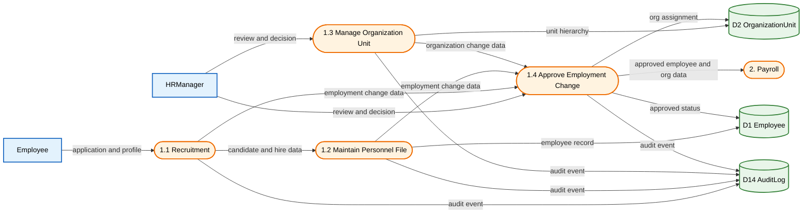
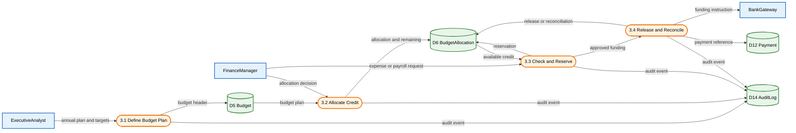
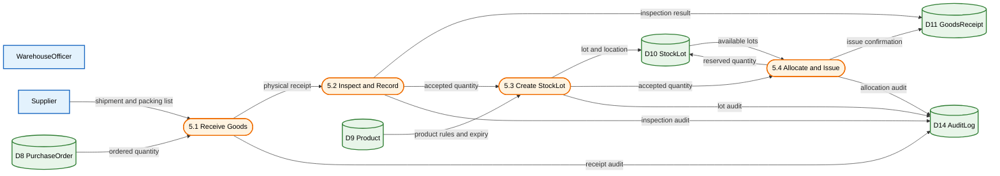
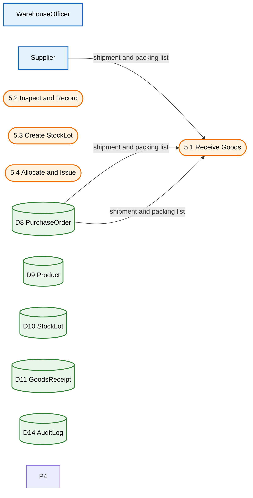
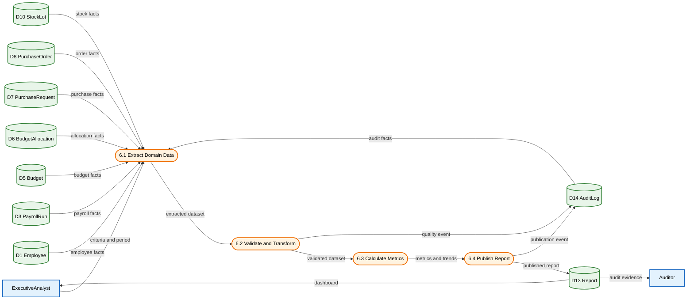
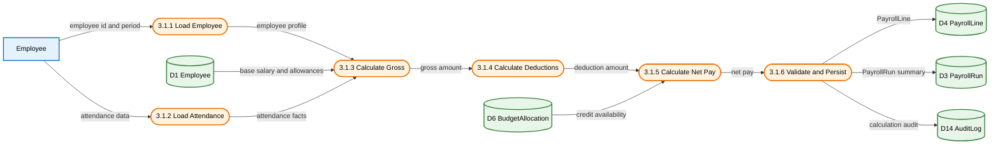
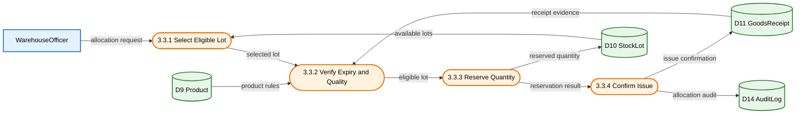

# مستند جامع مدل‌سازی DFD، BPMN و UML 2.5

**سامانه:** Integrated HR, Finance & Procurement Management System  
**نسخه:** v1.0  
**تاریخ:** 2026-09-10  
**وضعیت:** مستند معماری و تحلیل فرایند

## هدف و دامنه

این سند، مدل یکپارچهٔ سامانهٔ مدیریت منابع انسانی، حقوق و دستمزد، بودجه و اعتبارات، تدارکات و انبار، و گزارش‌گیری تحلیلی را در سه لایهٔ انتزاع ارائه می‌کند. DFD مرز سامانه و جریان داده‌ها را نشان می‌دهد، BPMN رفتار کسب‌وکار و همکاری نقش‌ها را مدل می‌کند، و UML 2.5 ساختار، رفتار و تعاملات طراحی را تا سطح پیاده‌سازی پوشش می‌دهد.

### قرارداد نام‌گذاری

- شناسه‌های DFD با `DFD-Lx.y` و مخازن با `D1` تا `D14` نمایش داده می‌شوند.
- شناسه‌های BPMN با `BPMN-Lx-<Domain>` و استثناها با `EX-<Domain><Seq>` نام‌گذاری می‌شوند.
- نام موجودیت‌ها و عملیات‌ها در همهٔ нотاسیون‌ها یکسان است: `Employee`, `PayrollRun`, `PayrollLine`, `Budget`, `BudgetAllocation`, `PurchaseRequest`, `PurchaseOrder`, `Product`, `StockLot`, `GoodsReceipt`, `Payment`, `Report`, `AuditLog`.
- عملیات‌های کلیدی: `calculateSalary()`, `BudgetAllocation.checkBudget()`, `BudgetAllocation.reserve()`, `StockLot.allocate()` / `allocateStock()`, `generateReport()`, `executePayment()`.
- هر تغییر مهم، تأیید، رد، رزرو، پرداخت، تخصیص و انتشار گزارش باید یک رویداد `AuditLog` ایجاد کند.

## فهرست مطالب

1. [DFD](#1-dfd)
2. [BPMN](#2-bpmn)
3. [UML 2.5](#3-uml-25)
4. [ردیابی و قوانین انسجام](#4-ردیابی-و-قوانین-انسجام)

## پوشش مدل‌ها

| خانواده | سطح ۰ / زمینه | سطح ۱ | سطح ۲ | سطح ۳ |
|---|---:|---:|---:|---:|
| DFD | نمودار زمینه | ۶ فرایند اصلی | ۶ تجزیهٔ دامنه‌ای | ۳ فرایند اتمی حیاتی |
| BPMN | — | نمای کلان استخرها و لین‌ها | ۶ فرایند دامنه‌ای | ۳ زیرفرایند اجرایی حیاتی |
| UML 2.5 | — | دامنه و چشم‌انداز | طراحی و زیرسیستم | پیاده‌سازی، امضاها و قیود |

# ۱. DFD

DFD با حفظ اصل balance طراحی شده است: خروجی‌ها و ورودی‌های هر فرایند در سطح تجزیه‌شده باید با فرایند والد همخوانی داشته باشند. موجودیت‌های بیرونی با رنگ آبی، فرایندها با رنگ نارنجی و مخازن داده با رنگ سبز متمایز شده‌اند.

## سطح ۰ — نمودار زمینه


- `Employee` داده‌های هویتی، مرخصی و حضور را وارد می‌کند و فیش حقوقی و اعلان دریافت می‌کند.
- `HRManager` تصمیم‌های استخدام، انتقال و خاتمهٔ همکاری را ثبت و تأیید می‌کند.
- `FinanceManager` تصمیم بودجه و پرداخت را صادر می‌کند؛ `BankGateway` نتیجهٔ تراکنش را برمی‌گرداند.
- `ProcurementOfficer` درخواست خرید را ثبت می‌کند و `Supplier` وضعیت سفارش و محموله را اعلام می‌کند.
- `WarehouseOfficer` رسید کالا و تخصیص موجودی را ثبت می‌کند؛ `ExecutiveAnalyst` و `Auditor` خروجی‌های مدیریتی و حسابرسی می‌گیرند.
- در این سطح هیچ مخزن داخلی نمایش داده نمی‌شود و همهٔ جریان‌ها از مرز سامانه عبور می‌کنند.

## سطح ۱ — فرایندهای اصلی


- شش فرایند اصلی، پنج دامنهٔ درخواستی را به‌همراه گزارش‌گیری پوشش می‌دهند.
- `HR Management` منبع دادهٔ `Employee` و `OrganizationUnit` برای حقوق و گزارش‌هاست.
- `Payroll` از دادهٔ پرسنلی و اعتبار باقی‌مانده استفاده کرده و `PayrollRun`، `PayrollLine` و `Payment` را تولید می‌کند.
- `Budget & Credits` اعتبار را تخصیص و رزرو می‌کند و هیچ پرداخت یا سفارش خریدی بدون بررسی اعتبار صادر نمی‌شود.
- `Procurement` و `Inventory/Warehouse` چرخهٔ درخواست، سفارش، رسید انبار و `StockLot` را به هم متصل می‌کنند.
- `Reporting & Analytics` فقط از مخازن عملیاتی می‌خواند، `Report` را می‌سازد و خروجی را به `ExecutiveAnalyst` و `Auditor` می‌دهد.

## سطح ۲ — تجزیه فرایندها

### DFD-L2.1 — مدیریت منابع انسانی



- استخدام، نگهداری پرونده، مدیریت واحد سازمانی و تأیید تغییرات استخدامی از یکدیگر جدا شده‌اند.
- `Employee` دادهٔ متقاضی و پروفایل را وارد می‌کند و `HRManager` تصمیم استخدام، انتقال یا خاتمه را ثبت می‌کند.
- `D1 Employee` رکورد پایدار پرسنلی و `D2 OrganizationUnit` سلسله‌مراتب سازمانی است.
- هر تغییر وضعیت یا ساختار، رویدادی در `D14 AuditLog` ایجاد می‌کند.
- خروجی تأییدشده به `Payroll` می‌رود تا واجد شرایط بودن و دادهٔ محاسبه حقوق به‌روز بماند.

### DFD-L2.2 — حقوق و دستمزد


- `PayrollRun` شناسهٔ اجرای حقوق و `PayrollLine` جزییات محاسبه هر کارمند را نگهداری می‌کند.
- فرایند محاسبه، حقوق پایه، مزایا، کسورات، حضور و اعتبار باقی‌ماندهٔ `BudgetAllocation` را ترکیب می‌کند.
- `FinanceManager` پس از بررسی مجموع خالص و اعتبار، اجرا را تأیید یا رد می‌کند.
- نتیجهٔ بانک در `Payment` و `AuditLog` ثبت می‌شود و خطای درگاه مسیر Retry محدود را فعال می‌کند.
- این تجزیه مستقیماً با `calculateSalary()` و `postPayment()` در مدل‌های UML و BPMN تناظر دارد.

### DFD-L2.3 — بودجه و اعتبارات



- بودجهٔ سالانه در `D5 Budget` و سهم هر واحد یا پروژه در `D6 BudgetAllocation` نگهداری می‌شود.
- `BudgetAllocation.checkBudget()` مقدار درخواستی را با `remaining` مقایسه می‌کند.
- رزرو موقت، مصرف همزمان یک اعتبار توسط درخواست‌های موازی را جلوگیری می‌کند.
- پرداخت موفق، رزرو را آزاد یا تسویه می‌کند و `Payment`D14`D14` را ثبت و تسویه می‌کند.
- کمبود اعتبار، درخواست تخصیص مجدد یا رد عملیات را از طریق زیرفرایند سطح ۳ فعال می‌کند.

### DFD-L2.4 — تدارکات

```mermaid
flowchart LR
classDef entity fill:#E3F2FD,stroke:#1565C0,stroke-width:2px,color:#000;
classDef process fill:#FFF3E0,stroke:#EF6C00,stroke-width:2px,color:#000;
classDef store fill:#E8F5E9,stroke:#2E7D32,stroke-width:2px,color:#000;
PROC[ProcurementOfficer]:::entity
FIN[FinanceManager]:::entity
SUP[Supplier]:::entity
P41([4.1 Create PurchaseRequest]):::process
P42([4.2 Validate Request]):::process
P43([4.3 Check Budget]):::process
P44([4.4 Approve and Issue PO]):::process
D6[(D6 BudgetAllocation)]:::store
D7[(D7 PurchaseRequest)]:::store
D8[(D8 PurchaseOrder)]:::store
D9[(D9 Product)]:::store
D14[(D14 AuditLog)]:::store
PROC -->|request lines and amount| P41
P41 -->|draft request| P42
P41 -->|draft request| D7
D7 -->|draft request| P42
P42 -->|validation result| D7
D9 -->|product and price| P42
D6 -->|available credit| P43
P42 -->|valid request| P43
P43 -->|reservation| D6
FIN -->|approval decision| P44
P43 -->|approved credit| P44
P44 -->|approved order| D8
P44 -->| D8
P44 -->|PO and delivery terms| SUP
SUP -->|acknowledgement| P44
P41 -->|audit event| D14
P42 -->|audit event| D14
P43 -->|audit event| D14
P44 -->|audit event| D14
```

- درخواست خرید از نظر کامل بودن سطرها، شناسه کالا و مبلغ مثبت اعتبارسنجی می‌شود.
- `D6 BudgetAllocation` در فرایند `4.3 Check Budget` خوانده و در صورت تأیید، مبلغ رزرو می‌شود.
- فقط درخواست تأیید می‌شود.
- `PurchaseRequest` تنها پس از اعتبارسنجی و رزرو بودجه به `PurchaseOrder` تبدیل می‌شود.
- پاسخ تامین‌کننده و شرایط تحویل به مخزن سفارش و رویدادهای حسابرسی متصل است.
- این مدل با DFD-L3.2 و BPMN-L3 بودجهٔ درخواست خرید هم‌نام و هم‌مسیر است.

### DFD-L2.5 — انبار و موجودی



- کالای فیزیکی با مقدار سفارش‌شده و بارنامهٔ تامین‌کننده تطبیق داده می‌شود.
- کالای پذیرفته‌شده ابتدا `GoodsReceipt` و سپس `StockLot` با مکان، تاریخ انقضا و مقدار می‌سازد.
- `StockLot.allocate()` / `allocateStock()` مقدار قابل تخصیص را کاهش و وضعیت لات را به‌روز می‌کند.
- مغایرت مقدار یا کیفیت، گزارش مغایرت ایجاد کرده و انتشار نهایی موجودی را متوقف می‌کند.
- دریافت، بررسی کیفیت و ثبت 14
- هر روید.
- `D14
- هیچ تخصی.
```

### D14 — گزارش‌4.3 — بودجه و اعتبارات


- بودجهٔ سالانه در `D5 Budget` و سهم هر واحد یا پروژه در `D6 BudgetAllocation` نگهداری می‌شود.
- `BudgetAllocation.checkBudget()` مقدار درخواستی را با `remaining` مقایسه می‌کند.
- رزرو موقت، مصرف همزمان یک اعتبار توسط درخواست‌های موازی را جلوگیری می‌کند.
- پرداخت موفق، رزرو را آزاد یا تسویه می‌کند و `Payment` را ثبت می‌کند.
- کمبود اعتبار، درخواست تخصیص مجدد یا رد عملیات را از طریق زیرفرایند سطح ۳ فعال می‌کند.

### DFD-L2.4 — تدارکات


- درخواست خرید از نظر کامل بودن سطرها، شناسه کالا و مبلغ مثبت اعتبارسنجی می‌شود.
- `D6 BudgetAllocation` در فرایند `4.3 Check Budget` خوانده و در صورت تأیید، مبلغ رزرو می‌شود.
- `PurchaseRequest` تنها پس از اعتبارسنجی و رزرو بودجه به `PurchaseOrder` تبدیل می‌شود.
- پاسخ تامین‌کننده و شرایط تحویل به مخزن سفارش و رویدادهای حسابرسی متصل است.
- این مدل با DFD-L3.2 و BPMN-L3 بودجهٔ درخواست خرید هم‌نام و هم‌مسیر است.

### DFD-L2.5 — انبار و موجودی



<!-- APPEND -->|D14 AuditLog)]::store
P5
```

### DFD-L2.6 — گزارش‌گیری و تحلیل



- گزارش‌گیری داده‌های دامنه را می‌خواند و رکوردهای عملیاتی را تغییر نمی‌دهد.
- استخراج، اعتبارسنجی، تبدیل و محاسبهٔ شاخص به ترتیب انجام می‌شوند تا گزارش ناسازگار منتشر نشود.
- `Report` دوره، فیلترها، معیارها، نسخه و زمان تولید را نگهداری می‌کند.
- `ExecutiveAnalyst` داشبورد مدیریتی و `Auditor` شواهد حسابرسی را دریافت می‌کند.
- رویدادهای کیفیت داده و انتشار برای بازتولید گزارش در `AuditLog` ثبت می‌شوند.

## سطح ۳ — فرایندهای اتمی حیاتی

### DFD-L3.1 — محاسبه حقوق نهایی



- ورودی‌های اتمی شامل شناسه کارمند، دوره حقوق، وضعیت اشتغال و دادهٔ حضور هستند.
- حقوق ناخالص برابر است با `baseSalary + allowances + approvedOvertime - unpaidLeave`.
- کسورات شامل مالیات، بیمه و کسورات تأییدشده است و `netPay` نباید منفی شود.
- در صورت کمبود اعتبار یا نقض قانون محاسبه، `PayrollLine` ذخیره نمی‌شود و خطا در `AuditLog` ثبت می‌گردد.
- خروجی نهایی یک `PayrollLine` و `PayrollRun` را در `PayrollLine` را تولید و `PayrollRun` را تولید می‌کند.

### DFD-L3.2 — ثبت و تأیید درخواست خرید

```mermaid
flowchart LR
classDef entity fill:#E3F2FD,stroke:#1565C0,stroke-width:2px,color:#000;
classDef process fill:#FFF3E0,stroke:#EF6C00,stroke-width:2px,color:#000;
classDef store fill:#E8F5E9,stroke:#2E7D32,stroke-width:2px,color:#000;
PROC[ProcurementOfficer]:::entity
FIN[FinanceManager]:::entity
T1([3.2.1 Create Draft PR]):::process
T2([3.2.2 Validate Lines]):::process
T3([3.2.3 Check Budget]):::process
T4([3.2.4 Manager Approval]):::process
T5([3.2.5 Issue PurchaseOrder]):::process
D7[(D7 PurchaseRequest)]:::store
D6[(D6 BudgetAllocation)]:::store
D8[(D8 PurchaseOrder)]:::store
D9[(D9 Product)]:::store
D14[(D14 AuditLog)]:::store
PROC -->|requester, lines, amount| T1
T1 -->|draft PR| D7
D7 -->|draft PR| T2
D9 -->|product and unit price| T2
T2 -->|valid request| T3
D6 -->|remaining credit| T3
T3 -->|reservation result| T4
FIN -->|approve or reject| T4
T4 -->|approved PR| T5
T5 -->|PurchaseOrder| D8
T5 -->|audit event| D14
T2 -->|validation audit| D14
T3 -->|budget audit| D14
T4 -->|audit
```

<!-- APPEND -->
```

### DFD-L3.3 — تخصی


- انتخاب لات بر اساس کالا، مقدار قابل تخصیص، تاریخ انقضا، کیفیت و قاعدهٔ FEFO انجام می‌شود.
- قبل از رزرو، مقدار درخواستی نباید از `StockLot.availableQuantity` بیشتر باشد.
- رزرو به‌صورت اتمی مقدار موجود را کم و مقدار رزروشده را زیاد می‌کند تا تخصیص همزمان باعث کسری نشود.
- تأیید خروج، رسید کالا و رویداد حسابرسی را به‌روز می‌کند؛ مغایرت فیزیکی فرایند را متوقف می‌کند.
- خروجی نهایی شامل `StockLot` به‌روز، مقدار تخصیص‌یافته، محل تحویل و رویداد `AuditLog` است.

## قوانین یکپارچگی DFD

1. هر فرایند سطح ۲ باید ورودی‌ها و خروجی‌های فرایند والد سطح �1 را حفظ کند.
2. هر تغییر در `Employee`، `BudgetAllocation`، `PurchaseRequest`، `PurchaseOrder`، `StockLot` یا `Payment` باید رویداد `AuditLog` بسازد.
3. `Reporting & Analytics` حق نوشتن در مخازن عملیاتی را ندارد و فقط `Report` را ایجاد می‌کند.
4. بدون بررسی و رزرو اعتبار، پرداخت یا سفارش خرید صادر نمی‌شود.
5. بدون رسید معتبر و لات واجد شرایط، تخصیص کالا انجام نمی‌شود.

<!-- APPEND -->
