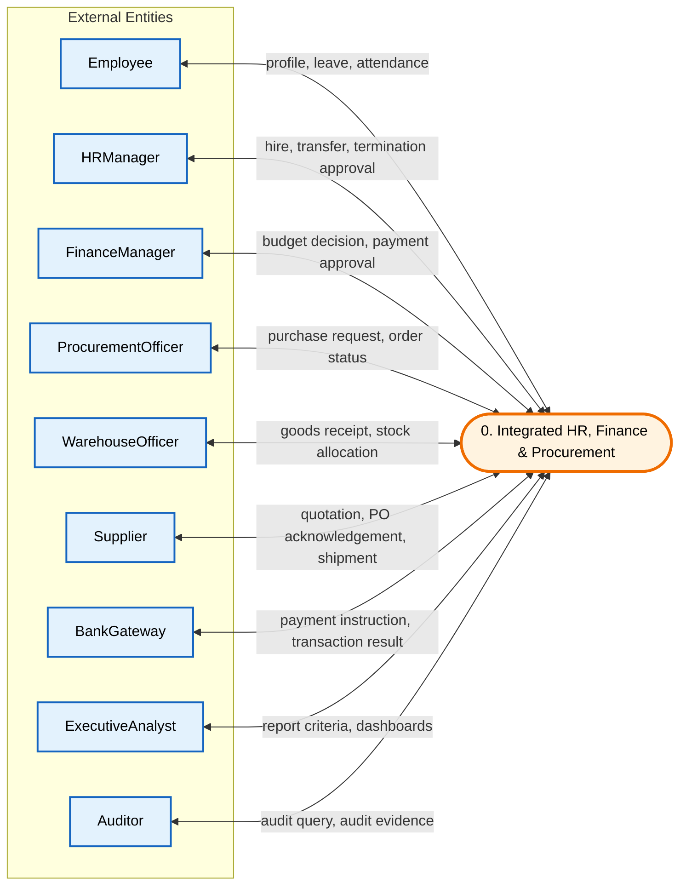
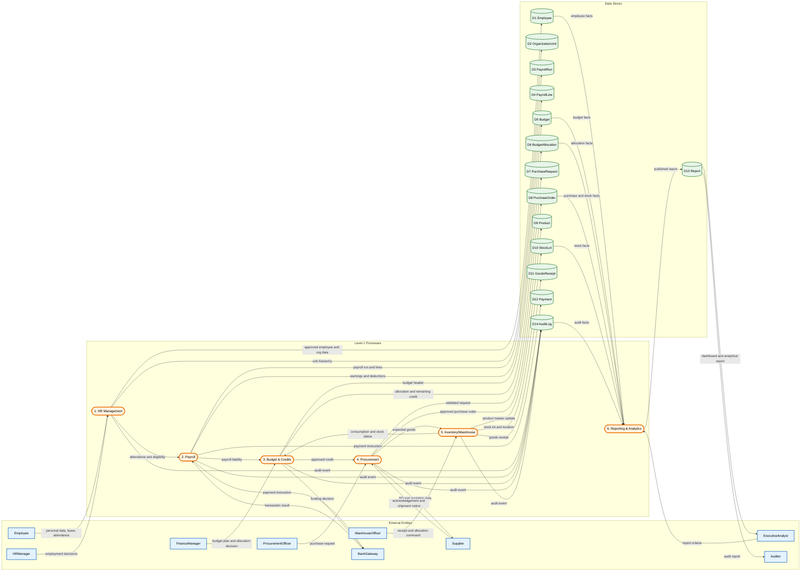
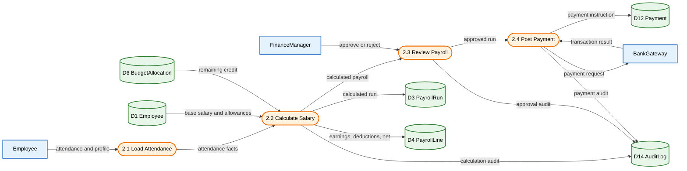
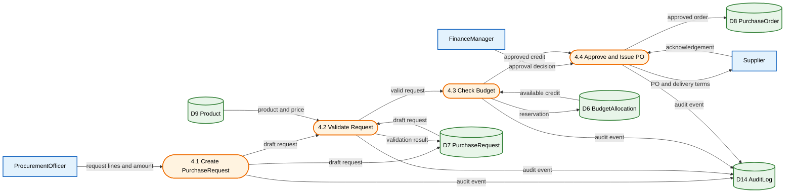
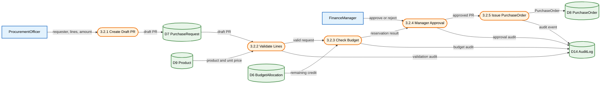

# مستند جامع مدل‌سازی DFD، BPMN و UML 2.5

**سامانه:** Integrated HR, Finance & Procurement Management System  
**نسخه:** v1.0  
**تاریخ:** 2026-09-10  
**وضعیت:** مستند معماری و تحلیل فرایند

## هدف و دامنه

این سند، مدل یکپارچهٔ سامانهٔ مدیریت منابع انسانی، حقوق و دستمزد، بودجه و اعتبارات، تدارکات و انبار، و گزارش‌گیری تحلیلی را در سه لایهٔ انتزاع ارائه می‌کند. DFD مرز سامانه و جریان داده‌ها را نشان می‌دهد، BPMN رفتار کسب‌وکار و همکاری نقش‌ها را مدل می‌کند، و UML 2.5 ساختار، رفتار و تعاملات طراحی را تا سطح پیاده‌سازی پوشش می‌دهد.

### قرارداد نام‌گذاری

- شناسه‌های DFD با `DFD-Lx.y` و مخازن با `D1` تا `D14` نمایش داده می‌شوند.
- شناسه‌های BPMN با `BPMN-Lx-<Domain>` و استثناها با `EX-<Domain><Seq>` نام‌گذاری می‌شوند.
- نام موجودیت‌ها و عملیات‌ها در همهٔ нотاسیون‌ها یکسان است: `Employee`, `PayrollRun`, `PayrollLine`, `Budget`, `BudgetAllocation`, `PurchaseRequest`, `PurchaseOrder`, `Product`, `StockLot`, `GoodsReceipt`, `Payment`, `Report`, `AuditLog`.
- عملیات‌های کلیدی: `calculateSalary()`, `BudgetAllocation.checkBudget()`, `BudgetAllocation.reserve()`, `StockLot.allocate()` / `allocateStock()`, `generateReport()`, `executePayment()`.
- هر تغییر مهم، تأیید، رد، رزرو، پرداخت، تخصیص و انتشار گزارش باید یک رویداد `AuditLog` ایجاد کند.

## فهرست مطالب

1. [DFD](#1-dfd)
2. [BPMN](#2-bpmn)
3. [UML 2.5](#3-uml-25)
4. [ردیابی و قوانین انسجام](#4-ردیابی-و-قوانین-انسجام)

## پوشش مدل‌ها

| خانواده | سطح ۰ / زمینه | سطح ۱ | سطح ۲ | سطح ۳ |
|---|---:|---:|---:|---:|
| DFD | نمودار زمینه | ۶ فرایند اصلی | ۶ تجزیهٔ دامنه‌ای | ۳ فرایند اتمی حیاتی |
| BPMN | — | نمای کلان استخرها و لین‌ها | ۶ فرایند دامنه‌ای | ۳ زیرفرایند اجرایی حیاتی |
| UML 2.5 | — | دامنه و چشم‌انداز | طراحی و زیرسیستم | پیاده‌سازی، امضاها و قیود |

# ۱. DFD

DFD با حفظ اصل balance طراحی شده است: ورودی‌ها و خروجی‌های هر فرایند در سطح تجزیه‌شده باید با فرایند والد همخوانی داشته باشند. موجودیت‌های بیرونی با رنگ آبی، فرایندها با رنگ نارنجی و مخازن داده با رنگ سبز متمایز شده‌اند.

## سطح ۰ — نمودار زمینه



- `Employee` داده‌های هویتی، مرخصی و حضور را وارد می‌کند و فیش حقوقی و اعلان دریافت می‌کند.
- `HRManager` تصمیم‌های استخدام، انتقال و خاتمهٔ همکاری را ثبت و تأیید می‌کند.
- `FinanceManager` تصمیم بودجه و پرداخت را صادر می‌کند؛ `BankGateway` نتیجهٔ تراکنش را برمی‌گرداند.
- `ProcurementOfficer` درخواست خرید را ثبت می‌کند و `Supplier` وضعیت سفارش و محموله را اعلام می‌کند.
- `WarehouseOfficer` رسید کالا و تخصیص موجودی را ثبت می‌کند؛ `ExecutiveAnalyst` و `Auditor` خروجی‌های مدیریتی و حسابرسی می‌گیرند.
- در این سطح هیچ مخزن داخلی نمایش داده نمی‌شود و همهٔ جریان‌ها از مرز سامانه عبور می‌کنند.

## سطح ۱ — فرایندهای اصلی



- شش فرایند اصلی، پنج دامنهٔ درخواستی را به‌همراه گزارش‌گیری پوشش می‌دهند.
- `HR Management` منبع دادهٔ `Employee` و `OrganizationUnit` برای حقوق و گزارش‌هاست.
- `Payroll` از دادهٔ پرسنلی و اعتبار باقی‌مانده استفاده کرده و `PayrollRun`، `PayrollLine` و `Payment` را تولید می‌کند.
- `Budget & Credits` اعتبار را تخصیص و رزرو می‌کند و هیچ پرداخت یا سفارش خریدی بدون بررسی اعتبار صادر نمی‌شود.
- `Procurement` و `Inventory/Warehouse` چرخهٔ درخواست، سفارش، رسید انبار و `StockLot` را به هم متصل می‌کنند.
- `Reporting & Analytics` فقط از مخازن عملیاتی می‌خواند، `Report` را می‌سازد و خروجی را به `ExecutiveAnalyst` و `Auditor` می‌دهد.

## سطح ۲ — تجزیه فرایندها

### DFD-L2.1 — مدیریت منابع انسانی


- استخدام، نگهداری پرونده، مدیریت واحد سازمانی و تأیید تغییرات استخدامی از یکدیگر جدا شده‌اند.
- `Employee` دادهٔ متقاضی و پروفایل را وارد می‌کند و `HRManager` تصمیم استخدام، انتقال یا خاتمه را ثبت می‌کند.
- `D1 Employee` رکورد پایدار پرسنلی و `D2 OrganizationUnit` سلسله‌مراتب سازمانی است.
- هر تغییر وضعیت یا ساختار، رویدادی در `D14 AuditLog` ایجاد می‌کند.
- خروجی تأییدشده به `Payroll` می‌رود تا واجد شرایط بودن و دادهٔ محاسبه حقوق به‌روز بماند.

### DFD-L2.2 — حقوق و دستمزد



- `PayrollRun` شناسهٔ اجرای حقوق و `PayrollLine` جزییات محاسبه هر کارمند را نگهداری می‌کند.
- فرایند محاسبه، حقوق پایه، مزایا، کسورات، حضور و اعتبار باقی‌ماندهٔ `BudgetAllocation` را ترکیب می‌کند.
- `FinanceManager` پس از بررسی مجموع خالص و اعتبار، اجرا را تأیید یا رد می‌کند.
- نتیجهٔ بانک در `Payment` و `AuditLog` ثبت می‌شود و خطای درگاه مسیر Retry محدود را فعال می‌کند.
- این تجزیه مستقیماً با `calculateSalary()` و `postPayment()` در مدل‌های UML و BPMN تناظر دارد.

### DFD-L2.3 — بودجه و اعتبارات


- بودجهٔ سالانه در `D5 Budget` و سهم هر واحد یا پروژه در `D6 BudgetAllocation` نگهداری می‌شود.
- `BudgetAllocation.checkBudget()` مقدار درخواستی را با `remaining` مقایسه می‌کند.
- رزرو موقت، مصرف همزمان یک اعتبار توسط درخواست‌های موازی را جلوگیری می‌کند.
- پرداخت موفق، رزرو را آزاد یا تسویه می‌کند و `Payment` را ثبت می‌کند.
- کمبود اعتبار، درخواست تخصیص مجدد یا رد عملیات را از طریق زیرفرایند سطح ۳ فعال می‌کند.

### DFD-L2.4 — تدارکات



- درخواست خرید از نظر کامل بودن سطرها، شناسه کالا و مبلغ مثبت اعتبارسنجی می‌شود.
- `D6 BudgetAllocation` در فرایند `4.3 Check Budget` خوانده و در صورت تأیید، مبلغ رزرو می‌شود.
- `PurchaseRequest` تنها پس از اعتبارسنجی و رزرو بودجه به `PurchaseOrder` تبدیل می‌شود.
- پاسخ تامین‌کننده و شرایط تحویل به مخزن سفارش و رویدادهای حسابرسی متصل است.
- این مدل با DFD-L3.2 و BPMN-L3 بودجهٔ درخواست خرید هم‌نام و هم‌مسیر است.

### DFD-L2.5 — انبار و موجودی


- کالای فیزیکی با مقدار سفارش‌شده و بارنامهٔ تامین‌کننده تطبیق داده می‌شود.
- کالای پذیرفته‌شده ابتدا `GoodsReceipt` و سپس `StockLot` با مکان، تاریخ انقضا و مقدار می‌سازد.
- `StockLot.allocate()` / `allocateStock()` مقدار قابل تخصیص را کاهش و وضعیت لات را به‌روز می‌کند.
- مغایرت مقدار یا کیفیت، گزارش مغایرت ایجاد کرده و انتشار نهایی موجودی را متوقف می‌کند.
- دریافت، بررسی کیفیت، ایجاد لات و تخصیص همگی در `AuditLog` قابل ردیابی هستند.

### DFD-L2.6 — گزارش‌گیری و تحلیل


- گزارش‌گیری داده‌های دامنه را می‌خواند و رکوردهای عملیاتی را تغییر نمی‌دهد.
- استخراج، اعتبارسنجی، تبدیل و محاسبهٔ شاخص به ترتیب انجام می‌شوند تا گزارش ناسازگار منتشر نشود.
- `Report` دوره، فیلترها، معیارها، نسخه و زمان تولید را نگهداری می‌کند.
- `ExecutiveAnalyst` داشبورد مدیریتی و `Auditor` شواهد حسابرسی را دریافت می‌کند.
- رویدادهای کیفیت داده و انتشار برای بازتولید گزارش در `AuditLog` ثبت می‌شوند.

## سطح ۳ — فرایندهای اتمی حیاتی

### DFD-L3.1 — محاسبه حقوق نهایی


- ورودی‌های اتمی شامل شناسه کارمند، دوره حقوق، وضعیت اشتغال و دادهٔ حضور هستند.
- حقوق ناخالص برابر است با `baseSalary + allowances + approvedOvertime - unpaidLeave`.
- کسورات شامل مالیات، بیمه و کسورات تأییدشده است و `netPay` نباید منفی شود.
- در صورت کمبود اعتبار یا نقض قانون محاسبه، `PayrollLine` ذخیره نمی‌شود و خطا در `AuditLog` ثبت می‌گردد.
- خروجی نهایی یک `PayrollLine` و خلاصهٔ `PayrollRun` است که مقدار ناخالص، کسورات، خالص و نسخهٔ قانون محاسبه را دارد.

### DFD-L3.2 — ثبت و تأیید درخواست خرید



- درخواست باید درخواست‌دهندهٔ فعال، دست‌کم یک سطر، مبلغ مثبت و کالای معتبر داشته باشد.
- `BudgetAllocation.checkBudget()` مجموع درخواست را با مانده تخصیص مقایسه و در موفقیت رزرو موقت می‌سازد.
- تأیید مدیر فقط پس از اعتبارسنجی سطور و رزرو بودجه امکان‌پذیر است؛ رد درخواست رزرو را آزاد می‌کند.
- صدور `PurchaseOrder` اتمی است و شماره سفارش، تامین‌کننده، مبلغ و مهلت تحویل را پایدار می‌کند.
- همهٔ تصمیم‌ها و تغییرات بودجه در `AuditLog` ثبت می‌شوند.

### DFD-L3.3 — تخصیص کالا به درخواست‌کننده


- انتخاب لات بر اساس کالا، مقدار قابل تخصیص، تاریخ انقضا، کیفیت و قاعدهٔ FEFO انجام می‌شود.
- قبل از رزرو، مقدار درخواستی نباید از `StockLot.availableQuantity` بیشتر باشد.
- رزرو به‌صورت اتمی مقدار موجود را کم و مقدار رزروشده را زیاد می‌کند تا تخصیص همزمان باعث کسری نشود.
- تأیید خروج، رسید کالا و رویداد حسابرسی را به‌روز می‌کند؛ مغایرت فیزیکی فرایند را متوقف می‌کند.
- خروجی نهایی شامل `StockLot` به‌روز، مقدار تخصیص‌یافته، محل تحویل و رویداد `AuditLog` است.

## قوانین یکپارچگی DFD

1. هر فرایند سطح ۲ باید ورودی‌ها و خروجی‌های فرایند والد سطح ۱ را حفظ کند.
2. هر تغییر در `Employee`، `BudgetAllocation`، `PurchaseRequest`، `PurchaseOrder`، `StockLot` یا `Payment` باید رویداد `AuditLog` بسازد.
3. `Reporting & Analytics` حق نوشتن در مخازن عملیاتی را ندارد و فقط `Report` را ایجاد می‌کند.
4. بدون بررسی و رزرو اعتبار، پرداخت یا سفارش خرید صادر نمی‌شود.
5. بدون رسید معتبر و لات واجد شرایط، تخصیص کالا انجام نمی‌شود.

# ۲. BPMN

> **نکتهٔ нотاسیون:** کدهای این بخش با PlantUML Activity Notation و برچسب‌های BPMN-style نوشته شده‌اند؛ استخرها و لین‌ها نقش بازیگران و واحدهای داخلی را نشان می‌دهند. برای اجرا در Camunda یا Flowable باید مدل به BPMN 2.0 XML تبدیل و Data Objects، Signals، Timers و Error Events به آن افزوده شود.

## سطح ۱ — نمای کلان فرایند

```plantuml
@startuml BPMN-L1-Overview
left to right direction
skinparam backgroundColor #FEFEFE
skinparam defaultTextAlignment center
title BPMN Level 1 — Process Overview

|Employee|
start
:Submit personal data / leave / attendance;
:Receive notification and salary slip;
stop

|HR Manager|
:Receive HR request;
if (Request type?) then (Employment)
  :Review recruitment or transfer;
else (Leave)
  :Check leave balance;
endif
if (Approved?) then (Yes)
  :Approve HR request;
  :Publish attendance/eligibility event;
else (No)
  :Reject HR request;
endif
:Write AuditLog;
stop

|PayrollRun|
:Receive approved employee data;
:Invoke calculateSalary();
:Create PayrollRun and PayrollLine;
:Send payroll summary;
stop

|Finance Manager|
:Receive payroll or expense summary;
:Invoke checkBudget();
if (Budget available?) then (Yes)
  :Approve payment;
  :Create Payment;
else (No)
  :Defer or reject payment;
endif
stop

|Budget|
:Receive funding request;
:Read BudgetAllocation;
if (Credit sufficient?) then (Yes)
  :Reserve credit;
else (No)
  :Return insufficient-budget result;
endif
stop

|Procurement Officer|
:Create PurchaseRequest;
:Receive budget decision;
if (Approved?) then (Yes)
  :Issue PurchaseOrder;
else (No)
  :Revise or cancel request;
endif
stop

|Warehouse Officer|
:Receive GoodsReceipt;
:Inspect goods;
:Invoke allocateStock();
:Update StockLot;
stop

|Supplier|
:Receive PurchaseOrder;
:Acknowledge order;
:Ship goods;
stop

|Bank/Payment Gateway|
:Receive Payment request;
if (Transaction success?) then (Yes)
  :Return payment confirmation;
else (No)
  :Return payment failure;
endif
stop

|Executive/Analyst|
:Define report criteria;
:Invoke generateReport();
:Receive Report and dashboard;
stop

Employee ..> HR Manager : personal data / leave / attendance
HR Manager ..> PayrollRun : approved employee data
PayrollRun ..> Finance Manager : payroll summary
Finance Manager ..> Bank/Payment Gateway : payment instruction
Procurement Officer ..> Supplier : PurchaseOrder
Supplier ..> Warehouse Officer : GoodsReceipt
Warehouse Officer ..> Executive/Analyst : stock status
Executive/Analyst ..> Finance Manager : budget reallocation decision
@enduml
```

### مسیر خوش‌حال سطح ۱

| گام | نقش | فعالیت | خروجی |
|---:|---|---|---|
| ۱ | `Employee` | ثبت دادهٔ پرسنلی، مرخصی یا حضور | رویداد ورودی |
| ۲ | `HRManager` | بررسی و تأیید درخواست | دادهٔ پرسنلی تأییدشده |
| ۳ | `PayrollRun` | اجرای `calculateSalary()` | `PayrollRun` و `PayrollLine` |
| ۴ | `FinanceManager` | اجرای `BudgetAllocation.checkBudget()` و تأیید پرداخت | `Payment` |
| ۵ | `BankGateway` | اجرای پرداخت | تأیید تراکنش |
| ۶ | `ProcurementOfficer` | ایجاد PR و صدور PO | `PurchaseOrder` |
| ۷ | `Supplier` / `WarehouseOfficer` | ارسال و ثبت کالا | `GoodsReceipt` و `StockLot` |
| ۸ | `ExecutiveAnalyst` | اجرای `ReportEngine.generateReport()` | `Report` |

### جریان‌های استثنا سطح ۱

| کد | نقش | رویداد استثنا | پاسخ فرایند |
|---|---|---|---|
| EX-L1-01 | `Employee` | داده ناقص یا نامعتبر | بازگشت برای اصلاح و ثبت `AuditLog` |
| EX-L1-02 | `HRManager` | عدم تأیید درخواست | رد درخواست و اطلاع به کارمند |
| EX-L1-03 | `PayrollRun` | خطای `calculateSalary()` | توقف، ثبت خطا و اطلاع به HR |
| EX-L1-04 | `FinanceManager` | کمبود `BudgetAllocation` | تعویق/رد و درخواست تخصیص مجدد |
| EX-L1-05 | `BankGateway` | خطای تراکنش | رویداد خطا و Retry محدود |
| EX-L1-06 | `WarehouseOfficer` | مغایرت کالا با PO | ایجاد `DiscrepancyReport` و توقف تخصیص |
| EX-L1-07 | `ExecutiveAnalyst` | ناقص بودن داده گزارش | درخواست تکمیل داده و ثبت رویداد کیفیت |

## سطح ۲ — فرایندهای دامنه‌ای قابل اجرا

### BPMN-L2-HR — استخدام، انتقال و مرخصی

```plantuml
@startuml BPMN-L2-HR
left to right direction
skinparam backgroundColor #FEFEFE
title BPMN Level 2 — HR Process
|Employee|
start
:Submit request;
if (Request type?) then (Recruitment/Transfer)
  :Submit profile and documents;
else (Leave)
  :Submit leave form;
endif
:Send request to HR Manager;
stop
|HR Manager|
:Receive request;
if (Recruitment/Transfer?) then (Yes)
  :Review documents;
  if (Complete?) then (Yes)
    :Schedule interview or transfer review;
  else (No)
    :Return for correction;
    stop
  endif
else (Leave)
  :Check leave balance;
endif
if (Approved?) then (Yes)
  :Approve request;
  :Update Employee record;
  :Write AuditLog;
  :Notify Employee;
else (No)
  :Reject request;
  :Write AuditLog;
  :Notify Employee;
  stop
endif
stop
@enduml
```

**مسیر خوش‌حال:** کارمند درخواست را ثبت می‌کند؛ مدیر منابع انسانی مدارک یا مانده مرخصی را بررسی می‌کند، درخواست تأیید می‌شود، `Employee` به‌روز شده و `AuditLog` ثبت می‌گردد.  
**استثنا:** مدارک ناقص، مانده مرخصی ناکافی یا رد مدیر؛ درخواست برای اصلاح برگردانده یا نهایی رد می‌شود.

### BPMN-L2-Payroll — محاسبه، تأیید و پرداخت حقوق

```plantuml
@startuml BPMN-L2-Payroll
left to right direction
skinparam backgroundColor #FEFEFE
title BPMN Level 2 — Payroll Process
|HR Manager|
start
:Approve employee and attendance list;
:Send approved data to PayrollRun;
stop
|PayrollRun|
:Receive approved data;
:Invoke calculateSalary();
loop for each Employee
  :Calculate allowances and deductions;
  :Create PayrollLine;
end
if (Calculation valid?) then (Yes)
  :Generate Salary Slip;
  :Send summary to Finance Manager;
else (No)
  :Raise calculation error;
  :Write AuditLog;
  stop
endif
stop
|Finance Manager|
:Receive payroll summary;
:Invoke checkBudget();
if (Budget available?) then (Yes)
  :Approve payroll payment;
  :Create Payment;
  :Send payment instruction to Bank Gateway;
else (No)
  :Request budget extension;
  :Write AuditLog;
  stop
endif
stop
|Bank/Payment Gateway|
:Receive payment instruction;
if (Transaction success?) then (Yes)
  :Return confirmation;
  :Update Payment status;
else (No)
  :Return failure;
  :Schedule retry;
endif
stop
@enduml
```

**مسیر خوش‌حال:** فهرست تأیید می‌شود، `calculateSalary()` سطرها را می‌سازد، مدیر مالی بودجه را تأیید می‌کند و بانک پرداخت را ثبت می‌کند.  
**استثنا:** خطای محاسبه، کمبود بودجه یا خطای درگاه؛ فرایند متوقف، `AuditLog` ثبت و در خطای قابل بازیابی Retry محدود زمان‌بندی می‌شود.

### BPMN-L2-Budget — تدوین، تخصیص و اعتبارسنجی بودجه

```plantuml
@startuml BPMN-L2-Budget
left to right direction
skinparam backgroundColor #FEFEFE
title BPMN Level 2 — Budget Process
|Executive/Analyst|
start
:Define annual budget plan;
:Submit budget targets;
stop
|Finance Manager|
:Receive budget plan;
:Create Budget;
fork
  :Allocate credit to organization units;
fork again
  :Publish BudgetAllocation;
end fork
:Receive expense or payroll request;
:Invoke checkBudget();
if (Credit sufficient?) then (Yes)
  :Reserve BudgetAllocation;
  :Approve request;
else (No)
  :Request reallocation;
  stop
endif
:Write AuditLog;
stop
@enduml
```

**مسیر خوش‌حال:** بودجهٔ سالانه تعریف، اعتبار بین واحدها تخصیص و `BudgetAllocation.checkBudget()` مقدار درخواستی را بررسی و رزرو می‌کند.  
**استثنا:** مانده اعتبار کمتر از درخواست است؛ مدیر مالی درخواست realloc را به `ExecutiveAnalyst` می‌فرستد و عملیات وابسته متوقف می‌ماند.

### BPMN-L2-Procurement — درخواست خرید تا سفارش

```plantuml
@startuml BPMN-L2-Procurement
left to right direction
skinparam backgroundColor #FEFEFE
title BPMN Level 2 — Procurement Process
|Procurement Officer|
start
:Create PurchaseRequest;
:Attach Product and supplier data;
:Submit to Finance Manager;
stop
|Finance Manager|
:Receive PurchaseRequest;
:Invoke checkBudget();
if (Budget available?) then (Yes)
  :Reserve BudgetAllocation;
  :Approve PurchaseRequest;
  :Issue PurchaseOrder;
  :Send PO to Supplier;
else (No)
  :Reject or request reallocation;
  :Notify Procurement Officer;
  stop
endif
stop
|Supplier|
:Receive PurchaseOrder;
:Acknowledge order;
:Ship goods;
:Send shipment notice;
stop
|Warehouse Officer|
:Receive goods and shipment notice;
:Create GoodsReceipt;
:Send receipt result;
stop
@enduml
```

**مسیر خوش‌حال:** PR ایجاد و اعتبارسنجی می‌شود، بودجه رزرو و PR تأیید می‌گردد؛ PO به تامین‌کننده ارسال و کالا با `GoodsReceipt` ثبت می‌شود.  
**استثنا:** سطر نامعتبر، کمبود بودجه، رد تامین‌کننده یا مغایرت حمل؛ درخواست اصلاح، لغو یا `DiscrepancyReport` ایجاد می‌شود.

### BPMN-L2-Inventory — رسید، موجودی و تخصیص

```plantuml
@startuml BPMN-L2-Inventory
left to right direction
skinparam backgroundColor #FEFEFE
title BPMN Level 2 — Inventory Process
|Warehouse Officer|
start
:Receive GoodsReceipt;
:Inspect physical goods;
if (Matches PurchaseOrder?) then (Yes)
  :Create or update StockLot;
  :Invoke allocateStock();
  :Update available and reserved quantity;
  :Check reorder level;
  if (Reorder needed?) then (Yes)
    :Create automatic PurchaseRequest;
  else (No)
    :Notify Procurement Officer;
  endif
else (No)
  :Create DiscrepancyReport;
  :Notify Procurement Officer;
  stop
endif
:Write AuditLog;
stop
|Executive/Analyst|
:Receive inventory dashboard;
:Review stock turnover and capacity;
stop
@enduml
```

**مسیر خوش‌حال:** کالا با PO تطبیق دارد، `StockLot` ایجاد یا به‌روز می‌شود، `allocateStock()` رزرو را ثبت و داشبورد منتشر می‌گردد.  
**استثنا:** مغایرت مقدار یا کیفیت، کمبود موجودی یا ظرفیت انبار؛ گزارش مغایرت، توقف تخصیص یا درخواست توسعه انبار ایجاد می‌شود.

### BPMN-L2-Reporting — گزارش‌گیری مدیریتی

```plantuml
@startuml BPMN-L2-Reporting
left to right direction
skinparam backgroundColor #FEFEFE
title BPMN Level 2 — Reporting Process
|Executive/Analyst|
start
:Define report criteria and period;
:Request integrated report;
stop
|System / Report Engine|
:Extract Employee, Payroll, Budget, Procurement and Inventory data;
fork
  :Validate and transform data;
fork again
  :Calculate metrics;
end fork
:Invoke generateReport();
if (Data quality valid?) then (Yes)
  :Publish Report;
  :Write AuditLog;
else (No)
  :Raise DataQualityException;
  :Request data correction;
  stop
endif
stop
|Executive/Analyst|
:Receive Report;
if (Revision needed?) then (Yes)
  :Request revision;
else (No)
  :Approve and publish dashboard;
endif
stop
@enduml
```

**مسیر خوش‌حال:** معیارها تعریف، دادهٔ دامنه استخراج و اعتبارسنجی می‌شود و `ReportEngine.generateReport()` گزارش را منتشر می‌کند.  
**استثنا:** داده ناقص یا ناسازگار است؛ موتور گزارش خطای کیفیت ثبت و درخواست تکمیل داده می‌دهد.

### جدول مسیرهای خوش‌حال و استثنا سطح ۲

| دامنه | مسیر خوش‌حال | موجودیت / عملیات | استثنا و پاسخ |
|---|---|---|---|
| HR | تأیید و به‌روزرسانی `Employee` | `Employee`, `approveRequest()` | مدارک ناقص یا مانده مرخصی ناکافی؛ اصلاح یا رد |
| Payroll | محاسبه، تأیید بودجه و پرداخت | `PayrollRun`, `calculateSalary()`, `checkBudget()` | خطای محاسبه یا پرداخت؛ توقف و Retry محدود |
| Budget | تخصیص و رزرو اعتبار | `BudgetAllocation`, `reserve()` | مانده ناکافی؛ درخواست reallocation |
| Procurement | PR → PO → Supplier | `PurchaseRequest`, `PurchaseOrder` | PR نامعتبر یا PO ردشده؛ اصلاح یا لغو |
| Inventory | رسید → `StockLot` → تخصیص | `GoodsReceipt`, `StockLot`, `allocateStock()` | مغایرت یا کمبود؛ `DiscrepancyReport` |
| Reporting | استخراج، اعتبارسنجی و انتشار | `Report`, `ReportEngine.generateReport()` | کیفیت پایین؛ `DataQualityException` |

## سطح ۳ — زیرفرایندهای حیاتی

### BPMN-L3-PayrollApproval — تأیید و پرداخت حقوق

```plantuml
@startuml BPMN-L3-PayrollApproval
left to right direction
skinparam backgroundColor #FEFEFE
title BPMN Level 3 — Payroll Approval
|HR Manager|
start
:Review payroll list;
:Digitally sign approval;
:Send approved list to PayrollRun;
stop
|PayrollRun|
:Receive approved list;
:Invoke calculateSalary();
if (Calculation valid?) then (Yes)
  :Create PayrollLine;
  :Generate Salary Slip;
  :Send summary to Finance Manager;
else (No)
  :Raise CalculationException;
  :Write AuditLog;
  :Notify HR Manager;
  stop
endif
stop
|Finance Manager|
:Receive payroll summary;
:Invoke checkBudget();
if (Budget available?) then (Yes)
  :Approve payment;
  :Create Payment;
  :Send payment instruction;
else (No)
  :Reject or defer payment;
  :Write AuditLog;
  :Notify HR Manager;
  stop
endif
stop
|Bank/Payment Gateway|
:Receive payment instruction;
if (Transaction success?) then (Yes)
  :Return confirmation;
  :Mark Payment as Paid;
else (No)
  :Return failure;
  :Schedule retry after 5 minutes;
  :Write AuditLog;
  stop
endif
stop
@enduml
```

| گام | نقش | فعالیت | موجودیت / عملیات |
|---:|---|---|---|
| ۱ | `HRManager` | بررسی و امضای دیجیتال | `Employee` |
| ۲ | `PayrollRun` | محاسبه حقوق | `calculateSalary()` |
| ۳ | `PayrollRun` | تولید فیش | `PayrollLine` |
| ۴ | `FinanceManager` | بررسی بودجه | `BudgetAllocation.checkBudget()` |
| ۵ | `FinanceManager` | ایجاد پرداخت | `Payment` |
| ۶ | `BankGateway` | تأیید تراکنش | `Payment.status = Paid` |

| کد | خطا | پاسخ |
|---|---|---|
| EX-P01 | `CalculationException` | توقف، ثبت `AuditLog` و اطلاع به HR |
| EX-P02 | کمبود بودجه | رد یا تعویق و درخواست reallocation |
| EX-P03 | `PaymentFailedException` | Retry پس از ۵ دقیقه، حداکثر ۳ تلاش |

### BPMN-L3-BudgetCheckPR — تطابق بودجه با درخواست خرید

```plantuml
@startuml BPMN-L3-BudgetCheckPR
left to right direction
skinparam backgroundColor #FEFEFE
title BPMN Level 3 — Budget Check for Purchase Request
|Procurement Officer|
start
:Create PurchaseRequest;
:Submit request and amount;
stop
|Finance Manager|
:Receive PurchaseRequest;
:Invoke checkBudget();
:Read BudgetAllocation;
if (Budget available?) then (Yes)
  :Reserve BudgetAllocation;
  :Approve PurchaseRequest;
  :Issue PurchaseOrder;
  :Send PO to Supplier;
else (No)
  if (Reallocation requested?) then (Yes)
    :Send reallocation request to Executive/Analyst;
  else (No)
    :Reject PurchaseRequest;
    :Notify Procurement Officer;
    stop
  endif
endif
stop
|Executive/Analyst|
:Receive reallocation request;
if (Approved?) then (Yes)
  :Update BudgetAllocation;
  :Notify Finance Manager;
else (No)
  :Reject reallocation;
  :Write AuditLog;
  stop
endif
stop
|Finance Manager|
:Receive reallocation response;
if (Budget now available?) then (Yes)
  :Approve PurchaseRequest;
  :Issue PurchaseOrder;
else (No)
  :Reject PurchaseRequest finally;
  :Write AuditLog;
endif
stop
@enduml
```

| گام | نقش | فعالیت | موجودیت / عملیات |
|---:|---|---|---|
| ۱ | `ProcurementOfficer` | ایجاد PR | `PurchaseRequest` |
| ۲ | `FinanceManager` | بررسی بودجه | `BudgetAllocation.checkBudget()` |
| ۳ | `FinanceManager` | رزرو اعتبار | `BudgetAllocation.reserve()` |
| ۴ | `FinanceManager` | تأیید و صدور PO | `PurchaseOrder` |
| ۵ | `Supplier` | تأیید سفارش | `PurchaseOrder.acknowledge()` |

| کد | خطا | پاسخ |
|---|---|---|
| EX-B01 | کمبود بودجه بدون reallocation | رد PR و اطلاع به درخواست‌دهنده |
| EX-B02 | رد reallocation توسط مدیر اجرایی | توقف و ثبت `AuditLog` |
| EX-B03 | بودجه پس از reallocation همچنان ناکافی | رد نهایی PR |

### BPMN-L3-StockAllocation — تخصیص کالا به درخواست‌کننده

```plantuml
@startuml BPMN-L3-StockAllocation
left to right direction
skinparam backgroundColor #FEFEFE
title BPMN Level 3 — Stock Allocation
|Warehouse Officer|
start
:Receive GoodsReceipt;
:Inspect physical goods;
:Scan barcode or serial;
:Record GoodsReceipt;
:Invoke allocateStock();
if (Eligible lot and quantity available?) then (Yes)
  :Select FEFO lot;
  :Reserve quantity;
  :Update StockLot;
  :Confirm issue;
  :Notify Procurement Officer;
else (No)
  if (Warehouse overflow?) then (Yes)
    :Raise OverflowAlert;
    :Notify Executive/Analyst;
  else (No)
    :Raise StockShortageException;
    :Notify Procurement Officer;
  endif
  stop
endif
:Write AuditLog;
stop
|Executive/Analyst|
:Receive OverflowAlert;
if (Expansion approved?) then (Yes)
  :Approve warehouse expansion;
else (No)
  :Approve overflow management or reject;
endif
:Notify Warehouse Officer;
stop
|Procurement Officer|
:Receive allocation notice;
if (Reorder needed?) then (Yes)
  :Create automatic PurchaseRequest;
else (No)
  :Close allocation task;
endif
stop
@enduml
```

| گام | نقش | فعالیت | موجودیت / عملیات |
|---:|---|---|---|
| ۱ | `WarehouseOfficer` | دریافت و بررسی کالا | `GoodsReceipt` |
| ۲ | `WarehouseOfficer` | انتخاب لات واجد شرایط | `StockLot` |
| ۳ | `WarehouseOfficer` | رزرو مقدار | `StockLot.allocate()` / `allocateStock()` |
| ۴ | `WarehouseOfficer` | به‌روزرسانی موجودی | `StockLot.availableQuantity` |
| ۵ | `ProcurementOfficer` | دریافت اطلاع | `PurchaseRequest` در صورت نیاز |

| کد | خطا | پاسخ |
|---|---|---|
| EX-S01 | مقدار ناکافی | `StockShortageException` و اطلاع خرید |
| EX-S02 | تکمیل ظرفیت انبار | `OverflowAlert` به `ExecutiveAnalyst` |
| EX-S03 | مغایرت رسید فیزیکی | `DiscrepancyReport` و توقف تخصیص |

## قوانین فرایندی BPMN

1. بدون `PayrollRun` تأییدشده و نتیجهٔ موفق `BudgetAllocation.checkBudget()` هیچ `Payment` ایجاد نمی‌شود.
2. بدون `PurchaseRequest` تأییدشده و رزرو بودجه هیچ `PurchaseOrder` صادر نمی‌شود.
3. بدون `GoodsReceipt` معتبر و منطبق با `PurchaseOrder` هیچ `StockLot` ایجاد نمی‌شود.
4. هر تأیید، رد، رزرو، پرداخت و تخصیص باید `AuditLog` تولید کند.
5. خطاهای Retryپذیر فقط تا سقف تلاش تعریف‌شده و با correlation ID اجرا می‌شوند.

# ۳. UML 2.5

این بخش دقیقاً ۱۴ نوع نمودار UML 2.5 را پوشش می‌دهد: ۷ نمودار ساختاری، ۳ نمودار رفتاری و ۴ نمودار تعاملی. برای هر نوع، سه لایهٔ Domain/Scope، Design/Subsystem و Implementation/Detail تعریف شده است. Profile Diagram و Interaction Overview Diagram در PlantUML به‌صورت بومی پشتیبانی نمی‌شوند؛ بنابراین برای آن دو، جدول‌های ساختاریافته و قیدهای OCL ارائه شده است.

## فهرست ۱۴ نوع نمودار

| ردیف | نوع نمودار | گروه | سطح ۱ | سطح ۲ | سطح ۳ |
|---:|---|---|---|---|---|
| ۱ | Class | Structural | Domain Model | Subsystem Design | Implementation Classes |
| ۲ | Object | Structural | Domain Snapshot | Mid-process Snapshot | Critical Transaction |
| ۳ | Component | Structural | Top-level Components | Subcomponents | Provided/Required Interfaces |
| ۴ | Deployment | Structural | Physical Nodes | Allocation/Protocols | Node Configuration |
| ۵ | Package | Structural | System Packages | Sub-packages | Detailed Contents |
| ۶ | Composite Structure | Structural | Collaborations | Internal Parts/Ports | Roles/Connectors |
| ۷ | Profile | Structural | Stereotypes | Tags | OCL Constraints |
| ۸ | Use Case | Behavioral | Domain Goals | Relationships | Specifications/Exceptions |
| ۹ | Activity | Behavioral | Main Flow | Parallel/Conditional Flow | Swimlanes/Pins/Signals |
| ۱۰ | State Machine | Behavioral | Main States | Events/Guards | Composite/History States |
| ۱۱ | Sequence | Interaction | Layer Interaction | Detailed Scenario | Concurrency/Async/Errors |
| ۱۲ | Communication | Interaction | Object Links | Process Messages | Numbered Messages |
| ۱۳ | Interaction Overview | Interaction | High-level Paths | Domain Fragments | Critical References |
| ۱۴ | Timing | Interaction | Overall Timing | Domain Timing | Duration/Delay Constraints |

## ۳.۱. نمودار کلاس — Type 1

### سطح ۱ — مدل دامنه

```plantuml
@startuml ARCH-L1-Class-Domain
skinparam backgroundColor #FEFEFE
skinparam classAttributeIconSize 0
title L1: Domain Model — HR/Finance/Procurement
class Employee
class OrganizationUnit
class PayrollRun
class PayrollLine
class Budget
class BudgetAllocation
class PurchaseRequest
class PurchaseOrder
class Product
class StockLot
class GoodsReceipt
class Payment
class Report
class AuditLog
Employee "1" -- "0..1" OrganizationUnit : assigned to
Employee "1" -- "0..*" PayrollLine : receives
PayrollRun "1" *-- "1..*" PayrollLine : contains
Budget "1" *-- "0..*" BudgetAllocation : allocates
PurchaseRequest "1" -- "0..1" BudgetAllocation : reserves
PurchaseRequest "1" -- "0..*" PurchaseOrder : converts to
PurchaseOrder "1" -- "1" Product : requests
PurchaseOrder "1" -- "0..*" GoodsReceipt : receives
Product "1" -- "0..*" StockLot : stocked as
GoodsReceipt "1" -- "0..*" StockLot : creates
PayrollRun "1" -- "0..*" Payment : initiates
Report "0..*" --> Employee : summarizes
Report "0..*" --> Budget : summarizes
Report "0..*" --> PurchaseOrder : summarizes
AuditLog "0..*" --> Employee : records
AuditLog "0..*" --> BudgetAllocation : records
AuditLog "0..*" --> PurchaseRequest : records
AuditLog "0..*" --> StockLot : records
@enduml
```

مدل دامنه، موجودیت‌های اصلی و رابطه‌های معنایی آن‌ها را بدون جزییات فنی نشان می‌دهد. هر `PayrollRun` از چند `PayrollLine` تشکیل می‌شود و هر `Budget` می‌تواند چند `BudgetAllocation` داشته باشد. `PurchaseRequest` پس از تأیید به `PurchaseOrder` تبدیل می‌شود و رسید کالا، `StockLot` می‌سازد.

### سطح ۲ — طراحی زیرسیستم‌ها

```plantuml
@startuml ARCH-L2-Class-Design
skinparam backgroundColor #FEFEFE
skinparam classAttributeIconSize 0
title L2: Design Classes and Subsystems
package "HR" { class Employee; class OrganizationUnit; class LeaveRequest; }
package "Payroll" { class PayrollRun; class PayrollLine; class SalaryCalculator; class Payment; }
package "Budget" { class Budget; class BudgetAllocation; class BudgetValidator; }
package "Procurement" { class PurchaseRequest; class PurchaseOrder; class ProcurementService; }
package "Inventory" { class Product; class StockLot; class GoodsReceipt; class StockManager; }
package "Reporting" { class Report; class ReportEngine; }
package "Shared" { class AuditLog; class Notification; }
Employee "1" -- "0..1" OrganizationUnit
PayrollRun "1" *-- "1..*" PayrollLine
PayrollRun --> SalaryCalculator : uses
SalaryCalculator --> Employee : reads
SalaryCalculator --> PayrollLine : creates
PayrollRun --> Payment : initiates
Budget "1" *-- "0..*" BudgetAllocation
BudgetValidator --> BudgetAllocation : validates
PurchaseRequest --> BudgetValidator : invokes
PurchaseRequest "1" -- "0..*" PurchaseOrder
ProcurementService --> PurchaseRequest : creates
ProcurementService --> PurchaseOrder : issues
GoodsReceipt "1" -- "0..*" StockLot
StockManager --> StockLot : allocates
ReportEngine --> Report : generates
AuditLog <-- HR : logs
AuditLog <-- Payroll : logs
AuditLog <-- Budget : logs
AuditLog <-- Procurement : logs
AuditLog <-- Inventory : logs
Notification <-- HR : sends
Notification <-- Payroll : sends
@enduml
```

کلاس‌های طراحی مرز زیرسیستم‌ها و خدمات تخصصی را مشخص می‌کنند. `SalaryCalculator` فقط محاسبه می‌کند، `BudgetValidator` اعتبار را بررسی می‌کند و `StockManager` تخصیص موجودی را انجام می‌دهد. `AuditLog` و `Notification` خدمات مشترک همهٔ دامنه‌ها هستند.

### سطح ۳ — کلاس‌های پیاده‌سازی

```plantuml
@startuml ARCH-L3-Class-Implementation
skinparam backgroundColor #FEFEFE
skinparam classAttributeIconSize 0
skinparam shadowing false
title L3: Implementation Classes
class Employee {
  -id: UUID
  -employeeNo: String
  -fullName: String
  -status: EmploymentStatus
  -baseSalary: Money
  -organizationUnitId: UUID
  +isActive(): boolean
  +changeOrganizationUnit(unitId: UUID): void
}
class PayrollRun {
  -id: UUID
  -period: DateRange
  -status: PayrollStatus
  -approvedBy: UUID
  +calculateSalary(employee: Employee, period: DateRange): PayrollLine
  +approve(approver: FinanceManager): void
  +postPayment(gateway: PaymentGateway): Payment
}
class PayrollLine {
  -id: UUID
  -employeeId: UUID
  -grossAmount: Money
  -deductionAmount: Money
  -netAmount: Money
  +validate(): boolean
  +calculateNet(): Money
}
class SalaryCalculator {
  +calculatePayrollLine(employee: Employee, period: DateRange): PayrollLine
  +calcDeductions(employee: Employee, period: DateRange): Money
  +calcBenefits(employee: Employee, period: DateRange): Money
}
class Payment {
  -id: UUID
  -payrollRunId: UUID
  -amount: Money
  -status: PaymentStatus
  -transactionId: String
  +markPaid(transactionId: String): void
}
class PaymentGateway { +executePayment(payment: Payment): String }
class StockManager { +allocateStock(lotId: UUID, quantity: decimal): AllocationResult }
class BudgetAllocation {
  -id: UUID
  -budgetId: UUID
  -organizationUnitId: UUID
  -allocatedAmount: Money
  -reservedAmount: Money
  -spentAmount: Money
  +remaining(): Money
  +checkBudget(amount: Money): BudgetDecision
  +reserve(amount: Money): void
}
class PurchaseRequest {
  -id: UUID
  -requesterId: UUID
  -status: PurchaseRequestStatus
  -totalAmount: Money
  +submit(): void
  +approve(approver: FinanceManager): void
  +reject(reason: String): void
}
class PurchaseOrder {
  -id: UUID
  -requestId: UUID
  -supplierId: UUID
  -status: PurchaseOrderStatus
  +issue(): void
  +acknowledge(): void
}
class StockLot {
  -id: UUID
  -productId: UUID
  -availableQuantity: decimal
  -reservedQuantity: decimal
  -expiresAt: LocalDate
  +allocate(quantity: decimal): AllocationResult
  +release(quantity: decimal): void
}
class Report { -id: UUID; -type: ReportType; -period: DateRange; -payload: JSON }
class ReportEngine { +generateReport(criteria: ReportCriteria): Report }
class AuditLog {
  -id: UUID
  -actorId: UUID
  -action: String
  -entityType: String
  -entityId: UUID
  -occurredAt: Instant
  +append(event: AuditEvent): void
}
Employee "1" -- "0..*" PayrollLine
PayrollRun "1" *-- "1..*" PayrollLine
PayrollRun --> BudgetAllocation : checkBudget()
PurchaseRequest --> BudgetAllocation : reserve()
PurchaseRequest "1" -- "0..*" PurchaseOrder
PurchaseOrder "1" -- "0..*" StockLot : fulfilled by
StockLot --> AuditLog : logs
PayrollRun --> AuditLog : logs
Report --> AuditLog : publication event
note right of PayrollLine
  invariant: netAmount >= 0
  invariant: netAmount = grossAmount - deductionAmount
end note
note right of BudgetAllocation
  invariant: reservedAmount + spentAmount <= allocatedAmount
end note
note right of StockLot
  invariant: availableQuantity >= 0
  invariant: reservedQuantity >= 0
end note
@enduml
```

در سطح پیاده‌سازی، ویژگی‌های خصوصی، عملیات عمومی، نوع بازگشتی و قیدهای دامنه مشخص شده‌اند. `calculateSalary()` یک `PayrollLine` تولید می‌کند، `checkBudget()` تصمیم بودجه برمی‌گرداند و `allocate()` فقط برای لات معتبر و دارای مقدار قابل تخصیص اجرا می‌شود.

## ۳.۲. نمودار شیء — Type 2

### سطح ۱ — نمونهٔ دامنه

```plantuml
@startuml ARCH-L1-Object
skinparam backgroundColor #FEFEFE
title L1: Object Snapshot — Employee Scenario
object "emp-1001\nEmployee" as emp { employeeNo = E-1001; status = Active }
object "org-fin\nOrganizationUnit" as org { name = Finance }
object "pr-5001\nPurchaseRequest" as pr { status = Draft; totalAmount = 120000000 IRR }
object "po-7001\nPurchaseOrder" as po { status = Created }
object "lot-9001\nStockLot" as lot { availableQuantity = 20 }
emp --> org : assignedTo
pr --> po : approvedAs
po --> lot : fulfilledBy
@enduml
```

این لحظه یک کارمند فعال، واحد مالی، درخواست خرید پیش‌نویس، سفارش ایجادشده و لات موجودی را نشان می‌دهد؛ رفتار محاسبه یا پرداخت در این سطح اجرا نمی‌شود.

### سطح ۲ — نمونهٔ میانهٔ فرایند

```plantuml
@startuml ARCH-L2-Object
skinparam backgroundColor #FEFEFE
title L2: Object Snapshot — Payroll Calculation
object "run-2026-09\nPayrollRun" as run { period = 1405/06; status = Calculating }
object "line-1001\nPayrollLine" as line { grossAmount = 180000000 IRR; deductionAmount = 24000000 IRR; netAmount = 156000000 IRR }
object "alloc-fin\nBudgetAllocation" as alloc { allocatedAmount = 5000000000 IRR; reservedAmount = 156000000 IRR; spentAmount = 0 IRR }
object "audit-88\nAuditLog" as audit { action = SalaryCalculated }
run *-- line : contains
run --> alloc : checks
run --> audit : records
@enduml
```

`PayrollRun` در حال محاسبه است و `PayrollLine` مقادیر ناخالص، کسورات و خالص را دارد. `BudgetAllocation` مقدار رزروشده برای پرداخت را نشان می‌دهد و `AuditLog` رویداد محاسبه را ثبت کرده است.

### سطح ۳ — لحظهٔ تراکنش مالی

```plantuml
@startuml ARCH-L3-Object
skinparam backgroundColor #FEFEFE
title L3: Object Snapshot — Payment Transaction
object "payment-771\nPayment" as payment { amount = 156000000 IRR; status = Processing; transactionId = null }
object "run-2026-09\nPayrollRun" as run { status = Approved }
object "alloc-fin\nBudgetAllocation" as alloc { allocatedAmount = 5000000000 IRR; reservedAmount = 156000000 IRR; spentAmount = 0 IRR }
object "gateway-result\nTransactionResult" as result { status = Pending; providerReference = null }
object "audit-772\nAuditLog" as audit { action = PaymentPosted; occurredAt = 2026-09-09T22:00:00+03:30 }
run --> payment : initiates
payment --> alloc : consumes reservation
payment --> result : awaits
payment --> audit : records
@enduml
```

در این لحظه `Payment` ایجاد شده اما تأیید بانک دریافت نشده است؛ `transactionId` و `providerReference` مقدار `null` دارند. پس از تأیید، وضعیت به `Paid` تغییر کرده، رزرو به `spentAmount` منتقل و رویداد نهایی در `AuditLog` ثبت می‌شود.

## ۳.۳. نمودار مؤلفه — Type 3

### سطح ۱ — مؤلفه‌های اصلی

```plantuml
@startuml ARCH-L1-Component
skinparam backgroundColor #FEFEFE
skinparam componentStyle rectangle
title L1: Component Overview
component "HR Management Component" as HR
component "Payroll Component" as PAY
component "Budget Component" as BUD
component "Procurement Component" as PROC
component "Inventory Component" as INV
component "Reporting Component" as REP
component "Audit and Notification" as SHARED
HR --> PAY : employee and attendance
PAY --> BUD : payroll liability
PROC --> BUD : budget reservation
PROC --> INV : expected goods
INV --> REP : stock facts
PAY --> REP : payroll facts
BUD --> REP : budget facts
HR --> SHARED : audit and notification
PAY --> SHARED : audit and notification
PROC --> SHARED : audit and notification
INV --> SHARED : audit and notification
@enduml
```

مرز منطقی HR، Payroll، Budget، Procurement، Inventory و Reporting نمایش داده شده است. مؤلفهٔ مشترک، حسابرسی و اعلان‌ها را برای همهٔ دامنه‌ها فراهم می‌کند.

### سطح ۲ — زیرمؤلفه‌ها

```plantuml
@startuml ARCH-L2-Component
skinparam backgroundColor #FEFEFE
skinparam componentStyle rectangle
title L2: Internal Components
component "HR API" as HRAPI
component "Employee Service" as EMP
component "Payroll API" as PAYAPI
component "Salary Calculator" as CALC
component "Payment Service" as PAYMENT
component "Budget API" as BUDAPI
component "Budget Validator" as VALIDATOR
component "Procurement API" as PROC_API
component "Purchase Service" as PURCHASE
component "Inventory API" as INV_API
component "Stock Manager" as STOCK
component "Report Engine" as REPORT
HRAPI --> EMP
PAYAPI --> CALC
PAYAPI --> PAYMENT
BUDAPI --> VALIDATOR
PROC_API --> PURCHASE
PURCHASE --> VALIDATOR
PURCHASE --> STOCK
INV_API --> STOCK
REPORT --> EMP
REPORT --> CALC
REPORT --> VALIDATOR
REPORT --> PURCHASE
REPORT --> STOCK
@enduml
```

هر مؤلفه به API، خدمت دامنه و موتور تخصصی تجزیه شده است. `Salary Calculator` محاسبه حقوق، `Budget Validator` اعتبارسنجی بودجه، `Purchase Service` چرخه خرید و `Stock Manager` تخصیص موجودی را انجام می‌دهد.

### سطح ۳ — رابط‌های ارائه‌شده و موردنیاز

```plantuml
@startuml ARCH-L3-Component
skinparam backgroundColor #FEFEFE
skinparam componentStyle rectangle
title L3: Provided and Required Interfaces
interface "IPayrollService" as IPay {
  +calculateSalary(employeeId: UUID, period: DateRange): PayrollLine
  +approveRun(runId: UUID, approverId: UUID): void
}
interface "IBudgetService" as IBud {
  +checkBudget(allocationId: UUID, amount: Money): BudgetDecision
  +reserve(allocationId: UUID, amount: Money): Reservation
}
interface "IProcurementService" as IProc {
  +createPurchaseRequest(command: CreatePRCommand): PurchaseRequest
  +approveRequest(requestId: UUID): void
  +issuePurchaseOrder(requestId: UUID): PurchaseOrder
}
interface "IInventoryService" as IInv {
  +recordGoodsReceipt(command: RecordGRCommand): GoodsReceipt
  +allocateStock(lotId: UUID, quantity: decimal): AllocationResult
}
interface "IReportService" as IRep { +generateReport(criteria: ReportCriteria): Report }
interface "IAuditService" as IAudit { +append(event: AuditEvent): void }
component "Payroll Adapter" as PA
component "Salary Calculator" as CALC
component "Budget Adapter" as BA
component "Budget Validator" as VALID
component "Procurement Adapter" as PCA
component "Purchase Service" as PUR
component "Inventory Adapter" as IA
component "Stock Manager" as STOCK
component "Report Engine" as REP
component "Audit Logger" as AUD
PA ..|> IPay
CALC ..|> IPay
BA ..|> IBud
VALID ..|> IBud
PCA ..|> IProc
PUR ..|> IProc
IA ..|> IInv
STOCK ..|> IInv
REP ..|> IRep
AUD ..|> IAudit
CALC ..> IBud : required
PUR ..> IBud : required
PUR ..> IInv : required
REP ..> IPay : required
REP ..> IBud : required
REP ..> IProc : required
REP ..> IInv : required
PUR ..> IAudit : required
CALC ..> IAudit : required
STOCK ..> IAudit : required
@enduml
```

رابط‌ها قرارداد قابل فراخوانی هر مؤلفه را تعریف می‌کنند. نام عملیات‌ها با BPMN و DFD یکسان است و رابط‌های موردنیاز، وابستگی‌های بین مؤلفه‌ها و نقطهٔ ثبت `AuditLog` را مشخص می‌کنند.

## ۳.۴. نمودار استقرار — Type 4

### سطح ۱ — گره‌های فیزیکی

```plantuml
@startuml ARCH-L1-Deployment
skinparam backgroundColor #FEFEFE
skinparam deploymentStyle rectangle
title L1: Deployment Overview
node "Client Devices" as CLIENT { device "Browser / Mobile" as BROWSER }
node "Application Cluster" as APP { component "HR/Finance/Procurement API" as API; component "Background Workers" as WORKER }
node "Database Cluster" as DB { database "Primary Database" as PRIMARY; database "Read Replica" as REPLICA }
node "Reporting Node" as REPORT_NODE { component "Report Engine" as REPORT }
node "External Services" as EXT { cloud "Bank/Payment Gateway" as BANK; cloud "Notification Provider" as NOTIFY }
BROWSER --> API : HTTPS
API --> PRIMARY : SQL
API --> REPLICA : read SQL
WORKER --> PRIMARY : SQL
REPORT --> REPLICA : read SQL
API --> BANK : HTTPS/API
API --> NOTIFY : HTTPS/Webhook
@enduml
```

گره‌های اصلی شامل مشتری، خوشهٔ اپلیکیشن، خوشهٔ پایگاه داده و گره گزارش‌گیری هستند. سرویس بانک و اعلان‌دهنده بیرونی‌اند و گزارش‌ها برای کاهش بار تراکنشی از Read Replica می‌خوانند.

### سطح ۲ — تخصیص مؤلفه و پروتکل

```plantuml
@startuml ARCH-L2-Deployment
skinparam backgroundColor #FEFEFE
skinparam deploymentStyle rectangle
title L2: Component Allocation and Protocols
node "API Nodes :8080" as API_NODES {
  component "HR Component" as HR
  component "Payroll Component" as PAY
  component "Budget Component" as BUD
  component "Procurement Component" as PROC
  component "Inventory Component" as INV
  component "Reporting Component" as REP
}
node "Worker Nodes" as WORKERS {
  component "Payroll Worker" as PAY_WORKER
  component "Procurement Worker" as PROC_WORKER
  component "Report Worker" as REP_WORKER
}
node "PostgreSQL Primary :5432" as PRIMARY
node "PostgreSQL Replica :5432" as REPLICA
cloud "Bank Gateway" as BANK
cloud "Message Broker" as BROKER
API_NODES --> PRIMARY : JDBC/SQL write
API_NODES --> REPLICA : JDBC/SQL read
WORKERS --> PRIMARY : JDBC/SQL
PAY_WORKER --> BANK : HTTPS
API_NODES --> BROKER : AMQP/HTTPS
WORKERS --> BROKER : AMQP
REP_WORKER --> REPLICA : JDBC/SQL read
BROKER --> WORKERS : AMQP
@enduml
```

مؤلفه‌های API روی پورت ۸۰۸۰، نوشتن را به PostgreSQL Primary و خواندن را از Replica انجام می‌دهند. Workerها عملیات طولانی حقوق، خرید و گزارش را پردازش می‌کنند و Broker پیام‌های ناهمگام و Retry را جدا می‌کند.

### سطح ۳ — پیکربندی گره‌ها

```plantuml
@startuml ARCH-L3-Deployment
skinparam backgroundColor #FEFEFE
skinparam deploymentStyle rectangle
title L3: Node Configuration and Capacity
node "API Cluster\nOS: Linux 6.8\nInstances: 3\nPort: 8080" as API {
  artifact "hr-finance-procurement-api.jar" as API_JAR
  component "REST API" as REST
  component "Authentication Filter" as AUTH
}
node "Worker Cluster\nOS: Linux 6.8\nInstances: 2\nQueue: payroll/procurement/report" as WORKER {
  artifact "domain-workers.jar" as WORKER_JAR
  component "Payroll Worker" as PAY_WORKER
  component "Procurement Worker" as PROC_WORKER
  component "Report Worker" as REP_WORKER
}
node "PostgreSQL Primary\nVersion: 16\nPort: 5432\nMax connections: 200" as PRIMARY { database "operational_db" as OPERATIONAL }
node "PostgreSQL Replica\nVersion: 16\nPort: 5432\nRead-only" as REPLICA { database "reporting_db" as REPORTING }
node "Report Node\nOS: Linux 6.8\nInstances: 1\nPort: 8081" as REPORT_NODE { component "Report Engine" as REPORT }
cloud "Bank Gateway\nTLS 1.3\nTimeout: 5s\nRetry: 3" as BANK
cloud "Broker\nProtocol: AMQP 1.0\nPort: 5671" as BROKER
API_JAR --> REST
REST --> AUTH
REST --> OPERATIONAL : JDBC :5432
WORKER_JAR --> PAY_WORKER
WORKER_JAR --> PROC_WORKER
WORKER_JAR --> REP_WORKER
PAY_WORKER --> OPERATIONAL : JDBC :5432
PROC_WORKER --> OPERATIONAL : JDBC :5432
REP_WORKER --> REPORTING : JDBC :5432
REPORT --> REPORTING : JDBC :5432
REST --> BANK : HTTPS :443
REST --> BROKER : AMQPS :5671
WORKER_JAR --> BROKER : AMQPS :5671
@enduml
```

سطح ۳ تعداد نمونه‌ها، سیستم‌عامل، نسخه PostgreSQL، پورت‌ها، سقف اتصال، پروتکل TLS و زمان انتظار بانک را مشخص می‌کند. تراکنش‌های عملیاتی به Primary و گزارش‌ها به Replica متصل می‌شوند.

## ۳.۵. نمودار بسته — Type 5

### سطح ۱ — بسته‌های سامانه

```plantuml
@startuml ARCH-L1-Package
skinparam backgroundColor #FEFEFE
skinparam packageStyle rectangle
title L1: Package Overview — Integrated HR/Finance/Procurement
package "HR Domain" as HR {}
package "Payroll Domain" as PAY {}
package "Budget Domain" as BUD {}
package "Procurement Domain" as PROC {}
package "Inventory Domain" as INV {}
package "Reporting Domain" as REP {}
package "Shared / Cross-Cutting" as SHARED {}
HR --> SHARED : depends on
PAY --> SHARED : depends on
BUD --> SHARED : depends on
PROC --> SHARED : depends on
INV --> SHARED : depends on
REP --> SHARED : depends on
PAY --> BUD : consumes budget
PAY --> HR : consumes attendance
PROC --> BUD : consumes budget
PROC --> INV : updates inventory
INV --> REP : feeds data
HR --> PAY : triggers payroll
PROC --> SHARED : uses AuditLog
@enduml
```

بسته‌های دامنه، مرزهای ماژولار HR، Payroll، Budget، Procurement، Inventory و Reporting را تعریف می‌کنند. بستهٔ Shared خدمات حسابرسی، اعلان و امنیت را به‌صورت مشترک در اختیار همه قرار می‌دهد.

### سطح ۲ — زیربسته‌ها

```plantuml
@startuml ARCH-L2-Package
skinparam backgroundColor #FEFEFE
skinparam packageStyle rectangle
title L2: Sub-Packages inside each Domain
package "HR Domain" as HR {
  package "HR.Core" { [Employee]; [HRManager]; [LeaveRequest] }
  package "HR.Recruitment" { [Candidate]; [Interview] }
}
package "Payroll Domain" as PAY {
  package "Payroll.Core" { [PayrollRun]; [SalarySlip]; [Payment] }
  package "Payroll.Calc" { [SalaryCalculator]; [DeductionEngine] }
}
package "Budget Domain" as BUD {
  package "Budget.Core" { [Budget]; [BudgetAllocation] }
  package "Budget.Validation" { [BudgetCheckService]; [BudgetValidator] }
}
package "Procurement Domain" as PROC {
  package "Procurement.Core" { [PurchaseRequest]; [PurchaseOrder]; [ProcurementOfficer] }
  package "Procurement.Approval" { [FinanceManager]; [BudgetCheck] }
}
package "Inventory Domain" as INV {
  package "Inventory.Core" { [GoodsReceipt]; [StockLot]; [WarehouseOfficer] }
  package "Inventory.Allocation" { [StockAllocationService]; [StockManager] }
}
package "Reporting Domain" as REP {
  package "Reporting.Core" { [Report]; [ExecutiveAnalyst] }
  package "Reporting.Engine" { [ReportGenerationService]; [ReportBuilder] }
}
package "Shared / Cross-Cutting" as SHARED {
  package "Shared.Audit" { [AuditLog] }
  package "Shared.Notification" { [Notification] }
  package "Shared.Security" { [BankGateway]; [PaymentGateway] }
}
PAY.Payroll.Calc --> PAY.Payroll.Core : uses
BUD.Budget.Validation --> BUD.Budget.Core : uses
PROC.Procurement.Approval --> BUD.Budget.Validation : calls
INV.Inventory.Allocation --> INV.Inventory.Core : updates
REP.Reporting.Engine --> REP.Reporting.Core : produces
SHARED.Shared.Audit <-- HR.HR.Core : logs
SHARED.Shared.Audit <-- PAY.Payroll.Core : logs
SHARED.Shared.Audit <-- PROC.Procurement.Core : logs
SHARED.Shared.Notification <-- HR.HR.Core : sends
SHARED.Shared.Security <-- PAY.Payroll.Core : uses
SHARED.Shared.Security <-- PROC.Procurement.Core : uses
@enduml
```

هر دامنه به بستهٔ Core و یک بستهٔ تخصصی تقسیم شده است. وابستگی‌ها فراخوانی خدمت، استفاده از موجودیت و ثبت رویداد مشترک را نشان می‌دهند.

### سطح ۳ — محتوای دقیق بسته‌ها

```plantuml
@startuml ARCH-L3-Package
skinparam backgroundColor #FEFEFE
skinparam packageStyle rectangle
title L3: Detailed Package Contents
package "HR.Domain.HR.Core" {
  class Employee { +id: UUID; +employeeNo: String; +status: EmploymentStatus; +isActive(): boolean }
  class HRManager { +approveRequest(request: LeaveRequest): boolean; +reviewResume(candidate: Candidate): boolean }
  class LeaveRequest { +id: UUID; +employeeId: UUID; +startDate: LocalDate; +endDate: LocalDate; +status: LeaveStatus }
}
package "HR.Domain.HR.Recruitment" {
  class Candidate { +id: UUID; +fullName: String; +email: String; +status: CandidateStatus }
  class Interview { +id: UUID; +candidateId: UUID; +scheduledAt: Instant; +result: InterviewResult }
}
package "Payroll.Domain.Payroll.Core" {
  class PayrollRun { +id: UUID; +period: DateRange; +status: PayrollStatus; +approvedBy: UUID }
  class SalarySlip { +id: UUID; +payrollRunId: UUID; +employeeId: UUID; +grossSalary: Money; +deductions: Money; +netSalary: Money }
  class Payment { +id: UUID; +payrollRunId: UUID; +amount: Money; +status: PaymentStatus; +transactionId: String }
}
package "Payroll.Domain.Payroll.Calc" {
  class SalaryCalculator { +calculateSalary(employee: Employee, period: DateRange): SalarySlip; +calcDeductions(employee: Employee, period: DateRange): Money; +calcBenefits(employee: Employee, period: DateRange): Money }
}
package "Shared.CrossCutting.Audit" {
  class AuditLog { +id: UUID; +actorId: UUID; +action: String; +entityType: String; +entityId: UUID; +occurredAt: Instant }
}
package "Shared.CrossCutting.Notification" {
  class Notification { +id: UUID; +userId: UUID; +type: String; +channel: String; +read: boolean }
}
HRManager --> LeaveRequest : approves
HRManager --> Candidate : reviews
LeaveRequest --> Employee : belongs to
Interview --> Candidate : for
PayrollRun --> SalarySlip : generates
PayrollRun --> Payment : initiates
SalaryCalculator --> SalarySlip : produces
HRManager --> AuditLog : logs
PayrollRun --> AuditLog : logs
HRManager --> Notification : sends
Employee --> Notification : receives
@enduml
```

در این سطح، کلاس‌ها و امضاهای واقعی هر بسته نمایش داده شده‌اند. وابستگی‌ها نشان می‌دهند کدام کلاس، کلاس دیگر را می‌سازد، می‌خواند، تأیید یا اطلاع‌رسانی می‌کند.

## ۳.۶. نمودار ساختار ترکیبی — Type 6

### سطح ۱ — همکاری‌های کلیدی

```plantuml
@startuml ARCH-L1-Composite
skinparam backgroundColor #FEFEFE
skinparam componentStyle rectangle
title L1: Composite Structure Overview — Key Collaborations
rectangle "Payroll Processing\nCollaboration" as PayCollab {}
rectangle "Budget Validation\nCollaboration" as BudCollab {}
rectangle "Purchase-to-Pay\nCollaboration" as P2PCollab {}
rectangle "Stock Allocation\nCollaboration" as StockCollab {}
rectangle "Integrated Reporting\nCollaboration" as RepCollab {}
PayCollab --> BudCollab : uses
P2PCollab --> BudCollab : uses
P2PCollab --> StockCollab : triggers
StockCollab --> RepCollab : feeds
PayCollab --> RepCollab : feeds
BudCollab --> RepCollab : feeds
@enduml
```

پنج همکاری اصلی، قابلیت‌های کامل کسب‌وکار را از هم جدا می‌کنند: پردازش حقوق، اعتبارسنجی بودجه، خرید تا پرداخت، تخصیص موجودی و گزارش‌گیری یکپارچه.

### سطح ۲ — ساختار داخلی پردازش حقوق

```plantuml
@startuml ARCH-L2-Composite
skinparam backgroundColor #FEFEFE
title L2: Internal Structure — Payroll Processing Collaboration
package "PayrollProcessingCollaboration" {
  component "PayrollRun" as PR {
    port in StartRun as PR_in
    port out SalarySlipReady as PR_out
    port in AttendanceData as PR_att
    port out PaymentInitiated as PR_pay
  }
  component "SalaryCalculator" as SC {
    port in CalcRequest as SC_in
    port out SlipGenerated as SC_out
  }
  component "BudgetValidator" as BV {
    port in ValidateRequest as BV_in
    port out BudgetStatus as BV_out
  }
  component "PaymentGateway" as PG {
    port in PaymentRequest as PG_in
    port out TransferResult as PG_out
  }
  component "AuditLogger" as AL { port in LogEvent as AL_in }
  component "Notifier" as N { port in Notify as N_in; port out NotificationSent as N_out }
}
PR_in --> SC_in : calculatesSalary()
PR_att --> SC_in : attendanceData
SC_out --> BV_in : validateBudget()
BV_out --> PR_out : budgetApproved()
PR_out --> PG_in : executePayment()
PG_out --> PR_pay : paymentResult
PR_pay --> AL_in : logPayment()
PR_pay --> N_in : notifyHR()
SC_out --> AL_in : logSlip()
@enduml
```

همکاری Payroll Processing از شش جزء تشکیل شده است. `PayrollRun` façade است؛ پورت‌ها دادهٔ ورودی، فیش حقوقی، وضعیت بودجه، نتیجه پرداخت، حسابرسی و اعلان را از اجزای داخلی جدا می‌کنند.

### سطح ۳ — ساختار داخلی بررسی بودجهٔ PR

```plantuml
@startuml ARCH-L3-Composite
skinparam backgroundColor #FEFEFE
title L3: Internal Structure — Budget Check for Purchase Request
package "BudgetCheckCollaboration" {
  component "FinanceManager" as FM {
    port in ReceivePR as FM_in
    port out ApprovePR as FM_out
    port out RejectPR as FM_rej
    port in ReallocationResponse as FM_rea
  }
  component "BudgetService" as BS {
    port in CheckRequest as BS_in
    port out AllocationStatus as BS_out
    port in UpdateRequest as BS_upd
  }
  component "ExecutiveAnalyst" as EA {
    port in ReallocationReq as EA_in
    port out ApproveRealloc as EA_out
    port out RejectRealloc as EA_rej
  }
  component "AuditLogger" as AL2 { port in Log as AL2_in }
  component "Notifier" as N2 { port in Notify as N2_in }
  component "PurchaseRequest" as PR2 {
    port in Created as PR2_in
    port out Approved as PR2_out
    port out Rejected as PR2_rej
  }
}
PR2_in --> FM_in : submit()
FM_in --> BS_in : checkBudget()
BS_out --> FM_out : budgetOK
BS_out --> FM_rej : budgetInsufficient
FM_rej --> N2_in : notifyProcurement()
FM_rej --> AL2_in : logRejection()
FM_rej --> EA_in : requestReallocation()
EA_out --> BS_upd : reallocate()
BS_upd --> FM_rea : updated
FM_rea --> FM_out : approvePR()
FM_out --> PR2_out : approved()
PR2_rej --> N2_in : notifyProcurement()
PR2_rej --> AL2_in : logFinalRejection()
@enduml
```

در مسیر کمبود بودجه، `FinanceManager` درخواست reallocation را به `ExecutiveAnalyst` می‌فرستد. پس از تأیید، `BudgetAllocation` به‌روز و `PurchaseRequest` تأیید می‌شود؛ رد نهایی نیز هم‌زمان اطلاع‌رسانی و حسابرسی می‌گردد.

## ۳.۷. نمودار نمایه — Type 7

PlantUML نمودار Profile را به‌صورت بومی رسم نمی‌کند؛ بنابراین سه سطح به‌صورت جدول‌های قابل ردیابی تعریف می‌شوند.

### سطح ۱ — کلیشه‌های اصلی

| کلیشه | عنصر پایه | هدف در سامانه |
|---|---|---|
| `<<Entity>>` | Class | موجودیت پایدار دامنه مانند `Employee` و `PurchaseRequest` |
| `<<Controller>>` | Class | تطبیق درخواست مرزی به خدمت دامنه |
| `<<Service>>` | Class | عملیات کسب‌وکار مانند `calculateSalary()` |
| `<<Repository>>` | Class | دسترسی تراکنشی به مخازن داده |
| `<<Event>>` | Class | رویداد دامنه و پیام حسابرسی |
| `<<ExternalSystem>>` | Component | `BankGateway` و `Supplier` |

### سطح ۲ — کلیشه‌ها و Tagged Values

| کلیشه | عنصر | Tag | نوع | مقدار نمونه |
|---|---|---|---|---|
| `<<HRDomain>>` | Class | `department` | String | `Finance` |
| `<<HRDomain>>` | Class | `leavePolicy` | String | `MonthlyQuota` |
| `<<PayrollDomain>>` | Class | `payrollFrequency` | String | `Monthly` |
| `<<PayrollDomain>>` | Operation | `calculationBasis` | String | `Workdays/Hours` |
| `<<BudgetDomain>>` | Class | `fiscalYear` | Integer | `1405` |
| `<<BudgetDomain>>` | Operation | `validationScope` | String | `Unit/Project` |
| `<<ProcurementDomain>>` | Class | `prType` | String | `Goods/Services` |
| `<<ProcurementDomain>>` | Operation | `approvalLevel` | String | `FinanceManager/Executive` |
| `<<InventoryDomain>>` | Class | `storageType` | String | `Cold/Warm/General` |
| `<<InventoryDomain>>` | Operation | `allocationStrategy` | String | `FEFO` |
| `<<ReportingDomain>>` | Class | `reportFormat` | String | `PDF/Excel/CSV` |
| `<<ReportingDomain>>` | Operation | `dataGranularity` | String | `Daily/Monthly` |
| `<<CrossCutting>>` | Class | `retentionDays` | Integer | `2555` |
| `<<CrossCutting>>` | Operation | `sensitivityLevel` | String | `Confidential` |

### سطح ۳ — قیدهای OCL

| شناسه | زمینه | قید OCL | معنی |
|---|---|---|---|
| HR-C-01 | `LeaveRequest` | `inv: endDate > startDate` | تاریخ پایان مرخصی باید پس از تاریخ شروع باشد. |
| HR-C-02 | `Employee` | `inv: leaveBalance >= 0` | مانده مرخصی منفی نیست. |
| PAY-C-01 | `SalarySlip` | `inv: netSalary = grossSalary - deductions` | خالص برابر ناخالص منهای کسورات است. |
| PAY-C-02 | `Payment` | `inv: status in {PENDING, PROCESSING, COMPLETED, FAILED}` | وضعیت پرداخت محدود به مقادیر مجاز است. |
| BUD-C-01 | `BudgetAllocation` | `inv: reservedAmount + spentAmount <= allocatedAmount` | رزرو و مصرف از تخصیص فراتر نمی‌رود. |
| PROC-C-01 | `PurchaseRequest` | `inv: totalAmount > 0 and lines->notEmpty()` | PR باید سطر و مبلغ مثبت داشته باشد. |
| PROC-C-02 | `PurchaseOrder` | `inv: poDate >= prApprovalDate` | سفارش پس از تأیید درخواست صادر می‌شود. |
| INV-C-01 | `StockLot` | `inv: availableQuantity >= 0 and reservedQuantity >= 0` | مقدار موجودی و رزروشده منفی نیست. |
| REP-C-01 | `Report` | `inv: dataFrom <= dataTo` | بازه گزارش معتبر است. |
| XC-C-01 | `AuditLog` | `inv: occurredAt <= now()` | رویداد حسابرسی نمی‌تواند زمان آینده داشته باشد. |
| XC-C-02 | `PaymentGateway` | `inv: transactionId->isUnique()` | شناسه تراکنش یکتاست. |

## ۳.۸. نمودار موردکاربری — Type 8

### سطح ۱ — چشم‌انداز دامنه

```plantuml
@startuml ARCH-L1-UseCase
skinparam backgroundColor #FEFEFE
left to right direction
title L1: Use Case Overview
actor "Employee" as EMP
actor "HR Manager" as HRM
actor "Finance Manager" as FIN
actor "Procurement Officer" as PROC
actor "Warehouse Officer" as WH
actor "Supplier" as SUP
actor "Bank Gateway" as BANK
actor "Executive Analyst" as EXEC
actor "Auditor" as AUD
rectangle "Integrated HR, Finance & Procurement System" {
  usecase "Manage Personnel" as UC_HR
  usecase "Calculate and Pay Salary" as UC_PAY
  usecase "Manage Budget and Credits" as UC_BUD
  usecase "Request and Purchase Goods" as UC_PROC
  usecase "Manage Inventory" as UC_INV
  usecase "Generate Analytical Reports" as UC_REP
}
EMP --> UC_HR
HRM --> UC_HR
EMP --> UC_PAY
FIN --> UC_PAY
FIN --> UC_BUD
EXEC --> UC_BUD
PROC --> UC_PROC
FIN --> UC_PROC
SUP --> UC_PROC
WH --> UC_INV
PROC --> UC_INV
EXEC --> UC_REP
AUD --> UC_REP
BANK --> UC_PAY
@enduml
```

بازیگران اصلی و شش قابلیت کلان سامانه در مرز سیستم نمایش داده شده‌اند. `Employee` و `HRManager` مدیریت پرسنل، `FinanceManager` حقوق و بودجه، `ProcurementOfficer` خرید، `WarehouseOfficer` انبار، `ExecutiveAnalyst` گزارش و `Auditor` شواهد حسابرسی را دنبال می‌کنند.

### سطح ۲ — include، extend و تعمیم

```plantuml
@startuml ARCH-L2-UseCase
skinparam backgroundColor #FEFEFE
left to right direction
title L2: Use Case Relationships
actor "Employee" as EMP
actor "Procurement Officer" as PROC
actor "Finance Manager" as FIN
actor "Warehouse Officer" as WH
actor "Executive Analyst" as EXEC
rectangle "System" {
  usecase "Submit Purchase Request" as UC_SUBMIT
  usecase "Validate Purchase Request" as UC_VALIDATE
  usecase "Check Budget" as UC_CHECK
  usecase "Approve Purchase Request" as UC_APPROVE
  usecase "Issue Purchase Order" as UC_ISSUE
}
EMP --> UC_SUBMIT
PROC --> UC_SUBMIT
UC_SUBMIT ..> UC_VALIDATE : <<include>>
UC_VALIDATE ..> UC_CHECK : <<include>>
UC_APPROVE ..> UC_ISSUE : <<include>>
UC_SUBMIT ..> UC_APPROVE : <<extend>>
FIN --> UC_CHECK
WH --> UC_CHECK
EXEC --> UC_CHECK
note right of UC_CHECK
  Guard: allocation.remaining >= requestedAmount
  Exception: InsufficientBudgetException
end note
@enduml
```

ثبت PR همواره اعتبارسنجی و بررسی بودجه را شامل می‌شود. تأیید PR در شرایط خاص، جریان ثبت را گسترش می‌دهد و صدور PO بخشی از تأیید است. گارد بودجه و استثنا در یادداشت مدل ثبت شده‌اند.

### سطح ۳ — مشخصه سناریوها و استثناها

| شناسه | مسیر اصلی | مسیر جایگزین | مسیر استثنا | پیش‌شرط | پس‌شرط |
|---|---|---|---|---|---|
| UC-HR-01 | ثبت و تأیید تغییرات پرسنلی | بازگشت برای اصلاح | `AuthorizationException` | نقش HR فعال است | `Employee` و `AuditLog` به‌روز |
| UC-PAY-01 | `calculateSalary()` و `postPayment()` | Retry پرداخت | `CalculationException`, `PaymentFailedException` | دوره حقوق باز است | `PayrollRun` تأیید یا ناموفق |
| UC-BUD-01 | تعریف و تخصیص بودجه | تخصیص مجدد | `InsufficientBudgetException` | مدیر مالی مجاز است | `BudgetAllocation` پایدار |
| UC-PROC-01 | ایجاد PR و صدور PO | اصلاح سطر یا تامین‌کننده | `ValidationException` | کالا و مبلغ معتبرند | PR تأیید شده |
| UC-INV-01 | ثبت رسید و تخصیص لات | رسید جزئی | `StockShortageException` | PO معتبر است | `StockLot` و `GoodsReceipt` به‌روز |
| UC-REP-01 | تولید `Report` | درخواست اصلاح | `DataQualityException` | دوره و معیار معتبرند | گزارش منتشر شده |

سناریوی جایگزین PR: اگر سطری ناقص باشد، درخواست به `Draft` برمی‌گردد و نسخه اصلاحی ساخته می‌شود. اگر بودجه ناکافی باشد، درخواست reallocation ثبت می‌شود؛ رد reallocation منجر به رد نهایی و رویداد `AuditLog` می‌گردد.

## ۳.۹. نمودار فعالیت — Type 9

### سطح ۱ — جریان اصلی ثبت و پردازش درخواست خرید

```plantuml
@startuml ARCH-L1-Activity
skinparam backgroundColor #FEFEFE
left to right direction
title L1: Purchase Request Processing
start
:Create PurchaseRequest;
:Validate requester and lines;
if (Valid?) then (yes)
  :Submit for budget check;
  :Check BudgetAllocation;
  if (Budget available?) then (yes)
    :Reserve budget;
    :Manager approval;
    if (Approved?) then (yes)
      :Issue PurchaseOrder;
      :Send PO to Supplier;
      stop
    else (no)
      :Reject request;
      :Release reservation;
      stop
    endif
  else (no)
    :Request reallocation;
    stop
  endif
else (no)
  :Reject request;
  :Release reservation;
  stop
endif
@enduml
```

چرخه از ایجاد PR شروع شده و پس از اعتبارسنجی، بررسی بودجه، تأیید مدیر و صدور PO به تامین‌کننده می‌رسد. رد درخواست، رزرو بودجه را آزاد می‌کند و مسیر ناکافی بودن بودجه به reallocation می‌رود.

### سطح ۲ — شاخه‌های موازی و شرطی

```plantuml
@startuml ARCH-L2-Activity
skinparam backgroundColor #FEFEFE
left to right direction
title L2: Purchase Request with Parallel Review
start
:Create PurchaseRequest;
fork
  :Validate product catalog;
  :Validate supplier terms;
fork again
  :Check BudgetAllocation;
  :Check approval authority;
end fork
if (All checks passed?) then (yes)
  :Reserve budget;
  fork
    :Prepare PurchaseOrder;
    :Notify Procurement Officer;
  fork again
    :Notify Finance Manager;
    :Create audit event;
  end fork
  :Issue PurchaseOrder;
  stop
else (no)
  if (Correctable?) then (yes)
    :Return for correction;
    stop
  else (no)
    :Reject request;
    :Release reservation;
    stop
  endif
endif
@enduml
```

اعتبارسنجی کالا و شرایط تامین‌کننده به‌صورت موازی با بررسی بودجه و سطح اختیار انجام می‌شود. فقط وقتی همهٔ بررسی‌ها موفق باشند، رزرو و صدور PO انجام می‌شود؛ خطای قابل اصلاح به درخواست‌دهنده برگردانده و خطای غیرقابل اصلاح رزرو را آزاد می‌کند.

### سطح ۳ — Swimlane، Pin و Signal

```plantuml
@startuml ARCH-L3-Activity
skinparam backgroundColor #FEFEFE
left to right direction
title L3: Purchase Request with Swimlane, Pin, and Signal
swimlane "Procurement Officer" as PROC {
  start
  :Create PurchaseRequest;
  :Submit Request;
  :Send signal SubmitPurchaseRequest;
}
swimlane "Validation Service" as VAL {
  :Receive signal SubmitPurchaseRequest;
  :Validate Lines;
  if (Lines valid?) then (yes)
    :Publish ValidatedRequest;
  else (no)
    :Publish ValidationFailed;
    stop
  endif
}
swimlane "Finance Manager" as FIN {
  :Receive signal ValidatedRequest;
  :Check BudgetAllocation;
  if (Budget available?) then (yes)
    :Reserve Budget;
    :Approve Request;
    :Send signal ApprovedRequest;
  else (no)
    :Send signal BudgetUnavailable;
    stop
  endif
}
swimlane "Procurement Service" as SVC {
  :Receive signal ApprovedRequest;
  :Issue PurchaseOrder;
  :Send signal PurchaseOrderIssued;
  stop
  :Receive signal BudgetUnavailable;
  :Release Reservation;
  :Publish RequestRejected;
  stop
}
swimlane "Supplier" as SUP {
  :Receive signal PurchaseOrderIssued;
  :Acknowledge Order;
  :Send signal OrderAcknowledged;
  stop
}
@enduml
```

لین‌ها درخواست‌دهنده، اعتبارسنج، مدیر مالی، خدمت خرید و تامین‌کننده را جدا می‌کنند. Signalهای `SubmitPurchaseRequest`، `ValidatedRequest`، `ApprovedRequest` و `PurchaseOrderIssued` مرز نقش‌ها را به‌صورت ناهمگام طی می‌کنند.

| Action | Pin ورودی | Pin خروجی | Signal |
|---|---|---|---|
| Submit Request | `RequestCommand` | `PurchaseRequest` | `SubmitPurchaseRequest` |
| Validate Lines | `PurchaseRequest` | `ValidatedRequest` | `ValidationFailed` در خطا |
| Check Budget | `ValidatedRequest` | `BudgetDecision` | `ApprovedRequest` یا `BudgetUnavailable` |
| Issue PurchaseOrder | `ApprovedRequest` | `PurchaseOrder` | `PurchaseOrderIssued` |
| Acknowledge Order | `PurchaseOrder` | `Acknowledgement` | `OrderAcknowledged` |

## ۳.۱۰. نمودار ماشین حالت — Type 10

### سطح ۱ — حالت‌های اصلی `PurchaseRequest`

```plantuml
@startuml ARCH-L1-State-PurchaseRequest
hide empty_description
state "Draft" as Draft
state "Submitted" as Submitted
state "Budget Checking" as BudgetChecking
state "Approved" as Approved
state "Rejected" as Rejected
state "Ordered" as Ordered
state "Received" as Received
state "Closed" as Closed
[*] --> Draft
Draft --> Submitted : submit()
Submitted --> BudgetChecking : BudgetAllocation.checkBudget()
BudgetChecking --> Approved : budgetAvailable
BudgetChecking --> Rejected : budgetUnavailable
Approved --> Ordered : createPurchaseOrder()
Ordered --> Received : recordGoodsReceipt()
Received --> Closed : reconcile()
Rejected --> Draft : revise()
Closed --> [*]
@enduml
```

درخواست خرید از `Draft` شروع می‌شود و پس از بررسی بودجه، تأیید، صدور سفارش، رسید کالا و تطبیق به `Closed` می‌رسد. درخواست ردشده می‌تواند اصلاح و دوباره ارسال شود.

### سطح ۲ — رویدادها و گاردها

```plantuml
@startuml ARCH-L2-State-PurchaseRequest
hide empty_description
state "Draft" as Draft
state "Submitted" as Submitted
state "Budget Checking" as BudgetChecking
state "Manager Review" as ManagerReview
state "Approved" as Approved
state "Rejected" as Rejected
state "PO Created" as POCreated
state "Partially Received" as PartiallyReceived
state "Received" as Received
state "Reconciled" as Reconciled
state "Cancelled" as Cancelled
[*] --> Draft
Draft --> Submitted : submit [totalAmount > 0]
Submitted --> BudgetChecking : validate
BudgetChecking --> ManagerReview : available [amount <= allocation.remaining]
BudgetChecking --> Rejected : unavailable [amount > allocation.remaining]
ManagerReview --> Approved : approve
ManagerReview --> Rejected : reject [reason.isDefined]
Rejected --> Draft : revise [version < maxVersions]
Approved --> POCreated : issuePO
POCreated --> PartiallyReceived : receive [receivedQty < orderedQty]
PartiallyReceived --> Received : receive [receivedQty = orderedQty]
PartiallyReceived --> POCreated : backorder
Received --> Reconciled : match [invoice = receipt]
Reconciled --> [*]
Approved --> Cancelled : cancel [beforeOrderDispatch]
@enduml
```

گاردها مبلغ مثبت، مانده بودجه، سطح تأیید، نسخه اصلاح و تطابق facture با رسید را کنترل می‌کنند. رسید جزئی وارد `PartiallyReceived` می‌شود و هر گذار مهم در `AuditLog` ثبت می‌گردد.

### سطح ۳ — حالت‌های مرکب و تاریخچه

```plantuml
@startuml ARCH-L3-State-PurchaseRequest
hide empty_description
state "Draft" as Draft
state "Submitted" as Submitted
state "Validation" as Validation {
  state "Budget Check" as BudgetCheck
  state "Manager Review" as ManagerReview
  state "Compliance Check" as Compliance
  BudgetCheck --> ManagerReview : budgetOk
  ManagerReview --> Compliance : approved
  Compliance --> BudgetCheck : correctionRequired [retryCount < maxCorrections]
}
state "Approved" as Approved
state "Ordered" as Ordered
state "Receiving" as Receiving {
  state "Awaiting Supplier" as Awaiting
  state "Partial Receipt" as Partial
  state "Quality Check" as Quality
  Awaiting --> Partial : shipmentReceived
  Partial --> Quality : qtyComplete
  Quality --> Awaiting : discrepancy [retryCount < maxCorrections]
}
state "Reconciled" as Reconciled
state "Rejected" as Rejected
state H1 <<history>>
state H2 <<history>>
[*] --> Draft
Draft --> Submitted : submit()
Submitted --> Validation : validate()
Validation --> Approved : valid
Validation --> Rejected : invalid
Rejected --> H1 : revise()
H1 --> Validation
Approved --> Ordered : createPurchaseOrder()
Ordered --> Receiving : dispatchConfirmed()
Receiving --> Reconciled : receiptMatched()
Reconciled --> [*]
Receiving --> H2 : pause()
H2 --> Receiving
@enduml
```

`Validation` و `Receiving` حالت‌های مرکب‌اند و زیرحالت‌های بودجه، تأیید، انطباق، انتظار تامین‌کننده، رسید جزئی و کنترل کیفیت را جدا می‌کنند. `H1` و `H2` آخرین زیرحالت معتبر را حفظ می‌کنند تا اصلاح یا توقف بدون از دست رفتن زمینه فرایند ادامه یابد.

## قوانین رفتاری UML

1. هر use case باید مسیر خوش‌حال، جایگزین و استثنا داشته باشد.
2. هر فعالیت سطح ۳ باید نقش، داده ورودی/خروجی و signal مرزی را مشخص کند.
3. تصمیم بودجه و تخصیص موجودی بدون `AuditLog` کامل نیست.
4. فعالیت‌های موازی فقط وقتی مجازند که وابستگی داده مستقیم نداشته باشند.
5. نام عملیات‌ها در Class، Sequence، Communication و BPMN یکسان باقی می‌ماند.

## ۳.۱۱. نمودار توالی — Type 11

### سطح ۱ — دریافت گزارش مالی

```plantuml
@startuml ARCH-L1-Sequence-Report
skinparam backgroundColor #FEFEFE
autonumber
title L1: Generate Financial Report
actor "Executive Analyst" as EXEC
participant "Report API" as API
participant "Report Engine" as ENGINE
database "Reporting DB" as DB
EXEC -> API : ReportEngine.generateReport(criteria)
API -> ENGINE : ReportEngine.generateReport(criteria)
ENGINE -> DB : read aggregated facts
DB --> ENGINE : dataset
ENGINE --> API : Report
API --> EXEC : Report
@enduml
```

تحلیلگر معیار گزارش را به API می‌دهد؛ Report Engine داده‌های تجمیع‌شده را از Reporting DB می‌خواند و `Report` را برمی‌گرداند. این سناریو با DFD-L2.6 و مؤلفه Reporting تناظر دارد.

### سطح ۲ — محاسبه حقوق یک کارمند

```plantuml
@startuml ARCH-L2-Sequence-Payroll
skinparam backgroundColor #FEFEFE
autonumber
title L2: Calculate Employee Salary
actor "HR Manager" as HRM
participant "PayrollRun" as RUN
participant "Salary Calculator" as CALC
database "Employee" as EMP
database "BudgetAllocation" as BUD
participant "Payment Service" as PAY
HRM -> RUN : approvePayrollList(runId)
RUN -> EMP : loadEmployee(employeeId)
EMP --> RUN : Employee
RUN -> CALC : calculateSalary(employee, period)
loop for each payroll line
  CALC -> EMP : loadAttendance(employeeId, period)
  EMP --> CALC : Attendance
  CALC -> BUD : BudgetAllocation.checkBudget(allocationId, netAmount)
  BUD --> CALC : BudgetDecision
  CALC --> RUN : PayrollLine
end
RUN -> PAY : postPayment(paymentCommand)
PAY --> RUN : PaymentResult
RUN --> HRM : PayrollRun status
alt calculation failed
  RUN -> RUN : recordFailure()
  RUN --> HRM : Failed
else calculation succeeded
  RUN --> HRM : Approved
end
@enduml
```

حلقه برای هر کارمند یک `PayrollLine` می‌سازد. `calculateSalary()` داده حضور و بودجه را ترکیب می‌کند و شاخه `alt` موفقیت را از خطای محاسبه جدا می‌کند. `postPayment()` پس از تأیید اجرا می‌شود.

### سطح ۳ — همزمانی، پیام ناهمگام و خطا

```plantuml
@startuml ARCH-L3-Sequence-Critical
skinparam backgroundColor #FEFEFE
autonumber
title L3: Parallel Payroll, Budget and Audit Processing
actor "Finance Manager" as FIN
participant "Payroll API" as API
participant "PayrollRun" as RUN
participant "Salary Calculator" as CALC
participant "Budget Validator" as BUD
participant "Payment Service" as PAY
participant "Audit Logger" as AUDIT
queue "Retry Queue" as QUEUE
FIN -> API : approveRun(runId)
API -> RUN : approve()
par calculate lines
  RUN -> CALC : calculateSalary(employee, period)
  CALC --> RUN : PayrollLine
else validate budget
  RUN -> BUD : BudgetAllocation.checkBudget(allocationId, amount)
  BUD --> RUN : BudgetDecision
end
RUN -> AUDIT : append(CalculationAudit)
AUDIT --> RUN : Ack
RUN -> PAY : postPayment(paymentCommand)
PAY -> PAY : PaymentGateway.executePayment()
alt payment success
  PAY --> RUN : PaymentConfirmed
  RUN -> AUDIT : append(PaymentAudit)
else timeout or failure
  PAY --> RUN : PaymentFailed
  RUN -> QUEUE : enqueueRetry(paymentCommand)
  RUN --> FIN : RetryScheduled
end
RUN --> API : PayrollRun status
API --> FIN : status
group exception handling
  RUN -> AUDIT : append(ErrorAudit)
  AUDIT --> RUN : Ack
end
@enduml
```

`par` محاسبه سطرها و اعتبارسنجی بودجه را هم‌زمان نشان می‌دهد؛ پرداخت پس از تکمیل هر دو شاخه انجام می‌شود. پیام حسابرسی هم‌زمان و پیام Retry به صف ناهمگام است. خطای درگاه باعث ثبت `ErrorAudit` و زمان‌بندی Retry می‌شود.

## ۳.۱۲. نمودار ارتباطی — Type 12

### سطح ۱ — ارتباط اشیاء در معماری کلی

```plantuml
@startuml ARCH-L1-Communication
skinparam backgroundColor #FEFEFE
title L1: Object Communication Overview
object "ExecutiveAnalyst" as EXEC
object "ReportAPI" as API
object "ReportEngine" as ENGINE
object "ReportingDB" as DB
object "Report" as REPORT
EXEC --> API : requestReport
API --> ENGINE : generateReport()
ENGINE --> DB : readFacts
DB --> ENGINE : create
ENGINE --> REPORT : create
REPORT --> EXEC : deliver
@enduml
```

این نما همکاری تحلیلگر، API، Report Engine، پایگاه گزارش و شیء `Report` را نشان می‌دهد. شماره پیام‌ها در سطوح بعدی دقیق‌تر می‌شوند.

### سطح ۲ — پیام‌های فرایند خرید

```plantuml
@startuml ARCH-L2-Communication
skinparam backgroundColor #FEFEFE
title L2: Purchase Request Communication
object "ProcurementOfficer" as PROC
object "PurchaseRequest" as PR
object "BudgetAllocation" as BUD
object "FinanceManager" as FIN
object "PurchaseOrder" as PO
object "AuditLog" as AUDIT
PROC --> PR : 1: submit()
PR --> BUD : 2: BudgetAllocation.checkBudget()
BUD --> FIN : 3: decision
FIN --> PR : 4: approve()
PR --> PO : 5: issue()
PR --> AUDIT : 6: log()
PO --> PROC : 7: notify()
@enduml
```

شماره پیام‌ها ترتیب ایجاد PR، بررسی بودجه، تأیید، صدور PO، ثبت حسابرسی و اطلاع‌رسانی را مشخص می‌کنند. ترتیب با DFD-L3.2 و Activity Diagram همخوان است.

### سطح ۳ — شماره‌گذاری دقیق پیام‌های حقوق

```plantuml
@startuml ARCH-L3-Communication
skinparam backgroundColor #FEFEFE
title L3: Detailed Message Numbering — Payroll
object "HRManager" as HRM
object "PayrollRun" as RUN
object "SalaryCalculator" as CALC
object "EmployeeStore" as EMP
object "BudgetAllocation" as BUD
object "PaymentService" as PAY
object "AuditLog" as AUDIT
HRM --> RUN : 1.1: approveRun(runId)
RUN --> EMP : 1.2: loadEmployee(employeeId)
EMP --> RUN : 1.3: Employee
RUN --> CALC : 2.1: calculateSalary(employee, period)
CALC --> EMP : 2.2: loadAttendance(employeeId, period)
EMP --> CALC : 2.3: Attendance
CALC --> BUD : 2.4: BudgetAllocation.checkBudget(allocationId, amount)
BUD --> CALC : 2.5: BudgetDecision
CALC --> RUN : 2.6: PayrollLine
RUN --> PAY : 3.1: postPayment(paymentCommand)
PAY --> RUN : 3.2: PaymentResult
RUN --> AUDIT : 4.1: append(AuditEvent)
AUDIT --> RUN : 4.2: Ack
RUN --> HRM : 5.1: PayrollRun status
note right of AUDIT
  Exception path: calculation failed
end note
RUN --> AUDIT : 6.1: append(ErrorAudit)
AUDIT --> RUN : 6.2: Ack
note right of RUN
  Exception path: payment failed
end note
RUN --> AUDIT : 6.3: append(PaymentError)
RUN --> RUN : 6.4: enqueueRetry()
@enduml
```

شماره‌های اعشاری فراخوانی‌های هم‌سطح و تودرتو را نشان می‌دهند. مسیر استثنا، خطای محاسبه یا پرداخت را در `AuditLog` ثبت و Retry را با `enqueueRetry()` زمان‌بندی می‌کند.

## ۳.۱۳. نمودار نمای کلی تعامل — Type 13

PlantUML Interaction Overview را به‌صورت بومی پشتیبانی نمی‌کند؛ بنابراین سه سطح با جدول نقش‌ها، مسیرها و Fragmentهای ترکیبی مدل می‌شوند.

### سطح ۱ — مسیرهای تعامل کلان

| شناسه | نقش مبدأ | نقش مقصد | پیام | نوع | نتیجه |
|---|---|---|---|---|---|
| IO-ACT-01 | `Employee` | `HRManager` | SubmitLeaveRequest | Synchronous | `LeaveRequest` |
| IO-ACT-02 | `HRManager` | `Employee` | LeaveApproved/Rejected | Asynchronous | Notification |
| IO-ACT-03 | `HRManager` | `PayrollRun` | SendAttendanceData | Synchronous | Attendance data |
| IO-ACT-04 | `PayrollRun` | `FinanceManager` | PayrollSummary | Synchronous | Payroll summary |
| IO-ACT-05 | `FinanceManager` | `BudgetAllocation` | CheckBudget | Synchronous | `BudgetDecision` |
| IO-ACT-06 | `FinanceManager` | `BankGateway` | ExecutePayment | Synchronous | `TransactionResult` |
| IO-ACT-07 | `ProcurementOfficer` | `FinanceManager` | SubmitPurchaseRequest | Synchronous | `PurchaseRequest` |
| IO-ACT-08 | `FinanceManager` | `Supplier` | SendPurchaseOrder | Asynchronous | `PurchaseOrder` |
| IO-ACT-09 | `Supplier` | `WarehouseOfficer` | ShipGoods | Asynchronous | Physical goods |
| IO-ACT-10 | `WarehouseOfficer` | `ExecutiveAnalyst` | IntegratedDataReport | Asynchronous | `Report` |

| Fragment | شرط | توصیف |
|---|---|---|
| `alt` | `budgetOK` | بودجه کافی باشد پرداخت ادامه می‌یابد؛否則 متوقف یا تعویق می‌شود. |
| `alt` | `reallocationRequested` | کمبود بودجه به مسیر reallocation می‌رود. |
| `opt` | `checkReorderLevel` | بررسی حداقل موجودی اختیاری است. |
| `par` | reporting aggregation | تجمیع داده و محاسبه شاخص هم‌زمان انجام می‌شود. |

### سطح ۲ — تعامل‌های دامنه‌ای

| دامنه | پیام‌های اصلی | Fragment | خروجی |
|---|---|---|---|
| HR | `SubmitLeaveRequest`, `LeaveDecision`, `SubmitResume`, `InterviewSchedule` | `alt(request type)`, `alt(approved)` | `LeaveRequest` یا `Candidate` |
| Payroll | `ApprovePayrollList`, `PayrollSummary`, `ExecutePayment`, `PaymentConfirmation` | `alt(transaction successful)`, `alt(sufficient budget)` | `Payment` |
| Budget | `DefineAnnualBudget`, `AllocationCreated`, `CheckBudget`, `BudgetApproval` | `alt(sufficient budget)` | `BudgetAllocation` |
| Procurement | `SubmitPurchaseRequest`, `ApprovePR`, `SendPurchaseOrder`, `ShipGoods` | `alt(sufficient budget)` | `PurchaseOrder` |
| Inventory | `ReceiveGoods`, `AllocateStock`, `AllocationNotice` | `alt(sufficient stock)`, `opt(overflow)` | `StockLot` |
| Reporting | `RequestIntegratedData`, `DeliverReport` | `opt(needs correction)` | `Report` |

### سطح ۳ — تعامل‌های حیاتی و ارجاع به Sequence

| شناسه | مسیر | نوع پیام | سقف زمان هدف | Sequence مرجع |
|---|---|---|---:|---|
| IO3-PAY-01 | `HRManager → PayrollRun: ApprovePayrollList` | Sync | 500ms | `ARCH-L3-Sequence-Critical` |
| IO3-PAY-02 | `PayrollRun → PayrollRun: calculateSalary()` | Local | 1500ms | `ARCH-L3-Sequence-Critical` |
| IO3-PAY-03 | `PayrollRun → FinanceManager: PayrollSummary` | Sync | 200ms | `ARCH-L3-Sequence-Critical` |
| IO3-PAY-04 | `FinanceManager → BudgetAllocation: checkBudget()` | Sync | 300ms | `ARCH-L3-Sequence-Critical` |
| IO3-PAY-05 | `FinanceManager → PaymentGateway: executePayment()` | Sync | 1000ms | `ARCH-L3-Sequence-Critical` |
| IO3-PAY-06 | `PaymentGateway → FinanceManager: PaymentConfirmation` | Async | 2000ms | `ARCH-L3-Sequence-Critical` |
| IO3-BUD-01 | `ProcurementOfficer → FinanceManager: SubmitPR` | Sync | 300ms | `ARCH-L2-Communication` |
| IO3-BUD-02 | `FinanceManager → BudgetAllocation: checkBudget()` | Sync | 200ms | `ARCH-L3-Sequence-Critical` |
| IO3-BUD-03 | `FinanceManager → ExecutiveAnalyst: RequestReallocation` | Async | 500ms | `ARCH-L3-Sequence-Critical` |
| IO3-INV-01 | `WarehouseOfficer → StockLot: allocate()` | Local | 500ms | `ARCH-L3-Sequence-Critical` |

Fragmentهای سطح ۳: `alt(transaction failed)` برای Retry پرداخت، `alt(reallocation successful)` برای تکرار بررسی بودجه، و `alt(overflow)` برای اعلان توسعه انبار.

## ۳.۱۴. نمودار زمان‌بندی — Type 14

### سطح ۱ — زمان‌بندی کلی سامانه

```plantuml
@startuml ARCH-L1-Timing
skinparam backgroundColor #FEFEFE
title L1: Timing Overview — Integrated HR/Finance/Procurement System
concise "Employee" as E
concise "HRManager" as HR
concise "PayrollRun" as PR
concise "FinanceManager" as FM
concise "BankGateway" as BG
@0
E is "Idle"
HR is "Idle"
PR is "Idle"
FM is "Idle"
BG is "Idle"
@100
E is "Submitting LeaveRequest"
HR is "Reviewing"
@500
E is "Waiting"
HR is "Approving"
@800
HR is "Approved"
PR is "Calculating Salary"
@1800
PR is "SlipReady"
FM is "Checking Budget"
@2200
FM is "BudgetOK"
BG is "Processing Payment"
@3200
BG is "TransferDone"
FM is "Payment Confirmed"
@3500
E is "Notified"
HR is "Idle"
PR is "Idle"
FM is "Idle"
BG is "Idle"
@enduml
```

این نمودار چرخهٔ کلی تأیید حقوق تا پرداخت را در بازهٔ نمونه نشان می‌دهد. هدف سخت، پردازش حقوق تا تأیید پرداخت در حدود ۲ ثانیه است؛ زمان‌های نمونه برای اندازه‌گیریproduction قابل تنظیم‌اند.

### سطح ۲ — زمان‌بندی دامنه حقوق

```plantuml
@startuml ARCH-L2-Timing-Payroll
skinparam backgroundColor #FEFEFE
title L2: Timing — Payroll Domain
concise "HRManager" as HR
concise "PayrollRun" as PR
concise "FinanceManager" as FM
concise "BankGateway" as BG
@0
HR is "Idle"
PR is "Idle"
FM is "Idle"
BG is "Idle"
@100
HR is "Approving Payroll"
PR is "Waiting"
@500
HR is "Approved"
PR is "Calculating Salary"
@1700
PR is "SlipReady"
FM is "Reviewing"
@1900
FM is "Approving Payment"
@2200
FM is "Payment Sent"
BG is "Processing"
@3200
BG is "Success"
FM is "Confirmed"
@3500
HR is "Idle"
PR is "Idle"
FM is "Idle"
BG is "Idle"
@enduml
```

محاسبه حقوق در نمونه �1200ms، بررسی بودجه حدود 200ms و پرداخت حدود 1000ms زمان می‌گیرد. هدف کل فرایند حقوق <= 2000ms از شروع `calculateSalary()` تا ارسال/تأیید پرداخت است.

### سطح ۲ — زمان‌بندی تدارکات

```plantuml
@startuml ARCH-L2-Timing-Procurement
skinparam backgroundColor #FEFEFE
title L2: Timing — Procurement Domain
concise "ProcurementOfficer" as PO
concise "FinanceManager" as FM
concise "Supplier" as SUP
concise "WarehouseOfficer" as WH
@0
PO is "Idle"
FM is "Idle"
SUP is "Idle"
WH is "Idle"
@100
PO is "Creating PurchaseRequest"
@300
PO is "Submitted"
FM is "Checking Budget"
@600
FM is "BudgetOK"
SUP is "Receiving PO"
@1200
SUP is "Packing"
WH is "Waiting"
@2500
SUP is "Shipped"
WH is "Receiving Goods"
@3000
WH is "Allocating Stock"
@3500
WH is "Stock Ready"
PO is "Notified"
@4000
PO is "Idle"
FM is "Idle"
SUP is "Idle"
WH is "Idle"
@enduml
```

چرخه خرید به دلیل حمل تامین‌کننده طولانی‌تر از حقوق است. ثبت `GoodsReceipt` و تخصیص موجودی باید پس از دریافت محموله و تطبیق با PO انجام شود.

### سطح ۳ — مسیر حیاتی تأیید حقوق

```plantuml
@startuml ARCH-L3-Timing-PayrollApproval
skinparam backgroundColor #FEFEFE
title L3: Timing — Payroll Approval Critical Path
concise "HRManager" as HR
concise "PayrollRun" as PR
concise "FinanceManager" as FM
concise "BudgetAllocation" as BUD
concise "PaymentGateway" as BG
concise "AuditLog" as AL
@0
HR is "Idle"
PR is "Idle"
FM is "Idle"
BUD is "Idle"
BG is "Idle"
AL is "Idle"
@100
HR is "Approving List"
PR is "Waiting"
@500
HR is "Approved [500ms]"
PR is "Calculating Salary"
@1700
PR is "SlipReady [1700ms]"
FM is "Checking Budget"
BUD is "Validating"
@1900
FM is "BudgetOK [400ms]"
BUD is "Updated"
@2200
FM is "Payment Sent"
BG is "Processing [1000ms]"
@3200
BG is "Success [1000ms]"
FM is "Confirmed [500ms]"
@3500
AL is "Logged"
HR is "Idle"
PR is "Idle"
FM is "Idle"
BUD is "Idle"
BG is "Idle"
@enduml
```

در این مسیر، محاسبه 1200ms، بررسی بودجه 200ms و پرداخت 1000ms زمان دارد. با اجرای موازی بررسی بودجه و آماده‌سازی پرداخت، هدف سخت <= 2000ms برای بخش محاسبه تا ارسال پرداخت قابل دستیابی است.

### سطح ۳ — مسیر حیاتی بررسی بودجه PR

```plantuml
@startuml ARCH-L3-Timing-BudgetCheckPR
skinparam backgroundColor #FEFEFE
title L3: Timing — Budget Check for Purchase Request
concise "ProcurementOfficer" as PO
concise "FinanceManager" as FM
concise "BudgetAllocation" as BUD
concise "ExecutiveAnalyst" as EA
concise "Supplier" as SUP
@0
PO is "Idle"
FM is "Idle"
BUD is "Idle"
EA is "Idle"
SUP is "Idle"
@100
PO is "Creating PR"
@300
PO is "Submitted [300ms]"
FM is "Checking Budget"
BUD is "Validating"
@500
FM is "Insufficient [200ms]"
EA is "Reviewing Realloc"
@1500
EA is "Reallocated [1000ms]"
BUD is "Updated"
@1700
FM is "BudgetOK [200ms]"
SUP is "Receiving PO"
@2200
SUP is "POReceived [500ms]"
FM is "Idle"
@2500
PO is "Approved"
EA is "Idle"
BUD is "Idle"
SUP is "Idle"
@enduml
```

بررسی بودجه باید زیر 200ms انجام شود. در صورت کمبود، reallocation حداکثر 1000ms و ارسال PO حداکثر 500ms زمان هدف دارد؛ در غیر این صورت PR رد و `AuditLog` ثبت می‌شود.

### سطح ۳ — مسیر حیاتی تخصیص موجودی

```plantuml
@startuml ARCH-L3-Timing-StockAllocation
skinparam backgroundColor #FEFEFE
title L3: Timing — Stock Allocation Critical Path
concise "WarehouseOfficer" as WH
concise "StockLot" as SL
concise "ExecutiveAnalyst" as EA
concise "ProcurementOfficer" as PO
@0
WH is "Idle"
SL is "Idle"
EA is "Idle"
PO is "Idle"
@100
WH is "Receiving Goods"
SL is "Waiting"
@500
WH is "Inspecting [500ms]"
SL is "Ready"
@1000
WH is "Allocating Stock"
SL is "Updating"
@1500
SL is "Updated [500ms]"
PO is "Notified"
@1800
PO is "Received"
WH is "Idle"
SL is "Idle"
EA is "Idle"
@enduml
```

تخصیص باید در 500ms کامل شود و ثبت `GoodsReceipt` نیز هدف 200ms دارد. اگر ظرفیت انبار تکمیل شود، `OverflowAlert` به‌صورت ناهمگام به `ExecutiveAnalyst` ارسال می‌شود.

### قیدهای زمانی و تأخیر

| فرایند | هدف | سقف سخت | واحد |
|---|---:|---:|---|
| `calculateSalary()` | 1200 | 1500 | ms |
| `BudgetAllocation.checkBudget()` | 200 | 300 | ms |
| `PaymentGateway.executePayment()` | 1000 | 2000 | ms |
| حقوق end-to-end | 2000 | 2500 | ms |
| `StockLot.allocate()` | 500 | 800 | ms |
| `ReportEngine.generateReport()` | 3000 | 5000 | ms |
| ثبت `GoodsReceipt` | 200 | 300 | ms |

| نوع تأخیر | حداکثر | راهکار |
|---|---:|---|
| Network latency | 100ms | HTTP/2 و Keep-Alive |
| Database query | 200ms | ایندکس و connection pool |
| Message broker | 50ms | partitioning و Broker اختصاصی |
| Bank gateway | 1000ms | timeout، circuit breaker و Retry نمایی |
| Retry delay | 5 دقیقه | scheduler و dead-letter queue |
| Cache miss | 500ms | cache warming و pre-computation |

## ۴. ردیابی و قوانین انسجام

### ماتریس ردیابی اصلی

| شناسه مدل | فرایند / قابلیت | DFD | BPMN | UML | موجودیت / عملیات |
|---|---|---|---|---|---|
| DFD-L0 / BPMN-L1 | مرز سامانه و بازیگران | Context | Process Overview | Use Case L1 | Actorها و مرز سیستم |
| DFD-L1 / BPMN-L1 | شش فرایند اصلی | Level-1 | Pools/Lanes | Component L1 | HR, Payroll, Budget, Procurement, Inventory, Reporting |
| DFD-L2.1 | مدیریت پرسنلی | HR | BPMN-L2-HR | Class/Activity | `Employee`, `approveRequest()` |
| DFD-L2.2 | حقوق و دستمزد | Payroll | BPMN-L2-Payroll / L3 Approval | Sequence/State | `PayrollRun`, `calculateSalary()` |
| DFD-L2.3 | بودجه و اعتبارات | Budget | BPMN-L2-Budget / L3 Budget | Class/Composite | `BudgetAllocation`, `checkBudget()` |
| DFD-L2.4 | تدارکات | Procurement | BPMN-L2-Procurement / L3 PR | Activity/Communication | `PurchaseRequest`, `PurchaseOrder` |
| DFD-L2.5 | انبار و تخصیص | Inventory | BPMN-L2-Inventory / L3 Stock | State/Timing | `StockLot`, `allocateStock()` |
| DFD-L2.6 | گزارش‌گیری | Reporting | BPMN-L2-Reporting | Sequence/Component | `ReportEngine.generateReport()` |
| DFD-L3.1 | محاسبه نهایی حقوق | Atomic | BPMN-L3-PayrollApproval | Class/Sequence | `calculateSalary()` |
| DFD-L3.2 | ثبت و تأیید PR | Atomic | BPMN-L3-BudgetCheckPR | Activity/Communication | `PurchaseRequest`, `checkBudget()` |
| DFD-L3.3 | تخصیص کالا | Atomic | BPMN-L3-StockAllocation | State/Timing | `StockLot.allocate()` |

### قوانین یکپارچگی مشترک

1. نام موجودیت‌ها، فرایندها و عملیات‌ها در DFD، BPMN و UML باید یکسان باشد.
2. هر تغییر مهم در `Employee`، `BudgetAllocation`، `PurchaseRequest`، `PurchaseOrder`، `StockLot`، `Payment` یا `Report` باید `AuditLog` ایجاد کند.
3. هیچ پرداختی بدون `PayrollRun` تأییدشده و `BudgetAllocation.checkBudget()` موفق انجام نمی‌شود.
4. هیچ `PurchaseOrder` بدون PR تأییدشده و رزرو بودجه صادر نمی‌شود.
5. هیچ `StockLot` بدون `GoodsReceipt` معتبر و تطبیق‌شده با PO ایجاد نمی‌شود.
6. `Reporting & Analytics` فقط می‌خواند و `Report` تولید می‌کند؛ داده عملیاتی را تغییر نمی‌دهد.
7. Retryها باید correlation ID، سقف تلاش و dead-letter path داشته باشند.
8. قیدهای OCL، guardهای State Machine و قوانین DFD/BPMN باید در اعتبارسنجی سرویس و تست‌های دامنه پیاده‌سازی شوند.
9. زمان‌های Timing Diagram باید به آزمون عملکرد، circuit breaker و alertهای observability متصل شوند.
10. هر سطح جدید باید balance ورودی/خروجی سطح والد را حفظ کند.

### محدودیت‌های нотاسیون

- DFD با Mermaid Flowchart و با کلاس‌های Entity، Process و Data Store نمایش داده شده است.
- BPMN با PlantUML Activity Notation و معنای BPMN-style مدل شده؛ برای اجرای واقعی باید به BPMN 2.0 XML تبدیل شود.
- PlantUML برای Profile Diagram و Interaction Overview Diagram رسم بومی کامل ندارد؛ این دو با جدول، stereotype، tagged value، OCL و ارجاع به Sequence Diagram تکمیل شده‌اند.
- Activity Diagram PlantUML Pin را به‌صورت گرافیکی پشتیبانی نمی‌کند؛ Pinها در جدول قرارداد داده مستند شده‌اند.

---

*پایان مستند جامع DFD، BPMN و UML 2.5*


