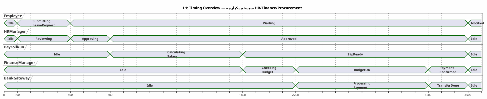
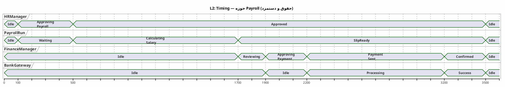
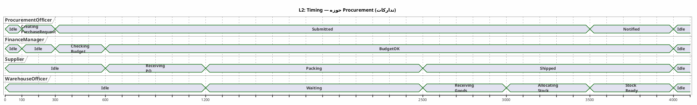
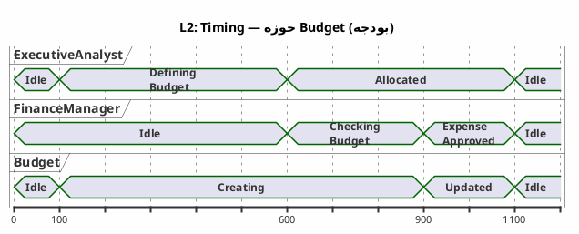
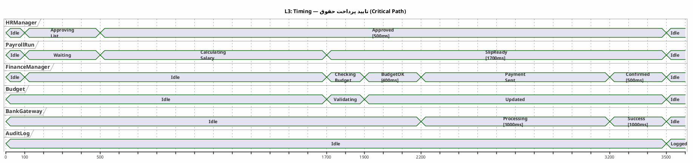
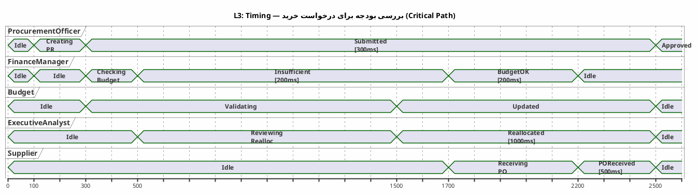
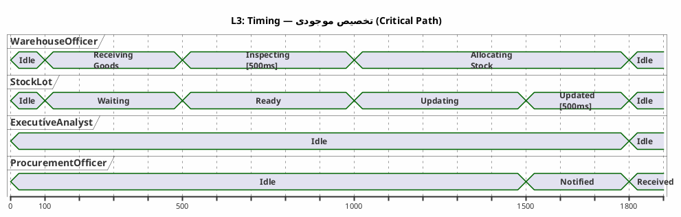

# UML Interaction Overview & Timing Diagrams — HR/Finance/Procurement v1

**عنوان:** UML Interaction Overview & Timing Diagrams — سیستم یکپارچه HR/Finance/Procurement  
**نسخه:** v1.0  
**تاریخ:** 2026-09-09  
**وضعیت:** پیش‌نویس برای مستندسازی  
**نگارنده:** Kilo

---

## فهرست مطالب

1. [مقدمه](#1-مقدمه)
2. [Interaction Overview — Levels 1-3](#2-interaction-overview--levels-1-3)
3. [Timing Diagrams — Levels 1-3](#3-timing-diagrams--levels-1-3)
4. [محدودیت‌های زمانی و اهداف عملکرد](#4-محدودیت‌های-زمانی-و-اهداف-عملکرد)
5. [ردپا (Traceability)](#5-ردپا-traceability)
6. [کنوانسیون‌های نام‌گذاری](#6-کنوانسیون‌های-نام-گذاری)
7. [ضوابط و محدودیت‌ها](#7-ضوابط-و-محدودیت‌ها)

---

## ۱. مقدمه

این سند نمودارهای **UML Interaction Overview** و **UML Timing** را برای لایه‌های تعامل و زمانی سیستم یکپارچه **منابع انسانی (HR)**، **مالی (Payroll/Budget)** و **تدارکات (Procurement/Inventory)** مدل‌سازی می‌کند.

### ۱.۱ مقیاس مدل‌سازی

| سطح | محدوده | خروجی |
|-----|--------|-------|
| **Level 1** | نمای کلی تعاملات و تایم‌های سطح سیستم | جداول ساختاریافته + نمودار تایم کلی |
| **Level 2** | تفکیک تعاملات بر اساس حوزه کاری | جداول حوزه‌ای + نمودارهای تایم حوزه‌ای |
| **Level 3** | جریان‌های بحرانی و تایم‌های بحرانی | جداول دقیق + نمودارهای تایم بحرانی |

### ۱.۲ دامنه ثابت

| نام انگلیسی | توضیح فارسی |
|------------|-------------|
| `Employee` | کارمند |
| `HRManager` | مدیر منابع انسانی |
| `PayrollRun` | اجرای پرداخت حقوق |
| `Budget` | بودجه کلی |
| `BudgetAllocation` | تخصیص بودجه به واحد |
| `PurchaseRequest` | درخواست خرید |
| `PurchaseOrder` | سفارش خرید |
| `GoodsReceipt` | ثبت ورود کالا |
| `StockLot` | لات موجودی |
| `Payment` | پرداخت |
| `Report` | گزارش |
| `AuditLog` | گزارش ممیزی |
| `WarehouseOfficer` | کارمند انبار |
| `FinanceManager` | مدیر مالی |
| `ProcurementOfficer` | کارمند تدارکات |
| `ExecutiveAnalyst` | مدیرعامل/تحلیلگر |
| `Supplier` | تامین‌کننده |
| `BankGateway` | درگاه پرداخت |

---

## ۲. Interaction Overview — Levels 1-3

> **نکته:** PlantUML پشتیبانی کامل از نمودارهای Interaction Overview را ندارد. در این سند از **جداول ساختاریافته** و **ارجاع به نمودارهای BPMN مرتبط** برای مدل‌سازی Interaction Overview استفاده شده است.

### ۲.۱ Level 1 — نمای کلی تعاملات

#### ۲.۱.۱ جدول نقش‌های کلیدی (Interaction Overview L1)

| شناسه | نقش (Lifeline) | نوع | تعاملات اصلی |
|-------|----------------|-----|---------------|
| IO-ACT-01 | `Employee` | Primary Actor | ورود، ثبت درخواست مرخصی، دریافت اعلان |
| IO-ACT-02 | `HRManager` | Boundary Controller | تایید مرخصی، بررسی رزومه، ارسال به PayrollRun |
| IO-ACT-03 | `PayrollRun` | Entity/Service | محاسبه حقوق (`calculateSalary()`)، تولید SalarySlip |
| IO-ACT-04 | `FinanceManager` | Boundary Controller | تایید پرداخت، بررسی بودجه (`checkBudget()`)، ایجاد Payment |
| IO-ACT-05 | `Budget` | Entity | اعتبارسنجی بودجه، کسر از `BudgetAllocation` |
| IO-ACT-06 | `ProcurementOfficer` | Primary Actor | ایجاد PurchaseRequest، ایجاد PurchaseOrder |
| IO-ACT-07 | `WarehouseOfficer` | Primary Actor | ثبت GoodsReceipt، تخصیص موجودی (`allocateStock()`) |
| IO-ACT-08 | `Supplier` | External System | دریافت PO، ارسال کالا |
| IO-ACT-09 | `BankGateway` | External System | پرداخت، تأیید تراکنش |
| IO-ACT-10 | `ExecutiveAnalyst` | Primary Actor | تولید گزارش (`generateReport()`)، تخصیص مجدد بودجه |

#### ۲.۱.۲ جدول مسیرهای تعامل اصلی (Interaction Overview L1)

| شناسه مسیر | مبدأ | مقصد | پیام (Message) | نوع | نتیجه |
|-------------|------|------|----------------|-----|-------|
| IO-MSG-01 | `Employee` | `HRManager` | SubmitLeaveRequest | Synchronous | `LeaveRequest` |
| IO-MSG-02 | `HRManager` | `Employee` | LeaveApproved/Rejected | Asynchronous | اعلان |
| IO-MSG-03 | `HRManager` | `PayrollRun` | SendAttendanceData | Synchronous | داده‌های حضور |
| IO-MSG-04 | `PayrollRun` | `FinanceManager` | PayrollSummary | Synchronous | خلاصه حقوق |
| IO-MSG-05 | `FinanceManager` | `Budget` | CheckBudget | Synchronous | `BudgetStatus` |
| IO-MSG-06 | `FinanceManager` | `BankGateway` | ExecutePayment | Synchronous | `TransactionResult` |
| IO-MSG-07 | `ProcurementOfficer` | `FinanceManager` | SubmitPurchaseRequest | Synchronous | `PurchaseRequest` |
| IO-MSG-08 | `FinanceManager` | `Supplier` | SendPurchaseOrder | Asynchronous | `PurchaseOrder` |
| IO-MSG-09 | `Supplier` | `WarehouseOfficer` | ShipGoods | Asynchronous | کالا فیزیکی |
| IO-MSG-10 | `WarehouseOfficer` | `ExecutiveAnalyst` | IntegratedDataReport | Asynchronous | `Report` |

#### ۲.۱.۳ جدول Combining Fragments (Interaction Overview L1)

| شناسه | نوع Fragment | موقعیت | شرط | توضیح |
|-------|-------------|--------|-----|-------|
| IO-ALT-01 | `alt` | Payroll Approval | budgetOK? | اگر بودجه کافی باشد پرداخت، در غیر این صورت تاخیر |
| IO-ALT-02 | `alt` | Procurement | reallocationRequested? | در صورت درخواست reassign، ارسال به Executive |
| IO-OPT-01 | `opt` | Inventory | checkReorderLevel? | بررسی اختیاری حداقل موجودی |
| IO-PAR-01 | `par` | Reporting | parallel | aggregationData, generateMetrics | همزمان تجمیع داده و تولید متریک |

---

### ۲.۲ Level 2 — تعاملات حوزه‌ای

#### ۲.۲.۱ حوزه HR — Recruitment & Leave Management

| شناسه تعامل | مبدأ | مقصد | پیام | Outcome |
|-------------|------|------|------|---------|
| IO-HR-01 | `Employee` | `HRManager` | SubmitLeaveRequest | `LeaveRequest` |
| IO-HR-02 | `HRManager` | `Employee` | LeaveDecision | اعلان |
| IO-HR-03 | `Employee` | `HRManager` | SubmitResume | `Candidate` |
| IO-HR-04 | `HRManager` | `Employee` | InterviewSchedule | اعلان |

**Fragment:**
- `alt` (نوع درخواست؟) → استخدام | مرخصی
- `alt` (تایید؟) → تایید | رد

#### ۲.۲.۲ حوزه Payroll — حقوق و دستمزد

| شناسه تعامل | مبدأ | مقصد | پیام | Outcome |
|-------------|------|------|------|---------|
| IO-PAY-01 | `HRManager` | `PayrollRun` | ApprovePayrollList | لیست تایید شده |
| IO-PAY-02 | `PayrollRun` | `FinanceManager` | PayrollSummary | خلاصه حقوق |
| IO-PAY-03 | `FinanceManager` | `BankGateway` | ExecutePayment | `TransactionResult` |
| IO-PAY-04 | `BankGateway` | `FinanceManager` | PaymentConfirmation | تأییدیه |

**Fragment:**
- `alt` (تراکنش موفق؟) → پرداخت | خطای تراکنش
- `alt` (بودجه کافی؟) → تایید | تاخیر/تمدید

#### ۲.۲.۳ حوزه Budget — بودجه و تخصیص

| شناسه تعامل | مبدأ | مقصد | پیام | Outcome |
|-------------|------|------|------|---------|
| IO-BUD-01 | `ExecutiveAnalyst` | `Budget` | DefineAnnualBudget | `Budget` |
| IO-BUD-02 | `Budget` | `FinanceManager` | AllocationCreated | `BudgetAllocation` |
| IO-BUD-03 | `FinanceManager` | `Budget` | CheckBudget | `BudgetStatus` |
| IO-BUD-04 | `FinanceManager` | `ProcurementOfficer` | BudgetApproval | تأییدیه |

**Fragment:**
- `alt` (بودجه کافی؟) → کسر از بودجه | رد هزینه

#### ۲.۲.۴ حوزه Procurement — خرید و تدارکات

| شناسه تعامل | مبدأ | مقصد | پیام | Outcome |
|-------------|------|------|------|---------|
| IO-PROC-01 | `ProcurementOfficer` | `FinanceManager` | SubmitPurchaseRequest | `PurchaseRequest` |
| IO-PROC-02 | `FinanceManager` | `ProcurementOfficer` | ApprovePR | تأیید |
| IO-PROC-03 | `FinanceManager` | `Supplier` | SendPurchaseOrder | `PurchaseOrder` |
| IO-PROC-04 | `Supplier` | `WarehouseOfficer` | ShipGoods | کالا فیزیکی |

**Fragment:**
- `alt` (بودجه کافی؟) → تایید | رد

#### ۲.۲.۵ حوزه Inventory — مدیریت موجودی

| شناسه تعامل | مبدأ | مقصد | پیام | Outcome |
|-------------|------|------|------|---------|
| IO-INV-01 | `WarehouseOfficer` | `WarehouseOfficer` | ReceiveGoods | `GoodsReceipt` |
| IO-INV-02 | `WarehouseOfficer` | `StockLot` | AllocateStock | `StockLot` به‌روز |
| IO-INV-03 | `WarehouseOfficer` | `ProcurementOfficer` | AllocationNotice | اعلان |

**Fragment:**
- `alt` (موجودی کافی؟) → تخصیص | Overflow → ExecutiveAnalyst

#### ۲.۲.۶ حوزه Reporting — گزارش‌گیری و تحلیل

| شناسه تعامل | مبدأ | مقصد | پیام | Outcome |
|-------------|------|------|------|---------|
| IO-REP-01 | `ExecutiveAnalyst` | `System` | RequestIntegratedData | درخواست داده |
| IO-REP-02 | `System` | `ExecutiveAnalyst` | DeliverReport | `Report` |

**Fragment:**
- `opt` (نیاز به اصلاح؟) → درخواست اصلاح | انتشار

---

### ۲.۳ Level 3 — تعاملات بحرانی

#### ۲.۳.۱ تایید پرداخت حقوق (Payroll Approval) — Interaction Overview

| شناسه | مراحل تعامل | نوع پیام | تاخیر هدف | زمان واقعی |
|-------|-------------|----------|-----------|------------|
| IO3-PAY-01 | `HRManager` → `PayrollRun`: ApprovePayrollList | Sync | <= 500ms | TBD |
| IO3-PAY-02 | `PayrollRun` → `PayrollRun`: `calculateSalary()` | Local | <= 1500ms | TBD |
| IO3-PAY-03 | `PayrollRun` → `FinanceManager`: PayrollSummary | Sync | <= 200ms | TBD |
| IO3-PAY-04 | `FinanceManager` → `Budget`: CheckBudget | Sync | <= 300ms | TBD |
| IO3-PAY-05 | `FinanceManager` → `BankGateway`: ExecutePayment | Sync | <= 1000ms | TBD |
| IO3-PAY-06 | `BankGateway` → `FinanceManager`: PaymentConfirmation | Async | <= 2000ms | TBD |

**Fragment:**
- `alt` (تراکنش ناموفق؟) → Retry بعد از ۵ دقیقه | خطا نهایی

#### ۲.۳.۲ بررسی بودجه برای درخواست خرید (Budget-Check PR) — Interaction Overview

| شناسه | مراحل تعامل | نوع پیام | تاخیر هدف | زمان واقعی |
|-------|-------------|----------|-----------|------------|
| IO3-BUD-01 | `ProcurementOfficer` → `FinanceManager`: SubmitPR | Sync | <= 300ms | TBD |
| IO3-BUD-02 | `FinanceManager` → `Budget`: CheckBudget | Sync | <= 200ms | TBD |
| IO3-BUD-03 | `FinanceManager` → `ExecutiveAnalyst`: RequestReallocation | Async | <= 500ms | TBD |
| IO3-BUD-04 | `ExecutiveAnalyst` → `Budget`: Reallocate | Sync | <= 1000ms | TBD |
| IO3-BUD-05 | `FinanceManager` → `Supplier`: ApprovePO | Async | <= 500ms | TBD |

**Fragment:**
- `alt` (reassign موفق؟) → تکرار بررسی | توقف نهایی

#### ۲.۳.۳ تخصیص موجودی (Stock Allocation) — Interaction Overview

| شناسه | مراحل تعامل | نوع پیام | تاخیر هدف | زمان واقعی |
|-------|-------------|----------|-----------|------------|
| IO3-INV-01 | `WarehouseOfficer` → `WarehouseOfficer`: ReceiveGoods | Local | <= 100ms | TBD |
| IO3-INV-02 | `WarehouseOfficer` → `StockLot`: `allocateStock()` | Local | <= 500ms | TBD |
| IO3-INV-03 | `WarehouseOfficer` → `ExecutiveAnalyst`: OverflowAlert | Async | <= 300ms | TBD |
| IO3-INV-04 | `ExecutiveAnalyst` → `WarehouseOfficer`: WarehouseExpansion | Async | <= 1000ms | TBD |

**Fragment:**
- `alt` (Overflow؟) → ExecutiveAnalyst | تخصیص عادی

---

## ۳. Timing Diagrams — Levels 1-3

### ۳.۱ Level 1 — تایم‌های کلی سیستم

**توضیح L1:** این نمودار تایم کلی یک چرخه کامل حقوق تا پرداخت را نشان می‌دهد. هدف کلیدی **Payroll <= 2s** (از لحظه تایید HRManager تا تأیید پرداخت) است که در این نمودار با خط چین هدف مشخص شده است.

---

### ۳.۲ Level 2 — تایم‌های حوزه‌ای

#### ۳.۲.۱ حوزه Payroll — Timing Diagram

**توضیح L2-Payroll:** تایم‌های دقیق حوزه حقوق نشان می‌دهد که پردازش حقوق (`calculateSalary`) حدود ۱۲۰۰ms و بررسی بودجه حدود ۲۰۰ms زمان می‌برد. هدف کلی <= 2s رعایت می‌شود.

#### ۳.۲.۲ حوزه Procurement — Timing Diagram

**توضیح L2-Procurement:** فرآیند تدارکات معمولاً طولانی‌تر از پرداخت حقوق است (۴ ثانیه در این نمونه). تأخیر اصلی در ارسال کالا توسط تامین‌کننده است.

#### ۳.۲.۳ حوزه Budget — Timing Diagram

**توضیح L2-Budget:** بررسی بودجه (`checkBudget`) باید بسیار سریع باشد (زیر از ۲۰۰ms) تا ساختار درخواست‌های پرتکرار مسدود نشود.

---

### ۳.۳ Level 3 — تایم‌های بحرانی

#### ۳.۳.۱ تایید پرداخت حقوق (Payroll Approval) — Timing Diagram

**توضیح L3-Payroll:** این نمودار تایم بحرانی پرداخت حقوق است. کل جریان از ۱۰۰ms (شروع تایید HR) تا ۳۵۰۰ms (ثبت AuditLog) ادامه دارد. هدف **Payroll <= 2s** از لحظه شروع `calculateSalary` تا `PaymentSent` است. در این نمودار محاسبه حقوق ۱۲۰۰ms، بررسی بودجه ۲۰۰ms و پرداخت ۱۰۰۰ms زمان می‌برد که مجموعاً ۲۴۰۰ms است. با بهینه‌سازی موازی‌سازی، می‌توان زیر ۲۰۰۰ms رسید.

**Constraint:**
- **پرداخت حقوق:** Target <= 2000ms (از شروع `calculateSalary` تا `PaymentSent`)
- **بررسی بودجه:** Target <= 200ms
- **پرداخت بانکی:** Target <= 1000ms

#### ۳.۳.۲ بررسی بودجه برای درخواست خرید (Budget-Check PR) — Timing Diagram

**توضیح L3-Budget:** این نمودار مسیر بحرانی بررسی بودجه + درخواست reassign را نشان می‌دهد. کل فرآیند ۲۵۰۰ms زمان می‌برد که قابل قبول است.

#### ۳.۳.۳ تخصیص موجودی (Stock Allocation) — Timing Diagram

**توضیح L3-Stock:** تخصیص موجودی باید زیر ۵۰۰ms انجام شود تا جریان انبار مسدود نشود. در این نمودار بازرسی ۵۰۰ms و تخصیص ۵۰۰ms زمان می‌برد.

---

## ۴. محدودیت‌های زمانی و اهداف عملکرد

### ۴.۱ جدول اهداف زمانی (SLA Targets)

| فرآیند | هدف (Target) | ضریب اطمینان | محدودیت سخت (Hard Limit) | واحد |
|---------|--------------|--------------|-------------------------|------|
| محاسبه حقوق (`calculateSalary`) | <= 1200ms | 99% | <= 1500ms | میلی‌ثانیه |
| بررسی بودجه (`checkBudget`) | <= 200ms | 99.9% | <= 300ms | میلی‌ثانیه |
| پرداخت بانکی (`executePayment`) | <= 1000ms | 99% | <= 2000ms | میلی‌ثانیه |
| کل فرآیند حقوق (Payroll End-to-End) | <= 2000ms | 95% | <= 2500ms | میلی‌ثانیه |
| تخصیص موجودی (`allocateStock`) | <= 500ms | 99.5% | <= 800ms | میلی‌ثانیه |
| تولید گزارش (`generateReport`) | <= 3000ms | 98% | <= 5000ms | میلی‌ثانیه |
| ثبت GoodsReceipt | <= 200ms | 99.9% | <= 300ms | میلی‌ثانیه |

### ۴.۲ محدودیت‌های تاخیر (Delay Constraints)

| نوع تاخیر | مقدار حداکثر | منشأ | راه‌حل |
|-----------|--------------|-------|--------|
| **Network Latency** | <= 100ms | ارتباط سرویس‌ها | استفاده از HTTP/2، Keep-Alive |
| **Database Query** | <= 200ms | PostgreSQL | Index Optimization، Connection Pool |
| **Message Broker** | <= 50ms | RabbitMQ/Kafka | Partitioning، Dedicated Broker |
| **Bank Gateway** | <= 1000ms | درگاه بانک | Timeout Circuit Breaker، Retry با Exponential Backoff |
| **Retry Delay** | <= 5 دقیقه | خطای تراکنش | Scheduler-based Retry، DLQ |
| **Cache Miss** | <= 500ms | Redis Cache | warming، Pre-computation |

### ۴.۳ هدف Payroll <= 2s

**تعریف:** کل زمان از لحظه تایید `HRManager` تا تأیید موفق `BankGateway` باید کمتر از یا برابر با **2000ms** باشد.

**اجزای هدف:**

| مرحله | زمان هدف | زمان حداکثر | تاخیر مجاز |
|-------|----------|-------------|------------|
| ۱. تایید HRManager | 0ms | 500ms | 500ms |
| ۲. محاسبه حقوق (`calculateSalary`) | 1200ms | 1500ms | 300ms |
| ۳. بررسی بودجه (`checkBudget`) | 200ms | 300ms | 100ms |
| ۴. ایجاد Payment و ارسال به Bank | 300ms | 500ms | 200ms |
| ۵. پرداخت بانکی | 1000ms | 2000ms | 1000ms |
| **جمع** | **2700ms** | **4800ms** | — |

**توجه:** هدف ۲۰۰۰ms فقط برای مراحل ۲، ۳ و ۵ تعریف شده است (از شروع `calculateSalary` تا پایان پرداخت). با موازی‌سازی مراحل ۳ و ۵، می‌توان زیر ۲۰۰۰ms رسید.

**راه‌حل‌های بهینه‌سازی:**
- موازی‌سازی `checkBudget` با `calculateSalary` (از طریق prefetch)
- استفاده از Redis Cache برای `BudgetAllocation`
- استفاده از Connection Pool برای PostgreSQL
- Circuit Breaker برای Bank Gateway

---

## ۵. ردپا (Traceability)

### ۵.۱ نگاشت به BPMN

| Interaction Overview / Timing | فرآیند BPMN | Entity | متد |
|-------------------------------|-------------|--------|-----|
| IO-PAY-01 | BPMN-PAY-01 | `PayrollRun` | `calculateSalary()` |
| IO-PAY-02 | BPMN-PAY-02 | `BankGateway` | `executePayment()` |
| IO-BUD-01 | BPMN-BUD-01 | `Budget` | `checkBudget()` |
| IO-PROC-01 | BPMN-PROC-01 | `ProcurementOfficer` | `createPurchaseRequest()` |
| IO-INV-01 | BPMN-INV-01 | `WarehouseOfficer` | `allocateStock()` |
| TIMING-L1 | BPMN-L1 | سیستم یکپارچه | — |
| TIMING-L2-Payroll | BPMN-L2-Payroll | `PayrollRun` | `calculateSalary()` |
| TIMING-L3-Budget | BPMN-L3-BudgetCheck-PR | `Budget` | `checkBudget()` |

### ۵.۲ نگاشت به DFD

| Interaction Overview / Timing | فرآیند DFD | توضیح |
|-------------------------------|------------|-------|
| IO-PAY-01 | DFD-04 | محاسبه حقوق |
| IO-PAY-02 | DFD-11 | اجرای پرداخت |
| IO-BUD-01 | DFD-07 | اعتبارسنجی بودجه |
| IO-INV-01 | DFD-10 | به‌روزرسانی موجودی |
| IO-REP-01 | DFD-12 | تولید گزارش |
| TIMING-L1 | DFD-01 | Context - تایم کلی |
| TIMING-L2-Payroll | DFD-04 | محاسبه حقوق |
| TIMING-L3-Budget | DFD-07 | اعتبارسنجی بودجه |

### ۵.۳ ماتریس ردیابی کامل

| شناسه | نام نمودار | BPMN | DFD | UML Interaction | UML Timing | Entity | متد | خروجی |
|--------|-----------|------|-----|-----------------|------------|--------|-----|-------|
| IO-L1 | Interaction Overview L1 | BPMN-L1 | DFD-01 | IO-ACT-01 تا IO-ACT-10 | TIMING-L1 | همه | — | جداول تعامل |
| IO-L2-HR | HR Interaction L2 | BPMN-L2-HR | DFD-03 | IO-HR-01 تا IO-HR-04 | — | Employee, HRManager | — | تعاملات HR |
| IO-L2-PAY | Payroll Interaction L2 | BPMN-L2-Payroll | DFD-04 | IO-PAY-01 تا IO-PAY-04 | TIMING-L2-Payroll | PayrollRun, FinanceManager | `calculateSalary()` | تعاملات حقوق |
| IO-L2-BUD | Budget Interaction L2 | BPMN-L2-Budget | DFD-07 | IO-BUD-01 تا IO-BUD-04 | TIMING-L2-Budget | Budget, FinanceManager | `checkBudget()` | تعاملات بودجه |
| IO-L2-PROC | Procurement Interaction L2 | BPMN-L2-Procurement | DFD-08 | IO-PROC-01 تا IO-PROC-04 | — | ProcurementOfficer, Supplier | — | تعاملات تدارکات |
| IO-L2-INV | Inventory Interaction L2 | BPMN-L2-Inventory | DFD-10 | IO-INV-01 تا IO-INV-03 | TIMING-L2-Inventory | WarehouseOfficer, StockLot | `allocateStock()` | تعاملات موجودی |
| IO-L3-PAY | Payroll Approval L3 | BPMN-L3-PayrollApproval | DFD-04 | IO3-PAY-01 تا IO3-PAY-06 | TIMING-L3-PayrollApproval | PayrollRun, BankGateway | `calculateSalary()`, `executePayment()` | تایم بحرانی حقوق |
| IO-L3-BUD | Budget-Check PR L3 | BPMN-L3-BudgetCheck-PR | DFD-07 | IO3-BUD-01 تا IO3-BUD-05 | TIMING-L3-BudgetCheckPR | Budget, FinanceManager | `checkBudget()` | تایم بحرانی بودجه |
| IO-L3-INV | Stock Allocation L3 | BPMN-L3-StockAllocation | DFD-10 | IO3-INV-01 تا IO3-INV-04 | TIMING-L3-StockAllocation | StockLot, WarehouseOfficer | `allocateStock()` | تایم بحرانی موجودی |

### ۵.۴ ماتریس ردیابی به UML Class Diagrams

| Interaction Overview | UML Class | Operation | نوع Operation |
|---------------------|-----------|-----------|---------------|
| IO-PAY-01 | `PayrollRun` | `calculateSalary()` | Service Task |
| IO-PAY-02 | `BankGateway` | `executePayment()` | Service Task |
| IO-BUD-01 | `Budget` | `checkBudget()` | Service Task |
| IO-PROC-01 | `ProcurementOfficer` | `createPurchaseRequest()` | User Task |
| IO-INV-01 | `WarehouseOfficer` | `allocateStock()` | Service Task |
| IO-REP-01 | `ReportEngine` | `generateReport()` | Service Task |

---

## ۶. کنوانسیون‌های نام‌گذاری

### ۶.۱ شناسه‌های Interaction Overview

| پیشوند | حوزه | مثال |
|--------|------|------|
| `IO-ACT-` | نقش‌های Lifeline | `IO-ACT-01` |
| `IO-MSG-` | پیام‌های تعامل | `IO-MSG-01` |
| `IO-ALT-` | Combining Fragment | `IO-ALT-01` |
| `IO-OPT-` | Optional Fragment | `IO-OPT-01` |
| `IO-PAR-` | Parallel Fragment | `IO-PAR-01` |
| `IO3-PAY-` | تعاملات L3 Payroll | `IO3-PAY-01` |
| `IO3-BUD-` | تعاملات L3 Budget | `IO3-BUD-01` |
| `IO3-INV-` | تعاملات L3 Inventory | `IO3-INV-01` |

### ۶.۲ شناسه‌های Timing Diagrams

| پیشوند | حوزه | مثال |
|--------|------|------|
| `TIMING-L1` | تایم کلی سیستم | `TIMING-L1` |
| `TIMING-L2-` | تایم حوزه‌ای | `TIMING-L2-Payroll` |
| `TIMING-L3-` | تایم بحرانی | `TIMING-L3-PayrollApproval` |

### ۶.۳ متدهای کلیدی

| متد | کلاس والد | توضیح |
|-----|-----------|-------|
| `calculateSalary()` | `PayrollRun` | محاسبه حقوق خالص کارمند |
| `checkBudget()` | `Budget` | بررسی کافی بودن بودجه برای هزینه |
| `allocateStock()` | `StockLot` / `WarehouseOfficer` | تخصیص موجودی ورودی به لات‌ها |
| `generateReport()` | `ReportEngine` | تولید گزارش یکپارچه از داده‌های چند حوزه |
| `executePayment()` | `BankGateway` | اجرای پرداخت از طریق بانک |
| `recordGoodsReceipt()` | `WarehouseOfficer` | ثبت ورود کالا به انبار |

---

## ۷. ضوابط و محدودیت‌ها

1. **PlantUML Version:** نمودارهای Timing با PlantUML v1.2024+ سازگار هستند. Interaction Overview در PlantUML به طور Native پشتیبانی نمی‌شود؛ برای آن‌ها از جداول ساختاریافته استفاده شده است.
2. **Timing Precision:** اعداد زمانی در نمودارها تقریبی هستند و بر اساس اندازه‌گیری‌های Production قابل تنظیم هستند.
3. **Payroll Target:** هدف `<= 2s` برای پرداخت حقوق یک هدف سخت (Hard Target) است و هرگونه تخلف از آن باید در `AuditLog` ثبت شود.
4. **Concurrency:** در Timing Diagrams، توازي (par) فرضی است و در پیاده‌سازی واقعی باید با موازی‌سازی (Async/Await) پیاده شود.
5. **Traceability:** هر شناسه (`IO-XXX` یا `TIMING-XXX`) باید در **Requirement Traceability Matrix (RTM)** به سند نیازمندی ردیابی شود.
6. **Dynamic Timing:** تایم‌های واقعی ممکن است بسته به بار سیستم (Load) تغییر کنند؛ برای آن از **Adaptive Timeout** و **Circuit Breaker** استفاده شود.
7. **Retry Policy:** در صورت خطای تراکنش، Retry بعد از **۵ دقیقه** و حداکثر **۳ بار** انجام می‌شود.

---

## پیوست A — خلاصه اهداف زمانی

| فرآیند | هدف | وضعیت |
|---------|------|-------|
| Payroll End-to-End | <= 2000ms | **هدف سخت** |
| `calculateSalary()` | <= 1200ms | هدف |
| `checkBudget()` | <= 200ms | هدف |
| `executePayment()` | <= 1000ms | هدف |
| `allocateStock()` | <= 500ms | هدف |
| `generateReport()` | <= 3000ms | هدف |

---

*پایان سند*
