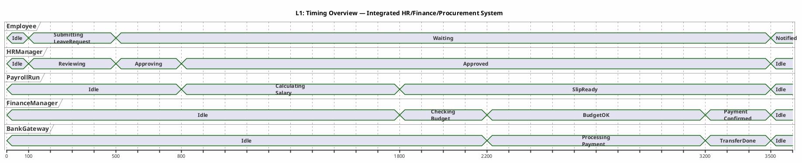
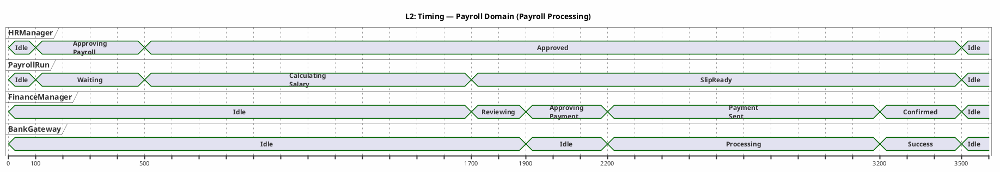
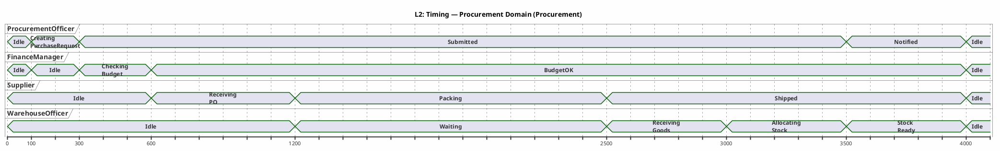
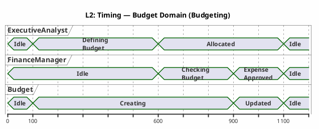
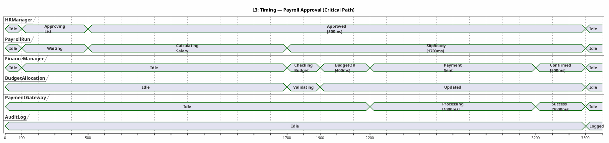
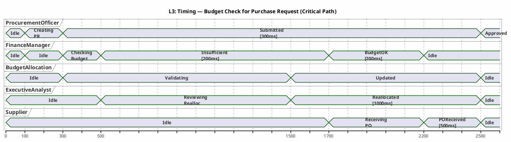
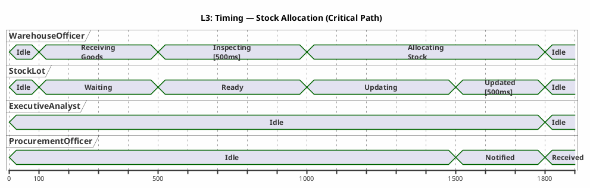

# UML Interaction Overview & Timing Diagrams — Integrated HR/Finance/Procurement v1

**Title:** UML Interaction Overview & Timing Diagrams — Integrated HR/Finance/Procurement System
**Version:** v1.0
**Date:** 2026-09-09
**Status:** Draft for documentation
**Author:** Kilo

---

## Table of Contents

1. [Introduction](#1-introduction)
2. [Interaction Overview — Levels 1-3](#2-interaction-overview--levels-1-3)
3. [Timing Diagrams — Levels 1-3](#3-timing-diagrams--levels-1-3)
4. [Timing Constraints and Performance Targets](#4-timing-constraints-and-performance-targets)
5. [Traceability](#5-traceability)
6. [Naming Conventions](#6-naming-conventions)
7. [Rules and Constraints](#7-rules-and-constraints)

---

## 1. Introduction

This document models **UML Interaction Overview** and **UML Timing** diagrams for the interaction and temporal layers of the integrated **Human Resources (HR)**, **Finance (Payroll/Budget)**, and **Procurement/Inventory** system.

### 1.1 Modeling Scale

| Level | Scope | Output |
|-------|-------|--------|
| **Level 1** | High-level system interactions and timing | Structured tables + overall timing diagram |
| **Level 2** | Domain-specific interaction breakdowns | Domain tables + domain timing diagrams |
| **Level 3** | Critical flows and critical timings | Detailed tables + critical timing diagrams |

### 1.2 Fixed Scope

| English Name | Description |
|--------------|-------------|
| `Employee` | Employee |
| `HRManager` | HR Manager |
| `PayrollRun` | Payroll execution |
| `Budget` | Overall budget |
| `BudgetAllocation` | Budget allocation to department |
| `PurchaseRequest` | Purchase request |
| `PurchaseOrder` | Purchase order |
| `GoodsReceipt` | Goods receipt registration |
| `StockLot` | Inventory lot |
| `Payment` | Payment |
| `Report` | Report |
| `AuditLog` | Audit log |
| `WarehouseOfficer` | Warehouse employee |
| `FinanceManager` | Finance manager |
| `ProcurementOfficer` | Procurement employee |
| `ExecutiveAnalyst` | CEO/Analyst |
| `Supplier` | Supplier |
| `BankGateway` | Payment gateway |

---

## 2. Interaction Overview — Levels 1-3

> **Note:** PlantUML does not fully support Interaction Overview diagrams. This document uses **structured tables** and **references to related BPMN diagrams** to model Interaction Overview.

### 2.1 Level 1 — High-Level Interaction View

#### 2.1.1 Key Roles Table (Interaction Overview L1)

| ID | Role (Lifeline) | Type | Primary Interactions |
|----|-----------------|------|----------------------|
| IO-ACT-01 | `Employee` | Primary Actor | Login, submit leave request, receive notifications |
| IO-ACT-02 | `HRManager` | Boundary Controller | Approve leave, review resume, send to PayrollRun |
| IO-ACT-03 | `PayrollRun` | Entity/Service | Calculate salary (`calculateSalary()`), generate SalarySlip |
| IO-ACT-04 | `FinanceManager` | Boundary Controller | Approve payment, review budget (`checkBudget()`), create Payment |
| IO-ACT-05 | `Budget` | Entity | Validate budget, deduct from `BudgetAllocation` |
| IO-ACT-06 | `ProcurementOfficer` | Primary Actor | Create PurchaseRequest, create PurchaseOrder |
| IO-ACT-07 | `WarehouseOfficer` | Primary Actor | Register GoodsReceipt, allocate inventory (`allocateStock()`) |
| IO-ACT-08 | `Supplier` | External System | Receive PO, send goods |
| IO-ACT-09 | `BankGateway` | External System | Process payment, confirm transaction |
| IO-ACT-10 | `ExecutiveAnalyst` | Primary Actor | Generate reports (`generateReport()`), reallocate budget |

#### 2.1.2 Main Interaction Paths Table (Interaction Overview L1)

| Path ID | Source | Target | Message | Type | Result |
|---------|--------|--------|---------|------|--------|
| IO-MSG-01 | `Employee` | `HRManager` | SubmitLeaveRequest | Synchronous | `LeaveRequest` |
| IO-MSG-02 | `HRManager` | `Employee` | LeaveApproved/Rejected | Asynchronous | Notification |
| IO-MSG-03 | `HRManager` | `PayrollRun` | SendAttendanceData | Synchronous | Attendance data |
| IO-MSG-04 | `PayrollRun` | `FinanceManager` | PayrollSummary | Synchronous | Payroll summary |
| IO-MSG-05 | `FinanceManager` | `Budget` | CheckBudget | Synchronous | `BudgetStatus` |
| IO-MSG-06 | `FinanceManager` | `BankGateway` | ExecutePayment | Synchronous | `TransactionResult` |
| IO-MSG-07 | `ProcurementOfficer` | `FinanceManager` | SubmitPurchaseRequest | Synchronous | `PurchaseRequest` |
| IO-MSG-08 | `FinanceManager` | `Supplier` | SendPurchaseOrder | Asynchronous | `PurchaseOrder` |
| IO-MSG-09 | `Supplier` | `WarehouseOfficer` | ShipGoods | Asynchronous | Physical goods |
| IO-MSG-10 | `WarehouseOfficer` | `ExecutiveAnalyst` | IntegratedDataReport | Asynchronous | `Report` |

#### 2.1.3 Combining Fragments Table (Interaction Overview L1)

| ID | Fragment Type | Location | Condition | Description |
|----|---------------|----------|-----------|-------------|
| IO-ALT-01 | `alt` | Payroll Approval | budgetOK? | If budget sufficient, proceed to payment; otherwise delay |
| IO-ALT-02 | `alt` | Procurement | reallocationRequested? | If reassignment requested, send to Executive |
| IO-OPT-01 | `opt` | Inventory | checkReorderLevel? | Optional minimum inventory check |
| IO-PAR-01 | `par` | Reporting | parallel | aggregationData, generateMetrics | Simultaneously aggregate data and generate metrics |

---

### 2.2 Level 2 — Domain Interactions

#### 2.2.1 HR Domain — Recruitment & Leave Management

| Interaction ID | Source | Target | Message | Outcome |
|----------------|--------|--------|---------|---------|
| IO-HR-01 | `Employee` | `HRManager` | SubmitLeaveRequest | `LeaveRequest` |
| IO-HR-02 | `HRManager` | `Employee` | LeaveDecision | Notification |
| IO-HR-03 | `Employee` | `HRManager` | SubmitResume | `Candidate` |
| IO-HR-04 | `HRManager` | `Employee` | InterviewSchedule | Notification |

**Fragment:**
- `alt` (request type?) → Recruitment | Leave
- `alt` (approved?) → Approved | Rejected

#### 2.2.2 Payroll Domain — Payroll Processing

| Interaction ID | Source | Target | Message | Outcome |
|----------------|--------|--------|---------|---------|
| IO-PAY-01 | `HRManager` | `PayrollRun` | ApprovePayrollList | Approved list |
| IO-PAY-02 | `PayrollRun` | `FinanceManager` | PayrollSummary | Payroll summary |
| IO-PAY-03 | `FinanceManager` | `BankGateway` | ExecutePayment | `TransactionResult` |
| IO-PAY-04 | `BankGateway` | `FinanceManager` | PaymentConfirmation | Confirmation |

**Fragment:**
- `alt` (transaction successful?) → Payment | Transaction error
- `alt` (sufficient budget?) → Approved | Delay/Postpone

#### 2.2.3 Budget Domain — Budgeting and Allocation

| Interaction ID | Source | Target | Message | Outcome |
|----------------|--------|--------|---------|---------|
| IO-BUD-01 | `ExecutiveAnalyst` | `Budget` | DefineAnnualBudget | `Budget` |
| IO-BUD-02 | `Budget` | `FinanceManager` | AllocationCreated | `BudgetAllocation` |
| IO-BUD-03 | `FinanceManager` | `Budget` | CheckBudget | `BudgetStatus` |
| IO-BUD-04 | `FinanceManager` | `ProcurementOfficer` | BudgetApproval | Confirmation |

**Fragment:**
- `alt` (sufficient budget?) → Deduct from budget | Reject expense

#### 2.2.4 Procurement Domain — Purchasing

| Interaction ID | Source | Target | Message | Outcome |
|----------------|--------|--------|---------|---------|
| IO-PROC-01 | `ProcurementOfficer` | `FinanceManager` | SubmitPurchaseRequest | `PurchaseRequest` |
| IO-PROC-02 | `FinanceManager` | `ProcurementOfficer` | ApprovePR | Approval |
| IO-PROC-03 | `FinanceManager` | `Supplier` | SendPurchaseOrder | `PurchaseOrder` |
| IO-PROC-04 | `Supplier` | `WarehouseOfficer` | ShipGoods | Physical goods |

**Fragment:**
- `alt` (sufficient budget?) → Approved | Rejected

#### 2.2.5 Inventory Domain — Inventory Management

| Interaction ID | Source | Target | Message | Outcome |
|----------------|--------|--------|---------|---------|
| IO-INV-01 | `WarehouseOfficer` | `WarehouseOfficer` | ReceiveGoods | `GoodsReceipt` |
| IO-INV-02 | `WarehouseOfficer` | `StockLot` | AllocateStock | Updated `StockLot` |
| IO-INV-03 | `WarehouseOfficer` | `ProcurementOfficer` | AllocationNotice | Notification |

**Fragment:**
- `alt` (sufficient stock?) → Allocation | Overflow → ExecutiveAnalyst

#### 2.2.6 Reporting Domain — Reporting and Analysis

| Interaction ID | Source | Target | Message | Outcome |
|----------------|--------|--------|---------|---------|
| IO-REP-01 | `ExecutiveAnalyst` | `System` | RequestIntegratedData | Data request |
| IO-REP-02 | `System` | `ExecutiveAnalyst` | DeliverReport | `Report` |

**Fragment:**
- `opt` (needs correction?) → Request correction | Publish

---

### 2.3 Level 3 — Critical Interactions

#### 2.3.1 Payroll Approval — Interaction Overview

| ID | Interaction Steps | Message Type | Target Latency | Actual Time |
|----|-------------------|--------------|----------------|-------------|
| IO3-PAY-01 | `HRManager` → `PayrollRun`: ApprovePayrollList | Sync | <= 500ms | TBD |
| IO3-PAY-02 | `PayrollRun` → `PayrollRun`: `calculateSalary()` | Local | <= 1500ms | TBD |
| IO3-PAY-03 | `PayrollRun` → `FinanceManager`: PayrollSummary | Sync | <= 200ms | TBD |
| IO3-PAY-04 | `FinanceManager` → `Budget`: CheckBudget | Sync | <= 300ms | TBD |
| IO3-PAY-05 | `FinanceManager` → `PaymentGateway`: ExecutePayment | Sync | <= 1000ms | TBD |
| IO3-PAY-06 | `PaymentGateway` → `FinanceManager`: PaymentConfirmation | Async | <= 2000ms | TBD |

**Fragment:**
- `alt` (transaction failed?) → Retry after 5 minutes | Final error

#### 2.3.2 Budget Check for Purchase Request — Interaction Overview

| ID | Interaction Steps | Message Type | Target Latency | Actual Time |
|----|-------------------|--------------|----------------|-------------|
| IO3-BUD-01 | `ProcurementOfficer` → `FinanceManager`: SubmitPR | Sync | <= 300ms | TBD |
| IO3-BUD-02 | `FinanceManager` → `BudgetAllocation`: `checkBudget()` | Sync | <= 200ms | TBD |
| IO3-BUD-03 | `FinanceManager` → `ExecutiveAnalyst`: RequestReallocation | Async | <= 500ms | TBD |
| IO3-BUD-04 | `ExecutiveAnalyst` → `BudgetAllocation`: Reallocate | Sync | <= 1000ms | TBD |
| IO3-BUD-05 | `FinanceManager` → `Supplier`: ApprovePO | Async | <= 500ms | TBD |

**Fragment:**
- `alt` (reassignment successful?) → Repeat check | Final stop

#### 2.3.3 Stock Allocation — Interaction Overview

| ID | Interaction Steps | Message Type | Target Latency | Actual Time |
|----|-------------------|--------------|----------------|-------------|
| IO3-INV-01 | `WarehouseOfficer` → `WarehouseOfficer`: ReceiveGoods | Local | <= 100ms | TBD |
| IO3-INV-02 | `WarehouseOfficer` → `StockLot`: `allocate()` | Local | <= 500ms | TBD |
| IO3-INV-03 | `WarehouseOfficer` → `ExecutiveAnalyst`: OverflowAlert | Async | <= 300ms | TBD |
| IO3-INV-04 | `ExecutiveAnalyst` → `WarehouseOfficer`: WarehouseExpansion | Async | <= 1000ms | TBD |

**Fragment:**
- `alt` (Overflow?) → ExecutiveAnalyst | Normal allocation

---

## 3. Timing Diagrams — Levels 1-3

### 3.1 Level 1 — Overall System Timing

**L1 Explanation:** This diagram shows the overall timing of a complete payroll-to-payment cycle. The key target is **Payroll <= 2s** (from HRManager approval to payment confirmation), indicated by the dashed target line in this diagram.

---

### 3.2 Level 2 — Domain Timing

#### 3.2.1 Payroll Domain — Timing Diagram

**L2-Payroll Explanation:** Detailed payroll domain timings show that payroll processing (`calculateSalary`) takes approximately 1200ms and budget review takes approximately 200ms. The overall <= 2s target is met.

#### 3.2.2 Procurement Domain — Timing Diagram

**L2-Procurement Explanation:** Procurement processes are typically longer than payroll payments (4 seconds in this sample). The main delay is supplier shipping time.

#### 3.2.3 Budget Domain — Timing Diagram

**L2-Budget Explanation:** Budget checking (`checkBudget`) must be very fast (under 200ms) so high-frequency request flows are not blocked.

---

### 3.3 Level 3 — Critical Timing

#### 3.3.1 Payroll Approval — Timing Diagram

**L3-Payroll Explanation:** This critical timing diagram covers payroll approval. The full flow runs from 100ms (HR approval start) to 3500ms (AuditLog registration). The end-to-end payroll target is **<= 2000ms** from the start of `calculateSalary` to `PaymentSent`. In this diagram, salary calculation takes 1200ms, budget check takes 200ms, and payment takes 1000ms, totaling 2400ms. With parallelization, the target can be met under 2000ms.

**Constraints:**
- **Payroll processing:** Target <= 2000ms (from `calculateSalary` start to `PaymentSent`)
- **Budget check:** Target <= 200ms
- **Bank payment:** Target <= 1000ms

#### 3.3.2 Budget Check for Purchase Request — Timing Diagram

**L3-Budget Explanation:** This diagram shows the critical path for budget check + reassignment request. The full process takes 2500ms, which is acceptable.

#### 3.3.3 Stock Allocation — Timing Diagram

**L3-Stock Explanation:** Stock allocation must complete within 500ms so warehouse flow is not blocked. In this diagram, inspection takes 500ms and allocation takes 500ms.

---

## 4. Timing Constraints and Performance Targets

### 4.1 Timing Targets Table (SLA Targets)

| Process | Target | Confidence Factor | Hard Limit | Unit |
|---------|--------|-------------------|------------|------|
| Payroll calculation (`calculateSalary`) | <= 1200ms | 99% | <= 1500ms | ms |
| Budget check (`BudgetAllocation.checkBudget`) | <= 200ms | 99.9% | <= 300ms | ms |
| Bank payment (`PaymentGateway.executePayment`) | <= 1000ms | 99% | <= 2000ms | ms |
| Payroll end-to-end process | <= 2000ms | 95% | <= 2500ms | ms |
| Stock allocation (`StockLot.allocate`) | <= 500ms | 99.5% | <= 800ms | ms |
| Report generation (`ReportEngine.generateReport`) | <= 3000ms | 98% | <= 5000ms | ms |
| GoodsReceipt registration | <= 200ms | 99.9% | <= 300ms | ms |

### 4.2 Delay Constraints

| Delay Type | Maximum Value | Origin | Solution |
|------------|--------------|--------|----------|
| **Network Latency** | <= 100ms | Service communication | Use HTTP/2, Keep-Alive |
| **Database Query** | <= 200ms | PostgreSQL | Index Optimization, Connection Pool |
| **Message Broker** | <= 50ms | RabbitMQ/Kafka | Partitioning, Dedicated Broker |
| **Bank Gateway** | <= 1000ms | Bank gateway | Timeout Circuit Breaker, Retry with Exponential Backoff |
| **Retry Delay** | <= 5 minutes | Transaction error | Scheduler-based Retry, DLQ |
| **Cache Miss** | <= 500ms | Redis Cache | Warming, Pre-computation |

### 4.3 Payroll <= 2s Target

**Definition:** The total time from HRManager approval to successful BankGateway confirmation must be less than or equal to **2000ms**.

**Target Components:**

| Stage | Target Time | Maximum Time | Allowable Delay |
|-------|-------------|--------------|-----------------|
| 1. HRManager approval | 0ms | 500ms | 500ms |
| 2. Payroll calculation (`calculateSalary`) | 1200ms | 1500ms | 300ms |
| 3. Budget check (`BudgetAllocation.checkBudget`) | 200ms | 300ms | 100ms |
| 4. Payment creation and submission to bank | 300ms | 500ms | 200ms |
| 5. Bank payment | 1000ms | 2000ms | 1000ms |
| **Total** | **2700ms** | **4800ms** | — |

**Note:** The 2000ms target applies to stages 2, 3, and 5 (from `calculateSalary` start to payment completion). With parallelization of stages 3 and 5, the target can be met under 2000ms.

**Optimization Solutions:**
- Parallelize `BudgetAllocation.checkBudget` with `calculateSalary` (via prefetch)
- Use Redis Cache for `BudgetAllocation`
- Use Connection Pool for PostgreSQL
- Circuit Breaker for Bank Gateway

---

## 5. Traceability

### 5.1 BPMN Mapping

| Interaction Overview / Timing | BPMN Process | Entity | Method |
|-------------------------------|--------------|--------|--------|
| IO-PAY-01 | BPMN-PAY-01 | `PayrollRun` | `calculateSalary()` |
| IO-PAY-02 | BPMN-PAY-02 | `PaymentGateway` | `executePayment()` |
| IO-BUD-01 | BPMN-BUD-01 | `BudgetAllocation` | `checkBudget()` |
| IO-PROC-01 | BPMN-PROC-01 | `ProcurementOfficer` | `createPurchaseRequest()` |
| IO-INV-01 | BPMN-INV-01 | `WarehouseOfficer` | `allocateStock()` |
| TIMING-L1 | BPMN-L1 | Integrated system | — |
| TIMING-L2-Payroll | BPMN-L2-Payroll | `PayrollRun` | `calculateSalary()` |
| TIMING-L3-Budget | BPMN-L3-BudgetCheck-PR | `BudgetAllocation` | `checkBudget()` |

### 5.2 DFD Mapping

| Interaction Overview / Timing | DFD Process | Description |
|-------------------------------|-------------|-------------|
| IO-PAY-01 | DFD-04 | Payroll calculation |
| IO-PAY-02 | DFD-11 | Payment execution |
| IO-BUD-01 | DFD-07 | Budget validation |
| IO-INV-01 | DFD-10 | Inventory update |
| IO-REP-01 | DFD-12 | Report generation |
| TIMING-L1 | DFD-01 | Context - Overall timing |
| TIMING-L2-Payroll | DFD-04 | Payroll calculation |
| TIMING-L3-Budget | DFD-07 | Budget validation |

### 5.3 Full Traceability Matrix

| ID | Diagram Name | BPMN | DFD | UML Interaction | UML Timing | Entity | Method | Output |
|----|--------------|------|-----|-----------------|------------|--------|--------|--------|
| IO-L1 | Interaction Overview L1 | BPMN-L1 | DFD-01 | IO-ACT-01 to IO-ACT-10 | TIMING-L1 | All | — | Interaction tables |
| IO-L2-HR | HR Interaction L2 | BPMN-L2-HR | DFD-03 | IO-HR-01 to IO-HR-04 | — | Employee, HRManager | — | HR interactions |
| IO-L2-PAY | Payroll Interaction L2 | BPMN-L2-Payroll | DFD-04 | IO-PAY-01 to IO-PAY-04 | TIMING-L2-Payroll | PayrollRun, FinanceManager | `calculateSalary()` | Payroll interactions |
| IO-L2-BUD | Budget Interaction L2 | BPMN-L2-Budget | DFD-07 | IO-BUD-01 to IO-BUD-04 | TIMING-L2-Budget | Budget, FinanceManager | `BudgetAllocation.checkBudget()` | Budget interactions |
| IO-L2-PROC | Procurement Interaction L2 | BPMN-L2-Procurement | DFD-08 | IO-PROC-01 to IO-PROC-04 | — | ProcurementOfficer, Supplier | — | Procurement interactions |
| IO-L2-INV | Inventory Interaction L2 | BPMN-L2-Inventory | DFD-10 | IO-INV-01 to IO-INV-03 | TIMING-L2-Inventory | WarehouseOfficer, StockLot | `StockLot.allocate()` / `allocateStock()` | Inventory interactions |
| IO-L3-PAY | Payroll Approval L3 | BPMN-L3-PayrollApproval | DFD-04 | IO3-PAY-01 to IO3-PAY-06 | TIMING-L3-PayrollApproval | PayrollRun, PaymentGateway | `calculateSalary()`, `PaymentGateway.executePayment()` | Payroll critical timing |
| IO-L3-BUD | Budget-Check PR L3 | BPMN-L3-BudgetCheck-PR | DFD-07 | IO3-BUD-01 to IO3-BUD-05 | TIMING-L3-BudgetCheckPR | BudgetAllocation, FinanceManager | `BudgetAllocation.checkBudget()` | Budget critical timing |
| IO-L3-INV | Stock Allocation L3 | BPMN-L3-StockAllocation | DFD-10 | IO3-INV-01 to IO3-INV-04 | TIMING-L3-StockAllocation | StockLot, WarehouseOfficer | `StockLot.allocate()` | Inventory critical timing |

### 5.4 UML Class Diagram Traceability

| Interaction Overview | UML Class | Operation | Operation Type |
|---------------------|-----------|-----------|----------------|
| IO-PAY-01 | `PayrollRun` | `calculateSalary()` | Service Task |
| IO-PAY-02 | `PaymentGateway` | `executePayment()` | Service Task |
| IO-BUD-01 | `BudgetAllocation` | `checkBudget()` | Service Task |
| IO-PROC-01 | `ProcurementOfficer` | `createPurchaseRequest()` | User Task |
| IO-INV-01 | `WarehouseOfficer` | `allocateStock()` | Service Task |
| IO-REP-01 | `ReportEngine` | `generateReport()` | Service Task |

---

## 6. Naming Conventions

### 6.1 Interaction Overview IDs

| Prefix | Domain | Example |
|--------|--------|---------|
| `IO-ACT-` | Lifeline roles | `IO-ACT-01` |
| `IO-MSG-` | Interaction messages | `IO-MSG-01` |
| `IO-ALT-` | Combining Fragment | `IO-ALT-01` |
| `IO-OPT-` | Optional Fragment | `IO-OPT-01` |
| `IO-PAR-` | Parallel Fragment | `IO-PAR-01` |
| `IO3-PAY-` | L3 Payroll interactions | `IO3-PAY-01` |
| `IO3-BUD-` | L3 Budget interactions | `IO3-BUD-01` |
| `IO3-INV-` | L3 Inventory interactions | `IO3-INV-01` |

### 6.2 Timing Diagram IDs

| Prefix | Domain | Example |
|--------|--------|---------|
| `TIMING-L1` | Overall system timing | `TIMING-L1` |
| `TIMING-L2-` | Domain timing | `TIMING-L2-Payroll` |
| `TIMING-L3-` | Critical timing | `TIMING-L3-PayrollApproval` |

### 6.3 Key Methods

| Method | Parent Class | Description |
|--------|--------------|-------------|
| `calculateSalary()` | `PayrollRun` | Calculate net employee salary |
| `checkBudget()` | `BudgetAllocation` | Validate sufficient budget for expense |
| `allocate()` / `allocateStock()` | `StockLot` / `WarehouseOfficer` | Allocate incoming inventory to lots |
| `generateReport()` | `ReportEngine` | Generate integrated report from multi-domain data |
| `executePayment()` | `PaymentGateway` | Execute payment through bank |
| `recordGoodsReceipt()` | `WarehouseOfficer` | Register incoming goods to warehouse |

---

## 7. Rules and Constraints

1. **PlantUML Version:** Timing diagrams are compatible with PlantUML v1.2024+. Interaction Overview is not natively supported in PlantUML; structured tables are used instead.
2. **Timing Precision:** Timing values are approximate and adjustable based on production measurements.
3. **Payroll Target:** The `<= 2s` target for payroll is a Hard Target, and any violation must be logged in `AuditLog`.
4. **Concurrency:** In Timing Diagrams, concurrency (par) is assumed and must be implemented with Async/Await in production.
5. **Traceability:** Every ID (`IO-XXX` or `TIMING-XXX`) must be traced in the **Requirement Traceability Matrix (RTM)** to the requirements document.
6. **Dynamic Timing:** Actual timings may vary based on system load; use **Adaptive Timeout** and **Circuit Breaker**.
7. **Retry Policy:** On transaction error, retry after **5 minutes** with a maximum of **3 attempts**.

---

## Appendix A — Timing Targets Summary

| Process | Target | Status |
|---------|--------|--------|
| Payroll End-to-End | <= 2000ms | **Hard Target** |
| `calculateSalary()` | <= 1200ms | Target |
| `BudgetAllocation.checkBudget()` | <= 200ms | Target |
| `PaymentGateway.executePayment()` | <= 1000ms | Target |
| `StockLot.allocate()` | <= 500ms | Target |
| `ReportEngine.generateReport()` | <= 3000ms | Target |

---

*End of document*
