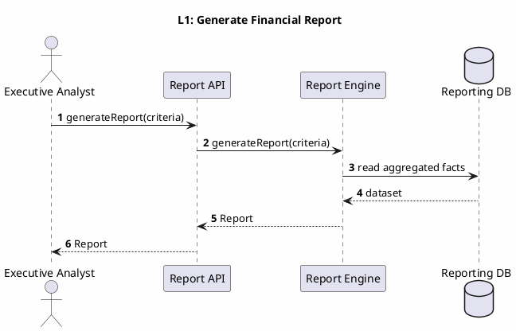
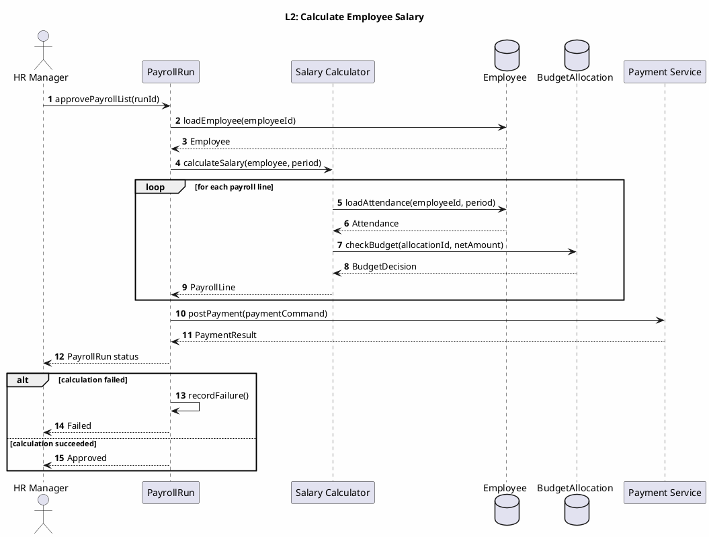
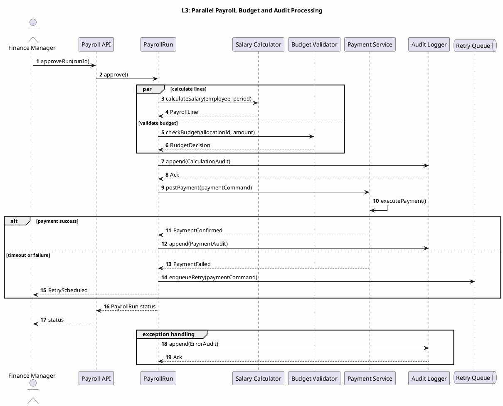
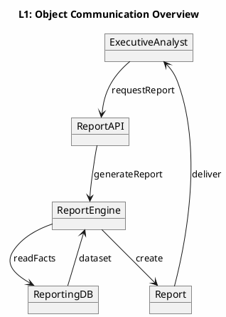
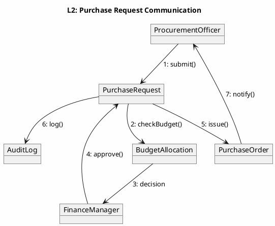

# UML 2.5 Interaction Diagrams — Sequence and Communication

**عنوان:** UML 2.5 Interaction Diagrams — سیستم یکپارچه HR/Finance/Procurement  
**نسخه:** v1.0  
**تاریخ:** 2026-09-09

---

## ۱. مقدمه

این سند دو نوع نمودار تعاملی UML 2.5 را در سه سطح انتزاع ارائه می‌کند:

- **Sequence:** ترتیب زمانی پیام‌ها، حلقه‌ها، شاخه‌ها، فراخوانی‌های ناهمگام و مدیریت خطا.
- **Communication:** لینک اشیاء و شماره پیام‌ها با تمرکز بر همکاری ساختاری.

نام‌های مشترک با DFD، BPMN و Class Diagram شامل `Employee`، `PayrollRun`، `BudgetAllocation`، `PurchaseRequest`، `PurchaseOrder`، `StockLot`، `GoodsReceipt`، `Payment`، `Report` و `AuditLog` است.

---

## ۲. نمودار توالی — نوع ۱۱

### ۲.۱ سطح ۱ — دریافت گزارش مالی



**توضیح:** تحلیلگر معیار گزارش را به API می‌دهد، Report Engine داده‌های تجمیعی را از Reporting DB می‌خواند و `Report` را برمی‌گرداند. این سناریو با DFD-L2.6 و مؤلفه Reporting در Class/Component هم‌خوان است. در سطح ۱ فقط ترتیب کلی فراخوانی‌ها نمایش داده شده و جزییات خطا و صف در سطح‌های بعدی اضافه می‌شود.

### ۲.۲ سطح ۲ — محاسبه حقوق یک کارمند



**توضیح:** حلقه برای تولید `PayrollLine` هر کارمند اجرا می‌شود و `calculateSalary()` داده‌های حضور و بودجه را ترکیب می‌کند. شاخه `alt` خطای محاسبه را از مسیر موفق جدا می‌کند. `postPayment()` پس از تأیید اجرا فراخوانی می‌شود و نتیجه به `HRManager` بازمی‌گردد. این سناریو مستقیماً با DFD-L3.1 و BPMN-L3 Payroll Approval مرتبط است.

### ۲.۳ سطح ۳ — همزمانی، پیام ناهمگام و مدیریت خطا



**توضیح:** `par` محاسبه خطوط و بررسی بودجه را همزمان نشان می‌دهد؛ پرداخت پس از تکمیل هر دو شاخه انجام می‌شود. پیام ممیزی همگام و پیام retry به صف ناهمگام ارسال می‌شود. خطای درگاه باعث ثبت `ErrorAudit` و زمان‌بندی تلاش مجدد می‌شود. این سطح با Interaction Overview و Timing Diagram سطح ۳ هماهنگ است.

---

## ۳. نمودار ارتباطی — نوع ۱۲

### ۳.۱ سطح ۱ — ارتباط اشیاء در معماری کلی



**توضیح:** ارتباط سطح ۱ بین تحلیلگر، API، موتور گزارش، پایگاه داده و شیء گزارش را نشان می‌دهد. هر لینک یک همکاری معنایی دارد و شماره پیام در سطح‌های بعدی دقیق می‌شود. این نما با Use Case `Generate Analytical Reports` و DFD-L2.6 مطابقت دارد.

### ۳.۲ سطح ۲ — پیام‌های فرایند میانی



**توضیح:** شماره پیام‌ها ترتیب همکاری را از ایجاد درخواست تا صدور سفارش مشخص می‌کند. `BudgetAllocation` پیش از تأیید بررسی می‌شود و `AuditLog` پس از تصمیم نهایی ثبت می‌گردد. این ترتیب با DFD-L3.2 و Activity سطح ۲ یکسان است.

### ۳.۳ سطح ۳ — شماره‌گذاری دقیق پیام‌ها

```plantuml
@startuml ARCH-L3-Communication
skinparam backgroundColor #FEFEFE

title L3: Detailed Message Numbering — Payroll

object "HRManager" as HRM
object "PayrollRun" as RUN
object "SalaryCalculator" as CALC
object "EmployeeStore" as EMP
object "BudgetAllocation" as BUD
object "PaymentService" as PAY
object "AuditLog" as AUDIT

HRM --> RUN : 1.1: approveRun(runId)
RUN --> EMP : 1.2: loadEmployee(employeeId)
EMP --> RUN : 1.3: Employee
RUN --> CALC : 2.1: calculateSalary(employee, period)
CALC --> EMP : 2.2: loadAttendance(employeeId, period)
EMP --> CALC : 2.3: Attendance
CALC --> BUD : 2.4: checkBudget(allocationId, amount)
BUD --> CALC : 2.5: BudgetDecision
CALC --> RUN : 2.6: PayrollLine
RUN --> PAY : 3.1: postPayment(paymentCommand)
PAY --> RUN : 3.2: PaymentResult
RUN --> AUDIT : 4.1: append(AuditEvent)
AUDIT --> RUN : 4.2: Ack
RUN --> HRM : 5.1: PayrollRun status

alt calculation failed
  RUN --> AUDIT : 6.1: append(ErrorAudit)
  AUDIT --> RUN : 6.2: Ack
else payment failed
  RUN --> AUDIT : 6.3: append(PaymentError)
  RUN --> RUN : 6.4: enqueueRetry()
end

@enduml
```

**توضیح:** شماره‌های اعشاری ترتیب فراخوانی‌های هم‌سطح و تو‌در‌تو را نشان می‌دهند. محاسبه حقوق، بررسی بودجه، پرداخت و ممیزی در یک سناریوی بحرانی هماهنگ شده‌اند. شاخه‌های خطا پیام‌های `ErrorAudit` و `enqueueRetry()` را فعال می‌کنند. این نمودار با Sequence سطح ۳ و Timing Diagram سطح ۳ هم‌خوان است.

---

## ۴. قوانین تعامل

| شناسه | قانون | پیامدهای نقض |
|---|---|---|
| INT-01 | `calculateSalary()` باید قبل از `postPayment()` کامل شود | پرداخت انجام نمی‌شود و `PayrollRun` ناموفق می‌شود |
| INT-02 | `checkBudget()` باید قبل از رزرو و صدور PO کامل شود | `PurchaseRequest` تأیید نمی‌شود |
| INT-03 | `allocateStock()` باید پس از `GoodsReceipt` معتبر فراخوانی شود | تخصیص رد و `StockShortageException` ثبت می‌شود |
| INT-04 | همه پیام‌های تصمیم و پرداخت باید `AuditLog` تولید کنند | عملیات از نظر ممیزی ناقص است |
| INT-05 | پیام‌های retry باید شناسه همبستگی و سقف تلاش داشته باشند | درخواست تکراری یا حلقه نامحدود ایجاد می‌شود |

## ۵. ردپا

| Interaction | DFD | BPMN | UML Class / Method |
|---|---|---|---|
| Generate Report | DFD-L2.6 | BPMN-L2 Reporting | `ReportEngine.generateReport()` |
| Calculate Salary | DFD-L2.2 / L3.1 | BPMN-L3 Payroll Approval | `PayrollRun.calculateSalary()` |
| Check Budget PR | DFD-L2.3 / L3.2 | BPMN-L3 Budget Check PR | `BudgetAllocation.checkBudget()` |
| Allocate Stock | DFD-L2.5 / L3.3 | BPMN-L3 Stock Allocation | `StockLot.allocate()` / `allocateStock()` |

*پایان سند Sequence و Communication*
