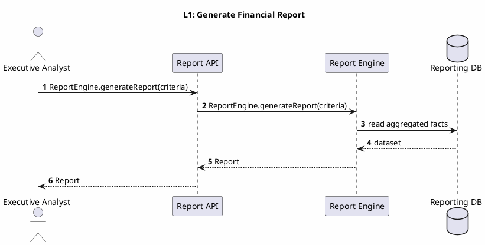
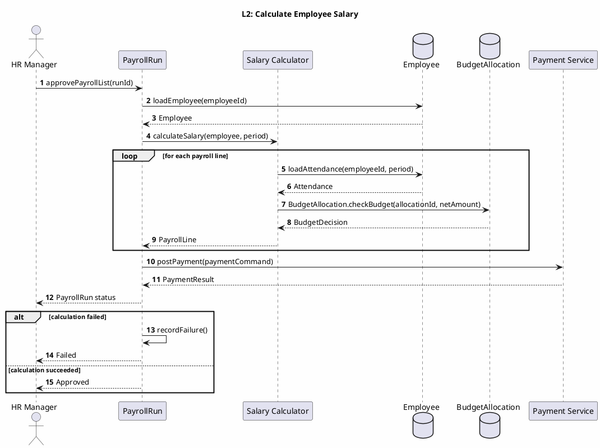
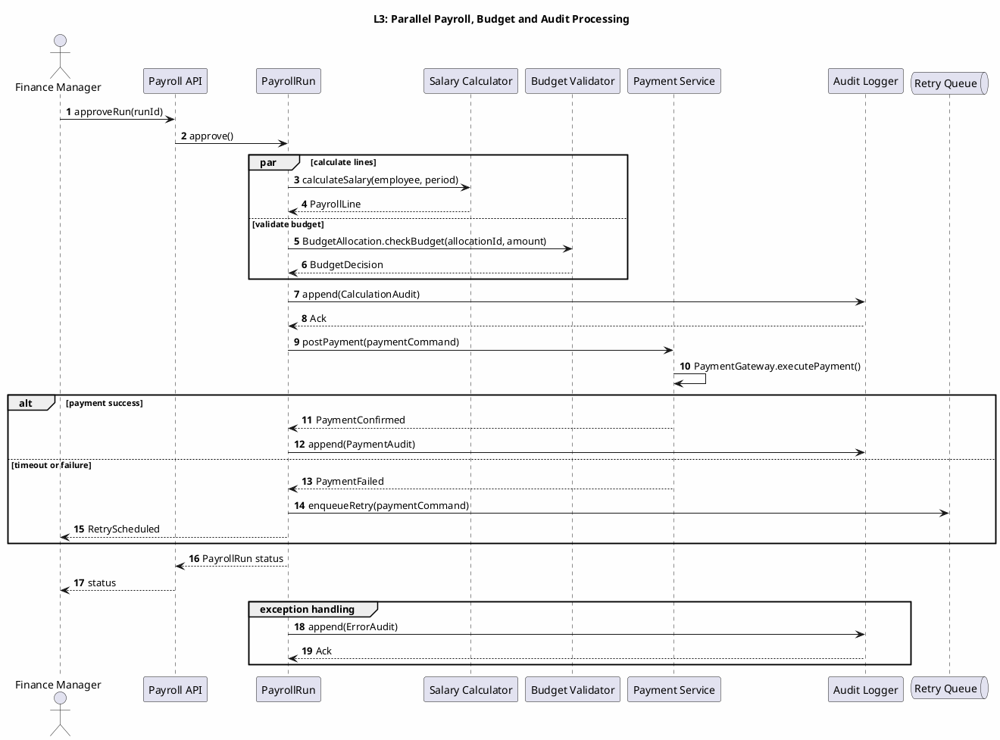
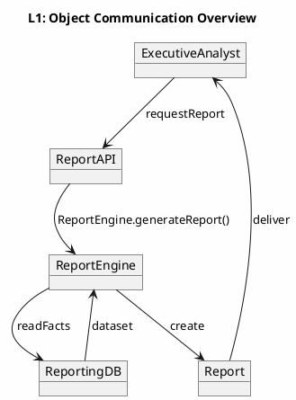
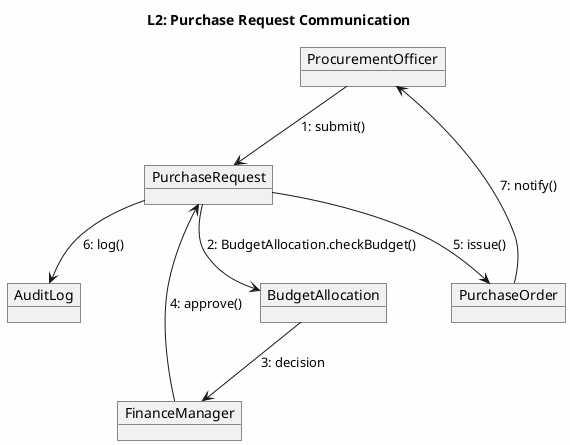
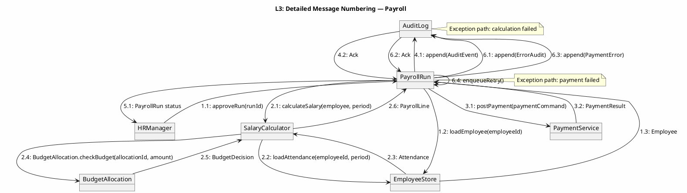

# UML 2.5 Interaction Diagrams — Sequence and Communication

**Title:** UML 2.5 Interaction Diagrams — Integrated HR/Finance/Procurement System
**Version:** v1.0
**Date:** 2026-09-09

---

## 1. Introduction

This document presents two types of UML 2.5 interaction diagrams at three levels of abstraction:

- **Sequence:** The temporal order of messages, loops, branches, asynchronous calls, and error handling.
- **Communication:** Object links and message numbers, with a focus on structural collaboration.

Names shared with the DFD, BPMN, and Class Diagram include `Employee`, `PayrollRun`, `BudgetAllocation`, `PurchaseRequest`, `PurchaseOrder`, `StockLot`, `GoodsReceipt`, `Payment`, `Report`, and `AuditLog`.

---

## 2. Sequence Diagrams — Type 11

### 2.1 Level 1 — Generate Financial Report

**Explanation:** The analyst provides the report criteria to the API. The Report Engine reads aggregated data from the Reporting DB and returns a `Report`. This scenario is consistent with DFD-L2.6 and the Reporting component in the Class/Component diagrams. At Level 1, only the overall call order is shown; error and queue details are added at later levels.

### 2.2 Level 2 — Calculate an Employee's Salary

**Explanation:** The loop runs to produce a `PayrollLine` for each employee, and `calculateSalary()` combines attendance and budget data. The `alt` branch separates calculation failure from the successful path. `postPayment()` is called after approval is executed, and the result is returned to `HRManager`. This scenario is directly related to DFD-L3.1 and BPMN-L3 Payroll Approval.

### 2.3 Level 3 — Concurrency, Asynchronous Messages, and Error Handling

**Explanation:** `par` shows line calculation and budget validation running concurrently; payment occurs after both branches complete. The audit message is synchronous, while the retry message is sent asynchronously to the queue. A gateway error causes `ErrorAudit` to be recorded and a retry to be scheduled. This level is consistent with the Level 3 Interaction Overview and Timing Diagram.

---

## 3. Communication Diagrams — Type 12

### 3.1 Level 1 — Object Communication in the Overall Architecture

**Explanation:** Level 1 communication shows the analyst, API, report engine, database, and report object. Each link represents a semantic collaboration, and message numbering becomes precise at later levels. This view corresponds to the `Generate Analytical Reports` use case and DFD-L2.6.

### 3.2 Level 2 — Intermediate Process Messages

**Explanation:** Message numbers define the collaboration order from request creation through purchase-order issuance. `BudgetAllocation.checkBudget()` is performed before approval, and `AuditLog` is recorded after the final decision. This order matches DFD-L3.2 and the Level 2 Activity diagram.

### 3.3 Level 3 — Detailed Message Numbering

**Explanation:** Decimal message numbers show the order of peer and nested calls. Payroll calculation, budget validation, payment, and auditing are coordinated in a critical scenario. The separately labeled exception paths record `ErrorAudit` or `PaymentError` and schedule a retry with `enqueueRetry()`. This diagram aligns with the Level 3 Sequence and Timing diagrams.

---

## 4. Interaction Rules

| ID | Rule | Consequence of Violation |
|---|---|---|
| INT-01 | `calculateSalary()` must complete before `postPayment()` | Payment is not executed and `PayrollRun` fails |
| INT-02 | `BudgetAllocation.checkBudget()` must complete before reservation and PO issuance | `PurchaseRequest` is not approved |
| INT-03 | `StockLot.allocate()` / `allocateStock()` must be called only after a valid `GoodsReceipt` | Allocation is rejected and `StockShortageException` is recorded |
| INT-04 | All decision and payment messages must produce an `AuditLog` | The operation is incomplete from an audit perspective |
| INT-05 | Retry messages must have a correlation ID and an attempt limit | Duplicate requests or an infinite loop may occur |

## 5. Traceability

| Interaction | DFD | BPMN | UML Class / Method |
|---|---|---|---|
| Generate Report | DFD-L2.6 | BPMN-L2 Reporting | `ReportEngine.generateReport()` |
| Calculate Salary | DFD-L2.2 / L3.1 | BPMN-L3 Payroll Approval | `PayrollRun.calculateSalary()` |
| Check Budget PR | DFD-L2.3 / L3.2 | BPMN-L3 Budget Check PR | `BudgetAllocation.checkBudget()` |
| Allocate Stock | DFD-L2.5 / L3.3 | BPMN-L3 Stock Allocation | `StockLot.allocate()` / `allocateStock()` |

*End of Sequence and Communication document*
