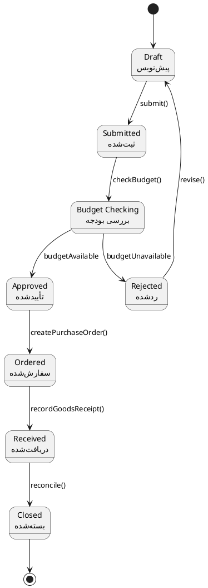
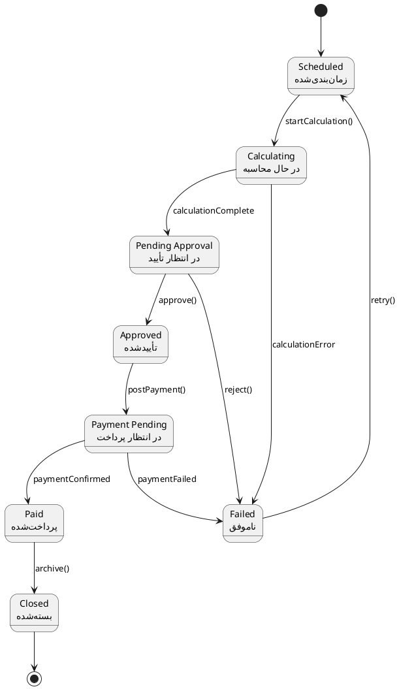
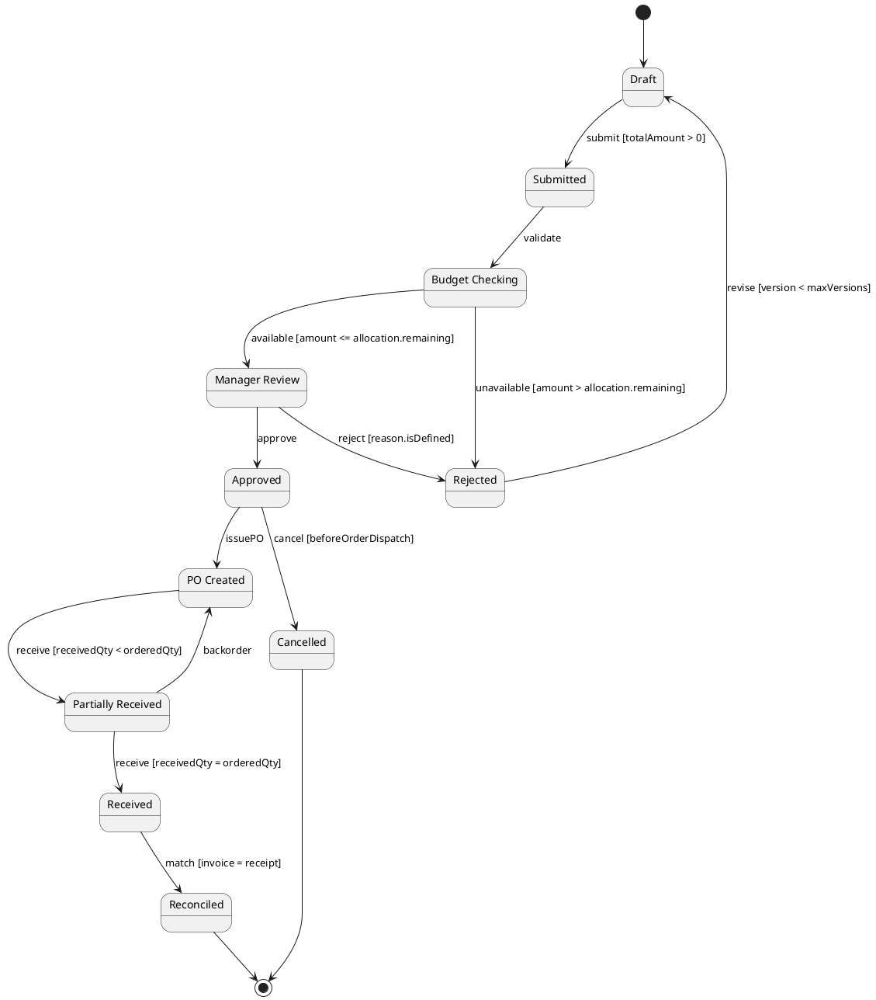
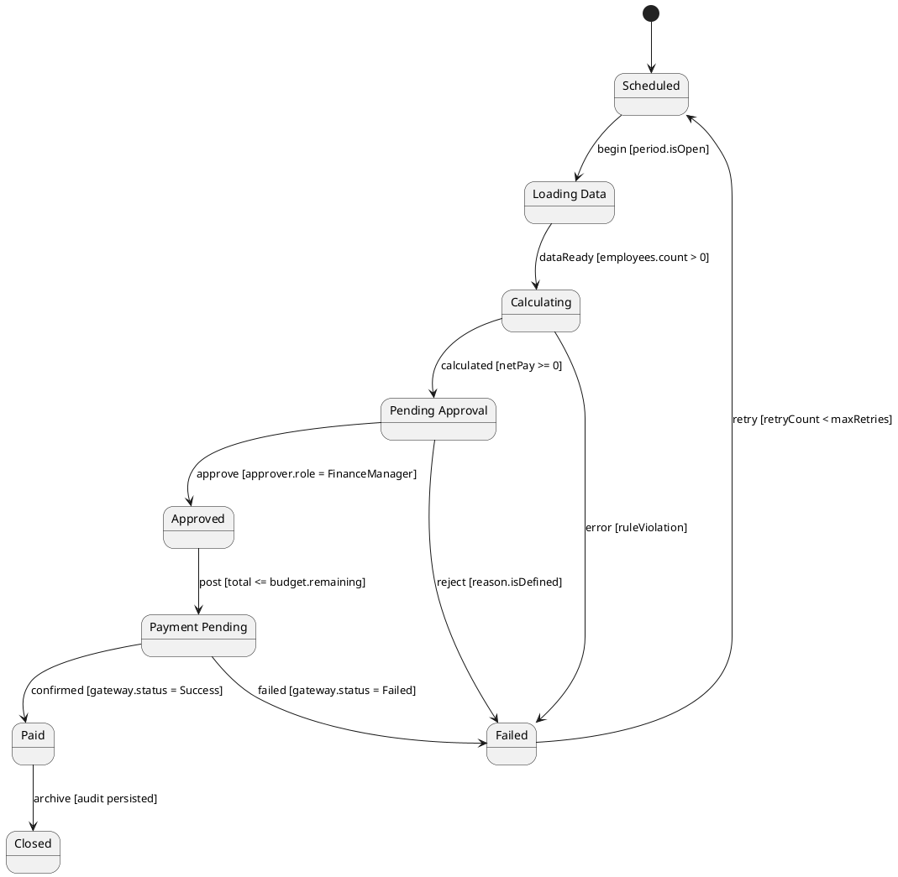

# نمودار ماشین حالت UML 2.5 — PurchaseRequest و PayrollRun

**دامنه:** سیستم یکپارچه مدیریت منابع انسانی، مالی و تدارکات  
**نسخه:** v1.0  
**تاریخ:** 2026-09-09

---

## ۱. هدف و قوانین‌گذاری

این سند چرخه‌های حالت `PurchaseRequest` و `PayrollRun` را در سه سطح انتزاع مدل‌سازی می‌کند. نام رویدادها، نگهبان‌ها و حالت‌ها با DFD و BPMN هم‌نام هستند.

---

## ۲. سطح ۱ — چشم‌انداز دامنه

### ۲.۱ ماشین حالت PurchaseRequest



**توضیح:** درخواست خرید از پیش‌نویس شروع می‌شود و پس از بررسی بودجه، تأیید، صدور سفارش، دریافت کالا و مغایرت‌گیری بسته می‌شود. رد درخواست امکان اصلاح و بازگشت به پیش‌نویس دارد. این چرخه با DFD-L2.4 و فعالیت‌های BPMN حوزه Procurement مطابقت دارد.

### ۲.۲ ماشین حالت PayrollRun



**توضیح:** اجرای حقوق مراحل زمان‌بندی، محاسبه، تأیید، پرداخت و بایگانه را طی می‌کند. خطاهای محاسبه، تأیید، پرداخت و بایگانی را طی می‌کند. خطا یا رد تأیید، اجرا را به حالت ناموفق می‌برد و با مجوز مجدد قابل تلاش است.

---

## ۳. سطح ۲ — طراحی و زیرسیستم

### ۳.۱ PurchaseRequest با رویدادها و نگهبان‌ها



**توضیح:** در این سطح، guardها مقدار درخواست، مانده `BudgetAllocation`، نسخه اصلاح و تطابق فاکتور با رسید را کنترل می‌کنند. دریافت ناقص به حالت `PartiallyReceived` می‌رود و کسری کالا می‌تواند سفارش جدید ایجاد کند. همه گذارهای مهم رویداد `AuditLog` تولید می‌کنند.

### ۳.۲ PayrollRun با رویدادها و نگهبان‌ها



**توضیح:** داده‌های پرسنلی و حضور از `Employee` و `PayrollLine` بارگذاری می‌شوند. نگهبان‌ها باز بودن دوره، مثبت بودن خالص پرداخت، نقش تأییدکننده و مانده بودجه را بررسی می‌کنند. متد `calculateSalary()` در گذار محاسبه و `postPayment()` در گذار پرداخت فراخوانی می‌شود.

---

## ۴. سطح ۳ — پیاده‌سازی، حالت‌های مرکب و تاریخچه

### ۴.۱ PurchaseRequest با Composite State و History

```plantuml
@startuml ARCH-L3-State-PurchaseRequest
hide empty_description
state "Draft" as Draft
state "Submitted" as Submitted
state "Validation" as Validation {
  state "Budget Check" as BudgetCheck
  state "Manager Review" as ManagerReview
  state "Compliance Check" as Compliance
  BudgetCheck --> ManagerReview : budgetOk
  ManagerReview --> Compliance : approved
  Compliance --> BudgetCheck : correctionRequired
}
state "Approved" as Approved
state "Ordered" as Ordered
state "Receiving" as Receiving {
  state "Awaiting Supplier" as Awaiting
  state "Partial Receipt" as Partial
  state "Quality Check" as Quality
  Awaiting --> Partial : shipmentReceived
  Partial --> Quality : qtyComplete
  Quality --> Awaiting : discrepancy
}
state "Reconciled" as Reconciled
state "Rejected" as Rejected
state H1 as H1 <<history>>
state H2 as H2 <<history>>

[*] --> Draft
Draft --> Submitted : submit()
Submitted --> Validation : validate()
Validation --> Approved : valid
Validation --> Rejected : invalid
Rejected --> H1 : revise()
H1 --> Validation
Approved --> Ordered : createPurchaseOrder()
Ordered --> Receiving : dispatchConfirmed()
Receiving --> Reconciled : receiptMatched()
Reconciled --> [*]
Receiving --> H2 : pause()
H2 --> Receiving
@enduml
```

**توضیح:** `Validation` و `Receiving` حالت‌های مرکب هستند؛ زیرحالت‌های داخلی، بررسی بودجه، تأیید مدیر، انطباق، انتظار تامین‌کننده، دریافت جزئی و کنترل کیفیت را جدا می‌کنند. `H1` آخرین زیرحالت اعتبارسنجی و `H2` آخرین زیرحالت دریافت را برای ادامه عملیات حفظ می‌کند. خطاهای انطباق و مغایرت کالا بدون از دست رفتن زمینه فرایند، مسیر اصلاح را فعال می‌کنند.

### ۴.۲ PayrollRun با Composite State و History

```plantuml
@startuml ARCH-L3-State-PayrollRun
hide empty_description
state "Scheduled" as Scheduled
state "Processing" as Processing {
  state "Load Employee Data" as Load
  state "Calculate Gross" as Gross
  state "Calculate Net Pay" as Net
  state "Apply Rules" as ApplyRules
  state "Generate Slip" as Generate
  Load --> Gross : dataLoaded
  Gross --> Net : rulesApplied
  Net --> Generate : netPay >= 0
  Generate --> Load : correctionRequired
}
state "Pending Approval" as PendingApproval
state "Approved" as Approved
state "Payment" as Payment {
  state "Create Payment" as Create
  state "Gateway Call" as Gateway
  state "Confirmation" as Confirmation
  Create --> Gateway : paymentCreated
  Gateway --> Confirmation : requestSent
  Confirmation --> Create : retryableFailure
}
state "Paid" as Paid
state "Failed" as Failed
state "Closed" as Closed
state H as H <<history>>

[*] --> Scheduled
Scheduled --> Processing : start()
Processing --> PendingApproval : calculationComplete
PendingApproval --> Approved : approve()
PendingApproval --> Failed : reject()
Approved --> Payment : postPayment()
Payment --> Paid : confirmed()
Paid --> Closed : archive()
Processing --> H : suspend()
H --> Processing
Failed --> Scheduled : retry()
@enduml
```

**توضیح:** `Processing` عملیات بارگذاری، محاسبه ناخالص، اعمال قوانین و تولید فیش را دربر می‌گیرد. `Payment` ساخت `Payment`، فراخوانی درگاه و دریافت تأییدیه را مدل‌سازی می‌کند. `H` امکان توقف موقت و ادامه از آخرین زیرحالت را فراهم می‌سازد. خطاهای قابل重试 تا `maxRetries` و خطاهای قانونی مستقیماً به `Failed` می‌روند.

---

## ۵. نگهبان‌ها، عملیات ورودی/خروجی و استثناها

| شناسه | حالت/گذار | نگهبان یا عملیات | نتیجه و خطا |
|---|---|---|---|
| ST-PR-01 | Draft → Submitted | `totalAmount > 0` و `requester.isActive` | در غیر این صورت `ValidationException` |
| ST-PR-02 | Budget Check → Manager Review | `amount <= BudgetAllocation.remaining` | در غیر این صورت `InsufficientBudgetException` |
| ST-PR-03 | Manager Review → Approved | `approver.authorizationLevel >= requiredLevel` | در غیر این صورت `AuthorizationException` |
| ST-PR-04 | Receiving → Reconciled | `receivedQty = orderedQty` و `invoice.amount = receipt.amount` | ایجاد `DiscrepancyReport` |
| ST-PAY-01 | Processing → Pending Approval | `calculateSalary()` بدون نقض قانون و `netPay >= 0` | ایجاد `CalculationException` |
| ST-PAY-02 | Pending Approval → Approved | `approver.role = FinanceManager` | ایجاد `ApprovalRejectedException` |
| ST-PAY-03 | Payment → Paid | `gateway.status = Success` | خطای درگاه به `Failed` یا retry می‌رود |
| ST-PAY-04 | Paid → Closed | `AuditLog` پایدار شده باشد | خطای بایگانی مانع بستن اجرا می‌شود |

---

## ۶. ردپا به DFD و BPMN

| شناسه State Machine | فرایند DFD | فعالیت BPMN | موجودیت/متد UML |
|---|---|---|---|
| PurchaseRequest Draft/Submitted | DFD-L2.4 Procurement | Create PurchaseRequest | `PurchaseRequest.submit()` |
| Budget Check | DFD-L3.2 Purchase-Request Approval | Check Budget | `Budget.checkBudget()` |
| Ordered/Receiving | DFD-L2.4 و DFD-L2.5 | Issue PO / Record Goods Receipt | `PurchaseOrder`, `GoodsReceipt` |
| PayrollRun Processing | DFD-L2.2 و DFD-L3.1 | Calculate Salary | `PayrollRun.calculateSalary()` |
| PayrollRun Payment | DFD-L2.2 و DFD-L2.3 | Post Payment | `Payment.postPayment()` |
| Reconciled/Closed | DFD-L2.6 Reporting | Generate Report | `Report.generateReport()` |

---

## ۷. قواعد یکپارچگی

1. هر گذار وضعیت باید یک رویداد قابل ردیابی در `AuditLog` ایجاد کند.
2. هیچ `PurchaseOrder` بدون گذار `Approved` و تأیید بودجه صادر نمی‌شود.
3. هیچ `Payment` بدون `PayrollRun` در حالت `Approved` ایجاد نمی‌شود.
4. وضعیت‌های `Paid` و `Reconciled` غیرقابل بازگشت هستند و هرگونه جبران خطای `Closed` نیازمند عملیات مدیریتی و رویداد ممیزی جداگانه است.
5. `History` فقط آخرین زیرحالت معتبر را بازیابی می‌کند و اجازه عبور از تأیید بودجه را نمی‌دهد.

---

*پایان سند*
