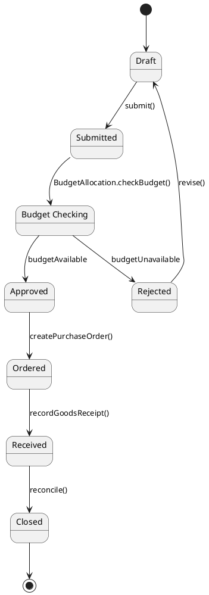
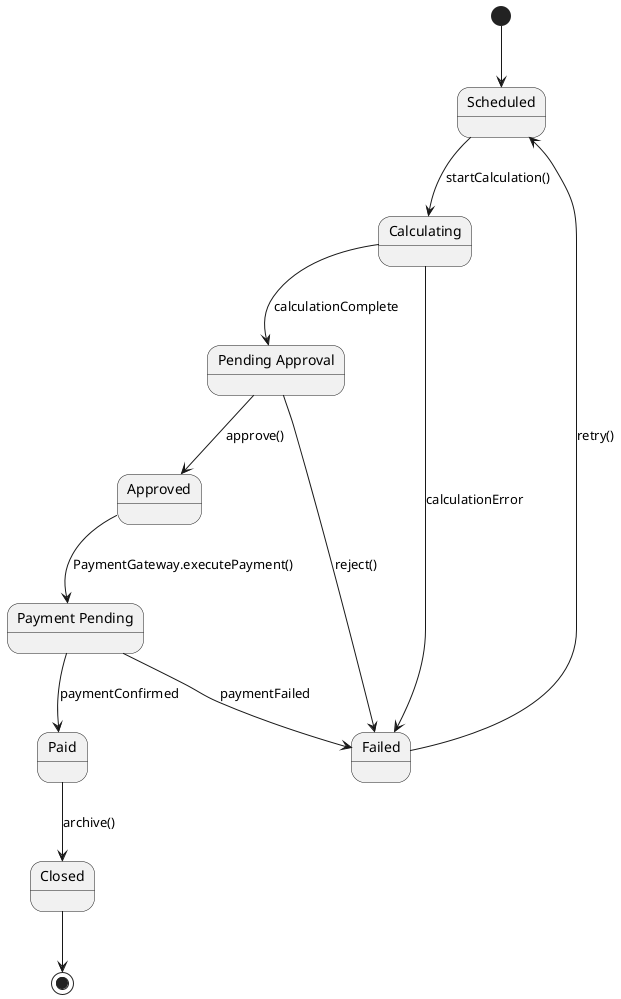
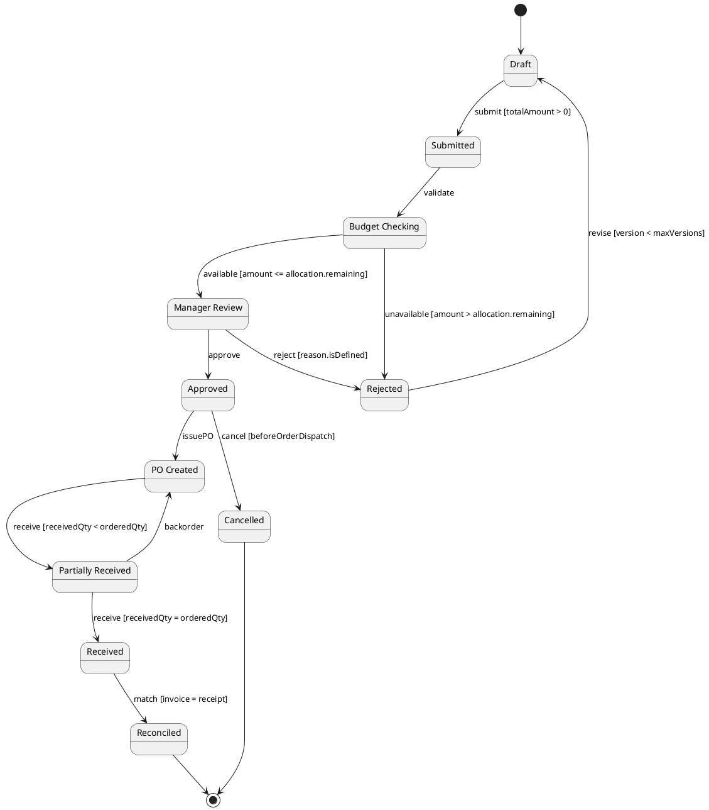
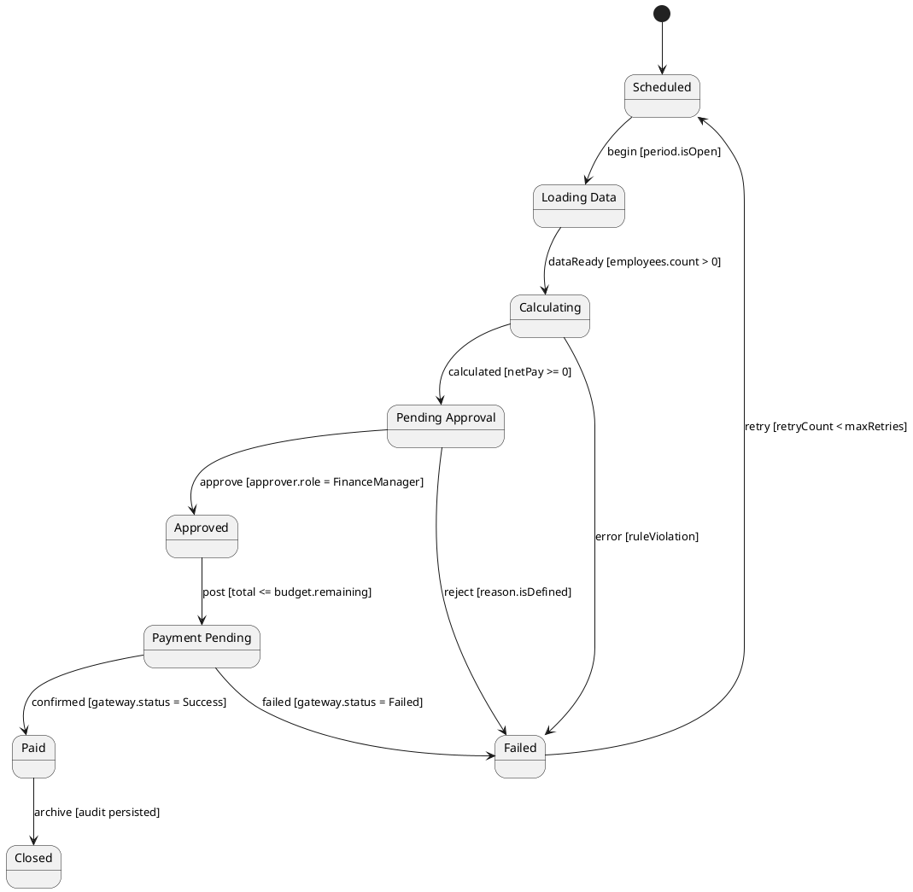
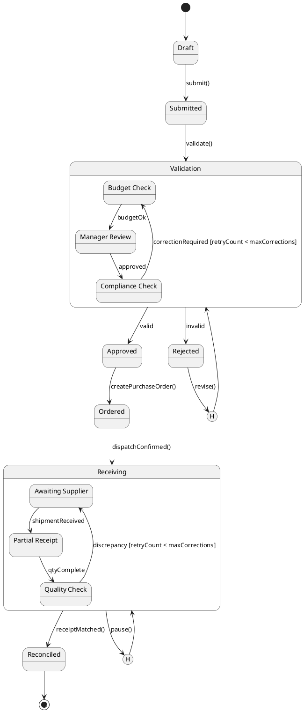
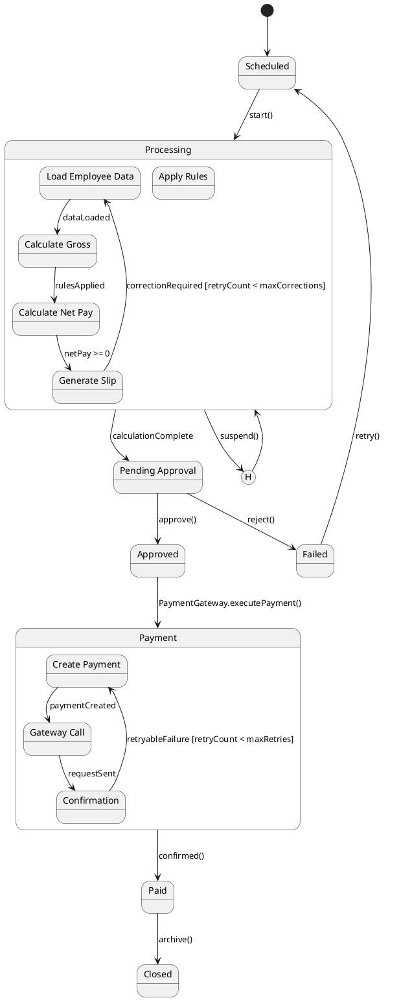

# UML 2.5 State Machine Diagram — PurchaseRequest and PayrollRun

**Domain:** Integrated human resources, finance, and procurement management system  
**Version:** v1.0  
**Date:** 2026-09-09

---

## 1. Purpose and Governance

This document models the state cycles of `PurchaseRequest` and `PayrollRun` at three levels of abstraction. Event, guard, and state names are aligned with the DFD and BPMN models.

---

## 2. Level 1 — Domain Overview

### 2.1 PurchaseRequest State Machine

**Explanation:** A purchase request starts in Draft and, after budget checking, approval, purchase-order creation, goods receipt, and reconciliation, reaches Closed. A rejected request can be revised and returned to Draft. This cycle aligns with DFD-L2.4 and the BPMN activities in the Procurement domain.

### 2.2 PayrollRun State Machine

**Explanation:** A payroll run proceeds through scheduling, calculation, approval, payment, and archival. Calculation, approval, payment, and archival errors move the run to Failed; a rejected approval also moves it to Failed, and it can be retried with renewed authorization.

---

## 3. Level 2 — Design and Subsystems

### 3.1 PurchaseRequest with Events and Guards

**Explanation:** At this level, guards control the request amount, the `BudgetAllocation` balance, the revision version, and invoice-to-receipt matching. A partial receipt enters `PartiallyReceived`, and a stock shortage can create a new order. All important transitions generate an `AuditLog` event.

### 3.2 PayrollRun with Events and Guards

**Explanation:** Personnel and attendance data are loaded from `Employee` and `PayrollLine`. Guards check whether the period is open, net pay is non-negative, the approver's role, and the budget balance. The `calculateSalary()` method is called during the calculation transition, and `PaymentGateway.executePayment()` is called during the payment transition.

---

## 4. Level 3 — Implementation, Composite States, and History

### 4.1 PurchaseRequest with Composite States and History

**Explanation:** `Validation` and `Receiving` are composite states; their internal substates separate budget checking, manager approval, compliance, supplier waiting, partial receipt, and quality control. `H1` retains the last validation substate and `H2` retains the last receiving substate so processing can resume. Compliance errors and goods discrepancies trigger correction paths without losing process context.

### 4.2 PayrollRun with Composite States and History

**Explanation:** `Processing` covers loading, gross-pay calculation, rule application, and slip generation. `Payment` models payment creation, gateway invocation, and confirmation. `H` enables suspension and resumption from the last substate. Retryable errors may be retried up to `maxRetries`; rule violations go directly to `Failed`.

---

## 5. Guards, Input/Output Operations, and Exceptions

| ID | State/Transition | Guard or Operation | Result and Error |
|---|---|---|---|
| ST-PR-01 | Draft → Submitted | `totalAmount > 0` and `requester.isActive` | Otherwise `ValidationException` |
| ST-PR-02 | Budget Check → Manager Review | `amount <= BudgetAllocation.remaining` | Otherwise `InsufficientBudgetException` |
| ST-PR-03 | Manager Review → Approved | `approver.authorizationLevel >= requiredLevel` | Otherwise `AuthorizationException` |
| ST-PR-04 | Receiving → Reconciled | `receivedQty = orderedQty` and `invoice.amount = receipt.amount` | Creates `DiscrepancyReport` |
| ST-PAY-01 | Processing → Pending Approval | `calculateSalary()` completes without a rule violation and `netPay >= 0` | Creates `CalculationException` |
| ST-PAY-02 | Pending Approval → Approved | `approver.role = FinanceManager` | Creates `ApprovalRejectedException` |
| ST-PAY-03 | Payment → Paid | `gateway.status = Success` | Gateway error goes to `Failed` or is retried |
| ST-PAY-04 | Paid → Closed | `AuditLog` persisted | Archival error prevents run closure |

---

## 6. Traceability to DFD and BPMN

| State Machine ID | DFD Process | BPMN Activity | UML Entity/Method |
|---|---|---|---|
| PurchaseRequest Draft/Submitted | DFD-L2.4 Procurement | Create PurchaseRequest | `PurchaseRequest.submit()` |
| Budget Check | DFD-L3.2 Purchase-Request Approval | Check Budget | `BudgetAllocation.checkBudget()` |
| Ordered/Receiving | DFD-L2.4 and DFD-L2.5 | Issue PO / Record Goods Receipt | `PurchaseOrder`, `GoodsReceipt`, `StockLot.allocate()` / `allocateStock()` |
| PayrollRun Processing | DFD-L2.2 and DFD-L3.1 | Calculate Salary | `PayrollRun.calculateSalary()` |
| PayrollRun Payment | DFD-L2.2 and DFD-L2.3 | Post Payment | `PaymentGateway.executePayment()` |
| Reconciled/Closed | DFD-L2.6 Reporting | Generate Report | `ReportEngine.generateReport()` |

---

## 7. Integrity Rules

1. Every state transition must create a traceable event in `AuditLog`.
2. No `PurchaseOrder` is issued without the `Approved` transition and budget approval.
3. No `Payment` is created without `PayrollRun` being in the `Approved` state.
4. The `Paid` and `Reconciled` states are irreversible; any compensation for a `Closed` error requires a separate administrative operation and audit event.
5. `History` restores only the last valid substate and does not allow budget approval to be bypassed.

---

*End of document*
