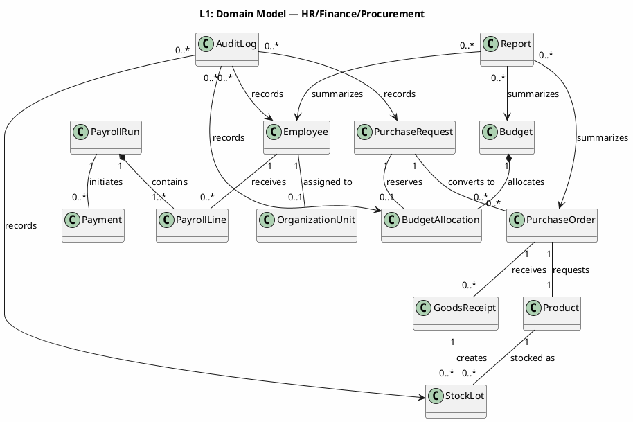
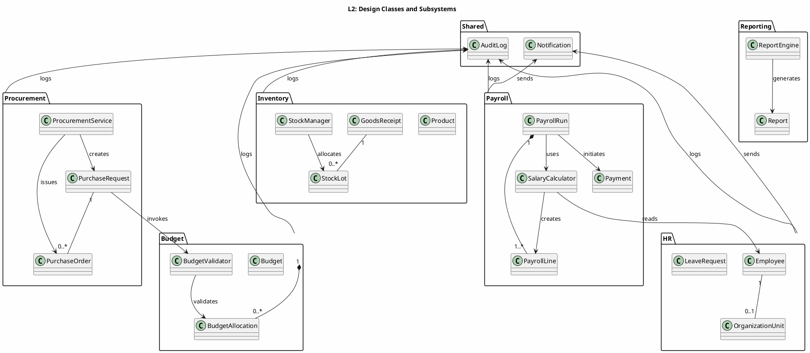
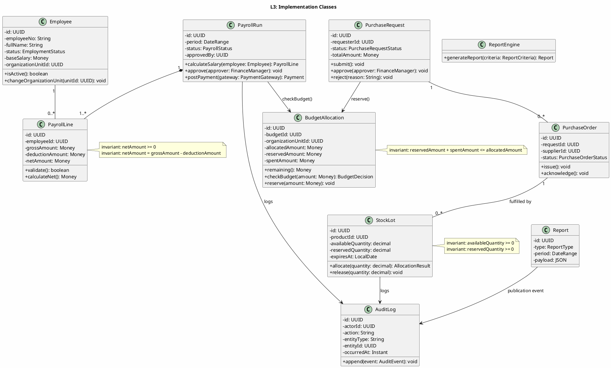
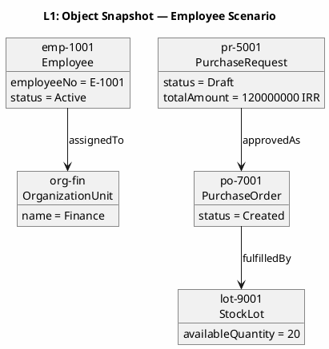
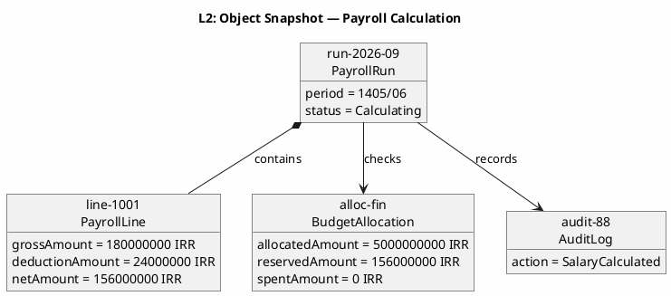
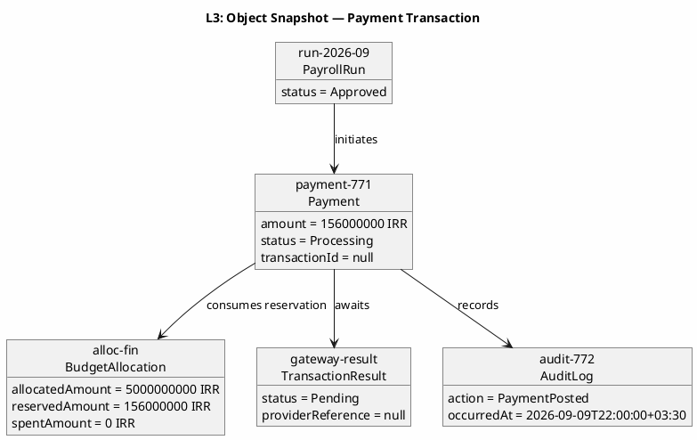
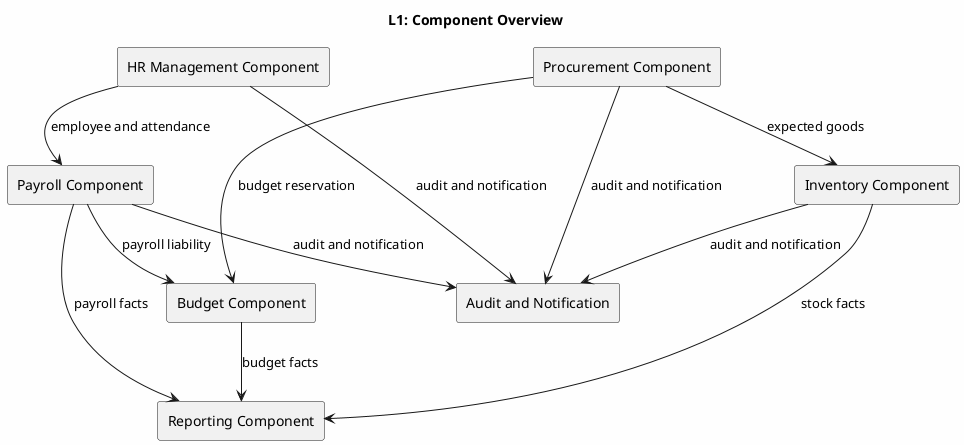
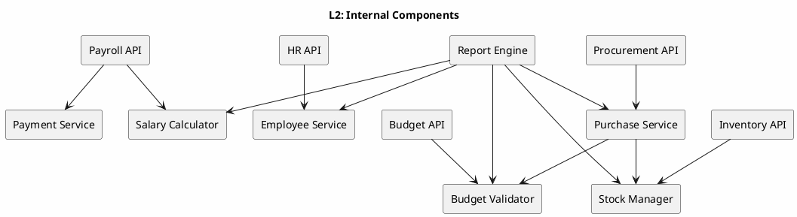
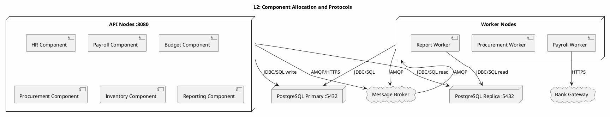
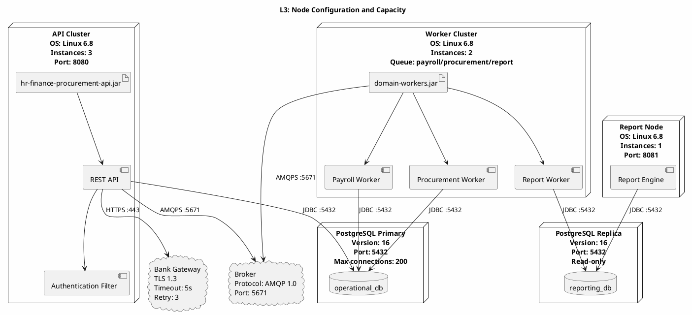

# UML 2.5 Structural Diagrams — Class, Object, Component, Deployment

**Title:** UML 2.5 Structural Diagrams — Integrated HR/Finance/Procurement System
**Version:** v1.0
**Date:** 2026-09-09

---

## 1. Introduction and Conventions

This document presents four types of UML 2.5 structural diagrams at three levels of abstraction:

- **Level 1:** Domain and System Context
- **Level 2:** Design and Subsystems
- **Level 3:** Implementation Details, Signatures, Constraints, and Deployment

Key entities are `Employee`, `OrganizationUnit`, `PayrollRun`, `PayrollLine`, `Budget`, `BudgetAllocation`, `PurchaseRequest`, `PurchaseOrder`, `Product`, `StockLot`, `GoodsReceipt`, `Payment`, `Report`, and `AuditLog`.

---

## 2. Class Diagram — Type 1

### 2.1 Level 1 — Domain Model



**Description:** The domain model shows core entities and their semantic relationships without technical details. Each `PayrollRun` consists of multiple `PayrollLine` items, and each `Budget` can have multiple `BudgetAllocation` items. A `PurchaseRequest` converts to a `PurchaseOrder` upon approval, and a goods receipt creates `StockLot` items. `Report` and `AuditLog` maintain cross-domain observation and audit relationships.

### 2.2 Level 2 — Subsystem Design



**Description:** Design classes define subsystem boundaries and specialized services. `SalaryCalculator` performs calculations only, `BudgetValidator` checks validity, and `StockManager` handles stock allocation. `ProcurementService` coordinates requests and orders, and `ReportEngine` produces analytical output. `AuditLog` and `Notification` are shared services across all domains.

### 2.3 Level 3 — Implementation Classes



**Description:** At the implementation level, private data and public service operations are shown. `calculateSalary()` returns a `PayrollLine`, `checkBudget()` produces a `BudgetDecision`, and `allocate()` on `StockLot` models the entity operation with `allocateStock()` as the service alias. Constraints enforce non-negative net amount, remaining budget, and allocatable stock. Errors for invalid amounts, budget shortfalls, and over-allocation must be reported to the calling service.

---

## 3. Object Diagram — Type 2

### 3.1 Level 1 — Domain Snapshot



**Description:** This snapshot shows an active employee, the Finance unit, a draft purchase request, a created order, and a stock lot in a single scenario. Values represent sample semantic links between objects and do not execute calculation or payment behavior. This view is consistent with the Level 1 class domain model.

### 3.2 Level 2 — Mid-Process Snapshot



**Description:** The `PayrollRun` object is mid-calculation and the `PayrollLine` holds gross, deduction, and net amounts. `BudgetAllocation` shows the reserved amount for payment, and `AuditLog` has recorded the calculation event. This moment relates to `calculateSalary()` and `checkBudget()` in the Level 3 class diagram.

### 3.3 Level 3 — Critical Financial Transaction Snapshot



**Description:** This snapshot shows a moment where `Payment` has been created but bank confirmation has not yet been received. `transactionId` and `providerReference` are still null, and statuses remain `Processing` and `Pending`. After bank confirmation, the payment status changes to `Paid`, the budget reservation moves to `spentAmount`, and the final event is recorded in `AuditLog`.

---

## 4. Component Diagram — Type 3

### 4.1 Level 1 — Top-Level Components



**Description:** Top-level components show logical boundaries for HR, Payroll, Budget, Procurement, Inventory, and Reporting. The shared component manages audit events and notifications. Inter-component flows align with DFD-L1 flows and BPMN-L1 lanes.

### 4.2 Level 2 — Subcomponents



**Description:** Each top-level component decomposes into API, domain service, and specialized engine. `Salary Calculator` performs payroll calculation, `Budget Validator` checks validity, `Purchase Service` handles the request and order lifecycle, and `Stock Manager` handles stock allocation. `Report Engine` uses domain services to build reports.

### 4.3 Level 3 — Provided and Required Interfaces

```plantuml
@startuml ARCH-L3-Component
skinparam backgroundColor #FEFEFE
skinparam componentStyle rectangle

title L3: Provided and Required Interfaces

interface "IPayrollService" as IPay {
  +calculateSalary(employeeId: UUID, period: DateRange): PayrollLine
  +approveRun(runId: UUID, approverId: UUID): void
}
interface "IBudgetService" as IBud {
  +checkBudget(allocationId: UUID, amount: Money): BudgetDecision
  +reserve(allocationId: UUID, amount: Money): Reservation
}
interface "IProcurementService" as IProc {
  +createPurchaseRequest(command: CreatePRCommand): PurchaseRequest
  +approveRequest(requestId: UUID): void
  +issuePurchaseOrder(requestId: UUID): PurchaseOrder
}
interface "IInventoryService" as IInv {
  +recordGoodsReceipt(command: RecordGRCommand): GoodsReceipt
  +allocateStock(lotId: UUID, quantity: decimal): AllocationResult
}
interface "IReportService" as IRep {
  +generateReport(criteria: ReportCriteria): Report
}
interface "IAuditService" as IAudit {
  +append(event: AuditEvent): void
}

component "Payroll Adapter" as PA
component "Salary Calculator" as CALC
component "Budget Adapter" as BA
component "Budget Validator" as VALID
component "Procurement Adapter" as PCA
component "Purchase Service" as PUR
component "Inventory Adapter" as IA
component "Stock Manager" as STOCK
component "Report Engine" as REP
component "Audit Logger" as AUD

PA ..|> IPay
CALC ..|> IPay
BA ..|> IBud
VALID ..|> IBud
PCA ..|> IProc
PUR ..|> IProc
IA ..|> IInv
STOCK ..|> IInv
REP ..|> IRep
AUD ..|> IAudit

CALC ..> IBud : required
PUR ..> IBud : required
PUR ..> IInv : required
REP ..> IPay : required
REP ..> IBud : required
REP ..> IProc : required
REP ..> IInv : required
PUR ..> IAudit : required
CALC ..> IAudit : required
STOCK ..> IAudit : required

@enduml
```

**Description:** Provided interfaces specify each component's callable contracts. `IPayrollService.calculateSalary()`, `IBudgetService.checkBudget()`, `IProcurementService.approveRequest()`, `IInventoryService.allocateStock()`, and `IReportService.generateReport()` share names with BPMN and DFD. Required interfaces show inter-component dependencies and the `AuditLog` registration point.

---

## 5. Deployment Diagram — Type 4

### 5.1 Level 1 — Physical Nodes

```plantuml
@startuml ARCH-L1-Deployment
skinparam backgroundColor #FEFEFE
skinparam deploymentStyle rectangle

title L1: Deployment Overview

node "Client Devices" as CLIENT {
  device "Browser / Mobile" as BROWSER
}

node "Application Cluster" as APP {
  component "HR/Finance/Procurement API" as API
  component "Background Workers" as WORKER
}

node "Database Cluster" as DB {
  database "Primary Database" as PRIMARY
  database "Read Replica" as REPLICA
}

node "Reporting Node" as REPORT_NODE {
  component "Report Engine" as REPORT
}

node "External Services" as EXT {
  cloud "Bank/Payment Gateway" as BANK
  cloud "Notification Provider" as NOTIFY
}

BROWSER --> API : HTTPS
API --> PRIMARY : SQL
API --> REPLICA : read SQL
WORKER --> PRIMARY : SQL
REPORT --> REPLICA : read SQL
API --> BANK : HTTPS/API
API --> NOTIFY : HTTPS/Webhook

@enduml
```

**Description:** Primary nodes include clients, the application cluster, the database cluster, and the reporting node. Banking and notification services are modeled as external services. Report reads use the `Read Replica` to reduce load on operational transactions.

### 5.2 Level 2 — Component Allocation and Protocols



**Description:** API components deploy on `:8080` nodes with writes to PostgreSQL Primary and reads from Replica. Workers process long-running payroll, procurement, and reporting operations. The `Message Broker` decouples async messages and retries, and bank communication uses HTTPS.

### 5.3 Level 3 — Node Configuration and Capacity



**Description:** Level 3 configuration specifies OS version, instance counts, ports, PostgreSQL version, connection limits, and bank timeout. API has three instances, Worker has two, and Report has one. Operational transactions connect to Primary and reports to Replica. Bank timeout is five seconds with a maximum of three retries.

---

## 6. Traceability and Integrity Rules

| Diagram | Level 1 | Level 2 | Level 3 |
|---|---|---|---|
| Class | Domain Model | Subsystems and Services | Signatures, Visibility, and Invariants |
| Object | Overview Scenario | Mid-Calculation | Payment Transaction |
| Component | Domain Components | Subcomponents | Provided/Required Interfaces |
| Deployment | Physical Nodes | Allocation and Protocols | OS, Version, Port, and Capacity |

1. The name `calculateSalary()` is consistent across Class, Component, Sequence, and BPMN diagrams.
2. `checkBudget()` always reads `BudgetAllocation` and creates a reservation upon approval.
3. `allocateStock()` executes only on a valid `StockLot` with allocatable quantity.
4. `generateReport()` does not write to operational data and produces a `Report`.
5. All significant changes are tracked via `AuditLog` and all notifications via `Notification`.

*End of Document*