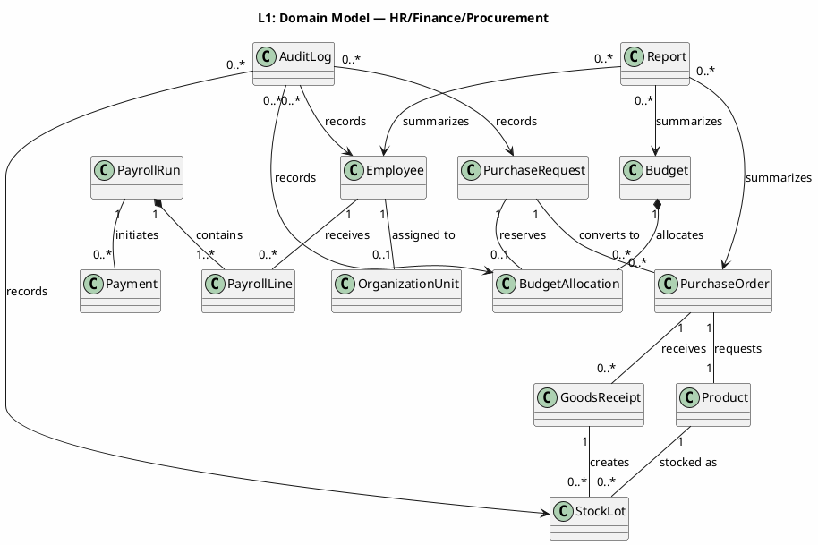
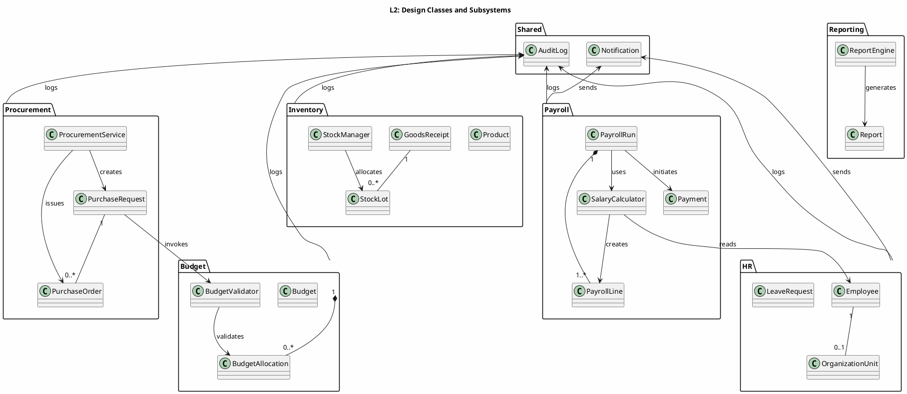
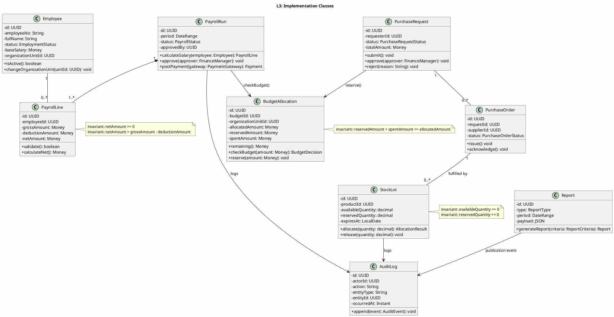
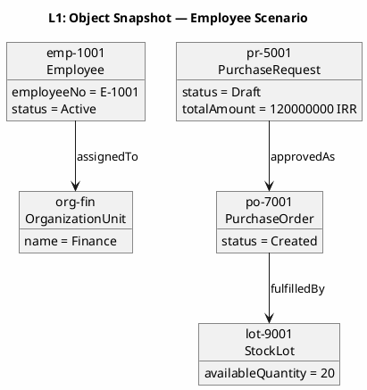
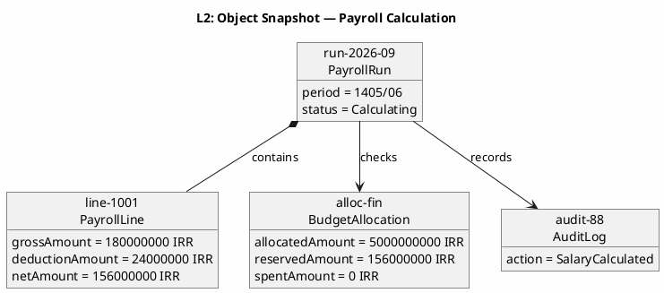
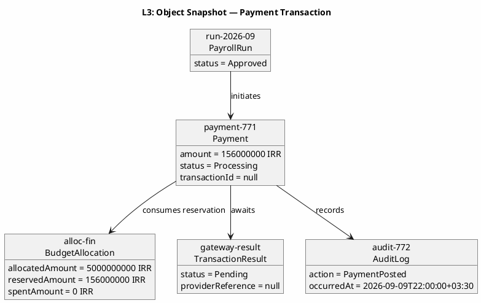
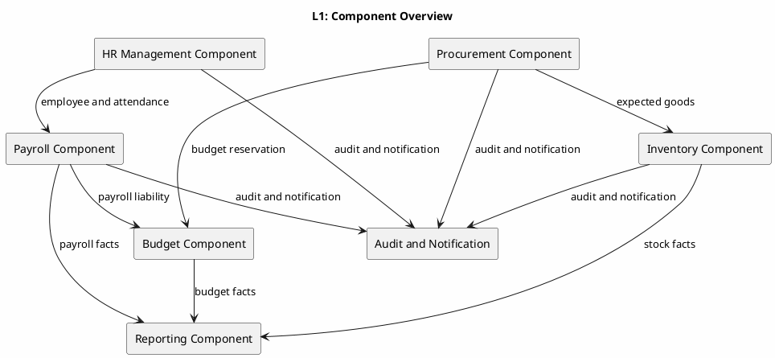
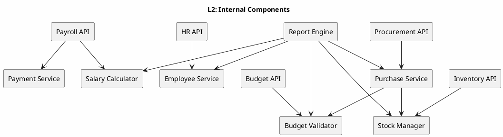
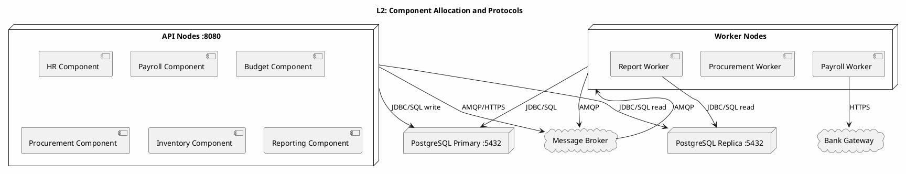
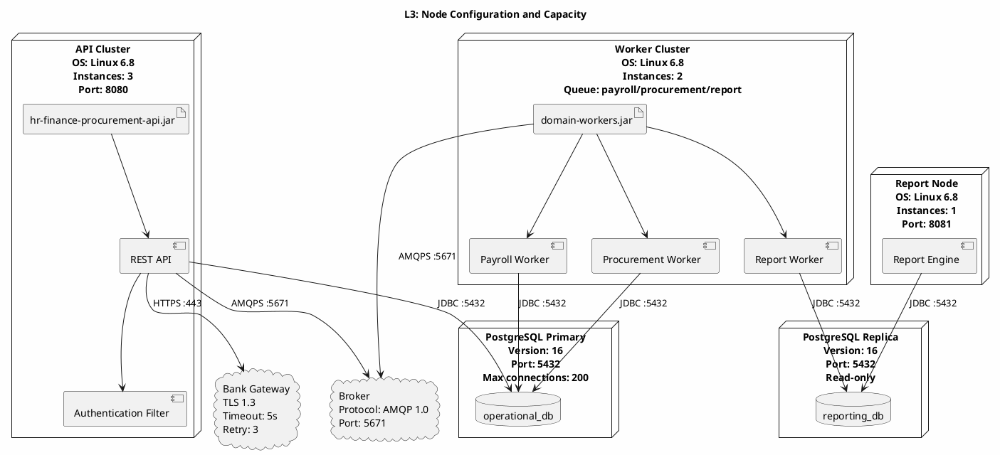

# UML 2.5 Structural Diagrams — Class, Object, Component, Deployment

**عنوان:** UML 2.5 Structural Diagrams — سیستم یکپارچه HR/Finance/Procurement  
**نسخه:** v1.0  
**تاریخ:** 2026-09-09

---

## ۱. مقدمه و قراردادها

این سند چهار نوع نمودار ساختاری UML 2.5 را در سه سطح انتزاع ارائه می‌کند:

- **سطح ۱:** دامنه و چشم‌انداز سیستم
- **سطح ۲:** طراحی و زیرسیستم‌ها
- **سطح ۳:** جزییات پیاده‌سازی، امضاها، قیود و استقرار

نام‌های اصلی عبارت‌اند از `Employee`، `OrganizationUnit`، `PayrollRun`، `PayrollLine`، `Budget`، `BudgetAllocation`، `PurchaseRequest`، `PurchaseOrder`، `Product`، `StockLot`، `GoodsReceipt`، `Payment`، `Report` و `AuditLog`.

---

## ۲. نمودار کلاس — نوع ۱

### ۲.۱ سطح ۱ — مدل دامنه



**توضیح:** مدل دامنه موجودیت‌های اصلی و روابط معنایی آن‌ها را بدون جزییات فناوری نشان می‌دهد. هر `PayrollRun` از چند `PayrollLine` تشکیل می‌شود و هر `Budget` می‌تواند چند `BudgetAllocation` داشته باشد. `PurchaseRequest` پس از تأیید به `PurchaseOrder` تبدیل می‌شود و رسید کالا، `StockLot` تولید می‌کند. `Report` و `AuditLog` روابط مشاهده‌ای و ممیزی چند حوزه را نگهداری می‌کنند.

### ۲.۲ سطح ۲ — طراحی زیرسیستم‌ها



**توضیح:** کلاس‌های طراحی، مرز زیرسیستم‌ها و خدمات تخصصی را مشخص می‌کنند. `SalaryCalculator` فقط محاسبه می‌کند، `BudgetValidator` اعتبار را بررسی می‌کند و `StockManager` تخصیص موجودی را انجام می‌دهد. `ProcurementService` درخواست و سفارش را هماهنگ می‌کند و `ReportEngine` خروجی تحلیلی تولید می‌کند. `AuditLog` و `Notification` خدمات مشترک بین همه حوزه‌ها هستند.

### ۲.۳ سطح ۳ — کلاس‌های پیاده‌سازی



**توضیح:** در سطح پیاده‌سازی، دیدگاه_private_ داده‌ها و عملیات_public_ سرویس‌ها نمایش داده شده‌اند. `calculateSalary()` یک `PayrollLine` برمی‌گرداند، `checkBudget()` یک `BudgetDecision` تولید می‌کند و `allocateStock()` در کلاس `StockLot` به‌صورت `allocate()` مدل شده است. قیدها مقدار خالص غیرمنفی، باقی‌مانده بودجه و موجودی قابل تخصیص را کنترل می‌کنند. خطاهای مقدار نامعتبر، کمبود بودجه و تخصیص بیش از موجودی باید به سرویس فراخوانی‌کننده گزارش شوند.

---

## ۳. نمودار شیء — نوع ۲

### ۳.۱ سطح ۱ — نمونه دامنه



**توضیح:** این نمونه یک کارمند فعال، واحد مالی، یک درخواست خرید پیش‌نویس، سفارش ایجادشده و لات موجودی را در یک سناریوی کلی نشان می‌دهد. مقادیر، نمونه‌ای از ارتباط معنایی بین اشیاء هستند و رفتار محاسبه یا پرداخت را اجرا نمی‌کنند. این نما با مدل دامنه سطح ۱ کلاس هم‌خوان است.

### ۳.۲ سطح ۲ — نمونه میانه فرایند



**توضیح:** شیء `PayrollRun` در میانه محاسبه قرار دارد و `PayrollLine` مقادیر ناخالص، کسورات و خالص را نگهداری می‌کند. `BudgetAllocation` مقدار رزروشده برای پرداخت را نشان می‌دهد و `AuditLog` رویداد محاسبه را ثبت کرده است. این لحظه با `calculateSalary()` و `checkBudget()` در سطح ۳ کلاس مرتبط است.

### ۳.۳ سطح ۳ — نمونه تراکنش مالی بحرانی



**توضیح:** این نمونه لحظه‌ای را نشان می‌دهد که `Payment` ایجاد شده اما تأییدیه بانک هنوز دریافت نشده است. `transactionId` و `providerReference` هنوز تهی هستند و وضعیت‌ها `Processing` و `Pending` باقی مانده‌اند. پس از تأیید بانک، وضعیت پرداخت به `Paid` تغییر می‌کند، رزرو بودجه به `spentAmount` منتقل می‌شود و رویداد نهایی در `AuditLog` ثبت می‌گردد.

---

## ۴. نمودار مؤلفه — نوع ۳

### ۴.۱ سطح ۱ — مؤلفه‌های سطح بالا



**توضیح:** مؤلفه‌های سطح بالا مرزهای منطقی HR، حقوق، بودجه، خرید، انبار و گزارش‌گیری را نشان می‌دهند. مؤلفه مشترک، رویدادهای ممیزی و اعلان‌ها را مدیریت می‌کند. جریان‌های بین مؤلفه‌ها با جریان‌های DFD-L1 و Laneهای BPMN-L1 مطابقت دارند.

### ۴.۲ سطح ۲ — زیرمؤلفه‌ها



**توضیح:** هر مؤلفه سطح بالا به API، سرویس دامنه و موتور تخصصی تجزیه شده است. `Salary Calculator` عملیات محاسبه حقوق، `Budget Validator` بررسی اعتبار، `Purchase Service` چرخه درخواست و سفارش، و `Stock Manager` تخصیص موجودی را انجام می‌دهد. `Report Engine` از سرویس‌های دامنه برای ساخت گزارش استفاده می‌کند.

### ۴.۳ سطح ۳ — رابط‌ها و وابستگی‌ها

```plantuml
@startuml ARCH-L3-Component
skinparam backgroundColor #FEFEFE
skinparam componentStyle rectangle

title L3: Provided and Required Interfaces

interface "IPayrollService" as IPay {
  +calculateSalary(employeeId: UUID, period: DateRange): PayrollLine
  +approveRun(runId: UUID, approverId: UUID): void
}
interface "IBudgetService" as IBud {
  +checkBudget(allocationId: UUID, amount: Money): BudgetDecision
  +reserve(allocationId: UUID, amount: Money): Reservation
}
interface "IProcurementService" as IProc {
  +createPurchaseRequest(command: CreatePRCommand): PurchaseRequest
  +approveRequest(requestId: UUID): void
  +issuePurchaseOrder(requestId: UUID): PurchaseOrder
}
interface "IInventoryService" as IInv {
  +recordGoodsReceipt(command: RecordGRCommand): GoodsReceipt
  +allocateStock(lotId: UUID, quantity: decimal): AllocationResult
}
interface "IReportService" as IRep {
  +generateReport(criteria: ReportCriteria): Report
}
interface "IAuditService" as IAudit {
  +append(event: AuditEvent): void
}

component "Payroll Adapter" as PA
component "Salary Calculator" as CALC
component "Budget Adapter" as BA
component "Budget Validator" as VALID
component "Procurement Adapter" as PCA
component "Purchase Service" as PUR
component "Inventory Adapter" as IA
component "Stock Manager" as STOCK
component "Report Engine" as REP
component "Audit Logger" as AUD

PA ..|> IPay
CALC ..|> IPay
BA ..|> IBud
VALID ..|> IBud
PCA ..|> IProc
PUR ..|> IProc
IA ..|> IInv
STOCK ..|> IInv
REP ..|> IRep
AUD ..|> IAudit

CALC ..> IBud : required
PUR ..> IBud : required
PUR ..> IInv : required
REP ..> IPay : required
REP ..> IBud : required
REP ..> IProc : required
REP ..> IInv : required
PUR ..> IAudit : required
CALC ..> IAudit : required
STOCK ..> IAudit : required

@enduml
```

**توضیح:** رابط‌های ارائه‌شده، قراردادهای قابل فراخوانی هر مؤلفه را مشخص می‌کنند. `IPayrollService.calculateSalary()`، `IBudgetService.checkBudget()`، `IProcurementService.approveRequest()`، `IInventoryService.allocateStock()` و `IReportService.generateReport()` نام‌های مشترک با BPMN و DFD دارند. رابط‌های موردنیاز، وابستگی‌های بین مؤلفه‌ها و نقطه ثبت `AuditLog` را نشان می‌دهند.

---

## ۵. نمودار استقرار — نوع ۴

### ۵.۱ سطح ۱ — گره‌های فیزیکی

```plantuml
@startuml ARCH-L1-Deployment
skinparam backgroundColor #FEFEFE
skinparam deploymentStyle rectangle

title L1: Deployment Overview

node "Client Devices" as CLIENT {
  device "Browser / Mobile" as BROWSER
}

node "Application Cluster" as APP {
  component "HR/Finance/Procurement API" as API
  component "Background Workers" as WORKER
}

node "Database Cluster" as DB {
  database "Primary Database" as PRIMARY
  database "Read Replica" as REPLICA
}

node "Reporting Node" as REPORT_NODE {
  component "Report Engine" as REPORT
}

node "External Services" as EXT {
  cloud "Bank/Payment Gateway" as BANK
  cloud "Notification Provider" as NOTIFY
}

BROWSER --> API : HTTPS
API --> PRIMARY : SQL
API --> REPLICA : read SQL
WORKER --> PRIMARY : SQL
REPORT --> REPLICA : read SQL
API --> BANK : HTTPS/API
API --> NOTIFY : HTTPS/Webhook

@enduml
```

**توضیح:** گره‌های اصلی شامل клієнт، خوشه اپلیکیشن، خوشه پایگاه داده و گره گزارش‌گیری هستند. سرویس‌های بانکی و اعلان به‌عنوان سرویس‌های بیرونی مدل شده‌اند. خواندن گزارش از `Read Replica` انجام می‌شود تا بار گزارش‌گیری روی تراکنش‌های عملیاتی کاهش یابد.

### ۵.۲ سطح ۲ — تخصیص مؤلفه‌ها و پروتکل‌ها



**توضیح:** مؤلفه‌های API روی گره‌های `:8080` مستقر می‌شوند و نوشته‌ها به PostgreSQL Primary و خواندن‌ها به Replica ارسال می‌شوند. Workerها عملیات طولانی حقوق، خرید و گزارش را پردازش می‌کنند. `Message Broker` پیام‌های ناهمگام و.retry را جدا می‌کند و ارتباط با بانک از HTTPS انجام می‌شود.

### ۵.۳ سطح ۳ — کانفیگ و ظرفیت گره‌ها



**توضیح:** پیکربندی سطح ۳ نسخه سیستم‌عامل، تعداد نمونه‌ها، پورت‌ها، نسخه PostgreSQL، سقف اتصال و زمان انتظار بانک را مشخص می‌کند. API سه نمونه، Worker دو نمونه و Report یک نمونه دارد. تراکنش‌های عملیاتی به Primary و گزارش‌ها به Replica وصل می‌شوند. زمان انتظار بانک پنج ثانیه و تلاش مجدد حداکثر سه بار تعریف شده است.

---

## ۶. ردپا و قوانین یکپارچگی

| نمودار | سطح ۱ | سطح ۲ | سطح ۳ |
|---|---|---|---|
| Class | مدل دامنه | زیرسیستم و خدمات | امضا، Visibility و invariant |
| Object | سناریوی کلی | میانه محاسبه | تراکنش پرداخت |
| Component | مؤلفه‌های حوزه | زیرمؤلفه‌ها | رابط‌های provided/required |
| Deployment | گره‌های فیزیکی | تخصیص و پروتکل | OS، نسخه، پورت و ظرفیت |

1. نام `calculateSalary()` در Class، Component، Sequence و BPMN یکسان است.
2. `checkBudget()` همیشه `BudgetAllocation` را می‌خواند و در صورت تأیید، رزرو ایجاد می‌کند.
3. `allocateStock()` فقط روی `StockLot` معتبر و دارای موجودی قابل تخصیص اجرا می‌شود.
4. `generateReport()` از داده‌های عملیاتی نوشتن انجام نمی‌دهد و `Report` را تولید می‌کند.
5. تمام تغییرات مهم از طریق `AuditLog` و تمام اعلان‌ها از طریق `Notification` ردیابی می‌شوند.

*پایان سند*
