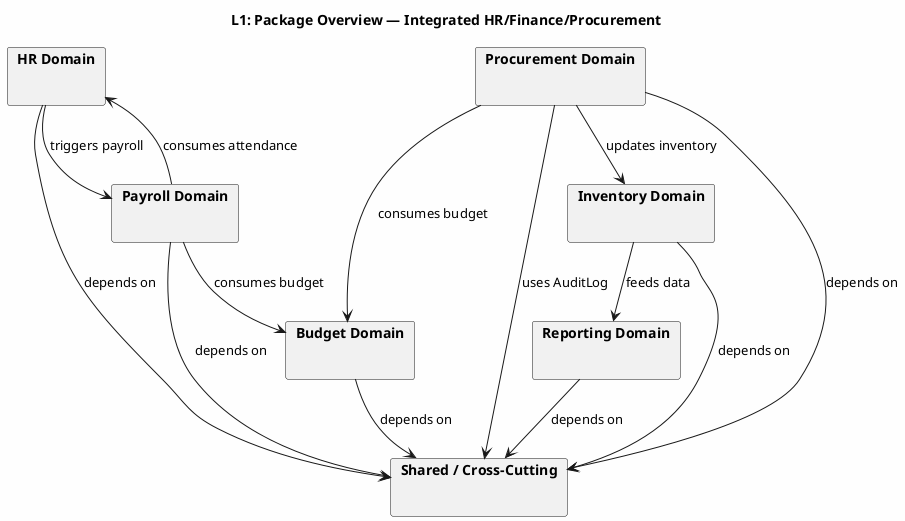
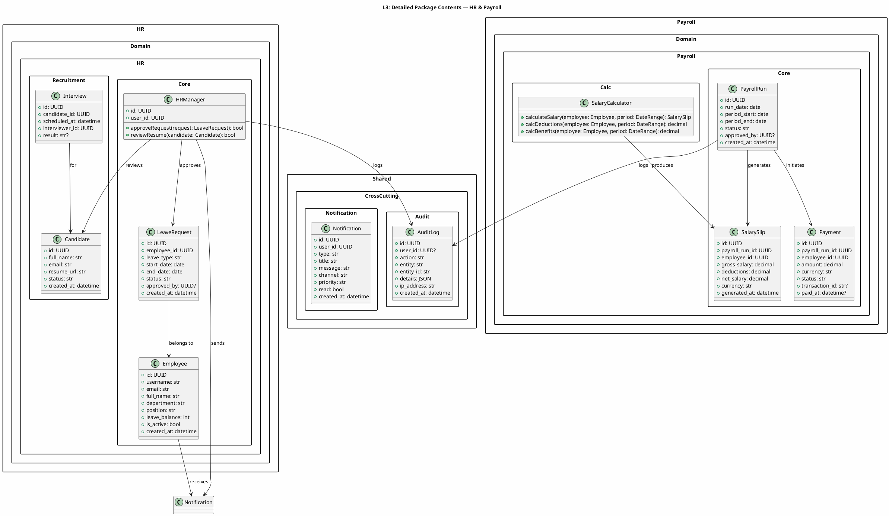

# UML 2.5 Structural Diagrams — Package, Composite Structure & Profile (HR/Finance/Procurement)

**Title:** UML 2.5 Structural Diagrams — Package, Composite Structure & Profile
**Scope:** Integrated HR, Finance, and Procurement system
**Version:** v1.0
**Date:** 2026-09-09
**Status:** Draft for documentation
**Author:** Kilo

---

## Table of Contents

1. [Introduction](#1-introduction)
2. [Package Diagram (Type 5)](#2-package-diagram-type-5)
3. [Composite Structure Diagram (Type 6)](#3-composite-structure-diagram-type-6)
4. [Profile Diagram (Type 7)](#4-profile-diagram-type-7)
5. [Traceability](#5-traceability)
6. [Naming Conventions](#6-naming-conventions)
7. [Rules and Limitations](#7-rules-and-limitations)

---

## 1. Introduction

This document models three UML 2.5 structural diagram types for the Package, Composite Structure, and Profile layers of the integrated HR/Finance/Procurement system.

### 1.1 Modeling Scale

| Level | Scope | Output |
|-------|-------|--------|
| **Level 1** | Overview of packages / collaborations / profiles | Basic diagrams |
| **Level 2** | Sub-package breakdown / internal parts / primary stereotypes | Medium diagrams |
| **Level 3** | Class details, ports, connectors, and constraints (OCL) | Detailed diagrams |

### 1.2 Fixed Scope

| English Name | Description |
|-------------|-------------|
| `Employee` | Employee |
| `HRManager` | HR Manager |
| `PayrollRun` | Payroll run |
| `Budget` | Overall budget |
| `BudgetAllocation` | Budget allocation to a department |
| `PurchaseRequest` | Purchase request |
| `PurchaseOrder` | Purchase order |
| `GoodsReceipt` | Goods receipt |
| `StockLot` | Stock lot |
| `Payment` | Payment |
| `Report` | Report |
| `AuditLog` | Audit log |
| `WarehouseOfficer` | Warehouse officer |
| `FinanceManager` | Finance manager |
| `ProcurementOfficer` | Procurement officer |
| `ExecutiveAnalyst` | Executive analyst |
| `Supplier` | Supplier |
| `BankGateway` | Payment gateway |

---

## 2. Package Diagram (Type 5)

A Package diagram shows the organization of modules and the dependencies between them.

### 2.1 Level 1 — System Package Overview

**Explanation:** At this level, seven primary packages are identified. Domain packages depend on a shared package (`Shared`), and data flow between domains is expressed through package dependencies.

---

### 2.2 Level 2 — Sub-Package Breakdown

```plantuml
@startuml ARCH-L2-Package
skinparam backgroundColor #FEFEFE
skinparam packageStyle rectangle

title L2: Sub-Packages inside each Domain

package "HR Domain" as HR {
  package "HR.Core" {
    [Employee]
    [HRManager]
    [LeaveRequest]
  }
  package "HR.Recruitment" {
    [Candidate]
    [Interview]
  }
}

package "Payroll Domain" as PAY {
  package "Payroll.Core" {
    [PayrollRun]
    [SalarySlip]
    [Payment]
  }
  package "Payroll.Calc" {
    [SalaryCalculator]
    [DeductionEngine]
  }
}

package "Budget Domain" as BUD {
  package "Budget.Core" {
    [Budget]
    [BudgetAllocation]
  }
  package "Budget.Validation" {
    [BudgetCheckService]
    [BudgetValidator]
  }
}

package "Procurement Domain" as PROC {
  package "Procurement.Core" {
    [PurchaseRequest]
    [PurchaseOrder]
    [ProcurementOfficer]
  }
  package "Procurement.Approval" {
    [FinanceManager]
    [BudgetCheck]
  }
}

package "Inventory Domain" as INV {
  package "Inventory.Core" {
    [GoodsReceipt]
    [StockLot]
    [WarehouseOfficer]
  }
  package "Inventory.Allocation" {
    [StockAllocationService]
    [StockManager]
  }
}

package "Reporting Domain" as REP {
  package "Reporting.Core" {
    [Report]
    [ExecutiveAnalyst]
  }
  package "Reporting.Engine" {
    [ReportGenerationService]
    [ReportBuilder]
  }
}

package "Shared / Cross-Cutting" as SHARED {
  package "Shared.Audit" {
    [AuditLog]
  }
  package "Shared.Notification" {
    [Notification]
  }
  package "Shared.Security" {
    [BankGateway]
    [PaymentGateway]
  }
}

PAY.Payroll.Calc --> PAY.Payroll.Core : uses
BUD.Budget.Validation --> BUD.Budget.Core : uses
PROC.Procurement.Approval --> BUD.Budget.Validation : calls
INV.Inventory.Allocation --> INV.Inventory.Core : updates
REP.Reporting.Engine --> REP.Reporting.Core : produces
SHARED.Shared.Audit <-- HR.HR.Core : logs
SHARED.Shared.Audit <-- PAY.Payroll.Core : logs
SHARED.Shared.Audit <-- PROC.Procurement.Core : logs
SHARED.Shared.Notification <-- HR.HR.Core : sends
SHARED.Shared.Security <-- PAY.Payroll.Core : uses
SHARED.Shared.Security <-- PROC.Procurement.Core : uses

@enduml
```

**Explanation:** Each domain is split into two sub-packages (Core and one specialized sub-package). Dependencies reflect service calls or entity usage.

---

### 2.3 Level 3 — Detailed Package Contents

**Explanation:** At this level, the actual classes within each package are shown with their attributes and operations. Dependencies reflect method calls or references to other entities.

---