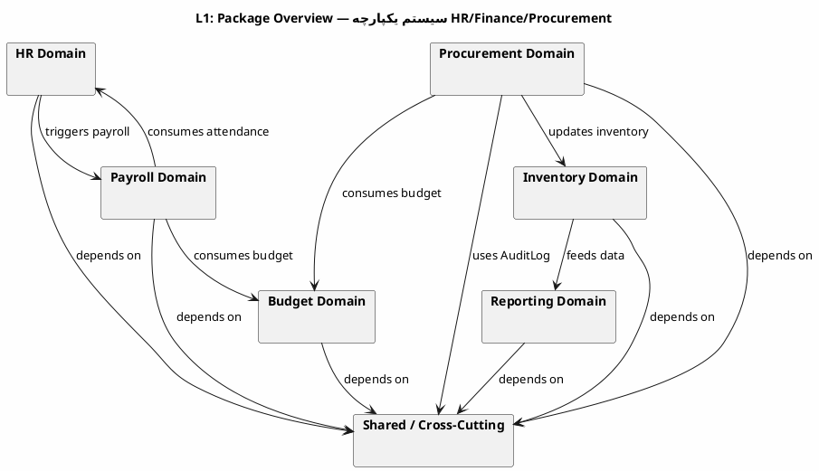
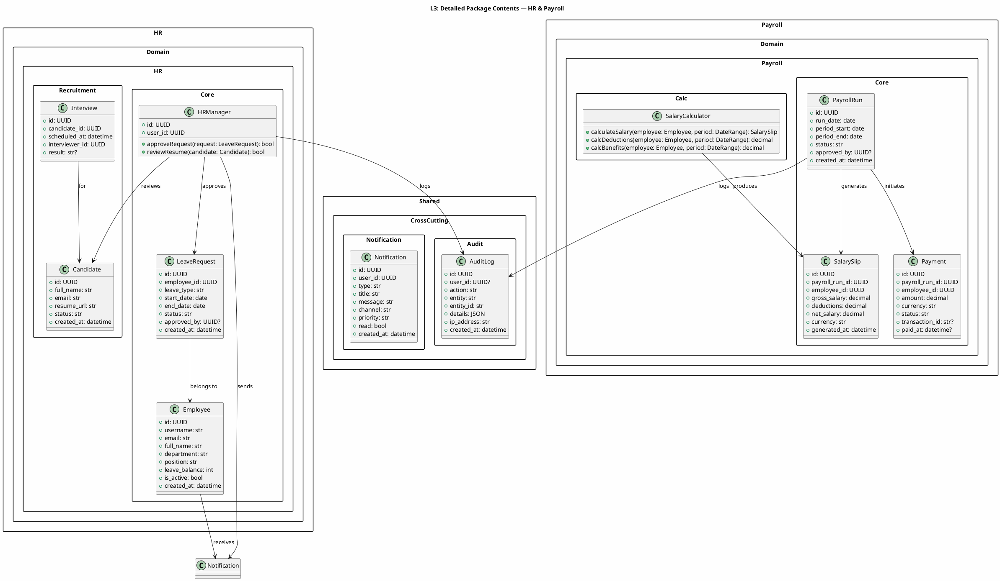
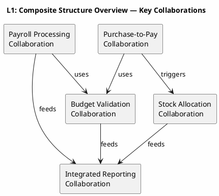

# UML 2.5 Structural Diagrams — Package, Composite Structure & Profile (HR/Finance/Procurement)

**عنوان:** UML 2.5 Structural Diagrams — Package, Composite Structure & Profile  
**دامنه:** سیستم یکپارچه منابع انسانی، مالی و تدارکات (HR / Finance / Procurement)  
**نسخه:** v1.0  
**تاریخ:** 2026-09-09  
**وضعیت:** پیش‌نویس برای مستندسازی  
**نگارنده:** Kilo

---

## فهرست مطالب

1. [مقدمه](#1-مقدمه)
2. [نمودار Package (نوع ۵)](#2-نمودار-package-نوع-5)
3. [نمودار Composite Structure (نوع ۶)](#3-نمودار-composite-structure-نوع-6)
4. [نمودار Profile (نوع ۷)](#4-نمودار-profile-نوع-7)
5. [ردپا (Traceability)](#5-ردپا-traceability)
6. [کنوانسیون‌های نام‌گذاری](#6-کنوانسیون‌های-نام‌گذاری)
7. [ضوابط و محدودیت‌ها](#7-ضوابط-و-محدودیت‌ها)

---

## ۱. مقدمه

این سند سه نوع نمودار ساختاری UML 2.5 را برای لایه‌های **Package**، **Composite Structure** و **Profile** سیستم یکپارچه HR/Finance/Procurement مدل‌سازی می‌کند.

### ۱.۱ مقیاس مدل‌سازی

| سطح | محدوده | خروجی |
|-----|--------|-------|
| **Level 1** | نمای کلی بسته‌ها / همکاری‌ها / پروفایل‌ها | نمودارهای پایه |
| **Level 2** | تفکیک زیربسته‌ها / قطعات داخلی / استریوتیپ‌های اصلی | نمودارهای متوسط |
| **Level 3** | جزئیات کلاس‌ها، پورت‌ها، کانکتورها و قیود (OCL) | نمودارهای دقیق |

### ۱.۲ دامنه ثابت

| نام انگلیسی | توضیح فارسی |
|------------|-------------|
| `Employee` | کارمند |
| `HRManager` | مدیر منابع انسانی |
| `PayrollRun` | اجرای پرداخت حقوق |
| `Budget` | بودجه کلی |
| `BudgetAllocation` | تخصیص بودجه به واحد |
| `PurchaseRequest` | درخواست خرید |
| `PurchaseOrder` | سفارش خرید |
| `GoodsReceipt` | ثبت ورود کالا |
| `StockLot` | لات موجودی |
| `Payment` | پرداخت |
| `Report` | گزارش |
| `AuditLog` | گزارش ممیزی |
| `WarehouseOfficer` | کارمند انبار |
| `FinanceManager` | مدیر مالی |
| `ProcurementOfficer` | کارمند تدارکات |
| `ExecutiveAnalyst` | مدیرعامل/تحلیلگر |
| `Supplier` | تامین‌کننده |
| `BankGateway` | درگاه پرداخت |

---

## ۲. نمودار Package (نوع ۵)

نمودار Package نشان‌دهنده سازماندهی ماژول‌ها و وابستگی‌های بین آن‌هاست.

### ۲.۱ سطح ۱ — نمای کلی بسته‌های سیستم



**توضیح:** در این سطح، هفت بسته اصلی شناسایی می‌شوند. بسته‌های حوزه‌ای به یک بسته مشترک (`Shared`) وابسته‌اند و جریان داده بین حوزه‌ها از طریق وابستگی‌های package مشخص شده است.

---

### ۲.۲ سطح ۲ — تفکیک زیربسته‌ها

```plantuml
@startuml ARCH-L2-Package
skinparam backgroundColor #FEFEFE
skinparam packageStyle rectangle

title L2: Sub-Packages inside each Domain

package "HR Domain" as HR {
  package "HR.Core" {
    [Employee]
    [HRManager]
    [LeaveRequest]
  }
  package "HR.Recruitment" {
    [Candidate]
    [Interview]
  }
}

package "Payroll Domain" as PAY {
  package "Payroll.Core" {
    [PayrollRun]
    [SalarySlip]
    [Payment]
  }
  package "Payroll.Calc" {
    [SalaryCalculator]
    [DeductionEngine]
  }
}

package "Budget Domain" as BUD {
  package "Budget.Core" {
    [Budget]
    [BudgetAllocation]
  }
  package "Budget.Validation" {
    [checkBudget()]
    [BudgetValidator]
  }
}

package "Procurement Domain" as PROC {
  package "Procurement.Core" {
    [PurchaseRequest]
    [PurchaseOrder]
    [ProcurementOfficer]
  }
  package "Procurement.Approval" {
    [FinanceManager]
    [BudgetCheck]
  }
}

package "Inventory Domain" as INV {
  package "Inventory.Core" {
    [GoodsReceipt]
    [StockLot]
    [WarehouseOfficer]
  }
  package "Inventory.Allocation" {
    [allocateStock()]
    [StockManager]
  }
}

package "Reporting Domain" as REP {
  package "Reporting.Core" {
    [Report]
    [ExecutiveAnalyst]
  }
  package "Reporting.Engine" {
    [generateReport()]
    [ReportBuilder]
  }
}

package "Shared / Cross-Cutting" as SHARED {
  package "Shared.Audit" {
    [AuditLog]
  }
  package "Shared.Notification" {
    [Notification]
  }
  package "Shared.Security" {
    [BankGateway]
    [PaymentGateway]
  }
}

PAY.Payroll.Calc --> PAY.Payroll.Core : uses
BUD.Budget.Validation --> BUD.Budget.Core : uses
PROC.Procurement.Approval --> BUD.Budget.Validation : calls
INV.Inventory.Allocation --> INV.Inventory.Core : updates
REP.Reporting.Engine --> REP.Reporting.Core : produces
SHARED.Shared.Audit <-- HR.HR.Core : logs
SHARED.Shared.Audit <-- PAY.Payroll.Core : logs
SHARED.Shared.Audit <-- PROC.Procurement.Core : logs
SHARED.Shared.Notification <-- HR.HR.Core : sends
SHARED.Shared.Security <-- PAY.Payroll.Core : uses
SHARED.Shared.Security <-- PROC.Procurement.Core : uses

@enduml
```



**توضیح:** هر حوزه به دو زیربسته اصلی (Core و یک زیربسته تخصصی) تقسیم می‌شود. وابستگی‌ها نشان‌دهنده فراخوانی سرویس‌ها یا استفاده از موجودیت‌ها هستند.

---

### ۲.۳ سطح ۳ — جزئیات محتویات بسته‌ها



**توضیح:** در این سطح، کلاس‌های واقعی هر بسته به همراه ویژگی‌ها و عملیات نمایش داده می‌شوند. وابستگی‌ها نشان‌دهنده فراخوانی متدها یا ارجاع به موجودیت‌های دیگر هستند.

---

## ۳. نمودار Composite Structure (نوع ۶)

نمودار Composite Structure ساختار داخلی یک کلاس یا همکاری (Collaboration) را از طریق بخش‌ها (Parts)، پورت‌ها (Ports) و کانکتورها (Connectors) نشان می‌دهد.

### ۳.۱ سطح ۱ — همکاری‌های کلیدی (Collaborations)



**توضیح:** پنج همکاری اصلی شناسایی شده‌اند. هر همکاری یک قابلیت تجاری تکمیل‌شده را مدل‌سازی می‌کند و با همکاری‌های دیگر از طریق پورت‌های تعریف شده در سطح ۲ و ۳ ارتباط برقرار می‌کنند.

---

### ۳.۲ سطح ۲ — ساختار داخلی همکاری پرداخت حقوق

```plantuml
@startuml ARCH-L2-Composite
skinparam backgroundColor #FEFEFE

title L2: Internal Structure — Payroll Processing Collaboration

package "PayrollProcessingCollaboration" {
  component "PayrollRun" as PR {
    port in StartRun as PR_in
    port out SalarySlipReady as PR_out
    port in AttendanceData as PR_att
    port out PaymentInitiated as PR_pay
  }

  component "SalaryCalculator" as SC {
    port in CalcRequest as SC_in
    port out SlipGenerated as SC_out
  }

  component "BudgetValidator" as BV {
    port in ValidateRequest as BV_in
    port out BudgetStatus as BV_out
  }

  component "PaymentGateway" as PG {
    port in PaymentRequest as PG_in
    port out TransferResult as PG_out
  }

  component "AuditLogger" as AL {
    port in LogEvent as AL_in
  }

  component "Notifier" as N {
    port in Notify as N_in
    port out NotificationSent as N_out
  }
}

PR_in --> SC_in : calculatesSalary()
PR_att --> SC_in : attendanceData
SC_out --> BV_in : validateBudget()
BV_out --> PR_out : budgetApproved()
PR_out --> PG_in : executePayment()
PG_out --> PR_pay : paymentResult
PR_pay --> AL_in : logPayment()
PR_pay --> N_in : notifyHR()
SC_out --> AL_in : logSlip()

@enduml
```

**توضیح:** همکاری پرداخت حقوق از شش جزء تشکیل شده است. هر جزء یک پورت ورودی و خروجی دارد. کانکتورها نشان‌دهنده فراخوانی مستقیم متدها و جریان داده بین اجزا هستند. `PayrollRun` به عنوان کانون ( façade ) این همکاری عمل می‌کند.

---

### ۳.۳ سطح ۳ — ساختار داخلی همکاری تایید بودجه برای خرید

```plantuml
@startuml ARCH-L3-Composite
skinparam backgroundColor #FEFEFE

title L3: Detailed Internal Structure — Budget-Check for Purchase Request

package "BudgetCheckCollaboration" {
  component "FinanceManager" as FM {
    port in ReceivePR as FM_in
    port out ApprovePR as FM_out
    port out RejectPR as FM_rej
    port in ReallocationResponse as FM_rea
  }

  component "BudgetService" as BS {
    port in CheckRequest as BS_in
    port out AllocationStatus as BS_out
    port in UpdateRequest as BS_upd
  }

  component "ExecutiveAnalyst" as EA {
    port in ReallocationReq as EA_in
    port out ApproveRealloc as EA_out
    port out RejectRealloc as EA_rej
  }

  component "AuditLogger" as AL2 {
    port in Log as AL2_in
  }

  component "Notifier" as N2 {
    port in Notify as N2_in
  }

  component "PurchaseRequest" as PR2 {
    port in Created as PR2_in
    port out Approved as PR2_out
    port out Rejected as PR2_rej
  }
}

PR2_in --> FM_in : submit()
FM_in --> BS_in : checkBudget()
BS_out --> FM_out : budgetOK
BS_out --> FM_rej : budgetInsufficient
FM_rej --> N2_in : notifyProcurement()
FM_rej --> AL2_in : logRejection()

FM_rej --> EA_in : requestReallocation()
EA_out --> BS_upd : reallocate()
BS_upd --> FM_rea : updated
FM_rea --> FM_out : approvePR()
FM_out --> PR2_out : approved()

PR2_rej --> N2_in : notifyProcurement()
PR2_rej --> AL2_in : logFinalRejection()

@enduml
```

**توضیح:** این همکاری جریان دقیق بررسی بودجه برای درخواست خرید را نشان می‌دهد. اگر بودجه ناکافی باشد، درخواست تخصیص مجدد به `ExecutiveAnalyst` ارسال می‌شود. در صورت تأیید، `BudgetAllocation` به‌روز می‌شود و `PurchaseRequest` نهایی تایید می‌گردد.

---

## ۴. نمودار Profile (نوع ۷)

نمودار Profile در UML 2.5 برای گسترش یا تخصص‌بخشی (Stereotype) به عناصر استاندارد UML استفاده می‌شود. از آنجا که PlantUML پشتیبانی کامل از Profile Diagrams را ندارد، در این سند:
- **Level 1:** نمای کلی پروفایل و حوزه‌های آن
- **Level 2:** جدول استریوتیپ‌ها و Tagged Values
- **Level 3:** جدول قیود یکپارچگی

### ۴.۱ سطح ۱ — نمای کلی پروفایل

**نام پروفایل:** `HRFinanceProcurementProfile`

**دامنه:** گسترش کلاس‌ها، ویژگی‌ها و عملیات‌های سیستم یکپارچه HR/Finance/Procurement

**هدف:** اعمال Stereotypes، Tagged Values و Constraints به عناصر UML برای:
- تفکیک حوزه‌های کسب‌وکار (HR، Payroll، Budget، Procurement، Inventory، Reporting)
- تعیین قوانین اعتبارسنجی (Validation Rules)
- مستندسازی پیچیدگی محاسباتی و جریان داده

### ۴.۲ سطح ۲ — استریوتیپ‌ها و مقادیر برچسب‌دار (Tagged Values)

| Stereotype | Base Class | Tagged Value | نوع | توضیح |
|------------|-----------|--------------|-----|-------|
| `<<HRDomain>>` | Class | `department` | String | واحد سازمانی مربوطه |
| `<<HRDomain>>` | Class | `leavePolicy` | String | سیاست‌نامه مرخصی |
| `<<PayrollDomain>>` | Class | `payrollFrequency` | String | دوره پرداخت (مثلاً ماهانه) |
| `<<PayrollDomain>>` | Operation | `calculationBasis` | String | محاسبه بر اساس روزهای کاری/ساعت |
| `<<BudgetDomain>>` | Class | `fiscalYear` | Integer | سال مالی تخصیص |
| `<<BudgetDomain>>` | Operation | `validationScope` | String | بودجه سراسری یا پروژه‌ای |
| `<<ProcurementDomain>>` | Class | `prType` | String | نوع درخواست خرید (کالا/خدمه) |
| `<<ProcurementDomain>>` | Operation | `approvalLevel` | String | سطح تایید (مدیر مالی/مدیرعامل) |
| `<<InventoryDomain>>` | Class | `storageType` | String | نوع انبار (سرد/گرم/عمومی) |
| `<<InventoryDomain>>` | Operation | `allocationStrategy` | String | استراتژی تخصیص (FIFO/LIFO/FEFO) |
| `<<ReportingDomain>>` | Class | `reportFormat` | String | فرمت خروجی (PDF/Excel/CSV) |
| `<<ReportingDomain>>` | Operation | `dataGranularity` | String | میزان جزئیات داده (روزانه/ماهانه) |
| `<<CrossCutting>>` | Class | `retentionDays` | Integer | مدت نگهداری لاگ |
| `<<CrossCutting>>` | Operation | `sensitivityLevel` | String | سطح حساسیت (عمومی/محرمانه) |

### ۴.۳ سطح ۳ — قیود و قوانین OCL (Object Constraint Language)

در زیر قیود کلیدی برای هر استریوتیپ به صورت قوانین متنی و نماد OCL ارائه می‌شود.

#### ۴.۳.۱ HRDomain Constraints

| کد قید | متن قید (OCL) | توضیح |
|--------|---------------|-------|
| HR-C-01 | `context LeaveRequest`<br>`inv: end_date > start_date` | تاریخ پایان مرخصی باید بعد از تاریخ شروع باشد. |
| HR-C-02 | `context Employee`<br>`inv: leave_balance >= 0` | موجودی مرخصی نمی‌تواند منفی باشد. |
| HR-C-03 | `context HRManager`<br>`pre: approved_by <> employee_id` | مدیر منابع انسانی نمی‌تواند درخواست خود را تایید کند. |
| HR-C-04 | `context LeaveRequest`<br>`inv: status in {'PENDING', 'APPROVED', 'REJECTED', 'CANCELLED'}` | وضعیت درخواست فقط مقادیر مجاز را می‌پذیرد. |

#### ۴.۳.۲ PayrollDomain Constraints

| کد قید | متن قید (OCL) | توضیح |
|--------|---------------|-------|
| PAY-C-01 | `context SalarySlip`<br>`inv: net_salary = gross_salary - deductions` | خالص حقوق برابر сумма کسورات از ناخالص باشد. |
| PAY-C-02 | `context SalarySlip`<br>`inv: gross_salary >= 0 and deductions >= 0 and net_salary >= 0` | هیچ مقدار منفی در فیش حقوقی مجاز نیست. |
| PAY-C-03 | `context Payment`<br>`inv: status in {'PENDING', 'PROCESSING', 'COMPLETED', 'FAILED'}` | وضعیت پرداخت فقط مقادیر مجاز را می‌پذیرد. |
| PAY-C-04 | `context PayrollRun`<br>`inv: period_end >= period_start` | پایان دوره حقوقی باید بعد از یا برابر با شروع باشد. |
| PAY-C-05 | `context SalaryCalculator`<br>`pre: employee.is_active = true` | فقط کارمند فعال در محاسبه حقوق شرکت می‌کند. |

#### ۴.۳.۳ BudgetDomain Constraints

| کد قید | متن قید (OCL) | توضیح |
|--------|---------------|-------|
| BUD-C-01 | `context Budget`<br>`inv: total_amount >= 0` | مبلغ کل بودجه نمی‌تواند منفی باشد. |
| BUD-C-02 | `context BudgetAllocation`<br>`inv: allocated_amount >= 0 and allocated_amount <= Budget.total_amount` | مبلغ تخصیص داده شده نمی‌تواند منفی یا بیشتر از کل بودجه باشد. |
| BUD-C-03 | `context BudgetValidator`<br>`pre: fiscalYear = Budget.fiscalYear` | اعتبارسنجی بودجه در همان سال مالی انجام می‌شود. |
| BUD-C-04 | `context Budget`<br>`inv: startDate <= endDate` | تاریخ شروع بودجه باید قبل از یا برابر با تاریخ پایان باشد. |

#### ۴.۳.۴ ProcurementDomain Constraints

| کد قید | متن قید (OCL) | توضیح |
|--------|---------------|-------|
| PROC-C-01 | `context PurchaseRequest`<br>`inv: quantity > 0 and unit_price >= 0` | مقدار و قیمت واحد در درخواست خرید باید معتبر باشند. |
| PROC-C-02 | `context PurchaseOrder`<br>`inv: poDate >= prApprovalDate` | تاریخ سفارش خرید باید بعد از یا برابر با تاریخ تایید درخواست خرید باشد. |
| PROC-C-03 | `context PurchaseOrder`<br>`inv: total_amount = quantity * unit_price` | مبلغ کل سفارش خرید برابر حاصلضرب مقدار و قیمت واحد است. |
| PROC-C-04 | `context ProcurementOfficer`<br>`pre: PR.approvalLevel in {\"FINANCE_MANAGER\", \"EXECUTIVE\"}` | درخواست خرید باید حداقل توسط مدیر مالی تایید شده باشد. |

#### ۴.۳.۵ InventoryDomain Constraints

| کد قید | متن قید (OCL) | توضیح |
|--------|---------------|-------|
| INV-C-01 | `context StockLot`<br>`inv: quantity >= 0 and quantity <= maxCapacity` | موجودی لات نمی‌تواند منفی و نباید از ظرفیت بیشتر باشد. |
| INV-C-02 | `context GoodsReceipt`<br>`inv: received_quantity > 0` | مقدار دریافت شده کالا باید بزرگتر از صفر باشد. |
| INV-C-03 | `context StockLot`<br>`inv: expiryDate is null or expiryDate > created_at` | تاریخ انقضاء (در صورت وجود) باید بعد از تاریخ ثبت باشد. |
| INV-C-04 | `context StockManager`<br>`pre: lot.location <> null` | هر لات موجودی باید به یک محل/لاین اختصاص داده شده باشد. |

#### ۴.۳.۶ ReportingDomain Constraints

| کد قید | متن قید (OCL) | توضیح |
|--------|---------------|-------|
| REP-C-01 | `context Report`<br>`inv: generatedAt >= dataFrom and generatedAt <= dataTo` | زمان تولید گزارش در بازه زمانی درخواستی قرار می‌گیرد. |
| REP-C-02 | `context Report`<br>`inv: dataFrom <= dataTo` | تاریخ شروع گزارش باید قبل از یا برابر با تاریخ پایان باشد. |
| REP-C-03 | `context generateReport()`<br>`pre: sourceData notEmpty` | برای تولید گزارش باید داده منبع حداقل یک رکورد داشته باشد. |
| REP-C-04 | `context ExecutiveAnalyst`<br>`inv: approvedBy <> createdBy` | تحلیلگر نمی‌تواند گزارش خود را بدون تأیید دیگران منتشر کند. |

#### ۴.۳.۷ Cross-Cutting Constraints

| کد قید | متن قید (OCL) | توضیح |
|--------|---------------|-------|
| XC-C-01 | `context AuditLog`<br>`inv: created_at <= now()` | زمان ثبت لاگ نمی‌تواند در آینده باشد. |
| XC-C-02 | `context Notification`<br>`inv: read implies read_at <> null` | اگر اطلاعیه خوانده شده باشد، زمان خواندن باید ثبت شده باشد. |
| XC-C-03 | `context PaymentGateway`<br>`inv: transactionId unique` | شناسه تراکنش باید یکتا باشد. |
| XC-C-04 | `context Employee`<br>`inv: email matches '^[A-Za-z0-9._%+-]+@[A-Za-z0-9.-]+\\.[A-Za-z]{2,}$'` | فرمت ایمیل کارمند باید معتبر باشد. |

---

## ۵. ردپا (Traceability)

### ۵.۱ نگاشت به BPMN

| نمودار ساختاری | فرآیند BPMN | Entity | متد |
|----------------|-------------|--------|-----|
| Package L3 | محاسبه حقوق | `PayrollRun` | `calculateSalary()` |
| Composite L2 | بررسی بودجه | `Budget` | `checkBudget()` |
| Composite L3 | تایید درخواست خرید | `FinanceManager` | `approvePurchaseRequest()` |
| Profile L2 | تولید گزارش | `Report` | `generateReport()` |
| Profile L3 | ثبت دریافت کالا | `GoodsReceipt` | `recordGoodsReceipt()` |

### ۵.۲ نگاشت به DFD

| نمودار ساختاری | فرآیند DFD | توضیح |
|----------------|------------|-------|
| Package L1 | DFD-01: Context | بسته‌های اصلی سیستم |
| Package L2 | DFD-02: Data Flow | جریان داده بین زیربسته‌ها |
| Composite L2 | DFD-04: Compute Payroll | محاسبه حقوق در همکاری پرداخت حقوق |
| Composite L3 | DFD-07: Validate Budget | بررسی بودجه در همکاری تایید بودجه |
| Profile L3 | DFD-12: Produce Reports | قیود مربوط به تولید گزارش |

### ۵.۳ ماتریس ردیابی کامل

| شناسه نمودار | نام نمودار | BPMN | DFD | UML Class | UML Method | Entity | خروجی |
|---------------|-----------|------|-----|-----------|------------|--------|-------|
| UML-PKG-L1 | Package Overview | BPMN-L1 | DFD-01 | HR/Finance/Procurement | — | Package | بسته‌های حوزه‌ای |
| UML-PKG-L2 | Sub-Packages | BPMN-L2 | DFD-02 | HR.Core/Payroll.Core | — | SubPackage | زیربسته‌ها |
| UML-PKG-L3 | Detailed Contents | BPMN-L3 | DFD-04 | Employee/PayrollRun | `calculateSalary()` | Employee | جزئیات کلاس |
| UML-COMP-L1 | Composite Overview | BPMN-L1 | DFD-06 | PayrollProcessing | — | Collaboration | همکاری‌ها |
| UML-COMP-L2 | Payroll Structure | BPMN-L3-Payroll | DFD-04 | PayrollRun | `calculateSalary()` | PayrollRun | ساختار داخلی |
| UML-COMP-L3 | Budget-Check Structure | BPMN-L3-Budget | DFD-07 | FinanceManager | `checkBudget()` | Budget | کانکتورها |
| UML-PROF-L1 | Profile Overview | BPMN-L1 | DFD-12 | HRFinanceProcurementProfile | — | Profile | پروفایل دامنه |
| UML-PROF-L2 | Stereotypes & Tags | BPMN-L2 | DFD-07/10 | <<HRDomain>>, <<BudgetDomain>> | Tagged Values | Stereotype | ویژگی‌های تخصصی |
| UML-PROF-L3 | OCL Constraints | BPMN-L3 | DFD-04/07 | Employee, PayrollRun, Budget | OCL invariants | Constraint | قوانین اعتبارسنجی |

---

## ۶. کنوانسیون‌های نام‌گذاری

### ۶.۱ بسته‌ها (Packages)

| نام بسته | حوزه | توضیح |
|----------|------|-------|
| `HR.Domain.HR.Core` | منابع انسانی | موجودیت‌های اصلی HR |
| `HR.Domain.HR.Recruitment` | منابع انسانی | فرآیند استخدام |
| `Payroll.Domain.Payroll.Core` | مالی | موجودیت‌های پرداخت حقوق |
| `Payroll.Domain.Payroll.Calc` | مالی | سرویس محاسباتی حقوق |
| `Budget.Domain.Budget.Core` | مالی | موجودیت‌های بودجه |
| `Budget.Domain.Budget.Validation` | مالی | سرویس اعتبارسنجی بودجه |
| `Procurement.Domain.Procurement.Core` | تدارکات | موجودیت‌های اصلی خرید |
| `Procurement.Domain.Procurement.Approval` | تدارکات | فرآیند تایید خرید |
| `Inventory.Domain.Inventory.Core` | موجودی | موجودیت‌های انبار |
| `Inventory.Domain.Inventory.Allocation` | موجودی | سرویس تخصیص موجودی |
| `Reporting.Domain.Reporting.Core` | گزارش | موجودیت‌های گزارش |
| `Reporting.Domain.Reporting.Engine` | گزارش | موتور تولید گزارش |
| `Shared.CrossCutting.Audit` | مشترک | گزارش ممیزی |
| `Shared.CrossCutting.Notification` | مشترک | سیستم اعلان |
| `Shared.CrossCutting.Security` | مشترک | درگاه پرداخت و امنیت |

### ۶.۲ استریوتیپ‌های Profile

| استریوتیپ | کاربرد |.Tagged Values |
|-----------|--------|---------------|
| `<<HRDomain>>` | کلاس‌ها و عملیات HR | `department`, `leavePolicy` |
| `<<PayrollDomain>>` | کلاس‌ها و عملیات حقوق | `payrollFrequency`, `calculationBasis` |
| `<<BudgetDomain>>` | کلاس‌ها و عملیات بودجه | `fiscalYear`, `validationScope` |
| `<<ProcurementDomain>>` | کلاس‌ها و عملیات تدارکات | `prType`, `approvalLevel` |
| `<<InventoryDomain>>` | کلاس‌ها و عملیات موجودی | `storageType`, `allocationStrategy` |
| `<<ReportingDomain>>` | کلاس‌ها و عملیات گزارش‌گیری | `reportFormat`, `dataGranularity` |
| `<<CrossCutting>>` | خدمات مشترک | `retentionDays`, `sensitivityLevel` |

### ۶.۳ متدهای کلیدی

| متد | کلاس والد | توضیح |
|-----|-----------|-------|
| `calculateSalary()` | `PayrollRun` / `SalaryCalculator` | محاسبه حقوق خالص کارمند |
| `checkBudget()` | `Budget` / `BudgetValidator` | بررسی کافی بودن بودجه برای هزینه |
| `allocateStock()` | `StockManager` | تخصیص موجودی ورودی به لات‌ها |
| `generateReport()` | `ReportBuilder` | تولید گزارش یکپارچه از داده‌های چند حوزه |
| `approveLeave()` | `HRManager` | تایید درخواست مرخصی |
| `reviewResume()` | `HRManager` | بررسی رزومه کاندیدا |
| `createPurchaseRequest()` | `ProcurementOfficer` | ایجاد درخواست خرید |
| `createPurchaseOrder()` | `ProcurementOfficer` | ایجاد سفارش خرید |
| `recordGoodsReceipt()` | `WarehouseOfficer` | ثبت ورود کالا به انبار |
| `executePayment()` | `PaymentGateway` | اجرای پرداخت از طریق بانک |

---

## ۷. ضوابط و محدودیت‌ها

1. **PlantUML Version:** نمودارهای Package و Composite Structure با PlantUML v1.2024+ سازگار هستند. Profile Diagrams در PlantUML به طور Native پشتیبانی نمی‌شوند؛ برای آن‌ها از جداول ساختاریافته و قیود OCL استفاده شده است.
2. **OCL Syntax:** قیود OCL مطابق با specification UML 2.5 نوشته شده‌اند؛ پیاده‌سازی دقیق بستگی به ابزار مدل‌سازی (مانند Enterprise Architect یا MagicDraw) دارد.
3. **Composite Structure Detail:** در سطح ۳، فقط همکاری‌های بحرانی (Payroll و Budget-Check) به طور کامل رسم شده‌اند. سایر همکاری‌ها می‌توانند با الگوی مشابه گسترش یابند.
4. **Package Granularity:** در صورت رشد سیستم، بسته‌های `Shared` ممکن است به زیربسته‌های مجزای `Security`، `Audit`، `Notification` تقسیم شوند.
5. **Traceability:** هر شناسه نمودار (مانند `UML-PKG-L1`) باید در **Requirement Traceability Matrix (RTM)** به سند نیازمندی ردیابی شود.
6. **Profile Extension:** در پیاده‌سازی واقعی، استریوتیپ‌های این پروفایل می‌توانند به عنوان annotations در کد Python (مثلاً با استفاده از decorators) یا metadata در Pydantic Schemas تعبیه شوند.

---

*پایان سند*
