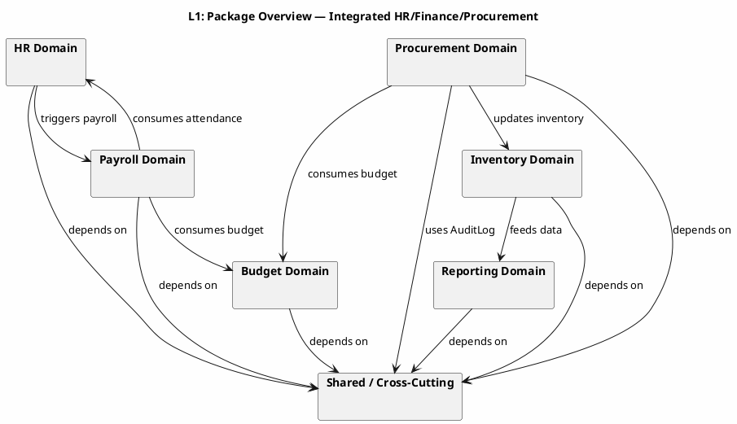
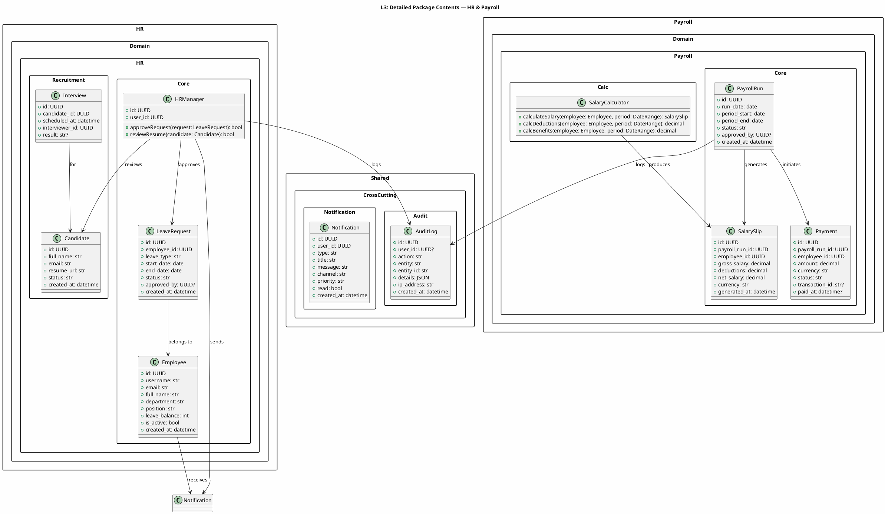
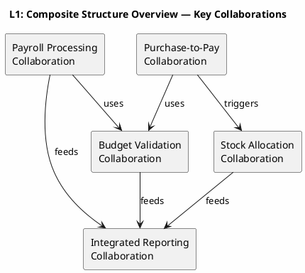

# UML 2.5 Structural Diagrams — Package, Composite Structure & Profile (HR/Finance/Procurement)

**Title:** UML 2.5 Structural Diagrams — Package, Composite Structure & Profile
**Scope:** Integrated HR, Finance, and Procurement system
**Version:** v1.0
**Date:** 2026-09-09
**Status:** Draft for documentation
**Author:** Kilo

---

## Table of Contents

1. [Introduction](#1-introduction)
2. [Package Diagram (Type 5)](#2-package-diagram-type-5)
3. [Composite Structure Diagram (Type 6)](#3-composite-structure-diagram-type-6)
4. [Profile Diagram (Type 7)](#4-profile-diagram-type-7)
5. [Traceability](#5-traceability)
6. [Naming Conventions](#6-naming-conventions)
7. [Rules and Limitations](#7-rules-and-limitations)

---

## 1. Introduction

This document models three UML 2.5 structural diagram types for the Package, Composite Structure, and Profile layers of the integrated HR/Finance/Procurement system.

### 1.1 Modeling Scale

| Level | Scope | Output |
|-------|-------|--------|
| **Level 1** | Overview of packages / collaborations / profiles | Basic diagrams |
| **Level 2** | Sub-package breakdown / internal parts / primary stereotypes | Medium diagrams |
| **Level 3** | Class details, ports, connectors, and constraints (OCL) | Detailed diagrams |

### 1.2 Fixed Scope

| English Name | Description |
|-------------|-------------|
| `Employee` | Employee |
| `HRManager` | HR Manager |
| `PayrollRun` | Payroll run |
| `Budget` | Overall budget |
| `BudgetAllocation` | Budget allocation to a department |
| `PurchaseRequest` | Purchase request |
| `PurchaseOrder` | Purchase order |
| `GoodsReceipt` | Goods receipt |
| `StockLot` | Stock lot |
| `Payment` | Payment |
| `Report` | Report |
| `AuditLog` | Audit log |
| `WarehouseOfficer` | Warehouse officer |
| `FinanceManager` | Finance manager |
| `ProcurementOfficer` | Procurement officer |
| `ExecutiveAnalyst` | Executive analyst |
| `Supplier` | Supplier |
| `BankGateway` | Payment gateway |

---

## 2. Package Diagram (Type 5)

A Package diagram shows the organization of modules and the dependencies between them.

### 2.1 Level 1 — System Package Overview



**Explanation:** At this level, seven primary packages are identified. Domain packages depend on a shared package (`Shared`), and data flow between domains is expressed through package dependencies.

---

### 2.2 Level 2 — Sub-Package Breakdown

```plantuml
@startuml ARCH-L2-Package
skinparam backgroundColor #FEFEFE
skinparam packageStyle rectangle

title L2: Sub-Packages inside each Domain

package "HR Domain" as HR {
  package "HR.Core" {
    [Employee]
    [HRManager]
    [LeaveRequest]
  }
  package "HR.Recruitment" {
    [Candidate]
    [Interview]
  }
}

package "Payroll Domain" as PAY {
  package "Payroll.Core" {
    [PayrollRun]
    [SalarySlip]
    [Payment]
  }
  package "Payroll.Calc" {
    [SalaryCalculator]
    [DeductionEngine]
  }
}

package "Budget Domain" as BUD {
  package "Budget.Core" {
    [Budget]
    [BudgetAllocation]
  }
  package "Budget.Validation" {
    [BudgetCheckService]
    [BudgetValidator]
  }
}

package "Procurement Domain" as PROC {
  package "Procurement.Core" {
    [PurchaseRequest]
    [PurchaseOrder]
    [ProcurementOfficer]
  }
  package "Procurement.Approval" {
    [FinanceManager]
    [BudgetCheck]
  }
}

package "Inventory Domain" as INV {
  package "Inventory.Core" {
    [GoodsReceipt]
    [StockLot]
    [WarehouseOfficer]
  }
  package "Inventory.Allocation" {
    [StockAllocationService]
    [StockManager]
  }
}

package "Reporting Domain" as REP {
  package "Reporting.Core" {
    [Report]
    [ExecutiveAnalyst]
  }
  package "Reporting.Engine" {
    [ReportGenerationService]
    [ReportBuilder]
  }
}

package "Shared / Cross-Cutting" as SHARED {
  package "Shared.Audit" {
    [AuditLog]
  }
  package "Shared.Notification" {
    [Notification]
  }
  package "Shared.Security" {
    [BankGateway]
    [PaymentGateway]
  }
}

PAY.Payroll.Calc --> PAY.Payroll.Core : uses
BUD.Budget.Validation --> BUD.Budget.Core : uses
PROC.Procurement.Approval --> BUD.Budget.Validation : calls
INV.Inventory.Allocation --> INV.Inventory.Core : updates
REP.Reporting.Engine --> REP.Reporting.Core : produces
SHARED.Shared.Audit <-- HR.HR.Core : logs
SHARED.Shared.Audit <-- PAY.Payroll.Core : logs
SHARED.Shared.Audit <-- PROC.Procurement.Core : logs
SHARED.Shared.Notification <-- HR.HR.Core : sends
SHARED.Shared.Security <-- PAY.Payroll.Core : uses
SHARED.Shared.Security <-- PROC.Procurement.Core : uses

@enduml
```



**Explanation:** Each domain is split into two sub-packages (Core and one specialized sub-package). Dependencies reflect service calls or entity usage.

---

### 2.3 Level 3 — Detailed Package Contents



**Explanation:** At this level, the actual classes within each package are shown with their attributes and operations. Dependencies reflect method calls or references to other entities.

---

## 3. Composite Structure Diagram (Type 6)

A Composite Structure diagram shows the internal structure of a class or collaboration through parts, ports, and connectors.

### 3.1 Level 1 — Key Collaborations



**Explanation:** Five key collaborations are identified. Each collaboration models a complete business capability and communicates with other collaborations through ports defined at Levels 2 and 3.

---

### 3.2 Level 2 — Internal Structure of Payroll Processing Collaboration

```plantuml
@startuml ARCH-L2-Composite
skinparam backgroundColor #FEFEFE

title L2: Internal Structure — Payroll Processing Collaboration

package "PayrollProcessingCollaboration" {
  component "PayrollRun" as PR {
    port in StartRun as PR_in
    port out SalarySlipReady as PR_out
    port in AttendanceData as PR_att
    port out PaymentInitiated as PR_pay
  }

  component "SalaryCalculator" as SC {
    port in CalcRequest as SC_in
    port out SlipGenerated as SC_out
  }

  component "BudgetValidator" as BV {
    port in ValidateRequest as BV_in
    port out BudgetStatus as BV_out
  }

  component "PaymentGateway" as PG {
    port in PaymentRequest as PG_in
    port out TransferResult as PG_out
  }

  component "AuditLogger" as AL {
    port in LogEvent as AL_in
  }

  component "Notifier" as N {
    port in Notify as N_in
    port out NotificationSent as N_out
  }
}

PR_in --> SC_in : calculatesSalary()
PR_att --> SC_in : attendanceData
SC_out --> BV_in : validateBudget()
BV_out --> PR_out : budgetApproved()
PR_out --> PG_in : executePayment()
PG_out --> PR_pay : paymentResult
PR_pay --> AL_in : logPayment()
PR_pay --> N_in : notifyHR()
SC_out --> AL_in : logSlip()

@enduml
```

**Explanation:** The Payroll Processing collaboration consists of six parts. Each part has an input and/or output port. Connectors represent direct method calls and data flow between parts. `PayrollRun` acts as the façade of this collaboration.

---

### 3.3 Level 3 — Internal Structure of Budget-Check Collaboration for Purchase Request

```plantuml
@startuml ARCH-L3-Composite
skinparam backgroundColor #FEFEFE

title L3: Detailed Internal Structure — Budget-Check for Purchase Request

package "BudgetCheckCollaboration" {
  component "FinanceManager" as FM {
    port in ReceivePR as FM_in
    port out ApprovePR as FM_out
    port out RejectPR as FM_rej
    port in ReallocationResponse as FM_rea
  }

  component "BudgetService" as BS {
    port in CheckRequest as BS_in
    port out AllocationStatus as BS_out
    port in UpdateRequest as BS_upd
  }

  component "ExecutiveAnalyst" as EA {
    port in ReallocationReq as EA_in
    port out ApproveRealloc as EA_out
    port out RejectRealloc as EA_rej
  }

  component "AuditLogger" as AL2 {
    port in Log as AL2_in
  }

  component "Notifier" as N2 {
    port in Notify as N2_in
  }

  component "PurchaseRequest" as PR2 {
    port in Created as PR2_in
    port out Approved as PR2_out
    port out Rejected as PR2_rej
  }
}

PR2_in --> FM_in : submit()
FM_in --> BS_in : checkBudget()
BS_out --> FM_out : budgetOK
BS_out --> FM_rej : budgetInsufficient
FM_rej --> N2_in : notifyProcurement()
FM_rej --> AL2_in : logRejection()

FM_rej --> EA_in : requestReallocation()
EA_out --> BS_upd : reallocate()
BS_upd --> FM_rea : updated
FM_rea --> FM_out : approvePR()
FM_out --> PR2_out : approved()

PR2_rej --> N2_in : notifyProcurement()
PR2_rej --> AL2_in : logFinalRejection()

@enduml
```

**Explanation:** This collaboration shows the exact flow of budget verification for a purchase request. If the budget is insufficient, the request is escalated to `ExecutiveAnalyst` for reallocation. Upon approval, `BudgetAllocation` is updated and the `PurchaseRequest` is finalized.

---

## 4. Profile Diagram (Type 7)

A Profile diagram extends or specializes standard UML elements using stereotypes. Since PlantUML does not natively support Profile Diagrams, this document uses:
- **Level 1:** Profile overview and its domains
- **Level 2:** Stereotype and Tagged Value tables
- **Level 3:** Integrity constraint tables

### 4.1 Level 1 — Profile Overview

**Profile Name:** `HRFinanceProcurementProfile`

**Scope:** Extension of classes, attributes, and operations in the integrated HR/Finance/Procurement system

**Purpose:** Apply Stereotypes, Tagged Values, and Constraints to UML elements for:
- Delineating business domains (HR, Payroll, Budget, Procurement, Inventory, Reporting)
- Defining validation rules
- Documenting computational complexity and data flow

---

### 4.2 Level 2 — Stereotypes and Tagged Values

| Stereotype | Base Class | Tagged Value | Type | Description |
|------------|-----------|--------------|-----|-------------|
| `<<HRDomain>>` | Class | `department` | String | The organizational unit this class belongs to |
| `<<HRDomain>>` | Class | `leavePolicy` | String | The leave policy applicable to this class |
| `<<PayrollDomain>>` | Class | `payrollFrequency` | String | Payroll cycle (e.g., monthly) |
| `<<PayrollDomain>>` | Operation | `calculationBasis` | String | Calculation basis (workdays / hours) |
| `<<BudgetDomain>>` | Class | `fiscalYear` | Integer | Fiscal year of allocation |
| `<<BudgetDomain>>` | Operation | `validationScope` | String | Enterprise-wide or project-level budget |
| `<<ProcurementDomain>>` | Class | `prType` | String | Purchase request type (goods / services) |
| `<<ProcurementDomain>>` | Operation | `approvalLevel` | String | Approval level (Finance Manager / Executive) |
| `<<InventoryDomain>>` | Class | `storageType` | String | Storage type (cold / warm / general) |
| `<<InventoryDomain>>` | Operation | `allocationStrategy` | String | Allocation strategy (FIFO / LIFO / FEFO) |
| `<<ReportingDomain>>` | Class | `reportFormat` | String | Output format (PDF / Excel / CSV) |
| `<<ReportingDomain>>` | Operation | `dataGranularity` | String | Data granularity (daily / monthly) |
| `<<CrossCutting>>` | Class | `retentionDays` | Integer | Log retention period in days |
| `<<CrossCutting>>` | Operation | `sensitivityLevel` | String | Sensitivity level (public / confidential) |

---

### 4.3 Level 3 — OCL Integrity Constraints

The key constraints for each stereotype are presented below as textual rules and OCL expressions.

#### 4.3.1 HRDomain Constraints

| Constraint ID | OCL Expression | Description |
|--------------|----------------|-------------|
| HR-C-01 | `context LeaveRequest`<br>`inv: end_date > start_date` | The leave end date must be after the start date. |
| HR-C-02 | `context Employee`<br>`inv: leave_balance >= 0` | The leave balance cannot be negative. |
| HR-C-03 | `context HRManager`<br>`pre: approved_by <> employee_id` | An HR manager cannot approve their own leave request. |
| HR-C-04 | `context LeaveRequest`<br>`inv: status in {'PENDING', 'APPROVED', 'REJECTED', 'CANCELLED'}` | The request status must be one of the allowed values. |

#### 4.3.2 PayrollDomain Constraints

| Constraint ID | OCL Expression | Description |
|--------------|----------------|-------------|
| PAY-C-01 | `context SalarySlip`<br>`inv: net_salary = gross_salary - deductions` | Net salary equals gross salary minus deductions. |
| PAY-C-02 | `context SalarySlip`<br>`inv: gross_salary >= 0 and deductions >= 0 and net_salary >= 0` | No negative values are allowed in a salary slip. |
| PAY-C-03 | `context Payment`<br>`inv: status in {'PENDING', 'PROCESSING', 'COMPLETED', 'FAILED'}` | The payment status must be one of the allowed values. |
| PAY-C-04 | `context PayrollRun`<br>`inv: period_end >= period_start` | The payroll period end must be on or after the start date. |
| PAY-C-05 | `context SalaryCalculator`<br>`pre: employee.is_active = true` | Only active employees are included in salary calculations. |

#### 4.3.3 BudgetDomain Constraints

| Constraint ID | OCL Expression | Description |
|--------------|----------------|-------------|
| BUD-C-01 | `context Budget`<br>`inv: total_amount >= 0` | The total budget amount cannot be negative. |
| BUD-C-02 | `context BudgetAllocation`<br>`inv: allocated_amount >= 0 and allocated_amount <= Budget.total_amount` | The allocated amount cannot be negative or exceed the total budget. |
| BUD-C-03 | `context BudgetValidator`<br>`pre: fiscalYear = Budget.fiscalYear` | Budget validation must occur within the same fiscal year. |
| BUD-C-04 | `context Budget`<br>`inv: startDate <= endDate` | The budget start date must be on or before the end date. |

#### 4.3.4 ProcurementDomain Constraints

| Constraint ID | OCL Expression | Description |
|--------------|----------------|-------------|
| PROC-C-01 | `context PurchaseRequest`<br>`inv: quantity > 0 and unit_price >= 0` | Quantity and unit price in a purchase request must be valid. |
| PROC-C-02 | `context PurchaseOrder`<br>`inv: poDate >= prApprovalDate` | The purchase order date must be on or after the request approval date. |
| PROC-C-03 | `context PurchaseOrder`<br>`inv: total_amount = quantity * unit_price` | The total order amount equals quantity multiplied by unit price. |
| PROC-C-04 | `context ProcurementOfficer`<br>`pre: PR.approvalLevel in {"FINANCE_MANAGER", "EXECUTIVE"}` | A purchase request must be approved at least by the Finance Manager. |

#### 4.3.5 InventoryDomain Constraints

| Constraint ID | OCL Expression | Description |
|--------------|----------------|-------------|
| INV-C-01 | `context StockLot`<br>`inv: quantity >= 0 and quantity <= maxCapacity` | Stock lot quantity cannot be negative and must not exceed maximum capacity. |
| INV-C-02 | `context GoodsReceipt`<br>`inv: received_quantity > 0` | The received goods quantity must be greater than zero. |
| INV-C-03 | `context StockLot`<br>`inv: expiryDate is null or expiryDate > created_at` | The expiry date, if present, must be after the creation date. |
| INV-C-04 | `context StockManager`<br>`pre: lot.location <> null` | Every stock lot must be assigned to a location or lane. |

#### 4.3.6 ReportingDomain Constraints

| Constraint ID | OCL Expression | Description |
|--------------|----------------|-------------|
| REP-C-01 | `context Report`<br>`inv: generatedAt >= dataFrom and generatedAt <= dataTo` | The report generation timestamp must fall within the requested date range. |
| REP-C-02 | `context Report`<br>`inv: dataFrom <= dataTo` | The report start date must be on or before the end date. |
| REP-C-03 | `context generateReport()`<br>`pre: sourceData notEmpty` | The source dataset must contain at least one record to generate a report. |
| REP-C-04 | `context ExecutiveAnalyst`<br>`inv: approvedBy <> createdBy` | An executive analyst cannot publish a report they created without separate approval. |

#### 4.3.7 Cross-Cutting Constraints

| Constraint ID | OCL Expression | Description |
|--------------|----------------|-------------|
| XC-C-01 | `context AuditLog`<br>`inv: created_at <= now()` | The audit log timestamp cannot be in the future. |
| XC-C-02 | `context Notification`<br>`inv: read implies read_at <> null` | If a notification is marked read, its read timestamp must be set. |
| XC-C-03 | `context PaymentGateway`<br>`inv: transactionId unique` | The transaction ID must be unique. |
| XC-C-04 | `context Employee`<br>`inv: email matches '^[A-Za-z0-9._%+-]+@[A-Za-z0-9.-]+\\.[A-Za-z]{2,}$'` | The employee email address must match a valid format. |

---

## 5. Traceability

### 5.1 Mapping to BPMN

| Structural Diagram | BPMN Process | Entity | Method |
|-------------------|-------------|--------|--------|
| Package L3 | Calculate Salary | `PayrollRun` | `calculateSalary()` |
| Composite L2 | Validate Budget | `BudgetAllocation` | `checkBudget()` |
| Composite L3 | Approve Purchase Request | `FinanceManager` | `approvePurchaseRequest()` |
| Profile L2 | Generate Report | `ReportEngine` | `generateReport()` |
| Profile L3 | Record Goods Receipt | `GoodsReceipt` | `recordGoodsReceipt()` |

### 5.2 Mapping to DFD

| Structural Diagram | DFD Process | Description |
|-------------------|------------|-------------|
| Package L1 | DFD-01: Context | Top-level system packages |
| Package L2 | DFD-02: Data Flow | Data flow between sub-packages |
| Composite L2 | DFD-04: Compute Payroll | Salary calculation within the payroll collaboration |
| Composite L3 | DFD-07: Validate Budget | Budget validation within the budget-check collaboration |
| Profile L3 | DFD-12: Produce Reports | Constraints related to report generation |

### 5.3 Complete Traceability Matrix

| Diagram ID | Diagram Name | BPMN | DFD | UML Class | UML Method | Entity | Output |
|-----------|-------------|------|-----|-----------|------------|--------|--------|
| UML-PKG-L1 | Package Overview | BPMN-L1 | DFD-01 | HR/Finance/Procurement | — | Package | Domain packages |
| UML-PKG-L2 | Sub-Packages | BPMN-L2 | DFD-02 | HR.Core/Payroll.Core | — | SubPackage | Sub-packages |
| UML-PKG-L3 | Detailed Contents | BPMN-L3 | DFD-04 | Employee/PayrollRun | `calculateSalary()` | Employee | Class details |
| UML-COMP-L1 | Composite Overview | BPMN-L1 | DFD-06 | PayrollProcessing | — | Collaboration | Collaborations |
| UML-COMP-L2 | Payroll Structure | BPMN-L3-Payroll | DFD-04 | PayrollRun | `calculateSalary()` | PayrollRun | Internal structure |
| UML-COMP-L3 | Budget-Check Structure | BPMN-L3-Budget | DFD-07 | FinanceManager | `checkBudget()` | Budget | Connectors |
| UML-PROF-L1 | Profile Overview | BPMN-L1 | DFD-12 | HRFinanceProcurementProfile | — | Profile | Domain profile |
| UML-PROF-L2 | Stereotypes & Tags | BPMN-L2 | DFD-07/10 | `<<HRDomain>>`, `<<BudgetDomain>>` | Tagged Values | Stereotype | Specialized attributes |
| UML-PROF-L3 | OCL Constraints | BPMN-L3 | DFD-04/07 | Employee, PayrollRun, Budget | OCL invariants | Constraint | Validation rules |

---

## 6. Naming Conventions

### 6.1 Packages

| Package Name | Domain | Description |
|-------------|--------|-------------|
| `HR.Domain.HR.Core` | HR | Core HR entities |
| `HR.Domain.HR.Recruitment` | HR | Recruitment process |
| `Payroll.Domain.Payroll.Core` | Finance | Payroll entities |
| `Payroll.Domain.Payroll.Calc` | Finance | Payroll calculation service |
| `Budget.Domain.Budget.Core` | Finance | Budget entities |
| `Budget.Domain.Budget.Validation` | Finance | Budget validation service |
| `Procurement.Domain.Procurement.Core` | Procurement | Core procurement entities |
| `Procurement.Domain.Procurement.Approval` | Procurement | Purchase approval process |
| `Inventory.Domain.Inventory.Core` | Inventory | Warehouse entities |
| `Inventory.Domain.Inventory.Allocation` | Inventory | Stock allocation service |
| `Reporting.Domain.Reporting.Core` | Reporting | Report entities |
| `Reporting.Domain.Reporting.Engine` | Reporting | Report generation engine |
| `Shared.CrossCutting.Audit` | Shared | Audit logging |
| `Shared.CrossCutting.Notification` | Shared | Notification system |
| `Shared.CrossCutting.Security` | Shared | Payment gateway and security |

### 6.2 Profile Stereotypes

| Stereotype | Application | Tagged Values |
|-----------|-------------|---------------|
| `<<HRDomain>>` | HR classes and operations | `department`, `leavePolicy` |
| `<<PayrollDomain>>` | Payroll classes and operations | `payrollFrequency`, `calculationBasis` |
| `<<BudgetDomain>>` | Budget classes and operations | `fiscalYear`, `validationScope` |
| `<<ProcurementDomain>>` | Procurement classes and operations | `prType`, `approvalLevel` |
| `<<InventoryDomain>>` | Inventory classes and operations | `storageType`, `allocationStrategy` |
| `<<ReportingDomain>>` | Reporting classes and operations | `reportFormat`, `dataGranularity` |
| `<<CrossCutting>>` | Shared services | `retentionDays`, `sensitivityLevel` |

### 6.3 Key Methods

| Method | Owner Class | Description |
|--------|-------------|-------------|
| `calculateSalary()` | `SalaryCalculator` | Calculates net salary for an employee in a given period |
| `checkBudget()` | `BudgetAllocation` | Checks whether sufficient budget is available for an expense |
| `allocateStock()` | `StockLot` | Allocates incoming stock to stock lots |
| `allocate()` | `StockLot` | Allocates stock from this lot to a demand |
| `generateReport()` | `ReportEngine` | Generates an integrated report from multiple domains |
| `approveLeave()` | `HRManager` | Approves a leave request |
| `reviewResume()` | `HRManager` | Reviews a candidate's resume |
| `createPurchaseRequest()` | `ProcurementOfficer` | Creates a purchase request |
| `createPurchaseOrder()` | `ProcurementOfficer` | Creates a purchase order |
| `recordGoodsReceipt()` | `WarehouseOfficer` | Records goods receipt into the warehouse |
| `executePayment()` | `PaymentGateway` | Executes payment via the bank gateway |

---

## 7. Rules and Limitations

1. **PlantUML Version:** Package and Composite Structure diagrams are compatible with PlantUML v1.2024+. Profile Diagrams are not natively supported by PlantUML; structured tables and OCL constraints are used for them instead.
2. **OCL Syntax:** OCL constraints are written according to the UML 2.5 specification; exact implementation depends on the modeling tool (e.g., Enterprise Architect or MagicDraw).
3. **Composite Structure Detail:** At Level 3, only critical collaborations (Payroll and Budget-Check) are fully drawn. Other collaborations can be extended using the same pattern.
4. **Package Granularity:** As the system grows, the `Shared` package may be split into separate `Security`, `Audit`, and `Notification` sub-packages.
5. **Traceability:** Every diagram ID (e.g., `UML-PKG-L1`) must be traced in the **Requirement Traceability Matrix (RTM)** to the requirements document.
6. **Profile Extension:** In the actual implementation, the stereotypes in this profile can be expressed as annotations in Python code (e.g., via decorators) or as metadata in Pydantic schemas.

---

*End of document*

---