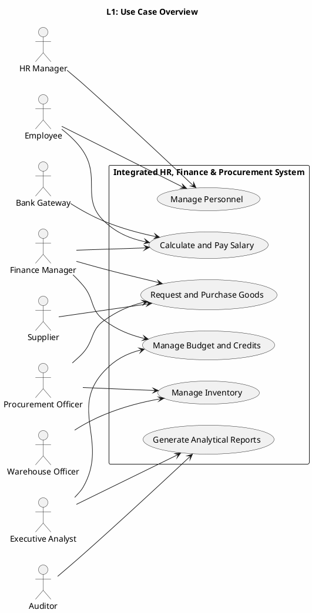
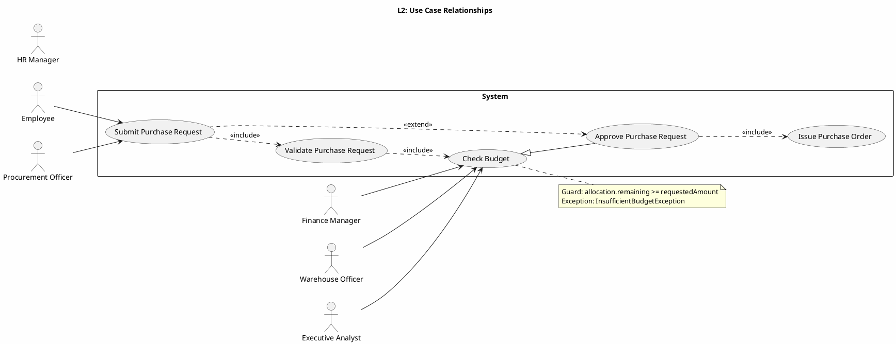

# UML 2.5 Behavioral Diagrams — Use Case and Activity

**عنوان:** UML 2.5 Behavioral Diagrams — سیستم یکپارچه HR/Finance/Procurement  
**نسخه:** v1.0  
**تاریخ:** 2026-09-09

---

## ۱. مقدمه

این سند دو نوع نمودار رفتاری UML 2.5 را در سه سطح انتزاع ارائه می‌کند:

- **Use Case:** بازیگران، اهداف کسب‌وکار، روابط include/extend/generalization و سناریوهای استثنا را ثبت می‌کند.
- **Activity:** جریان کار، تصمیم‌ها، شاخه‌های موازی، Swimlane، Pin و Signal را نشان می‌دهد.

نام‌های مشترک با DFD و BPMN شامل `Employee`، `PayrollRun`، `BudgetAllocation`، `PurchaseRequest`، `PurchaseOrder`، `StockLot`، `GoodsReceipt`، `Payment`، `Report` و `AuditLog` است.

---

## ۲. نمودار مورد استفاده — نوع ۸

### ۲.۱ سطح ۱ — چشم‌انداز دامنه



**توضیح:** بازیگران اصلی و شش قابلیت کلان سیستم در مرز سامانه نمایش داده شده‌اند. `Employee` و `HRManager` مدیریت پرسنل، `FinanceManager` حقوق و بودجه، `ProcurementOfficer` خرید، `WarehouseOfficer` انبار و `ExecutiveAnalyst` گزارش‌گیری را هدایت می‌کنند. `Supplier` و `BankGateway` سرویس‌های بیرونی زنجیره تأمین و پرداخت هستند. `Auditor` فقط به گزارش‌ها و شواهد ممیزی دسترسی دارد.

### ۲.۲ سطح ۲ — include، extend و تعمیم



**توضیح:** «ثبت درخواست خرید» همواره «اعتبارسنجی درخواست» و «بررسی بودجه» را شامل می‌شود. «تأیید درخواست خرید» در شرایط خاص، مسیر ثبت را گسترش می‌دهد و صدور سفارش را شامل می‌شود. تعمیم `Approve Purchase Request` از `Check Budget` نشان می‌دهد که تأیید، زیرمجموعه‌ای از بررسی اعتبار است. نگهبان بودجه و استثنا در یادداشت مشخص شده‌اند.

### ۲.۳ سطح ۳ — مشخصه سناریوها و استثناها

| شناسه مورد استفاده | مسیر اصلی | مسیر جایگزین | مسیر استثنا | پیش‌شرط | پس‌شرط |
|---|---|---|---|---|---|
| UC-HR-01 Manage Personnel | ثبت و تأیید تغییرات پرسنلی | بازگشت برای اصلاح | `AuthorizationException` | نقش HR فعال است | `Employee` و `AuditLog` به‌روز |
| UC-PAY-01 Calculate and Pay Salary | `calculateSalary()` و `postPayment()` | retry پرداخت | `CalculationException`، `PaymentFailedException` | دوره حقوق باز است | `PayrollRun` تأیید یا ناموفق |
| UC-BUD-01 Manage Budget | تعریف بودجه و تخصیص | تخصیص مجدد | `InsufficientBudgetException` | مدیر مالی مجاز است | `BudgetAllocation` پایدار |
| UC-PROC-01 Request and Purchase Goods | ایجاد PR و صدور PO | اصلاح سطر یا تامین‌کننده | `ValidationException` | کالا و مبلغ معتبرند | `PurchaseRequest` تأیید شده |
| UC-INV-01 Manage Inventory | ثبت رسید و تخصیص لات | دریافت ناقص | `StockShortageException` | PO معتبر است | `StockLot` و `GoodsReceipt` به‌روز |
| UC-REP-01 Generate Analytical Reports | تولید `Report` | درخواست اصلاح | `DataQualityException` | دوره و معیارها معتبرند | `Report` منتشر شده |

**سناریوی جایگزین PR:** اگر سطر ناقص باشد، درخواست به حالت `Draft` برمی‌گردد و نسخه جدید ایجاد می‌شود. اگر بودجه ناکافی باشد، `FinanceManager` می‌تواند درخواست تخصیص مجدد ثبت کند. در صورت رد تخصیص مجدد، درخواست خرید نهایی رد و در `AuditLog` ثبت می‌شود.

**سناریوی استثنا Payroll:** اگر `calculateSalary()` مقدار منفی تولید کند یا قوانین مالی نقض شوند، `PayrollRun` به `Failed` می‌رود و هیچ `Payment` ایجاد نمی‌شود. اگر درگاه پاسخ ندهد، پیام به صف retry منتقل شده و حداکثر سه بار تلاش انجام می‌شود.

---

## ۳. نمودار فعالیت — نوع ۹

### ۳.۱ سطح ۱ — ثبت و پردازش درخواست خرید

```plantuml
@startuml ARCH-L1-Activity
skinparam backgroundColor #FEFEFE
left to right direction

title L1: Purchase Request Processing

start
:Create PurchaseRequest;
:Validate requester and lines;
if (Valid?) then (yes)
  :Submit for budget check;
  :Check BudgetAllocation;
  if (Budget available?) then (yes)
    :Reserve budget;
    :Manager approval;
    if (Approved?) then (yes)
      :Issue PurchaseOrder;
      :Send PO to Supplier;
      stop
    else (no)
      :Reject request;
      :Release reservation;
      stop
    endif
  else (no)
    :Request reallocation;
    stop
  endif
else (no)
  :Reject request;
  :Release reservation;
  stop
endif

@enduml
```

**توضیح:** فعالیت سطح ۱ چرخه درخواست خرید را از ایجاد تا ارسال سفارش نشان می‌دهد. تصمیم‌های اعتبارسنجی، بودجه و تأیید مدیر مسیرهای اصلی و استثنا را جدا می‌کنند. رزرو بودجه فقط پس از اعتبارسنجی انجام می‌شود و رد درخواست، رزرو را آزاد می‌کند. این جریان با DFD-L3.2 و BPMN-L3 Budget-Check for Purchase Request هم‌ردیف است.

### ۳.۲ سطح ۲ — شاخه‌های موازی و شرطی

```plantuml
@startuml ARCH-L2-Activity
skinparam backgroundColor #FEFEFE
left to right direction

title L2: Purchase Request with Parallel Review

start
:Create PurchaseRequest;
fork
  :Validate product catalog;
  :Validate supplier terms;
fork again
  :Check BudgetAllocation;
  :Check approval authority;
end fork
if (All checks passed?) then (yes)
  :Reserve budget;
  fork
    :Prepare PurchaseOrder;
    :Notify Procurement Officer;
  fork again
    :Notify Finance Manager;
    :Create audit event;
  end fork
  :Issue PurchaseOrder;
  stop
else (no)
  if (Correctable?) then (yes)
    :Return for correction;
    stop
  else (no)
    :Reject request;
    :Release reservation;
    stop
  endif
endif

@enduml
```

**توضیح:** اعتبارسنجی کالا و شرایط تامین‌کننده به‌صورت موازی با بررسی بودجه و سطح اختیار انجام می‌شود. شاخه‌ها فقط زمانی به صدور سفارش می‌رسند که همه بررسی‌ها موفق باشند. مسیر قابل اصلاح به درخواست‌دهنده بازمی‌گردد و مسیر غیرقابل اصلاح، رزرو را آزاد می‌کند. `AuditLog` همزمان با تصمیم نهایی ثبت می‌شود.

### ۳.۳ سطح ۳ — Activity با Swimlane، Pin و Signal

```plantuml
@startuml ARCH-L3-Activity
skinparam backgroundColor #FEFEFE
left to right direction

swimlane "Procurement Officer" as PROC {
  start
  :Create PurchaseRequest;
  :Submit Request;
  <<sendSignal>> SubmitPurchaseRequest
}

swimlane "Validation Service" as VAL {
  <<receiveSignal>> SubmitPurchaseRequest
  :Validate Lines;
  if (Lines valid?) then (yes)
    :Publish ValidatedRequest;
  else (no)
    :Publish ValidationFailed;
    stop
  endif
}

swimlane "Finance Manager" as FIN {
  <<receiveSignal>> ValidatedRequest
  :Check BudgetAllocation;
  if (Budget available?) then (yes)
    :Reserve Budget;
    :Approve Request;
    <<sendSignal>> ApprovedRequest;
  else (no)
    <<sendSignal>> BudgetUnavailable;
    stop
  endif
}

swimlane "Procurement Service" as SVC {
  <<receiveSignal>> ApprovedRequest
  :Issue PurchaseOrder;
  <<sendSignal>> PurchaseOrderIssued;
  stop
  <<receiveSignal>> BudgetUnavailable
  :Release Reservation;
  :Publish RequestRejected;
  stop
}

swimlane "Supplier" as SUP {
  <<receiveSignal>> PurchaseOrderIssued
  :Acknowledge Order;
  <<sendSignal>> OrderAcknowledged;
  stop
}

@enduml
```

**توضیح:** Swimlaneها نقش‌های درخواست‌دهنده، اعتبارسنج، مدیر مالی، سرویس خرید و تامین‌کننده را جدا می‌کنند. `SubmitPurchaseRequest`، `ValidatedRequest`، `ApprovedRequest` و `PurchaseOrderIssued` سیگنال‌های ناهمگام بین نقش‌ها هستند. مسیر بودجه ناکافی، رزرو را آزاد و درخواست را رد می‌کند؛ مسیر موفق به صدور `PurchaseOrder` می‌رسد. Pinهای ورودی/خروجی به‌صورت داده‌های `RequestCommand`، `PurchaseRequest` و `PurchaseOrder` در جدول زیر مشخص شده‌اند.

| Action | Pin ورودی | Pin خروجی | Signal |
|---|---|---|---|
| Submit Request | `RequestCommand` | `PurchaseRequest` | `SubmitPurchaseRequest` |
| Validate Lines | `PurchaseRequest` | `ValidatedRequest` | `ValidationFailed` در خطا |
| Check Budget | `ValidatedRequest` | `BudgetDecision` | `ApprovedRequest` یا `BudgetUnavailable` |
| Issue PurchaseOrder | `ApprovedRequest` | `PurchaseOrder` | `PurchaseOrderIssued` |
| Acknowledge Order | `PurchaseOrder` | `Acknowledgement` | `OrderAcknowledged` |

---

## ۴. ردپا و قوانین رفتاری

| شناسه UML | DFD | BPMN | Entity / Method |
|---|---|---|---|
| UC-PROC-01 | DFD-L2.4 / DFD-L3.2 | BPMN-L3 Budget Check PR | `PurchaseRequest.submit()` |
| UC-PAY-01 | DFD-L2.2 / DFD-L3.1 | BPMN-L3 Payroll Approval | `PayrollRun.calculateSalary()` |
| UC-BUD-01 | DFD-L2.3 | BPMN-L2 Budget | `BudgetAllocation.checkBudget()` |
| UC-INV-01 | DFD-L2.5 / DFD-L3.3 | BPMN-L3 Stock Allocation | `StockLot.allocate()` |
| UC-REP-01 | DFD-L2.6 | BPMN-L2 Reporting | `ReportEngine.generateReport()` |

1. هر Use Case باید حداقل یک مسیر خوشحال، یک مسیر جایگزین و یک مسیر استثنا داشته باشد.
2. هر Activity سطح ۳ باید نقش‌ها، داده‌های ورودی/خروجی و سیگنال‌های مرزی را مشخص کند.
3. تصمیم‌های بودجه و موجودی نباید بدون ثبت `AuditLog` انجام شوند.
4. فعالیت‌های موازی فقط در نقاطی مجاز‌اند که وابستگی داده‌ای بین آن‌ها وجود نداشته باشد.
5. همه نام متدها با Class Diagram، Sequence Diagram و BPMN یکسان نگه داشته می‌شوند.

*پایان سند Use Case و Activity*
