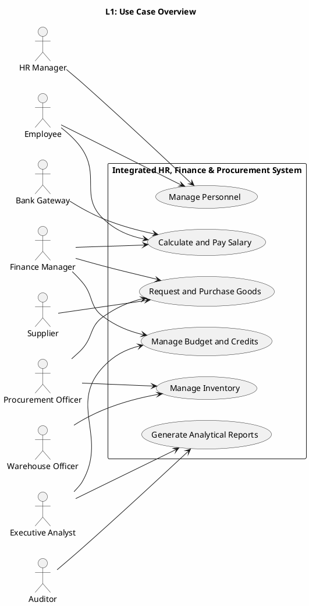
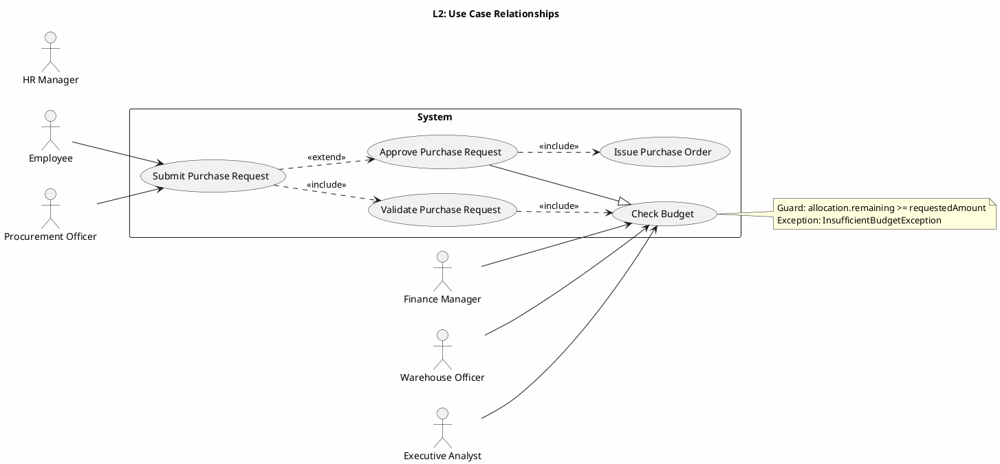

# UML 2.5 Behavioral Diagrams — Use Case and Activity

**Title:** UML 2.5 Behavioral Diagrams — Integrated HR/Finance/Procurement System
**Version:** v1.0
**Date:** 2026-09-09

---

## 1. Introduction

This document presents two types of UML 2.5 behavioral diagrams at three levels of abstraction:

- **Use Case:** Captures actors, business goals, include/extend/generalization relationships, and exception scenarios.
- **Activity:** Shows workflow, decisions, parallel branches, Swimlanes, Pins, and Signals.

Names shared with DFD and BPMN include `Employee`, `PayrollRun`, `BudgetAllocation`, `PurchaseRequest`, `PurchaseOrder`, `StockLot`, `GoodsReceipt`, `Payment`, `Report`, and `AuditLog`.

---

## 2. Use Case Diagram — Type 8

### 2.1 Level 1 — Domain Overview


**Explanation:** The main actors and the six coarse-grained system capabilities are shown at the system boundary. `Employee` and `HRManager` drive personnel management; `FinanceManager` drives payroll and budget; `ProcurementOfficer` drives purchasing; `WarehouseOfficer` drives inventory; `ExecutiveAnalyst` drives reporting. `Supplier` and `BankGateway` are external services for the supply chain and payment. `Auditor` has read-only access to reports and audit evidence.

### 2.2 Level 2 — include, extend, and generalization



**Explanation:** "Submit Purchase Request" always includes "Validate Purchase Request" and "Check Budget". "Approve Purchase Request" extends the submission flow under specific conditions and includes issuing the purchase order. The generalization from `Check Budget` to `Approve Purchase Request` shows that approval is a specialized form of budget review. The budget guard and exception are documented in the attached note.

### 2.3 Level 3 — Scenario and exception specifications

| Use Case ID | Main Path | Alternative Path | Exception Path | Pre-condition | Post-condition |
|---|---|---|---|---|---|
| UC-HR-01 Manage Personnel | Record and approve personnel changes | Return for correction | `AuthorizationException` | HR role is active | `Employee` and `AuditLog` are up to date |
| UC-PAY-01 Calculate and Pay Salary | `calculateSalary()` and `postPayment()` | Retry payment | `CalculationException`, `PaymentFailedException` | Payroll period is open | `PayrollRun` is approved or failed |
| UC-BUD-01 Manage Budget | Define budget and allocate | Reallocate | `InsufficientBudgetException` | Finance manager is authorized | `BudgetAllocation` is stable |
| UC-PROC-01 Request and Purchase Goods | Create PR and issue PO | Correct line or supplier | `ValidationException` | Item and amount are valid | `PurchaseRequest` is approved |
| UC-INV-01 Manage Inventory | Record receipt and allocate lot | Partial receipt | `StockShortageException` | PO is valid | `StockLot` and `GoodsReceipt` are up to date |
| UC-REP-01 Generate Analytical Reports | Generate `Report` | Request correction | `DataQualityException` | Period and criteria are valid | `Report` is published |

**Alternative PR scenario:** If a line is incomplete, the request returns to `Draft` state and a new revision is created. If the budget is insufficient, `FinanceManager` can submit a reallocation request. If the reallocation is rejected, the purchase request is finally rejected and recorded in `AuditLog`.

**Payroll exception scenario:** If `calculateSalary()` produces a negative value or tax rules are violated, `PayrollRun` transitions to `Failed` and no `Payment` is created. If the payment gateway does not respond, the message is enqueued for retry with a maximum of three attempts.

---

## 3. Activity Diagram — Type 9

### 3.1 Level 1 — Purchase Request Processing

```plantuml
@startuml ARCH-L1-Activity
skinparam backgroundColor #FEFEFE
left to right direction

title L1: Purchase Request Processing

start
:Create PurchaseRequest;
:Validate requester and lines;
if (Valid?) then (yes)
  :Submit for budget check;
  :Check BudgetAllocation;
  if (Budget available?) then (yes)
    :Reserve budget;
    :Manager approval;
    if (Approved?) then (yes)
      :Issue PurchaseOrder;
      :Send PO to Supplier;
      stop
    else (no)
      :Reject request;
      :Release reservation;
      stop
    endif
  else (no)
    :Request reallocation;
    stop
  endif
else (no)
  :Reject request;
  :Release reservation;
  stop
endif

@enduml
```

**Explanation:** Level 1 activity shows the purchase request lifecycle from creation to order dispatch. Budget, validity, and manager-approval decisions separate the main path from exception paths. Budget reservation occurs only after validation passes, and request rejection releases the reservation. This flow is aligned with DFD-L3.2 and BPMN-L3 Budget-Check for Purchase Request.

### 3.2 Level 2 — Conditional and parallel branches

```plantuml
@startuml ARCH-L2-Activity
skinparam backgroundColor #FEFEFE
left to right direction

title L2: Purchase Request with Parallel Review

start
:Create PurchaseRequest;
fork
  :Validate product catalog;
  :Validate supplier terms;
fork again
  :Check BudgetAllocation;
  :Check approval authority;
end fork
if (All checks passed?) then (yes)
  :Reserve budget;
  fork
    :Prepare PurchaseOrder;
    :Notify Procurement Officer;
  fork again
    :Notify Finance Manager;
    :Create audit event;
  end fork
  :Issue PurchaseOrder;
  stop
else (no)
  if (Correctable?) then (yes)
    :Return for correction;
    stop
  else (no)
    :Reject request;
    :Release reservation;
    stop
  endif
endif

@enduml
```

**Explanation:** Product catalog and supplier terms are validated in parallel with budget review and authority check. Branches reach order issuance only when all checks pass. The correctable path returns to the requester; the non-correctable path releases the reservation. `AuditLog` is written concurrently with the final decision.

### 3.3 Level 3 — Activity with Swimlane, Pin, and Signal

```plantuml
@startuml ARCH-L3-Activity
skinparam backgroundColor #FEFEFE
left to right direction

title L3: Purchase Request with Swimlane, Pin, and Signal

swimlane "Procurement Officer" as PROC {
  start
  :Create PurchaseRequest;
  :Submit Request;
  :Send signal SubmitPurchaseRequest;
}

swimlane "Validation Service" as VAL {
  :Receive signal SubmitPurchaseRequest;
  :Validate Lines;
  if (Lines valid?) then (yes)
    :Publish ValidatedRequest;
  else (no)
    :Publish ValidationFailed;
    stop
  endif
}

swimlane "Finance Manager" as FIN {
  :Receive signal ValidatedRequest;
  :Check BudgetAllocation;
  if (Budget available?) then (yes)
    :Reserve Budget;
    :Approve Request;
    :Send signal ApprovedRequest;
  else (no)
    :Send signal BudgetUnavailable;
    stop
  endif
}

swimlane "Procurement Service" as SVC {
  :Receive signal ApprovedRequest;
  :Issue PurchaseOrder;
  :Send signal PurchaseOrderIssued;
  stop
  :Receive signal BudgetUnavailable;
  :Release Reservation;
  :Publish RequestRejected;
  stop
}

swimlane "Supplier" as SUP {
  :Receive signal PurchaseOrderIssued;
  :Acknowledge Order;
  :Send signal OrderAcknowledged;
  stop
}

@enduml
```

**Explanation:** Swimlanes separate the requester, validator, financier, procurement service, and supplier roles. `SubmitPurchaseRequest`, `ValidatedRequest`, `ApprovedRequest`, and `PurchaseOrderIssued` are asynchronous signals crossing role boundaries. The insufficient-budget path releases the reservation and rejects the request; the success path issues `PurchaseOrder`.

**Pin documentation (structured input/output contracts):**

PlantUML does not currently render UML 2.5 `Pin` notation (inputPin/outputPin) as a first-class activity-diagram element. Pins are therefore documented here as structured data contracts — the input and output object types carried by each action and signal — rather than as graphical pin nodes in the diagram.

| Action | Input Pin (contract) | Output Pin (contract) | Signal |
|---|---|---|---|
| Submit Request | `RequestCommand` | `PurchaseRequest` | `SubmitPurchaseRequest` |
| Validate Lines | `PurchaseRequest` | `ValidatedRequest` | `ValidationFailed` (on error) |
| Check Budget | `ValidatedRequest` | `BudgetDecision` | `ApprovedRequest` or `BudgetUnavailable` |
| Issue PurchaseOrder | `ApprovedRequest` | `PurchaseOrder` | `PurchaseOrderIssued` |
| Acknowledge Order | `PurchaseOrder` | `Acknowledgement` | `OrderAcknowledged` |

---

## 4. Traceability and behavioral rules

| UML ID | DFD | BPMN | Entity / Method |
|---|---|---|---|
| UC-PROC-01 | DFD-L2.4 / DFD-L3.2 | BPMN-L3 Budget Check PR | `PurchaseRequest.submit()` |
| UC-PAY-01 | DFD-L2.2 / DFD-L3.1 | BPMN-L3 Payroll Approval | `PayrollRun.calculateSalary()` |
| UC-BUD-01 | DFD-L2.3 | BPMN-L2 Budget | `BudgetAllocation.checkBudget()` |
| UC-INV-01 | DFD-L2.5 / DFD-L3.3 | BPMN-L3 Stock Allocation | `StockLot.allocate()` / `allocateStock()` |
| UC-REP-01 | DFD-L2.6 | BPMN-L2 Reporting | `ReportEngine.generateReport()` |

1. Every use case must have at least one happy path, one alternative path, and one exception path.
2. Every Level 3 activity must specify roles, input/output data, and boundary signals.
3. Budget and stock decisions must never be made without writing an `AuditLog` entry.
4. Parallel activities are only permitted where no data dependency exists between them.
5. All method names must remain consistent across Class Diagram, Sequence Diagram, and BPMN.

*End of Use Case and Activity document*
