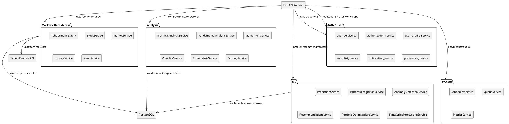

# UML Level 3 — Service Decomposition (Domain Services)

This level splits the services into Domain areas.

## Diagram (PlantUML)

## Notes
- Some routes (e.g. `/market/live/*`) are proxied directly to the **Yahoo Finance API**.
- Some routes (e.g. `/analysis/technical/{symbol}`) run on data stored in **PostgreSQL**.