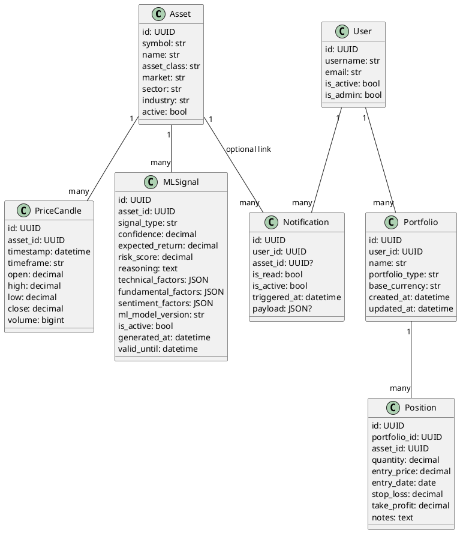

# UML Level 5 — Core Domain Classes / Schemas

This level categorizes the key classes/schemas.

> Note: For 100% accuracy, the files `app/models/models.py` and `app/schemas/schemas.py` should be read. At this stage the main entities are inferred from the routes and existing architecture.

## Diagram (PlantUML)

## Mapping to Routes
- `/market/*` operates on `Asset` and `PriceCandle`
- `/analysis/*` primarily on `PriceCandle` + `MLSignal`
- `/portfolios/*` operates on `Portfolio` and `Position`
- `/notifications*` operates on `Notification` (+ user_id via `get_route_user_id`)