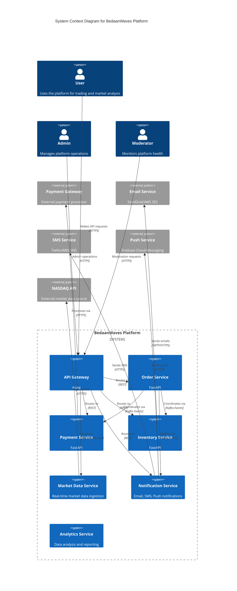
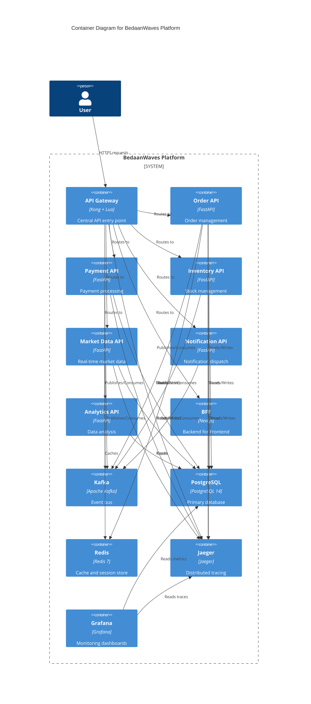
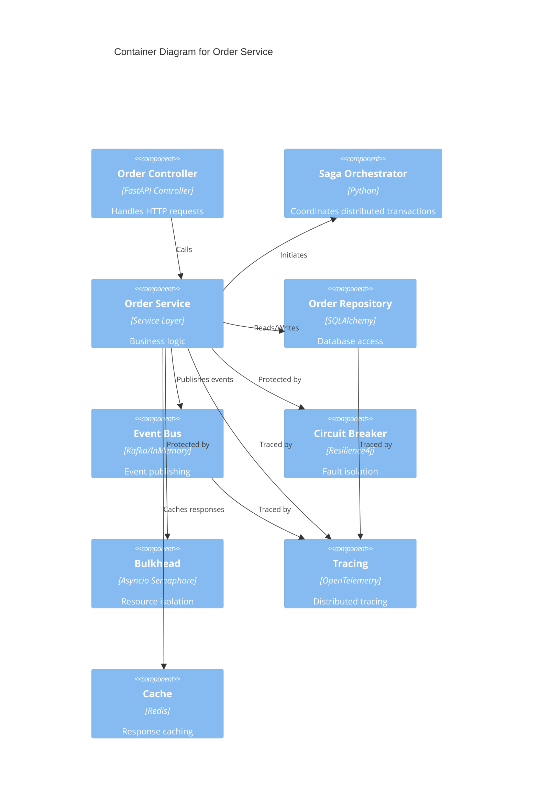

# BedaanWaves - C4 Model Architecture Documentation

## Level 1: System Context Diagram

## Level 2: Container Diagram

## Level 3: Component Diagram - Order Service

## Key Design Decisions

1. **Saga Pattern**: Orchestration-based saga for order processing
2. **Event-Driven Architecture**: Kafka for inter-service communication
3. **API Gateway**: Kong for centralized routing, auth, rate limiting
4. **Resilience**: Circuit Breaker + Bulkhead + Retry patterns
5. **Observability**: OpenTelemetry + Jaeger + Grafana
6. **Caching**: Redis for frequently accessed data
7. **Database per Service**: Each service owns its data