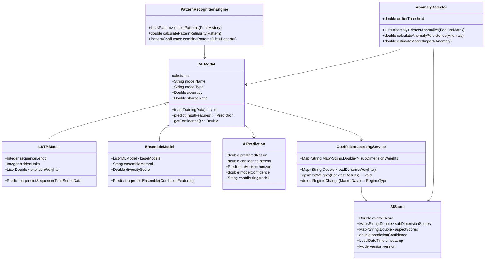

# AI Analysis in BedaanWaves Scoring System

## Overview
AI analysis leverages machine learning models and artificial intelligence to generate predictive insights, detect patterns, and identify anomalies in market data. This dimension contributes 10% to the overall 6D score, providing forward-looking signals that complement fundamental, technical, and other analytical approaches.

**Important**: The coefficient/weight of each dimension, sub-dimension, aspect, and sub-aspect is dynamically determined through machine learning models and is **not static**. The CoefficientLearningService continuously optimizes these weights based on backtest performance, regime changes, and evolving market conditions.

## Detailed Hierarchical Structure

| Level | Dimension / Aspect / Sub-Aspect |
|-------|-----------------------------------|
| **Level 1** | **AI** (10% weight) |
| **Level 2** | `Machine_Learning_Predictions`, `Pattern_Recognition`, `Anomaly_Detection` |
| **Level 3 – ML_Predictions** | Ensemble Modeling, Model Confidence, Prediction Horizon |
| **Level 4 – ML_Predictions Sub-Aspects** | `XGBoost_Model_Vote`, `LightGBM_Meta_Factor`, `LSTM_Sequence_Weight`, `Transformer_Attention_Score`, `Prediction_Confidence_80pc`, `Prediction_Confidence_95pc`, `Short_term_Horizon_1d`, `Medium_term_Horizon_5d`, `Long_term_Horizon_20d`, `Model_Voting_Consensus`, `Ensemble_Diversity_Score`, `Backtest_Sharpe_Ratio`, `Hit_Rate_Directional` |
| **Level 3 – Pattern_Recognition** | CNN-Based Detection, Temporal Patterns, Cross-Asset Patterns |
| **Level 4 – Pattern_Recognition Sub-Aspects** | `CNN_Chart_Pattern_Detector`, `LSTM_Sequence_Matcher`, `Transformer_Cross_Asset_Model`, `Pattern_Accuracy_Score`, `Pattern_Frequency_Index`, `Pattern_Reliability_Score`, `Pattern_Confluence_Count`, `Pattern_Divergence_Flag`, `Pattern_Confidence_Level`, `Pattern_Regime_Beta`, `Pattern_Timing_Window_1d`, `Pattern_Timing_Window_5d`, `Pattern_Timing_Window_20d` |
| **Level 3 – Anomaly_Detection** | Outlier Detection, Persistence Analysis, Impact Scoring |
| **Level 4 – Anomaly_Detection Sub-Aspects** | `Isolation_Forest_Outlier_Score`, `AutoEncoder_Reconstruction_Error`, `OneClassSVM_Anomaly_Flag`, `Anomaly_Persistence_Hours`, `Anomaly_False_Positive_Rate`, `Anomaly_True_Positive_Rate`, `Anomaly_Market_Impact_1d`, `Anomaly_Market_Impact_3d`, `Volume_Anomaly_Score`, `Volatility_Anomaly_Score`, `Correlation_Anomaly_Score`, `Anomaly_Confidence_Level` |

---

## Data Sources
- Historical price and volume data
- Fundamental financial statements
- Technical indicator calculations
- Sentiment analysis scores
- Macroeconomic indicators
- News article content and sentiment
- Market microstructure data
- External alternative data sources (satellite imagery, web traffic, etc.)

## Key Metrics Analyzed

### Machine Learning Predictions
- **Ensemble Model Predictions**: Combined output from multiple ML models
- **Prediction Confidence**: Model uncertainty quantification
- **Prediction Horizon**: Short-term, medium-term, long-term forecasts
- **Model Contribution Weights**: How much each model contributes to ensemble
- **Prediction Consistency**: Agreement between different model approaches
- **Backtest Performance**: Historical accuracy of model predictions
- **Sharpe Ratio of AI Strategy**: Risk-adjusted return of AI-driven trades
- **Hit Rate**: Percentage of correct directional predictions

### Pattern Recognition Metrics
- **Technical Pattern Accuracy**: Success rate of identified chart patterns
- **Pattern Frequency**: How often patterns occur across the market
- **Pattern Reliability Score**: Historical performance of each pattern type
- **Pattern Confluence**: Multiple patterns aligning simultaneously
- **Pattern Divergence**: When patterns contradict other signals
- **Deep Learning Pattern Detection**: CNN-based pattern identification
- **Anomaly Pattern Classification**: Unusual pattern recognition
- **Regime-Aware Pattern Performance**: Pattern effectiveness by market regime

### Anomaly Detection Metrics
- **Outlier Detection Score**: Degree of deviation from expected behavior
- **Anomaly Persistence**: How long anomalies continue
- **False Positive Rate**: Incorrect anomaly flags
- **True Positive Rate**: Correctly identified anomalies
- **Market Impact of Anomalies**: Subsequent price movement after anomaly detected
- **Volume Anomalies**: Unusual trading volume patterns
- **Volatility Anomalies**: Unexpected volatility spikes or drops
- **Correlation Anomalies**: Unusual relationship changes between assets

## Machine Learning Models

### Time Series Forecasting Models
- **LSTM Neural Networks**: Long Short-Term Memory for sequence modeling
- **GRU Networks**: Gated Recurrent Units for temporal patterns
- **Transformer Models**: Attention-based sequence-to-sequence models
- **Prophet**: Additive regression model for time series forecasting
- **ARIMA Models**: AutoRegressive Integrated Moving Average
- **VAR Models**: Vector Autoregression for multivariate forecasting
- **WaveNet**: Dilated convolutional neural networks for forecasting
- **Temporal Convolutional Networks**: CNN-based time series modeling

### Ensemble Methods
- **Gradient Boosting**: XGBoost, LightGBM, CatBoost
- **Random Forest**: Tree-based ensemble learning
- **Stacking Models**: Combining predictions from multiple base models
- **Blending Models**: Weighted average of different model types
- **Voting Classifiers**: Combining discrete predictions
- **Dynamic Ensemble Selection**: Choosing best model per context
- **Online Learning Models**: Updating models incrementally
- **Multi-Task Learning**: Simultaneously optimizing multiple objectives

### Deep Learning Architectures
- **Convolutional Neural Networks**: Pattern recognition in price charts
- **Recurrent Neural Networks**: Sequential data processing
- **Attention Mechanisms**: Focusing on relevant time periods
- **Autoencoders**: Unsupervised anomaly detection
- **Generative Adversarial Networks**: Synthetic data generation
- **Graph Neural Networks**: Relationship modeling between assets
- **Reinforcement Learning Agents**: Adaptive trading strategy optimization
- **Bayesian Neural Networks**: Uncertainty-aware predictions

## Analysis Process
1. **Data Preparation**: Clean, normalize, and structure data for ML models
2. **Feature Engineering**: Create relevant features from raw data
3. **Model Training**: Train multiple models on historical data
4. **Ensemble Creation**: Combine model predictions
5. **Validation**: Backtest performance on out-of-sample data
6. **Pattern Detection**: Identify and classify market patterns
7. **Anomaly Scoring**: Calculate deviation from normal behavior
8. **Confidence Assessment**: Quantify prediction uncertainty
9. **Signal Generation**: Convert ML outputs to trading signals
10. **Score Normalization**: Convert to 0-100 scale
11. **Weight Application**: Apply ML-optimized weights
12. **Aggregation**: Combine with pattern recognition and anomaly detection outputs

## Model Management and Monitoring
- **Model Performance Tracking**: Continuous monitoring of prediction accuracy
- **Retraining Schedule**: Regular model updates with new data
- **Drift Detection**: Identifying when models become outdated
- **A/B Testing**: Comparing new models against production models
- **Feature Importance**: Understanding which inputs drive predictions
- **Model Explainability**: SHAP values and interpretability tools
- **Bias/Fairness Monitoring**: Ensuring models don't exhibit unwanted biases
- **Computational Efficiency**: Model inference speed and resource usage

## Output Interpretation
AI analysis produces forward-looking signals with confidence intervals:
- **85-100**: High-confidence bullish predictions with strong model consensus
- **70-84**: Positive outlook with moderate to high model confidence
- **55-69**: Neutral signals with mixed model predictions
- **40-54**: Negative outlook with moderate model confidence
- **20-39**: Strong bearish predictions with low confidence or high uncertainty
- **0-19**: Very high-confidence bearish predictions or extreme uncertainty

## Integration with Other Dimensions
AI analysis enhances other dimensions by:
- **Feature Generation**: Creating new features for fundamental models
- **Signal Confirmation**: Validating technical analysis patterns
- **Sentiment Enhancement**: Improving news sentiment classification
- **Risk Adjustment**: Adjusting Value-at-Risk based on ML volatility forecasts
- **Macro Forecasting**: Predicting economic indicator movements
- **Dynamic Weighting**: Continuously optimizing 6D component weights

## BPMN Workflow Diagram

```mermaid
flowchart TD
    subgraph Data_Ingestion[" Data Ingestion"]
        A1[Historical Price Data] --> A2[Feature Store Ingestion]
        A2 --> A3[Fundamental Data Feed]
        A3 --> A4[Sentiment API Integration]
        A4 --> A5[Macro Indicator Stream]
        A5 --> A6[Test Dataset Allocation]
    end

    subgraph Feature_Engineering["️ Feature Engineering"]
        A6 --> B1[Price-Derived Features]
        B1 --> B1a[OHLCV Technical Indicators]
        B1 --> B1b[Lagged Returns, Rolling Statistics]
        B1 --> B1c[Volume-Adjusted Returns]
        A6 --> B2[Fundamental Features]
        B2 --> B2a[Financial Ratios (P/E, ROE, etc.)]
        B2 --> B2b[Sentiment & News Impact Scores]
        B2 --> B2c[Macro Indicators (GDP, Inflation)]
        A6 --> B3[Cross-Asset Features]
        B3 --> B3a[Cross-Asset Correlations]
        B3 --> B3b[Relative Strength vs Peers]
        B3 --> B3c[Market Regime Features]
        B1 & B2 & B3 --> B4[Feature Selection via SHAP Importance]
    end

    subgraph Model_Training[" Model Training & Validation"]
        B4 --> C1[Model Training (XGBoost, LightGBM)]
        C1 --> C1a[Hyperparameter Optimization (GridSearch/Bayesian)]
        C1a --> C2[Model Validation (Walk-forward CV)]
        C2 --> C2a[Performance Metrics (RMSE, MAE)]
        C2 --> C2b[Overfitting Check (Train vs Test)]
        C2 --> C2c[Backtesting Engine (Sharpe, Max DD)]
        C2c --> C3[Best Model Selection]
        C3 --> C4[Time Series Cross-Validation]
        C4 --> C5[LSTM/Transformer Training]
        C5 --> C6[Deep Learning Validation (Attention Heads)]
        C6 --> C7[Model Interpretability (SHAP/LIME)]
    end

    subgraph Pattern_Recognition[" Pattern Recognition"]
        C7 --> D1[CNN-Based Pattern Detector]
        D1 --> D1a[Candlestick Pattern Classifier]
        D1 --> D1b[Head & Shoulders, Double Top/Bottom, Triangles]
        D1 --> D1c[Pattern Confluence]
        D1 --> D1d[Pattern Divergence]
        D1 --> D1e[Pattern Reliability Rating]

        C7 --> D2[Anomaly Detection Engine]
        D2 --> D2a[Anomaly Persistence]
        D2 --> D2b[False Positive Rate]
        D2 --> D2c[True Positive Rate]
        D2 --> D2d[Anomaly Market Impact]
        D2 --> D2e[Anomaly Confidence Level]
    end

    subgraph Ensemble_Deployment[" Ensemble & Deployment"]
        D1 --> E1[Ensemble Voting Layer]
        D1 --> E1a[Stacking Meta-Learner]
        D1 --> E1b[Blending Weighted Model]
        D1 --> E1c[Dynamic Ensemble Selection]
        D1 --> E1d[Online Learning Models]
        D1 --> E1e[Multi-Task Learning]
        D2 --> E1

        D2 --> E2[Anomaly Pattern Classification]
        E1 & E2 --> E3[Model Deployment (FastAPI)]
        E3 --> E3a[REST/gRPC Endpoints]
        E3 --> E3b[Async Task Queue (Celery)]
        E3 --> E3c[Real-time Prediction API]
    end

    subgraph Coefficient_Integration["️ Coefficient Integration"]
        E3 --> F1[CoefficientLearningService (Dynamic Weights)]
        F1 --> F1a[AutoML Hyperparameter Tuning]
        F1 --> F1b[A/B Testing Framework]
        F1 --> F1c[Drift Detection (KL Divergence)]
        F1 --> F1d[Model Registry & Governance]
        F1 --> F1e[Feature Importance Refresh]
    end

    subgraph Signal_Generation[" Signal Generation"]
        F1 --> G1[Prediction Confidence Scoring]
        G1 --> G1a[Short-term Horizon (1-day)]
        G1 --> G1b[Medium-term Horizon (5-day)]
        G1 --> G1c[Long-term Horizon (20-day)]
        G1 --> G1d[Prediction Consistency Check]
        G1 --> G1e[Model Contribution Weights]
        G1 --> G1f[Backtest Performance]
        G1 --> G1g[Hit Rate Validation]

        G1 --> G2[Signal Scoring Engine]
        G2 --> G2a[Pattern Confl Unement]
        G2 --> G2b[Anomaly Scoring]
        G2 --> G2c[Signal Confidence Interval]
        G2 --> G2d[Cross-Asset Signal Validation]
    end

    subgraph Output_Pipeline[" Output Pipeline"]
        G2 --> H1[Score Normalization (0-100)]
        H1 --> H1a[AI Score (10% weight)]
        H1 --> H1b[Sub-Dimension Scores]
        H1 --> H1c[Aspect-Level Scores]

        H1 --> H2[Signal Generation]
        H2 --> H2a[High-Confidence Trade Signals]
        H2 --> H2b[Anomaly-Based Alerts]
        H2 --> H2c[Pattern-Based Recommendations]
        H2 --> H2d[Model Uncertainty Bounds]
        H2 --> H2e[Lift Score (AI vs Baseline)]
        H2 --> H2f[Feature Attribution Summary]

        H1 & H2 --> H3[6D Composite Score Integration]
        H3 --> H3a[Dashboard Visualization]
        H3 --> H3b[API Endpoints (REST/gRPC)]
        H3 --> H3c[Alerting System]
        H3 --> H3d[Portfolio Integration Engine]
    end

    subgraph Monitoring[" Monitoring & Feedback Loop"]
        H3 --> I1[Continuous Performance Tracker]
        I1 --> I1a[Prediction Accuracy Decay]
        I1 --> I1b[Data Drift Detection]
        I1 --> I1c[Regime Shift Alerts]
        I1 --> I1d[Model Version Rollout]
        I1 --> I1e[Model Retraining Trigger]
        I1 --> I1f[Feature Drift Alerts]
        I1 --> I1g[Prediction Latency Monitoring]
        I1 --> I1h[API Health Checks]
        I1 --> I1i[Anomaly Rate Monitor]

        I1 --> I2[Feedback Engine]
        I2 --> I2a[Human-in-the-Loop Feedback]
        I2 --> I2b[Active Learning Pipeline]
        I2 --> I2c[Bias/Fairness Monitor]
        I2 --> I2d[Synthetic Data Generator]
        I2 --> I2e[Model Ensemble Pruning]
        I2 --> I2f[New Feature Proposal Engine]
        I2 --> I2g[Cross-Model Agreement Score]

        I2 --> F1
        I2 --> C3
        I1i --> C1
        I1e --> E3
        I2f --> C5
    end

    style Data_Ingestion fill:#e3f2fd
    style Feature_Engineering fill:#e8f5e9
    style Model_Training fill:#fff3e0
    style Pattern_Recognition fill:#fce4ec
    style Ensemble_Deployment fill:#e0f2f1
    style Coefficient_Integration fill:#f3e5f5
    style Signal_Generation fill:#fff8e1
    style Output_Pipeline fill:#e0f7fa
    style Monitoring fill:#fbe9e7
```

## Data Flow Diagram (DFD)

```mermaid
graph LR
    subgraph External_Sources
        ES1[Historical Market Data]
        ES2[Fundamental APIs]
        ES3[Sentiment Feeds]
        ES4[Macro Indicators]
        ES5[Satellite/Web Traffic Data]
    end

    subgraph Ingestion_Layer
        IL1[API Connectors]
        IL2[Kafka Streams]
        IL3[Feature Store (Redis/DB)]
    end

    subgraph Processing_Layer
        PL1[Data Cleaning & Alignment]
        PL2[Feature Engineering Engine]
        PL3[LSTM/Transformer Training]
        PL4[CNN Pattern Detector]
        PL5[XGBoost/LightGBM Ensemble]
        PL6[AutoEncoder Anomaly Detector]
    end

    subgraph Scoring_Layer
        SL1[AI Scoring Engine]
        SL2[CoefficientLearningService]
        SL3[Score Aggregation Service]
    end

    subgraph API_Layer
        AL1[FastAPI Endpoints]
        AL2[WebSocket Live Feed]
    end

    subgraph Consumers
        C1[Frontend Dashboard]
        C2[Trading Engine]
        C3[Alert System]
    end

    ES1 --> IL1
    ES2 --> IL1
    ES3 --> IL1
    ES4 --> IL1
    ES5 --> IL1
    IL1 --> IL2
    IL2 --> IL3
    IL3 --> PL1
    PL1 --> PL2
    PL2 --> PL3
    PL2 --> PL4
    PL2 --> PL5
    PL2 --> PL6
    PL3 --> SL1
    PL4 --> SL1
    PL5 --> SL1
    PL6 --> SL1
    SL1 --> SL2
    SL2 --> SL3
    SL3 --> AL1
    SL3 --> AL2
    AL1 --> C1
    AL2 --> C2
    AL1 --> C3
```

## UML Class Diagram (AI Domain)



## Output Interpretation
AI analysis produces forward-looking signals with confidence intervals:
- **85-100**: High-confidence bullish predictions with strong model consensus
- **70-84**: Positive outlook with moderate to high model confidence
- **55-69**: Neutral signals with mixed model predictions
- **40-54**: Negative outlook with moderate model confidence
- **20-39**: Strong bearish predictions with low confidence or high uncertainty
- **0-19**: Very high-confidence bearish predictions or extreme uncertainty

This dimension serves as the predictive engine of the BedaanWaves scoring system, using advanced machine learning techniques to anticipate market movements and identify opportunities that traditional analysis approaches might miss.
