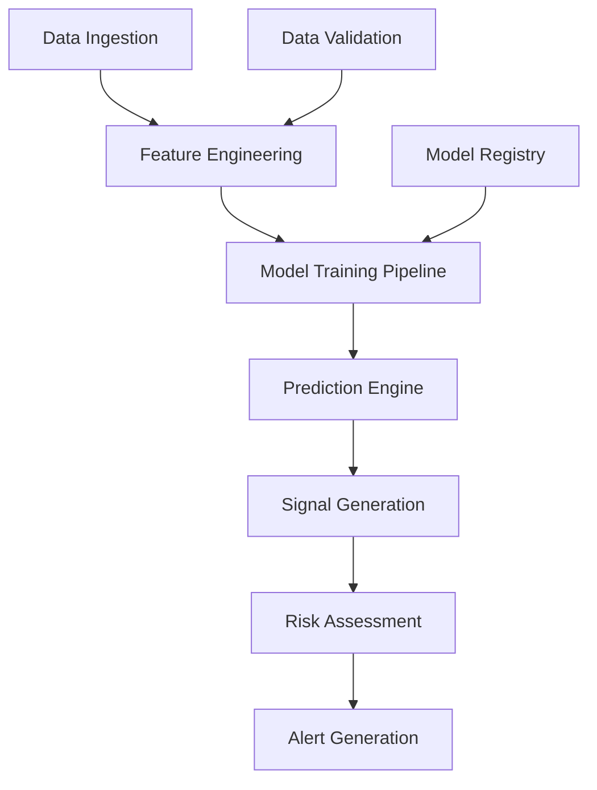

# BedaanWaves - ML Services

## Overview
Machine Learning services provide advanced analytics, predictions, pattern recognition, and automated recommendations across all asset classes.

## Key ML Services

### PredictionService
Price forecasting models using ARIMA, LSTM, and Prophet algorithms with automated model selection and continuous retraining capabilities.

**Features:**
- Multi-horizon forecasting (1 minute to 30 days)
- Ensemble of classical and deep learning models
- Confidence intervals and uncertainty quantification
- Backtesting framework for validation

**Endpoints:**
- `/api/v1/ml/predictions` - Get predictions
- `/api/v1/ml/models` - List trained models
- `/api/v1/ml/training-status` - Training progress

### PatternRecognitionService
Chart pattern detection including reversal and continuation patterns across multiple timeframes.

**Detected Patterns:**
- Reversal Patterns (23)
- Continuation Patterns (12)
- Candlestick Patterns (85+)
- Custom Composite Patterns (24)

**Endpoints:**
- `/api/v1/ml/patterns` - Detect patterns
- `/api/v1/ml/patterns/history` - Pattern performance history

### AnomalyDetectionService
Real-time outlier detection in market data and trading signals using statistical and machine learning approaches.

**Methods:**
- Isolation Forest
- Local Outlier Factor
- DBSCAN Clustering
- Autoencoders
- Statistical Control Charts

### PortfolioOptimizationService
Efficient frontier optimization using Modern Portfolio Theory with advanced constraints and risk models.

**Algorithms:**
- Mean-Variance Optimization
- Black-Litterman Model
- Risk Parity
- Hierarchical Risk Parity

### TimeSeriesForecastingService
Specialist service for time-series forecasting using ARIMA, LSTM, Prophet, and ensemble methods.

### CoefficientLearningService
Dynamic coefficient learning and feature importance ranking using SHAP, LIME, and permutation importance.

## Architecture

## Integration Points
- **Connected Services**: DataIngestionService, ScoringService, AlertService
- **Dependencies**: CacheService, DatabaseService
- **Consumers**: Frontend dashboard, Trading bots, API clients