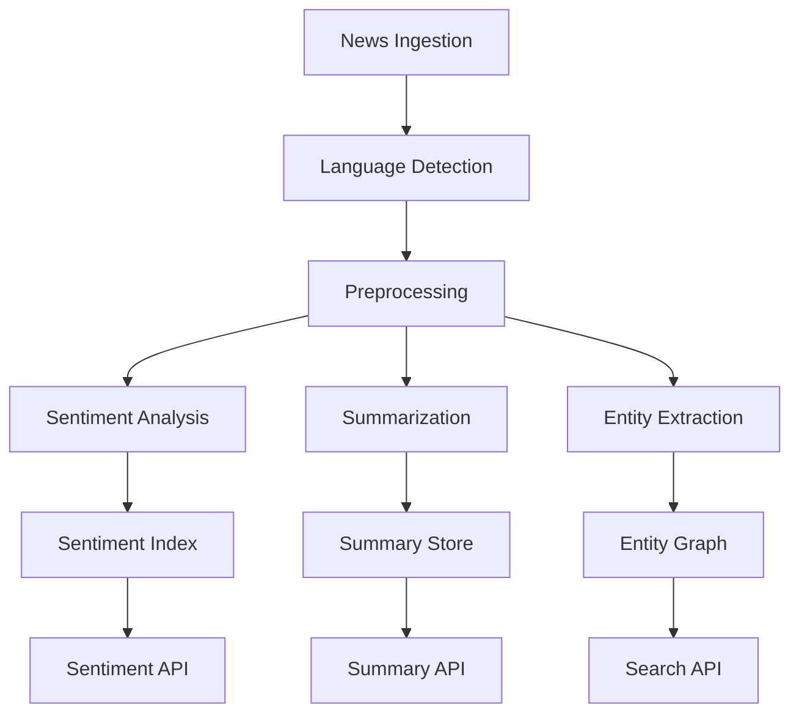

# BedaanWaves - NLP Services

## Overview
Natural Language Processing services for English language financial text analysis, including sentiment analysis, news summarization, document extraction, and conversational AI.

## Key NLP Services

### SentimentAnalysisService
Multi-language sentiment analysis focused on financial news and social media.

**Features:**
- English support (FinBERT, VADER)
- News source credibility weighting
- Real-time sentiment scoring (-1 to +1)
- Entity-level sentiment (per asset/sector)

**Models:**
- English: FinBERT + Custom Financial Lexicon
- Hybrid ensemble for multi-source content

**Endpoints:**
- `/api/v1/nlp/sentiment` - Analyze text sentiment
- `/api/v1/nlp/sentiment/batch` - Batch processing
- `/api/v1/nlp/sentiment/history` - Sentiment trends

### NewsSummarizationService
Automated news article summarization with financial focus.

**Features:**
- Extractive and abstractive summarization
- Key financial metrics extraction
- Action item identification
- Multi-document summarization

### DocumentExtractionService
PDF and document processing for financial reports and disclosures.

**Capabilities:**
- SEC filing parsing
- Annual report extraction
- Financial table extraction
- OCR for scanned documents

### ChatbotService
Conversational AI for market queries and portfolio assistance.

**Features:**
- English and multilingual support
- Intent classification
- Entity extraction
- Context-aware responses
- Tool use (API calls, calculations)

### SearchService
Semantic search across financial documents and news.

**Features:**
- Vector embeddings (BGE, E5)
- Hybrid search (keyword + semantic)
- Filter by asset, date, source
- Relevance ranking

### MultiLanguageNewsService
Country-specific news with language detection and translation.

**Supported Languages:**
- English (primary)
- German, French, Spanish (secondary)

## Architecture

## Configuration
- Model update intervals
- Sentiment thresholds
- Summary length limits
- Language confidence thresholds

## Integration
- Consumes: NewsIngestionService, DataValidationService
- Provides: Sentiment scores to ScoringService
- Alerts: AnomalyDetectionService on sentiment shifts