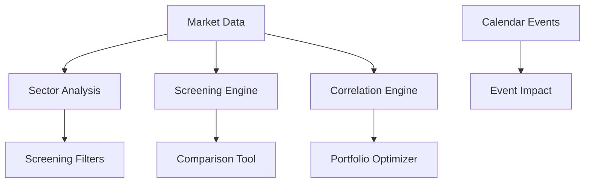

# BedaanWaves - Specialized Services

## Overview
Specialized analytical services for sector analysis, screening, comparison, correlation, calendar integration, and multi-market data.

## Core Specialized Services

### SectorAnalysisService
Sector and industry performance analysis across markets.

**Features:**
- Sector rotation detection
- Industry correlation matrix
- Sector ETF tracking
- Performance attribution

### ScreeningService
Advanced stock screening with customizable filters.

**Filter Categories:**
- Fundamental (P/E, ROE, Debt/Equity)
- Technical (RSI, MACD, Volume)
- Market (Market Cap, Liquidity)
- Custom formulas

**Endpoints:**
- `/api/v1/specialized/screen` - Run screens
- `/api/v1/specialized/screen/presets` - Saved screens

### ComparisonService
Peer benchmarking and comparative analysis.

**Features:**
- Peer group creation
- Multi-metric comparison
- Relative valuation
- Performance ranking

### CorrelationService
Cross-asset correlation analysis and matrix generation.

**Features:**
- Rolling correlation windows
- Correlation clustering
- Diversification metrics
- Risk factor decomposition

### CalendarService
Market calendar integration with corporate events.

**Events:**
- Earnings releases
- Dividend dates
- Economic indicators
- Central bank meetings
- Holiday schedules

### InternationalMarketService
Multi-country data integration for global market coverage.

**Markets Covered:**
- US (NASDAQ, NYSE)
- US (NYSE, NASDAQ)
- Europe, Asia, MENA

### SectorFilterService
Industry-based filtering and sector-specific analysis.

## Architecture

## Integration
- Connected to: DataServices, AnalysisServices
- Used by: PortfolioOptimization, RecommendationService
- APIs: RESTful with WebSocket for real-time