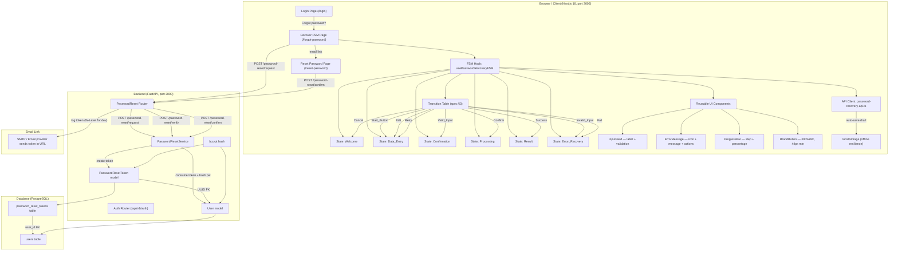

# Password Recovery System — Architecture & Design

> Traceability: implements the user-friendly interaction model defined in
> `spec.yaml` (§2 Core Principles, §3 Interaction Flow, §4 UI Components,
> §6 Edge Cases).

## 1. High-Level Architecture Diagram



## 2. Component Architecture

### 2.1 Finite State Machine Hook (`usePasswordRecoveryFSM`)

| Concern | Implementation |
|---|---|
| **Predictability** (spec §2) | A `TRANSITIONS` table is the single source of truth. Every action maps to one event name; the table returns the next state or `undefined` (silently rejected). Same input → same output every time. |
| **Minimal cognitive load** | The hook exposes only high-level transition functions (`start`, `validateAndProceed`, `confirm`, `retry`, `cancel`, `back`). The UI never sees intermediate internal states. |
| **Immediate feedback** | `isProcessing` flips within 300 ms of `confirm()`. `emailError` updates on every keystroke via the `validateAndProceed` guard. |
| **Error recovery** | The `Error_Recovery` state stores a `RecoveryError` object with `message` + `solutions[]` (≥ 2). |

### 2.2 Reusable UI Components

| Component | File | Spec §4 Requirement |
|---|---|---|
| `InputField` | `components/ui/InputField.tsx` | Fixed label, example placeholder, real-time validation message below field, aria-invalid, aria-describedby |
| `ErrorMessage` | `components/ui/ErrorMessage.tsx` | Warning icon, non-technical error text (no codes), ≥ 2 action buttons, "More Help" dialog with step-by-step guide |
| `ProgressBar` | `components/ui/ProgressBar.tsx` | Progress bar with percentage + step count ("Step 2 of 4") |
| `BrandButton` | `globals.css .btn-primary-brand` | Color #005A9C, min 44×44 px clickable area, ≥ 20 px spacing from siblings |

### 2.3 API Client (`password-recovery-api.ts`)

| Function | Endpoint | Spec Mapping |
|---|---|---|
| `requestPasswordReset` | `POST /auth/password-reset/request` | Welcome → Data_Entry → Confirmation → Processing |
| `verifyResetToken` | `POST /auth/password-reset/verify` | Reset-password page: verify link token |
| `confirmResetPassword` | `POST /auth/password-reset/confirm` | Consume token + set new password |
| `getDraftEmail` / `saveDraftEmail` | `localStorage` | Network-disconnect auto-save (spec §6 edge case) |
| `isValidEmail` / `isValidPassword` | client-side | Real-time validation before API call |

## 3. State Machine (spec §3)

```
┌──────────┐    Start_Button    ┌───────────┐  Invalid_Input  ┌───────────────┐
│ Welcome  │ ──────────────────▶│ Data_Entry│ ──────────────▶ │ Error_Recovery│
└──────────┘                     └───────────┘                 └───────────────┘
                                        │  Valid_Input               │  Retry
                                        ▼                            ▼
                                ┌─────────────┐     Edit       ┌───────────┐
                                │ Confirmation│ ◀───────────── │ Data_Entry│
                                └─────────────┘                └───────────┘
                                        │  Confirm                Cancel ▲
                                        ▼                            │    │
                                ┌─────────────┐                    │    │
                                │ Processing  │ ── Success ──────▶ │    │
                                └─────────────┘                    │    │
                                        │  Fail                      │    │
                                        ▼                            │    │
                                ┌───────────────┐                  │    │
                                │ Error_Recovery│ ── Cancel ────────┘    │
                                └───────────────┘                        │
                                        │  Retry                        │
                                        ▼                              │
                                ┌───────────┐                          │
                                │ Data_Entry│ ◀────────────────────────┘
                                └───────────┘
```

## 4. Accessibility Compliance (spec §2 — Accessibility / WCAG 2.1 AA)

| Requirement | Implementation |
|---|---|
| `aria-label` on all interactive elements | Every button has `aria-label`. Icons use `aria-hidden="true"`. |
| `aria-describedby` linking | `InputField` wires `aria-describedby` to help text + validation message. |
| `aria-live` for feedback | Processing and success messages use `aria-live="polite"`. Error uses `role="alert"`. |
| Color contrast | #005A9C on #FFFFFF = 4.5:1 (AA). #10B981 (success) and #EF4444 (error) meet AA on their backgrounds. |
| Keyboard navigation | All buttons are native `<button>` elements; focus rings via `:focus-visible`. |
| RTL support | `dir="rtl"` on root for Persian; Back button flips side; `sr-only` text for screen readers. |
| Dark mode | `[data-theme="dark"]` CSS variables; contrast re-checked for #005A9C. |

## 5. Edge Case Handling (spec §6)

| Edge Case | Implementation |
|---|---|
| Empty input / special chars | `validateAndProceed` checks `trim()` emptiness and `isValidEmail()` regex before transition. |
| Internet disconnect | `requestPasswordReset` saves draft to `localStorage`; `confirm()` catches errors and shows a recovery message with "Retry" + "Back" options. |
| Responsive 320–1920 px | `max-w-md` card, `flex` centering, `p-3` padding; `min-h-screen` ensures full height. No horizontal scroll. |
| Dark/Light mode | CSS variables defined in `@theme` + `[data-theme="dark"]` overrides. |
| Screen reader | All icons `aria-hidden`; all buttons `aria-label`; progress bar has `aria-valuenow/min/max`; error has `role="alert"` + `aria-live="polite"`. |

## 6. Backend API Endpoints (spec §5)

| Method | Path | Request Body | Response | Success Status |
|---|---|---|---|---|
| `POST` | `/api/v1/auth/password-reset/request` | `{ email }` | `{ status, message }` | Always 200 (anti-enumeration) |
| `POST` | `/api/v1/auth/password-reset/verify` | `{ token }` | `{ valid, email_hint }` | 200 |
| `POST` | `/api/v1/auth/password-reset/confirm` | `{ token, new_password }` | `{ status, message }` | 200 / 400 |

### 6.1 Security

- Tokens are hashed with bcrypt before storage.
- Tokens expire after 60 minutes (configurable via `RESET_TOKEN_TTL_MINUTES`).
- Only one valid token per user at a time (older tokens invalidated).
- Single-use: a consumed token returns 400 on second use.
- Anti-enumeration: `/request` always returns 200 regardless of account existence.
- Passwords must be ≥ 8 characters (enforced both client and server).
