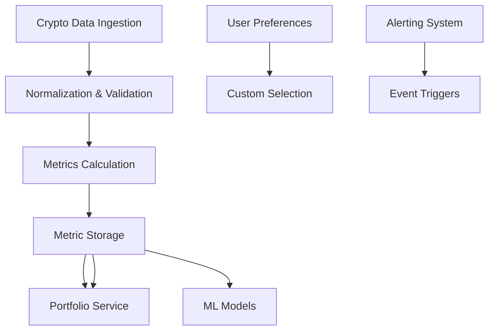

# BedaanWaves - Crypto Services

## Overview
Cryptocurrency services provide end-to-end management of cryptocurrency data, trading, and analysis capabilities.

## Core Crypto Services

### PriceService
Real-time cryptocurrency price tracking across multiple exchanges.

**Features:**
- Multi-exchange support (Binance, Kraken, Coinbase)
- 5-minute delay-free pricing
- Historical price data retrieval
- Order book visualization
- Market depth analysis

### PortfolioService
Cryptocurrency portfolio management and analytics.

**Features:**
- Portfolio tracking across exchanges
- Performance metrics (ROI, drawdown)
- Rebalancing suggestions
- Tax lot management
- Profit/loss reporting

### CryptoIngestionService
Comprehensive cryptocurrency data ingestion pipeline.

**Capabilities:**
- Exchange API integration (REST/WebSocket)
- Data normalization across exchanges
- Event detection (price pump/dump)
- Real-time alert generation
- Data quality monitoring

### CryptoMLService
Specialized machine learning models for cryptocurrency markets.

**Models:**
- Volatility forecasting (Beta-LMT, LSTM)
- Market regime detection
- Transaction clustering
- Whale movement predictor
- DeFi risk assessor

### CryptoAnalysisService
Blockchain analysis and on-chain metrics evaluation.

**Metrics:**
- Transaction volume analysis
- Address clustering
- Wallet attribution
- Chain health monitoring
- Gas fee optimization

### CustomCryptoSelectionService
User-defined cryptocurrency selection from top 300 by market cap.

**Features:**
- Custom screening criteria
- Correlation analysis
- Liquidity scoring
- Market dominance tracking
- Risk-adjusted performance

## Architecture

## Integration Points
- **Connected Services**: CryptoIngestionService, MarketService, PortfolioService
- **Data Sources**: Crypto Exchanges, On-chain Analytics, Price Feeds
- **Outputs**: Price APIs, Portfolio Analytics, Crypto Alerts

## Configuration
- Supported Cryptocurrencies (Top 300)
- Refresh Intervals (1m, 5m, 15m, daily)
- Data Quality Thresholds
- Alert Sensitivity Levels

## Security Features
- Private Key Management
- Secure Storage Recommendations
- Integration with Wallet Services