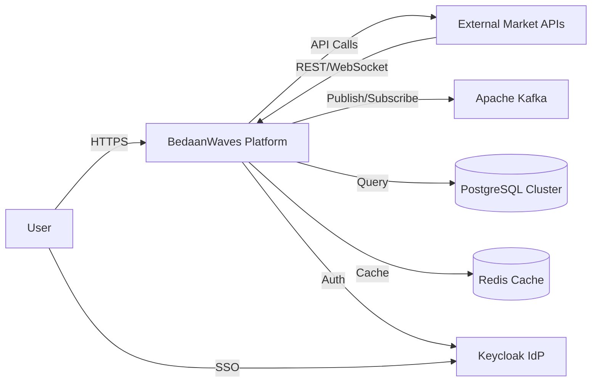
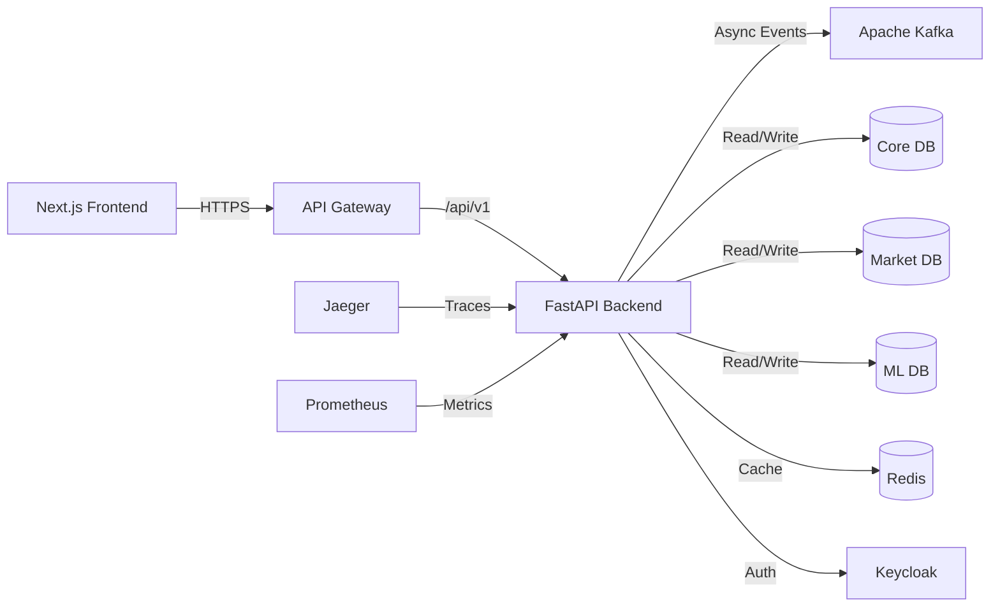
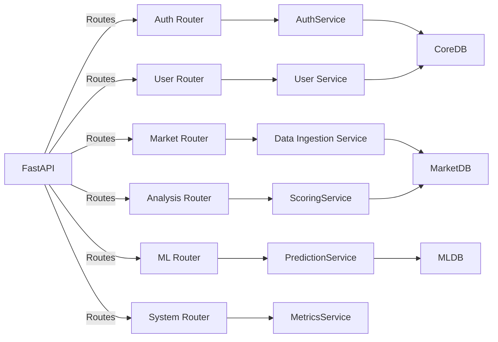
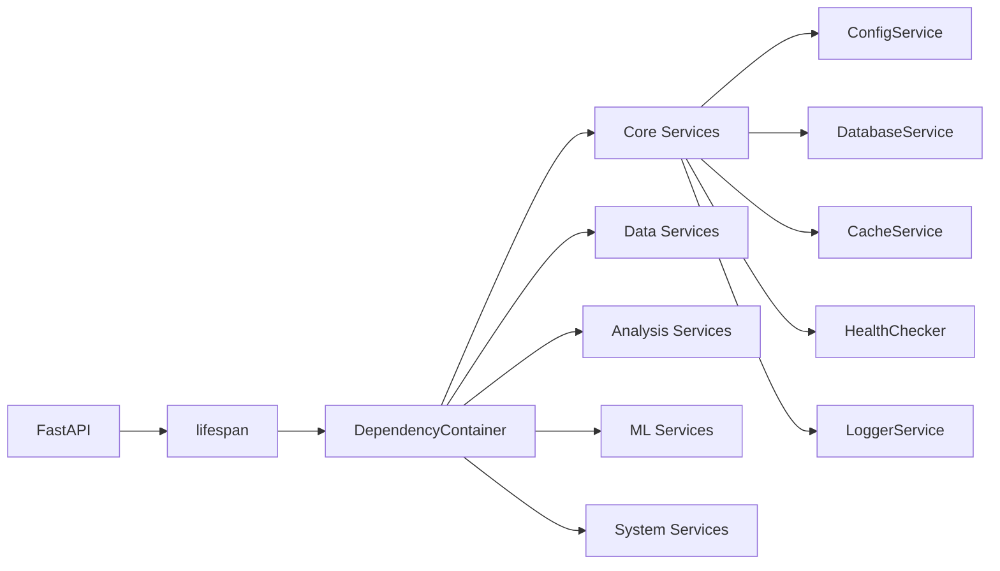

# BedaanWaves C4 Model Architecture Diagrams

## Level 1: System Context

```mermaid
graph LR
    User[User] -->|HTTPS| BedaanWaves[BedaanWaves Platform]
    ExternalAPIs[External Market APIs] -->|REST/WebSocket| BedaanWaves
    BedaanWaves -->|API Calls| ExternalAPIs
    BedaanWaves -->|Publish/Subscribe| Kafka[Apache Kafka]
    BedaanWaves -->|Query| Databases[(PostgreSQL Cluster)]
    BedaanWaves -->|Cache| Redis[(Redis Cache)]
    BedaanWaves -->|Auth| Keycloak[Keycloak IdP]
    User -->|SSO| Keycloak
```

## Level 2: Container

```mermaid
graph LR
    Frontend[Next.js Frontend] -->|HTTPS| Kong[API Gateway]
    Kong -->|/api/v1| FastAPI[FastAPI Backend]
    FastAPI -->|Async Events| Kafka[Apache Kafka]
    FastAPI -->|Read/Write| CoreDB[( Core DB)]
    FastAPI -->|Read/Write| MarketDB[(Market DB)]
    FastAPI -->|Read/Write| MLDB[(ML DB)]
    FastAPI -->|Cache| Redis[(Redis)]
    FastAPI -->|Auth| Keycloak[Keycloak]
    Jaeger[Jaeger] -->|Traces| FastAPI
    Prometheus[Prometheus] -->|Metrics| FastAPI
```

## Level 3: Component

```mermaid
graph LR
    FastAPI -->|Routes| AuthRouter[Auth Router]
    FastAPI -->|Routes| MarketRouter[Market Router]
    FastAPI -->|Routes| AnalysisRouter[Analysis Router]
    FastAPI -->|Routes| MLRouter[ML Router]
    FastAPI -->|Routes| UserRouter[User Router]
    FastAPI -->|Routes| SystemRouter[System Router]

    AuthRouter --> AuthService[AuthService]
    MarketRouter --> DataService[Data Ingestion Service]
    AnalysisRouter --> ScoringService[ScoringService]
    MLRouter --> PredictionService[PredictionService]
    UserRouter --> UserService[User Service]
    SystemRouter --> MetricsService[MetricsService]

    AuthService --> CoreDB
    DataService --> MarketDB
    ScoringService --> MarketDB
    PredictionService --> MLDB
    UserService --> CoreDB
```

## Level 4: Code (Core Services)

```mermaid
graph LR
    FastAPI --> Lifespan[lifespan]
    Lifespan --> Container[DependencyContainer]
    Container --> Core[Core Services]
    Container --> Data[Data Services]
    Container --> Analysis[Analysis Services]
    Container --> ML[ML Services]
    Container --> System[System Services]
    Core --> Config[ConfigService]
    Core --> DB[DatabaseService]
    Core --> Cache[CacheService]
    Core --> Health[HealthChecker]
    Core --> Logger[LoggerService]
```

---
*Last Updated: 2026-09-07*
