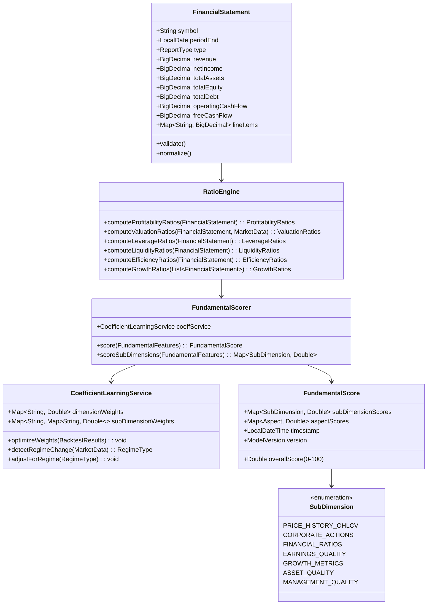

# Fundamental Analysis in BedaanWaves Scoring System

## Overview
Fundamental analysis evaluates the intrinsic value of securities by examining related economic, financial, and other qualitative and quantitative factors. This dimension contributes 25% to the overall 6D score.

**Important**: The coefficient/weight of each dimension, sub-dimension, aspect, and sub-aspect is dynamically determined through machine learning models and is **not static**. The CoefficientLearningService continuously optimizes these weights based on backtest performance, regime changes, and evolving market conditions.

## Hierarchical Structure
- **Level 1**: Fundamental (25% weight)
- **Level 2**: Price history, OHLCV data, Corporate actions
- **Level 3**: Financial ratios, Earnings quality, Growth metrics, Asset quality, Management quality
- **Level 4**: 50+ specific financial metrics and indicators

## Data Sources
- Financial statements (Income Statement, Balance Sheet, Cash Flow)
- Regulatory filings (CODAL for Iranian companies, SEC filings for international)
- Economic indicators from IMF, World Bank, central banks
- Analyst estimates and consensus forecasts
- Corporate actions data (dividends, splits, buybacks)

## Key Metrics Analyzed

### Profitability Metrics
- **ROE (Return on Equity)**: Measures return generated on shareholders' equity
- **ROA (Return on Assets)**: Indicates efficiency of asset utilization
- **Net Profit Margin**: Percentage of revenue converted to profit
- **Operating Margin**: Operational efficiency before interest and taxes
- **Gross Margin**: Production efficiency and pricing power

### Valuation Metrics
- **P/E Ratio (Price-to-Earnings)**: Market price relative to earnings per share
- **P/B Ratio (Price-to-Book)**: Market value relative to book value
- **EV/EBITDA**: Enterprise value relative to EBITDA (capital structure neutral)
- **PEG Ratio**: P/E ratio adjusted for earnings growth
- **Dividend Yield**: Annual dividend per share divided by price per share

### Financial Health Metrics
- **Debt-to-Equity Ratio**: Financial leverage measurement
- **Current Ratio**: Short-term liquidity position
- **Quick Ratio**: Immediate liquidity without inventory
- **Interest Coverage Ratio**: Ability to meet interest obligations
- **Cash Conversion Cycle**: Working capital efficiency

### Growth Metrics
- **Revenue Growth (YoY)**: Top-line expansion rate
- **EPS Growth (YoY)**: Earnings per share growth rate
- **Book Value Growth**: Shareholder equity growth
- **Dividend Growth Rate**: Dividend payout increase over time
- **Asset Growth**: Total asset expansion rate

### Quality Metrics
- **Earnings Quality**: Sustainability and predictability of earnings
- **Accounting Quality**: Transparency and conservatism in reporting
- **Management Effectiveness**: Capital allocation and operational efficiency
- **Corporate Governance**: Board structure and shareholder rights
- **Business Model Sustainability**: Competitive advantages and moats

## Analysis Process
1. **Data Collection**: Gather latest financial statements and key metrics
2. **Normalization**: Adjust for accounting differences and one-time events
3. **Benchmarking**: Compare against industry peers and historical averages
4. **Trend Analysis**: Identify improving or deteriorating trends over 3-5 years
5. **Scoring**: Convert normalized metrics to 0-100 scale using sector-specific curves
6. **Weight Application**: Apply learned weights from ML coefficient service
7. **Aggregation**: Combine sub-dimension scores into final fundamental score

## Machine Learning Integration
- Feature importance analysis identifies most predictive metrics
- Non-linear relationships captured through ensemble methods
- Sector-specific models account for industry variations
- Temporal weighting emphasizes recent performance while maintaining historical context
- Outlier detection prevents extreme values from skewing results

## Output
Fundamental analysis produces a normalized score between 0-100 where:
- 85-100: Exceptional fundamentals (Strong Buy signal)
- 70-84: Solid fundamentals (Buy signal)
- 55-69: Adequate fundamentals (Hold signal)
- 40-54: Concerning fundamentals (Sell signal)
- 0-39: Poor fundamentals (Strong Sell signal)

This score contributes 25% to the final 6D composite score, making it the single largest weighted component in the BedaanWaves scoring system.

## Detailed Sub-Dimensions, Aspects & Sub-Aspects

### Level 2: Price History & OHLCV Data
**Aspect 1: Trend Analysis**
- Sub-Aspect: Moving Average Convergence (SMA-20/50/200, EMA-12/26)
- Sub-Aspect: MACD Signal Line & Histogram
- Sub-Aspect: ADX Trend Strength
- Sub-Aspect: Parabolic SAR

**Aspect 2: Volatility Analysis**
- Sub-Aspect: Standard Deviation of Daily Returns (20/60/252-day)
- Sub-Aspect: Average True Range (ATR-14)
- Sub-Aspect: Bollinger Band Width & %B
- Sub-Aspect: Keltner Channel Width

**Aspect 3: Momentum Analysis**
- Sub-Aspect: RSI-14 (Relative Strength Index)
- Sub-Aspect: Stochastic %K/%D (14,3,3)
- Sub-Aspect: Williams %R (14)
- Sub-Aspect: Rate of Change (ROC-10)
- Sub-Aspect: Commodity Channel Index (CCI-20)

**Aspect 4: Volume-Price Relationship**
- Sub-Aspect: On-Balance Volume (OBV)
- Sub-Aspect: Chaikin Money Flow (CMF-20)
- Sub-Aspect: Volume-Weighted Average Price (VWAP)
- Sub-Aspect: Accumulation/Distribution Line
- Sub-Aspect: Volume Rate of Change (VROC)

### Level 2: Corporate Actions
**Aspect 1: Dividend Analysis**
- Sub-Aspect: Dividend Yield (Trailing/Forward)
- Sub-Aspect: Dividend Payout Ratio
- Sub-Aspect: Dividend Growth Rate (3/5/10-year CAGR)
- Sub-Aspect: Dividend Consistency Score
- Sub-Aspect: Ex-Dividend Date Impact

**Aspect 2: Stock Splits & Reverse Splits**
- Sub-Aspect: Split Ratio History
- Sub-Aspect: Post-Split Price Performance
- Sub-Aspect: Split-Adjusted Price Series

**Aspect 3: Share Buybacks**
- Sub-Aspect: Buyback Yield (Repurchases/Market Cap)
- Sub-Aspect: Buyback Authorization & Execution Rate
- Sub-Aspect: EPS Impact from Buybacks

**Aspect 4: Mergers & Acquisitions**
- Sub-Aspect: Deal Size / Enterprise Value
- Sub-Aspect: Accretion/Dilution Analysis
- Sub-Aspect: Synergy Estimates
- Sub-Aspect: Integration Risk Score

### Level 3: Financial Ratios
**Aspect 1: Profitability Ratios**
- Sub-Aspect: Return on Equity (ROE) — DuPont Decomposition
- Sub-Aspect: Return on Assets (ROA)
- Sub-Aspect: Return on Invested Capital (ROIC)
- Sub-Aspect: Net/Operating/Gross Margin
- Sub-Aspect: EBITDA Margin

**Aspect 2: Valuation Ratios**
- Sub-Aspect: P/E Ratio (Trailing/Forward/Shiller)
- Sub-Aspect: P/B Ratio
- Sub-Aspect: EV/EBITDA
- Sub-Aspect: EV/Revenue
- Sub-Aspect: Price/Sales
- Sub-Aspect: PEG Ratio

**Aspect 3: Leverage & Solvency Ratios**
- Sub-Aspect: Debt/Equity
- Sub-Aspect: Debt/EBITDA
- Sub-Aspect: Interest Coverage Ratio
- Sub-Aspect: Debt Service Coverage Ratio
- Sub-Aspect: Net Debt / EBITDA

**Aspect 4: Liquidity Ratios**
- Sub-Aspect: Current Ratio
- Sub-Aspect: Quick Ratio (Acid Test)
- Sub-Aspect: Cash Ratio
- Sub-Aspect: Operating Cash Flow Ratio

**Aspect 5: Efficiency Ratios**
- Sub-Aspect: Asset Turnover
- Sub-Aspect: Inventory Turnover
- Sub-Aspect: Receivables Turnover
- Sub-Aspect: Payables Turnover
- Sub-Aspect: Cash Conversion Cycle

### Level 3: Earnings Quality
- Sub-Aspect: Accruals Ratio (Balance Sheet / Cash Flow)
- Sub-Aspect: Sloan Ratio
- Sub-Aspect: Cash Flow vs Net Income Correlation
- Sub-Aspect: Non-Recurring Items % of Net Income
- Sub-Aspect: Revenue Recognition Quality Score

### Level 3: Growth Metrics
- Sub-Aspect: Revenue Growth (YoY, QoQ, 3/5-yr CAGR)
- Sub-Aspect: EPS Growth (YoY, QoQ, 3/5-yr CAGR)
- Sub-Aspect: Book Value per Share Growth
- Sub-Aspect: Dividend per Share Growth
- Sub-Aspect: Free Cash Flow Growth

### Level 3: Asset Quality
- Sub-Aspect: Goodwill & Intangibles / Total Assets
- Sub-Aspect: Inventory / Current Assets
- Sub-Aspect: Receivables / Revenue
- Sub-Aspect: PP&E Age & Depreciation Rate
- Sub-Aspect: Capital Expenditure / Depreciation

### Level 3: Management Quality
- Sub-Aspect: Capital Allocation Track Record (ROIC vs WACC)
- Sub-Aspect: Insider Ownership & Transactions
- Sub-Aspect: Executive Compensation Alignment
- Sub-Aspect: Board Independence & Diversity
- Sub-Aspect: ESG Score (Environmental, Social, Governance)

## BPMN Workflow Diagram

```mermaid
flowchart TD
    subgraph Data_Ingestion
        A1[Financial Statements API] --> A2[CODAL/SEC Filings Parser]
        A3[Market Data Feed] --> A2
        A4[Analyst Estimates Feed] --> A2
        A2 --> A5[Raw Data Lake (PostgreSQL)]
    end

    subgraph Normalization_Cleaning
        A5 --> B1[Accounting Standard Normalization]
        B1 --> B2[Currency Conversion (IRR/USD)]
        B2 --> B3[Fiscal Period Alignment]
        B3 --> B4[Outlier Detection (IQR/IsolationForest)]
        B4 --> B5[Missing Data Imputation (KNN/ForwardFill)]
    end

    subgraph Feature_Engineering
        B5 --> C1[Ratio Computation Engine (50+ ratios)]
        C1 --> C2[Trend Feature Generation]
        C2 --> C3[Peer Group Benchmarking (Sector/Industry)]
        C3 --> C4[Historical Percentile Ranking]
    end

    subgraph ML_Scoring
        C4 --> D1[Fundamental Model Ensemble]
        D1 --> D1a[XGBoost Regressor]
        D1 --> D1b[LightGBM Regressor]
        D1 --> D1c[Neural Network (MLP)]
        D1a --> D2[Stacking Meta-Learner]
        D1b --> D2
        D1c --> D2
        D2 --> D3[CoefficientLearningService (Dynamic Weights)]
        D3 --> D4[Score Normalization (0-100, Sector-Adjusted)]
    end

    subgraph Output_Generation
        D4 --> E1[Fundamental Score (25% weight)]
        D4 --> E2[Sub-Dimension Scores (Trend, Vol, Mom, Vol-Price, CorpActions)]
        D4 --> E3[Aspect-Level Scores (Profitability, Valuation, Leverage, etc.)]
        E1 --> F[6D Composite Score Aggregation]
        E2 --> F
        E3 --> F
    end

    subgraph Monitoring_Feedback
        F --> G[Backtest Performance Tracker]
        G --> H[Regime Detection (Bull/Bear/Sideways)]
        H --> D3
        G --> I[Model Drift Monitor (PSI/KL-Divergence)]
        I --> J[Retraining Trigger (Quarterly/Event-Driven)]
        J --> D1
    end

    style A1 fill:#e1f5fe
    style A5 fill:#e1f5fe
    style D3 fill:#fff3e0
    style F fill:#e8f5e9
    style G fill:#fce4ec
```

## Data Flow Diagram (DFD)

```mermaid
graph LR
    subgraph External_Sources
        ES1[CODAL/SEC Filings]
        ES2[Market Data Vendors]
        ES3[Analyst Estimate Providers]
        ES4[Economic Data (IMF/WorldBank)]
    end

    subgraph Ingestion_Layer
        IL1[API Connectors]
        IL2[Message Queue (Kafka/RabbitMQ)]
        IL3[Raw Data Lake]
    end

    subgraph Processing_Layer
        PL1[Normalization Engine]
        PL2[Feature Store]
        PL3[Model Training Pipeline]
        PL4[Inference Engine]
    end

    subgraph Scoring_Layer
        SL1[Fundamental Scoring Service]
        SL2[Coefficient Learning Service]
        SL3[Score Aggregation Service]
    end

    subgraph API_Layer
        AL1[FastAPI Endpoints]
        AL2[GraphQL Gateway]
        AL3[WebSocket Real-time Feed]
    end

    subgraph Consumers
        C1[Frontend Dashboard]
        C2[Alerting Engine]
        C3[Reporting Service]
        C4[Portfolio Optimizer]
    end

    ES1 --> IL1
    ES2 --> IL1
    ES3 --> IL1
    ES4 --> IL1
    IL1 --> IL2
    IL2 --> IL3
    IL3 --> PL1
    PL1 --> PL2
    PL2 --> PL3
    PL3 --> PL4
    PL4 --> SL1
    SL1 --> SL2
    SL2 --> SL3
    SL3 --> AL1
    SL3 --> AL2
    SL3 --> AL3
    AL1 --> C1
    AL2 --> C2
    AL3 --> C3
    AL1 --> C4
```

## UML Class Diagram (Core Domain)

