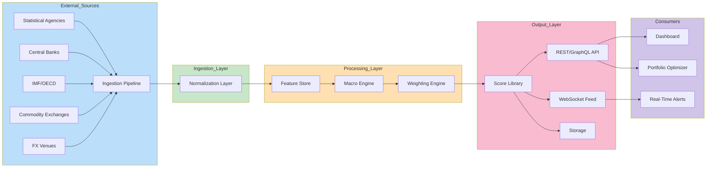
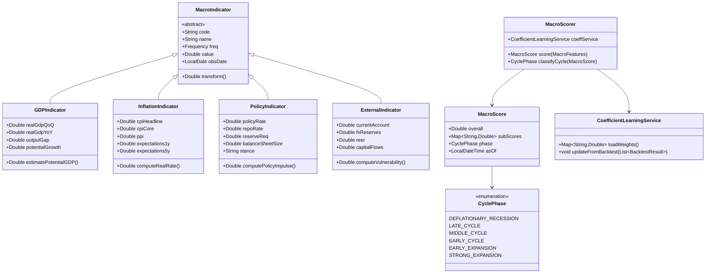

# Macro Analysis in BedaanWaves Scoring System

## Overview
Macro analysis evaluates securities based on broader economic and market factors. This dimension contributes 10% to the overall 6D score and captures systematic forces affecting all asset classes within specific economies.

**Important**: The coefficient/weight of each dimension, sub-dimension, aspect, and sub-aspect is dynamically determined through machine learning models and is **not static**. The CoefficientLearningService continuously optimizes these weights based on backtest performance, regime changes, and evolving market conditions.

---

## Detailed Hierarchical Structure

| Level | Dimension / Aspect / Sub-Aspect |
|-------|-----------------------------------|
| **Level 1** | **Macro** (10% weight) |
| **Level 2** | `Macro_Fundamentals`, `Monetary_Policy`, `Global_Environment` |
| **Level 3 – Macro_Fundamentals** | GDP, Inflation, Labor Market, Fiscal Policy |
| **Level 4 – GDP Sub-Aspects** | `Real_GDP_QoQ`, `Real_GDP_YoY`, `GDP_Per_Capita`, `Sectoral_Contribution`, `Output_Gap`, `Potential_GDP_Growth`, `Industrial_Production_Index`, `Capacity_Utilization` |
| **Level 4 – Inflation Sub-Aspects** | `CPI_Headline`, `CPI_Core`, `PPI`, `GDP_Deflator`, `Import_Price_Index`, `Wage_Growth`, `Inflation_Expectations_1Y`, `Inflation_Expectations_5Y` |
| **Level 4 – Labor Market Sub-Aspects** | `Unemployment_Rate`, `Labor_Force_Participation`, `Job_Openings_Rate`, `Wage_Price_Spiral_Index`, `Youth_Unemployment` |
| **Level 4 – Fiscal Policy Sub-Aspects** | `Govt_Debt_to_GDP`, `Primary_Deficit`, `Fiscal_Impulse`, `Tax_Revenue_Growth`, `Subsidy_Burden` |
| **Level 3 – Monetary_Policy** | Policy Rates, Liquidity, Policy Transmission |
| **Level 4 – Policy Rates Sub-Aspects** | `Key_Policy_Rate`, `Repo_Rate`, `Reverse_Repo`, `Interbank_Overnight_Rate`, `Policy_Rate_Forward_Guidance` |
| **Level 4 – Liquidity Sub-Aspects** | `Reserve_Requirements`, `OMO_Volume`, `Standing_Facility_Usage`, `Bank_Reserve_Balances`, `Liquidity_Coverage_Ratio` |
| **Level 4 – Transmission Sub-Aspects** | `Credit_Growth`, `Bank_Lending_Rates`, `Bond_Yield_Transmission`, `FX_Intervention_Volume`, `Policy_Shock_Index` |
| **Level 3 – Global_Environment** | External Sector, Commodity Cycle, Geopolitical Risk |
| **Level 4 – External Sub-Aspects** | `Current_Account_Balance`, `FX_Reserves`, `Real_Effective_Exchange_Rate`, `Trade_Weighted_Dollar`, `Capital_Flows` |
| **Level 4 – Commodity Sub-Aspects** | `Oil_Price_Brent`, `Oil_Price_WTI`, `Gas_Price_Hub`, `Metals_Index`, `Agriculture_Index`, `Energy_Intensity_GDP` |
| **Level 4 – Geopolitical Sub-Aspects** | `Sanctions_Index`, `Conflict_Proximity`, `Trade_Restriction_Score`, `Diplomatic_Risk`, `Supply_Chain_Disruption_Index` |

---

## Data Sources
- National statistics bureaus (SCI for Iran, BEA for US, Eurostat, etc.)  
- Central banks (CBI, Fed, ECB, BoJ, BoE) – policy communications, rate decisions, reports  
- International organizations (IMF, World Bank, OECD, BIS) – Article IV, WEO, GFSR  
- Government releases – budget statements, fiscal updates  
- Commodity exchanges (NYMEX, ICE, SHFE, DCE) – futures curves, inventories  
- Forex markets (EBS, Reuters, CME FX) – spot, forwards, options  
- Global databases (FRED, OECD Stat, CEIC, Bloomberg Terminal)  
- Real-time indicator feeds (PMI, tankan, ISM, flash PMIs)  

---

## Key Metrics Analyzed (Expanded)

### GDP & Growth
- **Real GDP Growth** (QoQ, YoY, SAAR)  
- **Output Gap** (actual vs. potential GDP)  
- **Industrial Production** (manufacturing, mining, utilities)  
- **Capacity Utilization** (manufacturing, total industry)  
- **Sectoral Contributions** (services, industry, agriculture)  

### Inflation
- **CPI** (headline, core, super-core)  
- **PPI** (intermediate, finished goods)  
- **GDP Deflator**  
- **Inflation Expectations** (survey-based, market-based breakevens)  
- **Wage Growth** (nominal, real, unit labor costs)  

### Monetary Policy
- **Policy Rate** (effective federal funds, key rate, deposit facility)  
- **Yield Curve** (2s10s, 3m10y, OIS curves)  
- **Money Supply** (M0, M1, M2, M3, credit aggregates)  
- **Central Bank Balance Sheet** (assets, liabilities, maturity profile)  
- **Forward Guidance** (dot plot, policy statement analysis via NLP)  

### Exchange Rates & External
- **Nominal & Real Effective Exchange Rate** (trade-weighted)  
- **FX Reserves** (composition, adequacy metrics)  
- **Current Account** (goods, services, primary/secondary income)  
- **Capital Flows** (FDI, portfolio, other investment)  
- **Carry Trade Metrics** (interest rate differentials, rollover risk)  

### Commodity & Geopolitical
- **Energy** (Brent, WTI, Henry Hub, JKM LNG)  
- **Metals** (copper, aluminum, iron ore, gold, silver)  
- **Agriculture** (wheat, corn, soybeans, sugar)  
- **Sanctions & Trade** (restriction indices, transaction costs)  
- **Supply Chain** (GSCPI, PMI suppliers' delivery times)  

---

## Machine Learning Integration
- **Time Series Forecasting**: ARIMA, ETS, Prophet, LSTM, TFT for GDP, CPI, rates  
- **Cointegration & VECM**: Long-run relationships (e.g., GDP–credit, CPI–wages)  
- **Factor Models**: PCA on macro panel, dynamic factor models (DFM)  
- **Causal Inference**: PC algorithm, DoWhy for policy shock identification  
- **Regime Detection**: HMM, MS-VAR for business cycle phases  
- **Scenario Generation**: Monte Carlo, GAN-based stress scenarios  
- **NLP for Policy**: BERT/FinBERT on central bank minutes, speeches  
- **Network Analysis**: Spillover indices, VAR-connectedness across countries  

---

## BPMN Workflow Diagram

```mermaid
flowchart TD
    subgraph Data_Collection["📥 Data Collection"]
        A1[National Statistics] --> A2[Central Bank Feeds]
        A3[Intl Organizations] --> A4[Commodity Prices]
        A5[FX Markets] --> A6[Policy Communications]
    end

    subgraph Normalization["🔧 Normalization & Alignment"]
        A2 --> B1[Frequency Conversion]
        B1 --> B2[Calendar Alignment]
        B2 --> B3[Base Year Rebasing]
        B3 --> B4[Unit Harmonization]
    end

    subgraph Feature_Engineering["⚙️ Feature Engineering"]
        B4 --> C1[Leading/Coincident/Lagging Tagging]
        C1 --> C2[Output Gap Estimation]
        C2 --> C3[Inflation Expectations Extraction]
        C3 --> C4[Policy Stance Scoring]
        C4 --> C5[External Vulnerability Index]
    end

    subgraph Modeling["🧠 Macro Modeling"]
        C5 --> D1[Time-Series Forecasting]
        D1 --> D2[VAR / DFM / FAVAR]
        D2 --> D3[Regime Switching HMM]
        D3 --> D4[Scenario Simulation]
        D4 --> D5[Policy Shock Decomposition]
    end

    subgraph Scoring["📊 Scoring & Output"]
        D5 --> E1[Raw Macro Score]
        E1 --> E2[Dynamic Weighting (CoefficientLearningService)]
        E2 --> E3[Normalized Score 0-100]
        E3 --> E4[Cycle Phase Label]
        E3 --> E5[Sector Rotation Signal]
    end

    subgraph Monitoring["📈 Monitoring"]
        E4 --> F1[Real-Time Indicator Tracker]
        F1 --> D1
        F1 --> D3
    end

    style Data_Collection fill:#e3f2fd
    style Normalization fill:#e8f5e9
    style Feature_Engineering fill:#fff3e0
    style Modeling fill:#fce4ec
    style Scoring fill:#e0f2f1
    style Monitoring fill:#f3e5f5
```

---

## Data Flow Diagram (DFD)



---

## UML Class Diagram (Macro Domain)



---

## Output Interpretation

| Macro Score | Cycle Phase | Typical Sector Allocation |
|-------------|-------------|---------------------------|
| 0–19 | Deflationary Recession | Long Duration Bonds, Defensive Equities, Cash |
| 20–39 | Late Cycle | Quality Growth, Low-Volatility, Short Duration |
| 40–54 | Middle Cycle | Balanced, Broad Market |
| 55–69 | Early Cycle | Cyclicals, Small Caps, Financials |
| 70–84 | Early Expansion | Commodities, Industrials, EM |
| 85–100 | Strong Expansion | Momentum, High Beta, Real Assets |

---

## Iran-Specific Enhancements
- **Sanctions Index**: Quantifies trade restriction severity (0–100) using transaction data and vessel tracking.  
- **FX Dual Rate Model**: Parallel market vs. official rate divergence as stress indicator.  
- **Budget Rule Monitor**: Oil revenue vs. expenditure rule compliance tracker.  
- **Subsidy Reform Tracker**: Price liberalization progress and inflation pass-through.  

---

## Integration with Other 6D Dimensions
| From Macro → To | Signal Provided |
|-----------------|-----------------|
| Fundamental | Earnings sensitivity to GDP, inflation pass-through to margins |
| Technical | Regime-dependent indicator reliability (e.g., RSI in trending vs. ranging) |
| Sentiment | Central bank credibility index from communication analysis |
| Risk | Correlation regime shifts, tail-dependence parameters |
| AI | Macro regime as conditioning variable for LSTM/Transformer models |

---

This dimension provides essential context for understanding the broader economic environment that drives all other dimensions of the 6D scoring system, helping investors position for favorable macro conditions.