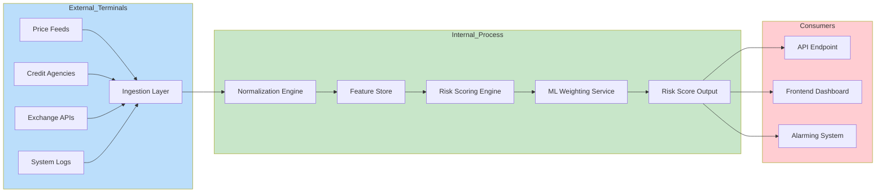
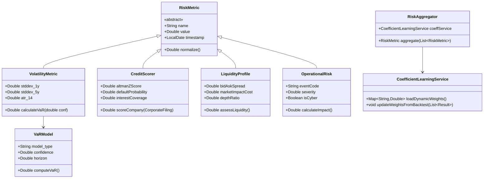

# Risk Analysis in BedaanWaves Scoring System

## Overview
Risk analysis quantifies the probability and magnitude of potential investment losses. This dimension contributes 20% to the overall 6D score, making it one of the most heavily weighted components due to its critical importance in investment decision-making.

**Important**: The coefficient/weight of each dimension, sub-dimension, aspect, and sub-aspect is dynamically determined through machine learning models and is **not static**. The CoefficientLearningService continuously optimizes these weights based on backtest performance, regime changes, and evolving market conditions.

## Detailed Hierarchical Structure  

| Level | Dimension / Aspect / Sub-Aspect |
|-------|-----------------------------------|
| **Level 1** | **Risk** (20% weight) |
| **Level 2** | `Market_Risk`, `Credit_Risk`, `Liquidity_Risk`, `Operational_Risk` |
| **Level 3 – Market_Risk** | Volatility, Correlation, Beta, VaR |
| **Level 4 – Volatility Sub-Aspects** | `Standard_Deviation_1Y`, `Standard_Deviation_5Y`, `Beta_Market`, `ATR_14`, `VaR_95`, `VaR_99`, `CVar_99`, `Max_Drawdown` |
| **Level 3 – Correlation Sub-Aspects** | `Cross_Asset_Correlation`, `Sector_Correlation`, `Dynamic_DCC`, `Tail_Correlation`, `Factor_Mapping` |
| **Level 3 – Credit_Risk Aspects** | Default Probability, Credit Rating, Coverage Ratios |
| **Level 4 – Credit_Risk Sub-Aspects** | `Altman_Z_Score`, `PD_Microfactor_Model`, `Rating_Change_Velocity`, `Interest_Coverage`, `Debt_Equity`, `Cash_Ratio`, `Default_Survival_Forecast` |
| **Level 3 – Liquidity_Risk Aspects** | Orderbook Depth, Spread Dynamics, Capacity Gaps |
| **Level 4 – Liquidity_Risk Sub-Aspects** | `Bid_Ask_Spread_Realized`, `VWAP_Slippage`, `Market_Impact_Cost`, `Depth_Pricing`, `Flash_Crash_Indicator`, `Block_Trade_Exposure` |
| **Level 3 – Operational_Risk Aspects** | System Failures, Execution Errors, Regulatory Events |
| **Level 4 – Operational_Risk Sub-Aspects** | `Cyber_Attack_Score`, `Reg_Twap_Timing`, `Fraud_Alert_Rate`, `Trading_Halt_Frequency`, `Wrong_Execution_Rate`, `Compliance_Breach_Index` |

---

## Data Sources
- Historical price data for volatility calculations  
- Financial statements for credit risk assessment  
- Market data feeds for correlation analysis  
- Economic indicators for systematic risk factors  
- Corporate filing data for operational risk  
- Trading volume data for liquidity metrics  
- Benchmark and peer comparison data  

---

## Key Metrics Analyzed

### Market Risk Metrics
- **Volatility (Standard Deviation)**: Price fluctuation over time  
- **Value-at-Risk (VaR)**: Maximum expected loss over given period at certain confidence  
- **Expected Shortfall (CVaR)**: Average loss beyond VaR threshold  
- **Beta**: Stock's sensitivity to market movements  
- **Tracking Error**: Deviation from benchmark performance  
- **Maximum Drawdown**: Largest peak-to-trough decline  

### Credit Risk Metrics
- **Default Probability**: Likelihood of company bankruptcy  
- **Credit Rating Changes**: Upgrades/downgrades impact  
- **Interest Coverage Ratio**: Ability to meet interest payments  
- **Altman Z-Score**: Bankruptcy prediction model  

### Liquidity Risk Metrics
- **Bid-Ask Spread**: Cost of entering/exiting positions  
- **Market Impact Cost**: Price movement from trading activity  
- **Depth Analysis**: Market depth and order book  

### Operational Risk Metrics
- **Event Risk**: Unexpected events causing disruptions  
- **Technology Risk**: System failures and cyber threats  

---

## Machine Learning Integration
- **Anomaly Detection**: Using Isolation Forest and AutoEncoders  
- **Clustering**: Grouping stocks by risk profiles (K-means + hierarchical clustering)  
- **Regression**: Predicting risk metrics from fundamentals (Random Forest, XGBoost)  
- **Time Series**: Forecasting volatility (LSTM, Prophet)  
- **Reinforcement Learning**: Dynamic capital allocation under risk constraints  

---

## BPMN Workflow Diagram

```mermaid
flowchart TD
    subgraph Data_Ingestion["📥 Data Ingestion"]
        A1[Historical Returns] --> A2
        A3[Credit Ratings] --> A4
        A5[Order Book Data] --> A6
        A7[System Logs] --> A8
    end

    subgraph Feature_Engineering["⚙️ Feature Engineering"]
        A6 --> B1[Variance/Std Dev]
        A8 --> B2[Regulatory Alerts]
        A4 --> B3[Z‑Score Model]
        A2 --> B4[Beta/Tracking Error]
    end

    subgraph Risk_Modeling["🧠 Risk Modeling"]
        B4 --> C1[Volatility Engine]
        B3 --> C2[Credit Scoring]
        B2 --> C3[Event Risk Detector]
        B1 --> C4[VaR Calculator]
    end

    subgraph Aggregation["📊 Score Aggregation"]
        C1 --> D1[Market Risk Score]
        C2 --> D2[Credit Risk Score]
        C3 --> D3[Operational Risk Score]
        C4 --> D4[Liquidity Risk Score]
    end

    subgraph Output["🔚 Output Generation"]
        D1 & D2 & D3 & D4 --> E1[Composite Risk Score (0-100)]
        E1 --> E2[6D Score Integration]
        E2 --> E3[Signal Router]
        E3 --> F1[Buy Signal]
        E3 --> F2[Sell Signal]
        E3 --> F3[Hold Signal]
    end

    subgraph Monitoring["📈 Monitoring & Feedback"]
        F3 --> G1[Model Drift Tracker]
        G1 --> C4
        G1 --> C2
    end

    style Data_Ingestion fill:#e3f2fd
    style Feature_Engineering fill:#e8f5e9
    style Risk_Modeling fill:#fff3e0
    style Aggregation fill:#fce4ec
    style Output fill:#e0f2f1
    style Monitoring fill:#f3e5f5
```

---

## Data Flow Diagram (DFD – Level 1)



---

## UML Class Diagram (Risk Domain)



---

## Output Interpretation
| Risk Score Range | Interpretation | Action |
|------------------|----------------|--------|
| 0–19 | Extremely high risk | Strong Sell |
| 20–39 | Very high risk | Sell |
| 40–54 | High risk | Caution |
| 55–69 | Moderate risk | Hold |
| 70–84 | Low-moderate risk | Buy |
| 85–100 | Low risk | Strong Buy |

---

## Integration with other Dimensions
- **Risk → AI**: Used as input for portfolio optimization models.  
- **Risk → Fundamental**: Altman Z‑Score enhances financial health metrics.  
- **Risk → Macro**: Sector rotation analysis under stress regimes.  

---

This dimension serves as a crucial counterbalance to other 6D components, ensuring that high-scoring opportunities are not pursued without adequate consideration of potential downside risk.