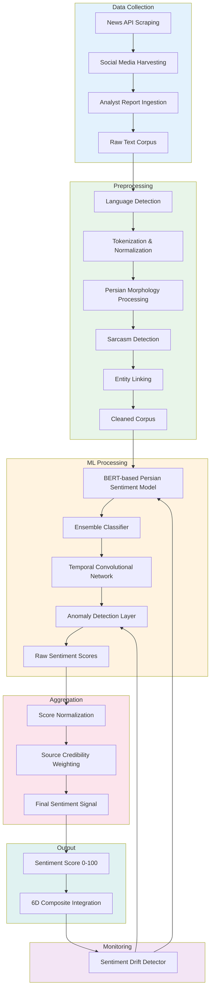
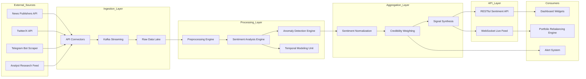
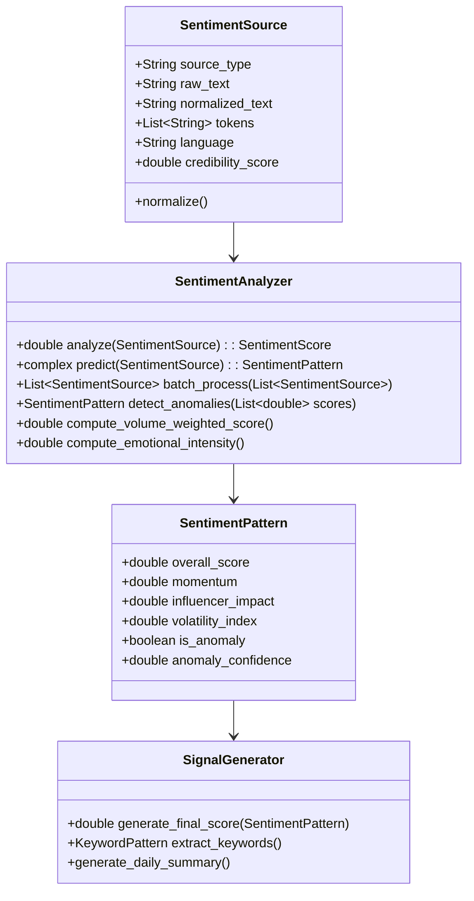

# Sentiment Analysis in BedaanWaves Scoring System

## Overview
Sentiment analysis evaluates market sentiment through analysis of news, social media, and analyst opinions. This dimension contributes 15% to the overall 6D score and focuses on understanding market psychology and sentiment-driven price movements.

**Important**: The coefficient/weight of each dimension, sub-dimension, aspect, and sub-aspect is dynamically determined through machine learning models and is **not static**. The CoefficientLearningService continuously optimizes these weights based on backtest performance, regime changes, and evolving market conditions.

## Detailed Hierarchical Structure

| Level | Dimension / Aspect / Sub-Aspect |
|-------|-----------------------------------|
| **Level 1** | **Sentiment** (15% weight) |
| **Level 2** | `News_Sentiment`, `Social_Media_Sentiment`, `Analyst_Sentiment` |
| **Level 3 – News_Sentiment** | Article Classification, Source Credibility, Temporal Momentum |
| **Level 4 – News Sub-Aspects** | `Persian_NLP_Score`, `English_NLP_Score`, `Topic_Relevance_Direct`, `Topic_Relevance_Indirect`, `Source_Trust_Score`, `Recency_Weight_24h`, `Recency_Weight_7d`, `Sentiment_Momentum_1d`, `Sentiment_Momentum_7d` |
| **Level 3 – Social_Media_Sentiment** | Volume Analysis, Influencer Impact, Trend Detection |
| **Level 4 – Social Sub-Aspects** | `Mention_Volume_Daily`, `Positive_Negative_Ratio`, `Influencer_Reach_Weighted`, `Retail_vs_Institutional_Split`, `Geographic_Sentiment_Index`, `Viral_Spike_Detection`, `Hashtag_Sentiment_Score`, `Emoji_Sentiment_Adjustment` |
| **Level 3 – Analyst_Sentiment** | Rating Consensus, Price Target Changes, Earnings Revisions |
| **Level 4 – Analyst Sub-Aspects** | `Buy_Hold_Sell_Ratio`, `Rating_Change_Direction`, `Price_Target_Upside_Downside`, `Earnings_Estimate_Revision_Magnitude`, `Broker_Consensus_Strength`, `Long_term_vs_Short_term_Divergence`, `Sector_Peer_Relative_Rating` |

---

## Data Sources
- Financial news sources (domestic and international)
- Social media platforms (Twitter/X, Telegram, financial forums)
- Analyst reports and brokerage research
- Financial forums and discussion boards
- Press releases and corporate announcements
- Economic news and market commentary

## Key Metrics Analyzed

### News Sentiment Analysis
- **Article Sentiment Score**: Positive/negative/neutral classification using NLP
- **News Volume**: Number of articles mentioning the stock/sector
- **Sentiment Momentum**: Change in sentiment over time
- **Source Credibility**: Weighting by source reliability and authority
- **Topic Relevance**: Direct vs. indirect mentions
- **Timeliness**: Recency weighting (more recent news weighted higher)
- **Language Analysis**: Persian and international news sentiment

### Social Media Sentiment
- **Social Volume**: Mentions across platforms
- **Social Sentiment**: Positive/negative ratio on social platforms
- **Influencer Impact**: Weighting by follower count and engagement
- **Trend Detection**: Emerging topics and viral sentiment
- **Retail Investor Sentiment**: Individual investor discussions
- **Institutional Mentions**: Professional investor commentary
- **Geographic Sentiment**: Regional sentiment variations

### Analyst Sentiment
- **Analyst Ratings**: Buy/Hold/Sell consensus
- **Price Target Changes**: Upgrades/downgrades and target revisions
- **Earnings Estimate Revisions**: Analyst forecast changes
- **Broker Sentiment**: Aggregate brokerage house opinions
- **Long-term vs Short-term**: Different horizon analyst views
- **Sector Comparison**: Analyst sentiment vs. sector peers

## Natural Language Processing (NLP) Components

### Persian Language Processing
- **Persian Sentiment Models**: Custom-trained models for Farsi text
- **Named Entity Recognition**: Company and entity identification in Persian text
- **Context Understanding**: Handling Persian linguistic nuances
- **Dialect Handling**: Various Persian language variants
- **Informal Language Processing**: Social media slang and abbreviations

### Multilingual Analysis
- **Cross-language Sentiment**: Comparing Persian vs. English sentiment
- **Translation Consistency**: Ensuring consistent sentiment across languages
- **International News Impact**: Global news effect on local sentiment
- **Currency Impact Analysis**: How international news affects local markets

## Analysis Process
1. **Data Collection**: Continuous scraping of news, social media, and analyst sources
2. **Text Preprocessing**: Cleaning, normalization, tokenization of text data
3. **Language Detection**: Identifying Persian vs. other language content
4. **Sentiment Scoring**: Applying NLP models to generate sentiment scores
5. **Entity Recognition**: Linking sentiment to specific companies/sector
6. **Temporal Analysis**: Tracking sentiment changes over time
7. **Source Weighting**: Applying credibility weights to different sources
8. **Signal Aggregation**: Combining multiple sentiment sources
9. **Normalization**: Converting to 0-100 scale
10. **Weight Application**: Applying ML-optimized weights
11. **Final Aggregation**: Combining news, social, and analyst components

## Machine Learning Integration
- **Transformer Models**: BERT-based models for Persian sentiment
- **Ensemble Methods**: Combining multiple NLP approaches
- **Temporal Models**: LSTM/GRU for sentiment time-series forecasting
- **Anomaly Detection**: Identifying unusual sentiment spikes
- **Fake News Detection**: Filtering unreliable or manipulative content
- **Topic Modeling**: Identifying key themes driving sentiment
- **Network Analysis**: Social network influence mapping

## Signal Interpretation
Sentiment analysis produces signals that reflect market psychology:
- **85-100**: Extremely positive sentiment with strong conviction
- **70-84**: Positive sentiment with moderate conviction
- **55-69**: Neutral to slightly positive sentiment
- **40-54**: Neutral to slightly negative sentiment
- **20-39**: Negative sentiment with moderate conviction
- **0-19**: Extremely negative sentiment with strong conviction

## Integration with Other Dimensions
Sentiment acts as a leading indicator that can:
- **Lead Fundamental Changes**: Sentiment often shifts before fundamentals
- **Amplify Technical Signals**: Positive sentiment + bullish technical = strong signal
- **Warn of Risk Buildup**: Extreme sentiment can signal contrarian opportunities
- **Contextualize Macro Events**: How markets emotionally react to economic news
- **Enhance AI Predictions**: Sentiment features improve ML model accuracy

## BPMN Workflow Diagram

## Data Flow Diagram (DFD)

## UML Class Diagram

## Output
Sentiment analysis produces a normalized score between 0-100 where:
- **85-100**: Extremely positive sentiment with strong conviction
- **70-84**: Positive sentiment with moderate conviction
- **55-69**: Neutral to slightly positive sentiment
- **40-54**: Neutral to slightly negative sentiment
- **20-39**: Negative sentiment with moderate conviction
- **0-19**: Extremely negative sentiment with strong conviction

This score contributes 15% to the final 6D composite score.
