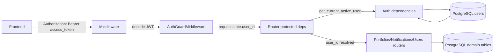

# DFD Level 2 — Authentication & Access Control

تفکیک جریان‌های داده مرتبط با JWT و propagation اطلاعات کاربر.

## Diagram (Mermaid)

## Data Flows
- **JWT Access Token**: از FE به Middleware ارسال می‌شود.
- **AuthGuardMiddleware**:
  - JWT decode
  - بررسی `type == access`
  - ست کردن `request.state.user_id` و `request.state.username`
- **get_route_user_id**:
  - اگر `request.state.user_id` موجود باشد، همان را مصرف می‌کند
  - در غیر این صورت (dev) از `settings.DEV_USER_ID` استفاده می‌کند

## داده‌های کلیدی
- `Token(access_token, refresh_token)`
- JWT payload: `{sub, user_id, type}`
- User entity در جدول `users`

