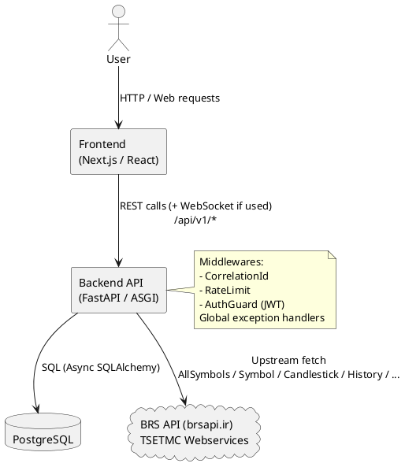

# UML Level 1 — Overview (Context / High-level)

این سند یک نمای کلی از سیستم **BedaanWaves** ارائه می‌دهد. تمرکز: اجزای اصلی، مرزها، و ارتباط‌های مستقیم.

## اجزای اصلی
- **Frontend (Next.js)**: رابط کاربری و ارسال درخواست‌ها به Backend
- **Backend API (FastAPI)**: لایه‌ی گیت‌وی/مسیر‌یابی و منطق کسب‌وکار
- **External APIs (BRS API)**: تامین‌کننده‌ی داده‌ی بازار سرمایه ایران
- **PostgreSQL**: ذخیره‌ی داده‌های Assets/PriceCandles/MLSignals/Portfolios/… 

## Diagram (PlantUML)

## روابط و داده‌های کلیدی
- Frontend درخواست را می‌فرستد -> Backend:
  - auth guard (در صورت فعال بودن)
  - سپس Router مناسب اجرا می‌شود
- برای برخی endpointها Backend به **BRS API** درخواست می‌زند (Live Proxy / Stock Fetch)
- در سایر endpointها Backend داده‌ها را از **PostgreSQL** می‌خواند/برمی‌گرداند یا برای محاسبات از آن استفاده می‌کند.

---

### Glossary
- **Asset**: نماد بازار (stock/ETF/…)
- **PriceCandle**: کندل‌های OHLCV در تایم‌فریم‌های مختلف (معمولاً daily)
- **MLSignal**: نتیجه‌ی تحلیل/پیش‌بینی با اعتبار و زمان اعتبار
- **Portfolio / Position**: داده‌های سبد کاربر و نگهداری دارایی‌ها
