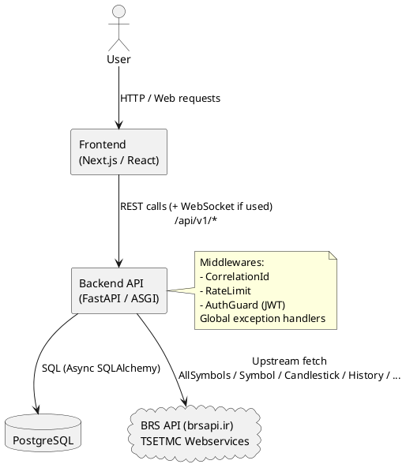

# UML Level 1 — Overview (Context / High-level)

This document provides an overview of the **BedaanWaves** system. Focus: main components, boundaries, and direct relationships.

## Main Components
- **Frontend (Next.js)**: User interface and request submission to the Backend
- **Backend API (FastAPI)**: Gateway/routing layer and business logic
- **External APIs (BRS API)**: Source of Iranian capital market data
- **PostgreSQL**: Stores Assets/PriceCandles/MLSignals/Portfolios/…

## Diagram (PlantUML)

```plantuml
@startuml
skinparam componentStyle rectangle

actor "User" as U
rectangle "Frontend\n(Next.js / React)" as FE
rectangle "Backend API\n(FastAPI / ASGI)" as BE
database "PostgreSQL" as DB
cloud "BRS API (brsapi.ir)\nTSETMC Webservices" as BRS

U --> FE : HTTP / Web requests
FE --> BE : REST calls (+ WebSocket if used)\n/api/v1/*

BE --> DB : SQL (Async SQLAlchemy)
BE --> BRS : Upstream fetch\nAllSymbols / Symbol / Candlestick / History / ...

note right of BE
Middlewares:
- CorrelationId
- RateLimit
- AuthGuard (JWT)
Global exception handlers
end note

@enduml
```

## Key Relationships and Data
- Frontend sends request -> Backend:
  - auth guard (when enabled)
  - then the appropriate Router runs
- For some endpoints, the Backend calls the **BRS API** (Live Proxy / Stock Fetch)
- For other endpoints, the Backend reads/returns data from **PostgreSQL** or uses it for calculations.

---

### Glossary
- **Asset**: Market symbol (stock/ETF/…)
- **PriceCandle**: OHLCV candles across various timeframes (usually daily)
- **MLSignal**: Analysis/prediction result with validity and expiration time
- **Portfolio / Position**: User portfolio data and asset holdings