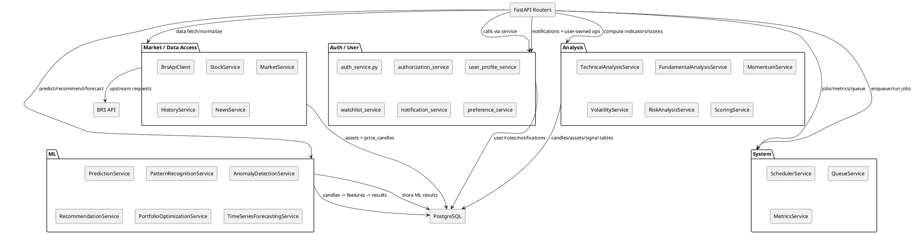

# UML Level 3 — Service Decomposition (Domain Services)

این سطح سرویس‌ها را به حوزه‌های Domain تقسیم می‌کند.

## حوزه‌ها
- **Auth / User**
- **Market / Data Access**
- **Analysis**
- **Portfolio / Risk-aware operations**
- **ML**
- **System / Queue / Scheduler / Metrics**
- **Notifications**

## Diagram (PlantUML)

## نکته
- برخی routeها (مثل `live/*`) مستقیم proxy به BRS API هستند و DB لازم ندارند.
- برخی routeها (مثل `/analysis/technical/{symbol}`) از داده‌های stored در DB استفاده می‌کنند.
