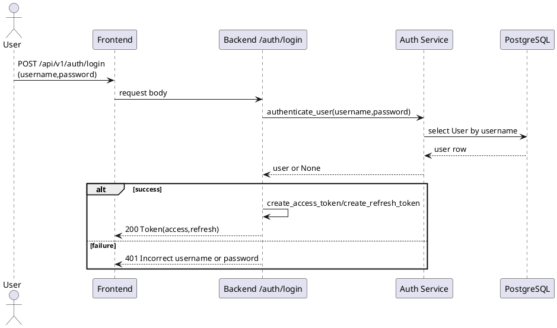
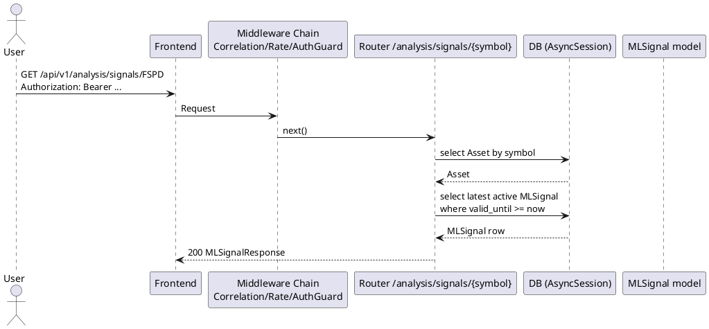
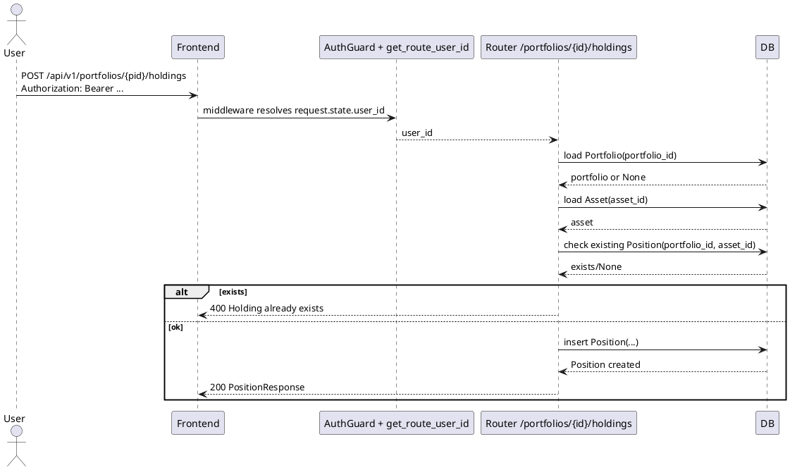
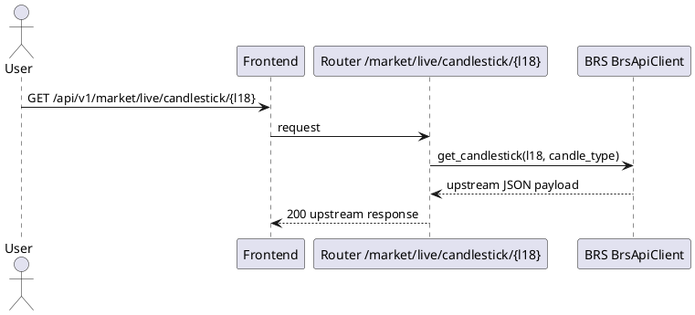

# UML Level 4 — Sequence Diagrams (Key Scenarios)

این سطح سناریوهای کلیدی Sequence را نشان می‌دهد.

## 1) Login (Public endpoint)


## 2) Get ML Signal (Protected)


## 3) Add Holding to Portfolio (Protected)


## 4) Live Candlestick Proxy (Upstream)


## 5) Enqueue system job
```plantuml
@startuml
actor Admin
participant "Frontend" as FE
participant "Router /system/queue/jobs" as R
participant "QueueService" as Q

Admin -> FE : POST /api/v1/system/queue/jobs\n{name,payload,priority,max_retries}
FE -> R : JSON body
R -> Q : enqueue(name,payload,priority,max_retries)
Q --> R : job_id
R --> FE : 200 {job_id,name}
@enduml
