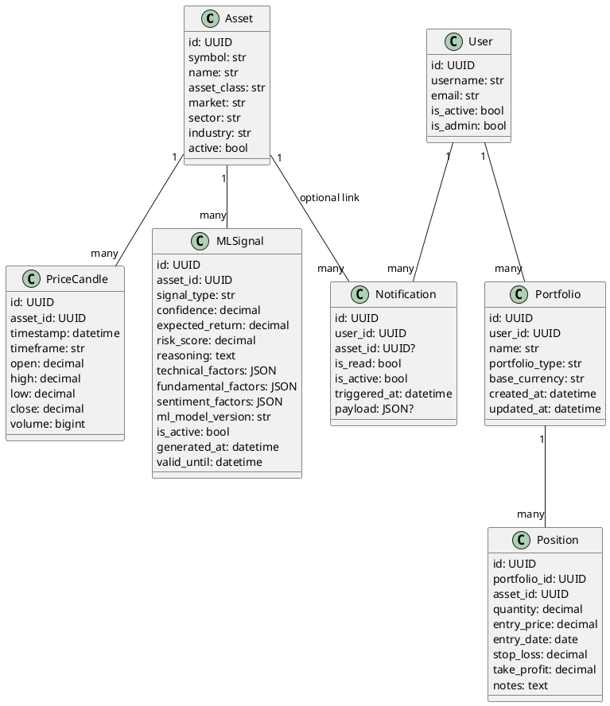

# UML Level 5 — Core Domain Classes / Schemas

این سطح کلاس‌ها/اسکیماهای کلیدی را دسته‌بندی می‌کند.

> توجه: برای دقت ۱۰۰٪ باید فایل‌های `app/models/models.py` و `app/schemas/schemas.py` خوانده شوند. در این مرحله بر اساس routeها و architecture موجود، موجودیت‌های اصلی infer شده‌اند.

## Diagram (PlantUML)

## Mapping to Routes
- `/market/*` روی `Asset` و `PriceCandle`
- `/analysis/*` به خصوص `PriceCandle` + `MLSignal`
- `/portfolios/*` روی `Portfolio` و `Position`
- `/notifications*` روی `Notification` (+ user_id via `get_route_user_id`)
