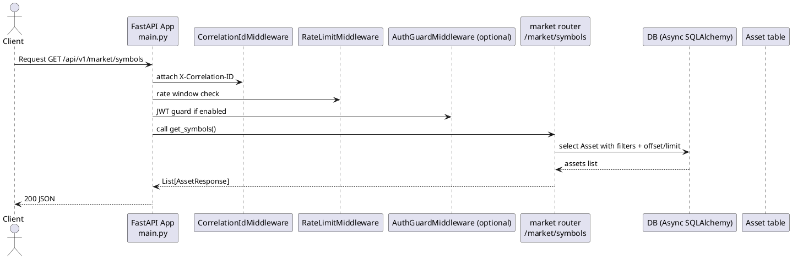
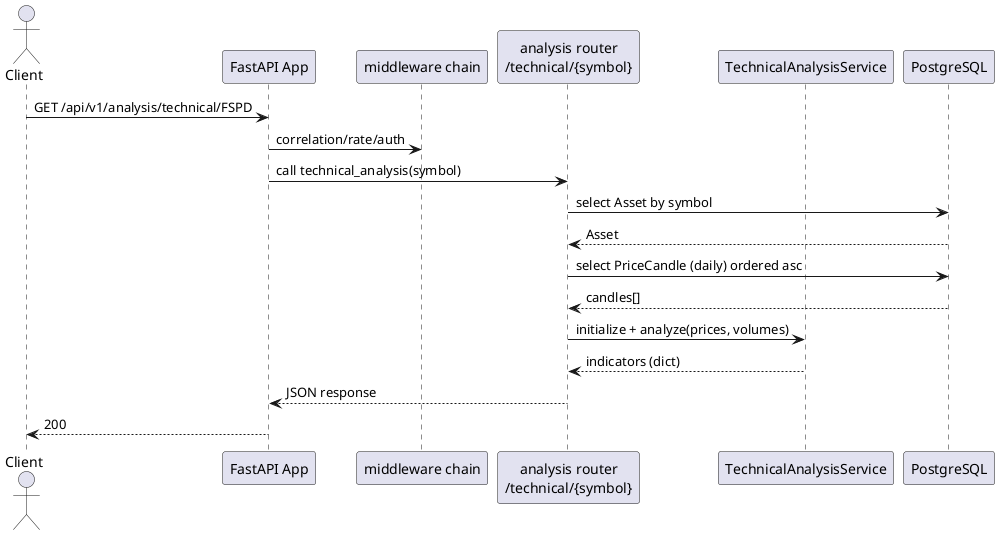
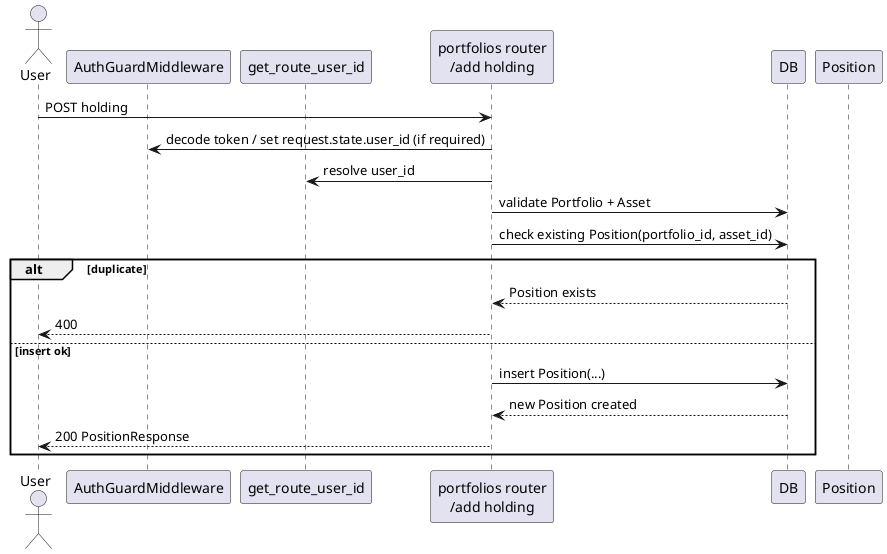
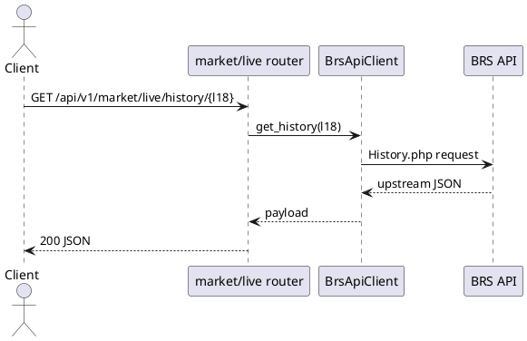
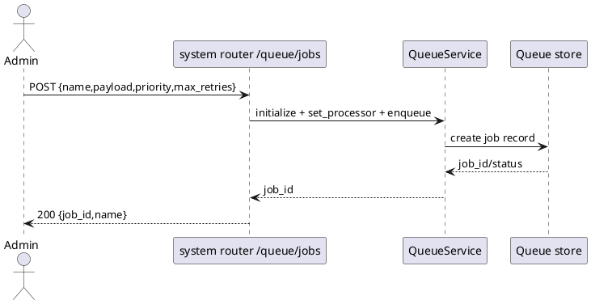
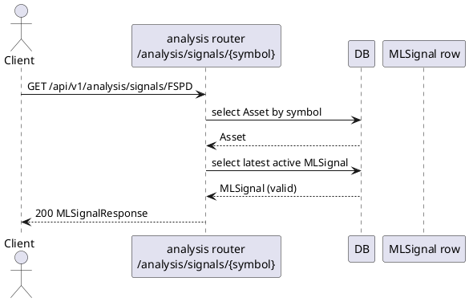

# UML Level 6 — End-to-End Paths (Request → Middleware → Service → DB/Upstream)

این سطح چند مسیر واقعی را از perspective UML تشریح می‌کند.

## مسیر A: GET /api/v1/market/symbols

## مسیر B: GET /api/v1/analysis/technical/{symbol}

## مسیر C: POST /api/v1/portfolios/{portfolio_id}/holdings

## مسیر D: GET /api/v1/market/live/history/{l18} (Upstream Proxy)

## مسیر E: POST /api/v1/system/queue/jobs

## مسیر F: GET /api/v1/analysis/signals/{symbol}

