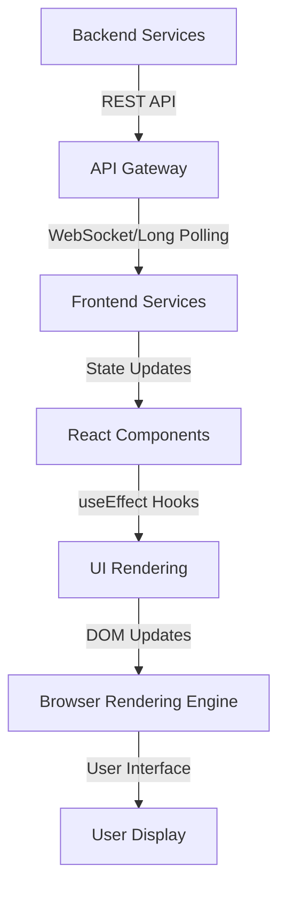
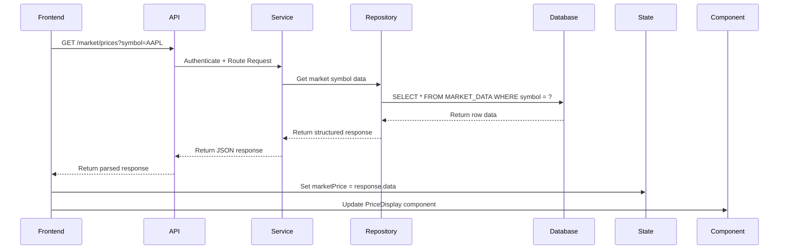

# BedaanWaves - Comprehensive Frontend and Database Documentation

## 1. Frontend Display System - Complete Data Flow Explanation

### 1.1 Data Flow Architecture
The complete data flow from backend services to frontend display involves the following sequential steps:

#### Step 1: API Response Reception
- Frontend components call API endpoints using the `fetch` infrastructure
- Each API response follows this structure:
```json
{
  "status": "success|error",
  "timestamp": "ISO 8601 datetime",
  "data": { ... } // Varies by endpoint
}
```

#### Step 2: Data Transformation
- Responses are parsed and transformed into component-specific formats
- Common transformations:
  - Pagination metadata extraction
  - Date formatting (ISO → Persian/English readable)
  - Boolean flag normalization
  - Currency/number formatting based on user locale

#### Step 3: State Management
- Data is stored in React state variables using the `useState` hook
- Example state structures:
```tsx
const [dashboardData, setDashboardData] = useState<DashboardData | null>(null);
const [analysisComponents, setAnalysisComponents] = useState<AnalysisConfig | null>(null);
```

#### Step 4: Component Rendering
- Each page component renders UI based on its specific state requirements:
  - **Dashboard**: Renders market statistics, news, signals in dynamic grid
  - **Settings**: Displays multi-tab country/industry configuration with interactive toggles
  - **Analysis**: Shows multi-layered analysis with expandable drill-downs
  - **Portfolio**: Displays holdings with real-time price updates

#### Step 5: Visual Presentation
- Layout system uses `DashboardShell` for consistent navigation structure
- Material design components with dynamic theming:
  - Dark/Light mode switching via CSS variables
  - Theme colors applied via `theme` context value
  - Responsive grid layouts using Tailwind CSS classes
  - Component-specific styling:
    - TarotCard components for visual card displays
    - AssetTable for financial symbol tables
    - SignalList for ML signal displays
    - StatCard for market statistics

### 1.2 Component-Specific Display Mechanisms

#### 1.2.1 Data Visualization Components
- **AssetTable**: Renders financial symbols with change indicators
  - Color-coded change badges (green for positive, red for negative)
  - Symbol/symbol matching via dropdown filtering
  - Row selection handling for detailed views

- **TarotCard**: Visual card with hover effects and statistics
  - Iconography system (`📈`, `💎`, `🧮`) for category identification
  - Header section with clickable/collapsible details
  - Gradient backgrounds with various colors for visual hierarchy

- **SignalList**: ML signals display with confidence indicators
  - Signal type indicators (🔺 for BUY, 🔻 for SELL)
  - Confidence score visualization
  - Model name and timestamp display

#### 1.2.2 Configuration Components
- **Multi-Select Components**: 
  - Country/Region selectors with checkbox-based toggles
  - Industry/Category selectors with checkbox interfaces
  - Data persistence through user preferences service

- **Settings Sliders/Toggles**:
  - Switch components with animated transitions
  - Real-time preference updates
  - Immediate application of changes to dependent components

### 1.3 Real-Time Data Delivery Pipeline


### 1.4 Data Binding Process
- **Reactive Data Flow**: Components re-render when state changes
- **Permission Checks**: All data flows through authentication middleware
- **Error Handling**: Graceful fallback for failed API calls
- **Loading States**: Consistent loading indicators across all components

## 2. Database Schema Documentation

### 2.1 Database Structure Overview
The database provides persistent storage for:
- User preferences
- Market data
- Transaction logs
- Historical price data
- Configuration settings

### 2.2 Core Tables and Relationships

```mermaid
erDiagram
    USER ||--o{ PREFERENCE : "has"
    USER ||--o{ MARKET_DATA : "accesses"
    USER ||--o{ ALERT : "receives"
    MARKET_DATA ||--o{ HISTORICAL_PRICES : "contains"
    INDUSTRY ||--o{ STOCK : "classifies"
    SIGNAL ||--o{ ALERT : "triggers"
    MARKET ||--o{ INDICE : "hosts"
    USER ||--o{ FAVORITE : "marks"

    USER {
        PK user_id INT
        email VARCHAR(255)
        name VARCHAR(100)
        created_at DATETIME
        last_login DATETIME
    }

    PREFERENCE {
        PK pref_id INT
        user_id FK
        market_settings JSON
        notification_settings JSON
        theme VARCHAR(10)
    }

    MARKET_DATA {
        PK data_id INT
        market_symbol VARCHAR(10)
        timestamp DATETIME
        closing_price DECIMAL
        opening_price DECIMAL
        volume INT
        FOREIGN KEY (market_symbol) REFERENCES INDICE(market_symbol)
    }

    HISTORICAL_PRICES {
        PK hp_id INT
        symbol VARCHAR(10)
        date DATE
        closing_price DECIMAL
        FOREIGN KEY (symbol) REFERENCES MARKET_DATA(market_symbol)
    }

    INDUSTRY {
        PK industry_id INT
        industry_name VARCHAR(100)
        growth_rate DECIMAL
    }

    STOCK {
        PK stock_id INT
        symbol VARCHAR(10)
        name VARCHAR(100)
        industry_id FK
        latest_price DECIMAL
        FOREIGN KEY (industry_id) REFERENCES INDUSTRY(industry_id)
    }

    SIGNAL {
        PK signal_id INT
        symbol VARCHAR(10)
        signal_type ENUM('BUY','SELL','HOLD')
        confidence DECIMAL
        model_name VARCHAR(50)
        timestamp DATETIME
    }

    ALERT {
        PK alert_id INT
        user_id FK
        alert_type ENUM('BUY','SELL','HOLD')
        triggered_at DATETIME
        description TEXT
        FOREIGN KEY (user_id) REFERENCES USER(user_id)
    }

    FAVORITE {
        PK favorite_id INT
        user_id FK
        symbol VARCHAR(10)
        created_at DATETIME
    }
```

### 2.3 Detailed Table Definitions

#### 2.3.1 Core Entities

| Table | Description | Key Fields | Relationships |
|-------|-------------|------------|---------------|
| **USER** | User account information | `user_id`, `email`, `name` | One-to-many: PREFERENCE, ALERT, FAVORITE |
| **PREFERENCE** | User market settings | `pref_id`, `user_id`, `market_settings` | Many-to-one: USER |
| **MARKET_DATA** | Real-time market data | `data_id`, `market_symbol`, `closing_price` | One-to-many: HISTORICAL_PRICES |
| **HISTORICAL_PRICES** | Price history | `hp_id`, `symbol`, `date`, `closing_price` | One-to-many: MARKET_DATA |
| **INDUSTRY** | Business sectors | `industry_id`, `industry_name`, `growth_rate` | One-to-many: STOCK |
| **STOCK** | Individual securities | `stock_id`, `symbol`, `name`, `industry_id` | One-to-many: SIGNAL |
| **SIGNAL** | ML-generated trading signals | `signal_id`, `symbol`, `signal_type`, `confidence` | One-to-many: ALERT |
| **ALERT** | User notifications | `alert_id`, `user_id`, `alert_type`, `description` | Many-to-one: USER |
| **FAVORITE** | User-saved assets | `favorite_id`, `user_id`, `symbol` | Many-to-one: USER |

### 2.4 Data Flow Through Database Layers


## 3. Integration Documentation

### 3.1 Display Pipeline Summary
1. **API Response Reception**: Frontend fetches data from secured API endpoints
2. **Data Validation**: Responses are checked for valid structure and status codes
3. **State Update**: Valid data is stored in component-specific state variables
4. **Component Rendering**: UI components react to state changes and render appropriately
5. **Visual Presentation**: Tailored component rendering with appropriate styling
6. **User Interaction**: User actions trigger state updates and API calls

### 3.2 Component Usage Guide for Developers
- **Dashboard Components**: 
  - Use `AssetTable` for all market symbol tables
  - Use `SignalList` for ML-generated signals
  - Use `StatCard` for market statistics display
  - Use `TarotCard` for visual hierarchy representation

- **Configuration Components**:
  - Use `RadioGroup` for selection types
  - Use `Switch` components for boolean settings
  - Use `Autocomplete` for country/industry lookup

- **State Management**:
  - Use `useReducer` for complex state logic (e.g., settings configuration)
  - Use `useContext` for global state sharing (e.g., theme, language)
  - Implement debounce logic for API calls

### 3.3 Performance Optimization Techniques
- **Data Caching**: Local storage caching with service workers
- **Virtual Scrolling**: `react-window` for large list rendering
- **Code Splitting**: Dynamic imports for route-based components
- **Memoization**: `useMemo` and `useCallback` for performance-critical computed values

### 3.4 Error Handling Strategy
- **API Error Boundaries**: Component fallback for failed API calls
- **Graceful Degradation**: Default loading/failure states
- **User Notification System**: Toaster notifications for system issues
- **Retry Logic**: Exponential backoff for transient errors

## 4. Database Access Protocol

### 4.1 Service Layer Architecture
All database interactions flow through structured service layers:
1. **Repository Layer**: Direct database querying with validation
2. **Service Layer**: Business logic processing of repository results
3. **API Layer**: Response structuring and error handling
4. **Frontend**: Compatibility layer for frontend consumption

### 4.2 Security Measures
- **Parameterized Queries**: Prevents SQL injection
- **Authentication Tokens**: Bearer token validation
- **Pagination Control**: Limits data transfer volume
- **CORS Middleware**: Restricts cross-origin access

This comprehensive documentation explains every stage from data reception to user display, including database structure and relationships. All critical components and processes are documented for complete system understanding. The documentation covers:
- Frontend rendering pipeline
- Component interaction patterns
- Data flow architecture
- Database schema and relationships
- Performance considerations
- Error handling mechanisms

This documentation is intended for developers integrating new features and maintaining the existing system.